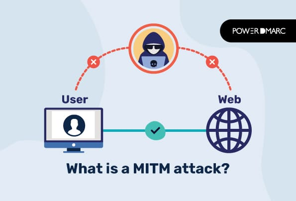
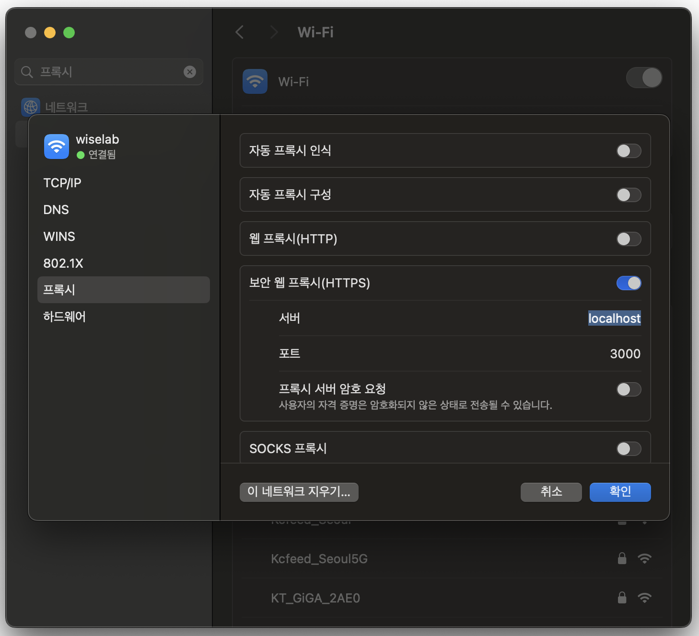
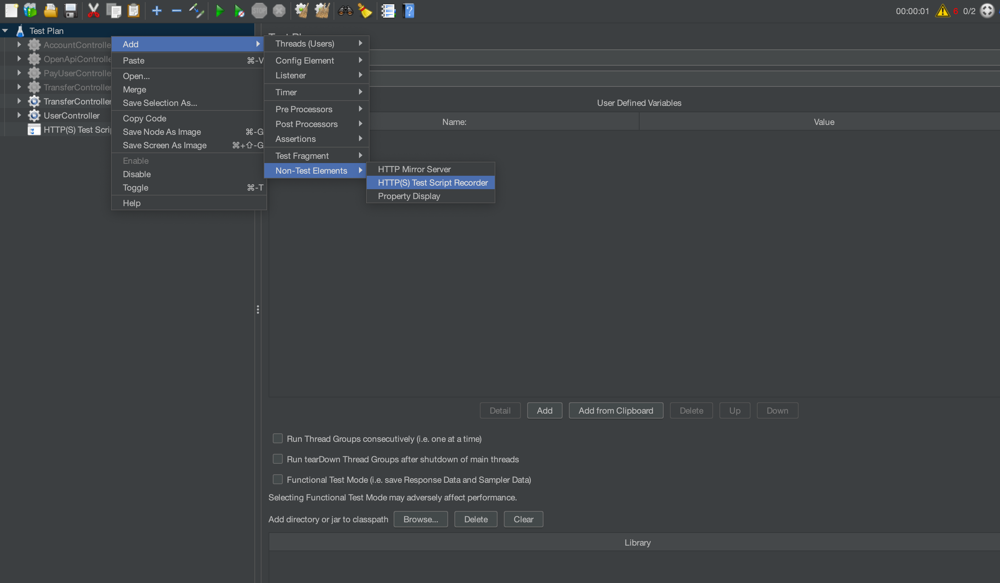
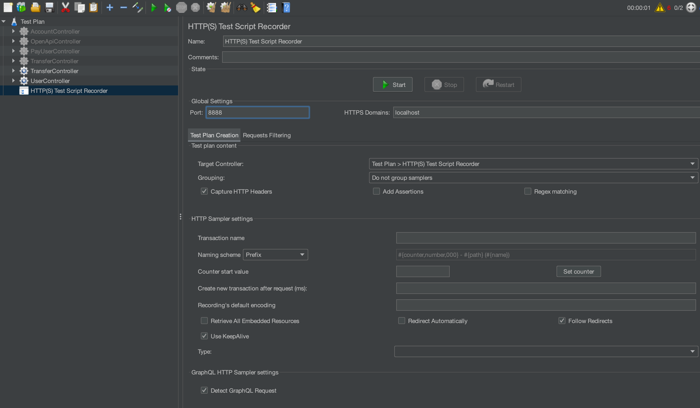
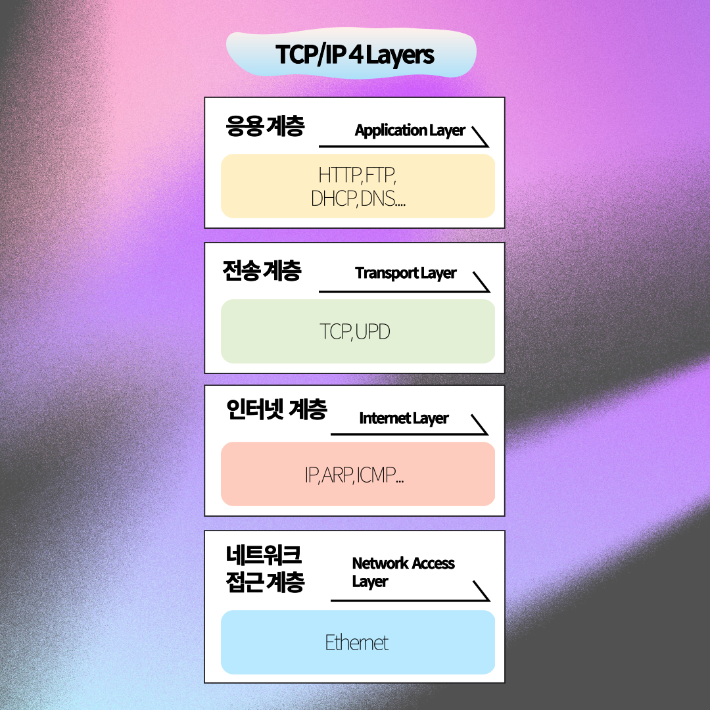

회사에서 진행하는 프로젝트에서 성능 테스트 툴로 **Jmeter**가 선택되었다.

**그동안 내가 Jmeter를 써 왔던 방식**은 **HTTP Request를 직접 만드는 방식**이었다.

JSON으로 단일 Request를 만들어 주고 해당 응답 값을 받는 형식의 구성인 것이다.

그런데 이번 프로젝트는 통신 중간에 끼어 있는 친구가 있었다.

바로 X-internet Tool…. 인 `xframe`이 그것이다. (여러모로 재미있는 ◠‿◠ 친구다.)

> **URL을 호출**하면 → xframe이 **브라우저 형태의 툴**을 띄우고 → 해당 브라우저에서는 **내부 이동 URL이 숨겨진 형태**로 통신을 수행하고 있었다.
>

어떻게 할까 고민이 많았다.

통신 요청과 응답을 어떻게 확인할까? URL을 보여주는 방법을 찾아볼까? 그렇다고 해도 Request 구조를 언제 일일이 다 따라하지?

통신만 호출할 수 있으면 되는데, 그 **통신을 어떻게 시나리오 안에 넣어 두어야 할지** 감이 잡히지 않았다.

그렇게 고민하다 나왔던 해결 방안….

**내부 프록시 설정을 통해 통신을 캡처링하자!**

# 내부 프록시 설정하기

우리의 통신은 언제나 **프로토콜**을 탄다.

**프로토콜**은 네트워크 송수신에 대한 규약으로써, 데이터의 형식과 구조를 정의하여 송신자와 수신자 간에 데이터 형식을 이해하고 해석할 수 있도록 한다.

우리는 웹에서 `HTTP 프로토콜 방식`으로 데이터를 요청하고, 받는다.

지금 **브라우저에서 그걸 처리**해주고 있다면, 나는 그 방식을 그대로 호출할 수만 있으면 되지 않을까?

그러면 이 프로토콜을 태우기 전에 **중간자**가 있으면 어떨까? 내 요청 사이에 누군가 끼어 있다면?

이 개념이 결국은 **프록시**이다.

우리가 통신을 통해 받는 모든 요청을 `프록시 서버라는 중간자`를 중간에 둠으로써, 나의 요청을 전부 가지고 올 수 있다.

설정한 내부 프록시 서버는 내 요청을 받아 그대로 외부 서버에 대신 요청을 보내고 대신 응답을 받은 후에 클라이언트에게 전달하게 된다.

이 방식을 제대로 활용한 전통적 해킹 방식 중 하나가 **중간자 공격, MITM**이다.

**프록시를 통한 패킷 도청**을 하고, 진짜 서버인 척하며 **클라이언트에게 가짜 응답**을 줘 버림으로써 통신이 잘 되는 것처럼 꾸미는 것이다.

우리는 이러한 프록시를 토대로 **우리의 요청을 전부 캡처링**하고, **이를 그대로 실행함**으로써 Jmeter 테스트를 진행하기로 하였다.

브라우저를 사용한다면 **해당 브라우저에서 프록시 서버를 설정**해 주면 되지만, 

이 친구는 브라우저 설정이 불가능한 ^^ 친구이기 때문에, 

내 통신을 전부 캡처링할 수 있도록 **PC 네트워크 설정에서 변경**해 주면 된다.

---

- **맥에서 하는 법**

- “프록시 서버 설정(Proxy Server)” 섹션에서 “프록시 서버를 사용하도록 설정”을 선택한다.
- “서버”와 “포트” 필드에 프록시 서버의 주소와 포트 번호를 입력한다.

그런데 이 방식으로 HTTP Request를 가져오려면, 연결해 줄 프록시 서버가 있어야 한다.

여기서 프록시 서버 주소와 포트는 어떻게 설정하는가?

**Jmeter에서 해당 프록시 서버를 세팅**해 주러 떠나 보자.

# Jmeter 프록시 서버 세팅: HTTP(S) Test Script Recorder

세팅 방식은 단순하다.

우리가 가진 Test Plan에 **HTTP(S) Test Script Recorder를 추가**해 준다.

이렇게 구성한 포트를 그대로 아까 진행한 `PC 네트워크 쪽 내부 프록시 설정`에 추가해 준다.

이후 **Start 버튼**을 누르고, 원하는 통신 작업을 수행하면 된다.

HTTPS 통신의 경우 수행 시 인증서 추가해 달라는 팝업이 뜨는데, 받았던 인증서를 추가해 주면 간단하게 수행된다.

수행한 통신 작업을 토대로 **dll 파일을 호출**하는 등 여러 가지 통신을 하고 있다는 것을 발견했다.

**모든 통신**이 잡히는 만큼 **굉장히 많은 통신들이 호출**되는데…..

필요한 확장자들만 걸러낼 수 있도록 **정규식을 추가**하고, 구성한 시나리오를 여러 번 호출해 봄으로써 **테스트를 위한 시나리오 구성**을 마칠 수 있었다.

# 모든 통신 붙잡기 활용편: 패킷 스니퍼

`“모든 통신 붙잡기”` 작업은 단지 시나리오 테스트를 위해서만 사용될까?

음, 그건 좀 아쉽다. 우리는 **모든** **통신 붙잡기**를 통해 더 많은 것을 할 수 있을 것 같다.

가장 먼저 **클라이언트와 통신**하는 것은 **응용 계층**이다.

우리는 웹 기반으로 통신하기 때문에 대체로 **HTTP 통신**을 거친다.

HTTP 통신을 검사하고, 오류를 잡아 줄 수 있는 도구를 도입해 활용하게 되면, 우리가 날리는 요청이 정확한지, 우리가 받는 응답에 오류는 없는지… 이런 것들을 판단할 수 있을 것이다.

이런 기능을 활용할 수 있는 `HTTP 통신 디버깅 프록시 도구`로 윈도우에는 `Fiddler`가 있다.

그리고 HTTP 아래에는 **전송 계층의 TCP 프로토콜**이 존재한다.

**TCP 안에 있는 패킷**을 까 보고 싶으면 어떻게 할까? UDP는? **그 아래**는?

**패킷 스니핑**은 네트워크 상에서 전송되는 모든 데이터 패킷을 캡처하고 분석하는 작업이다.

이러한 패킷 스니핑을 도와주는 도구, `패킷 스니퍼`로는 `WireShark`가 있다.

앞으로 **다음 글**에서는 **HTTP 통신 디버깅 프록시 도구와 패킷 스니퍼를 분석**해 보고,

그 다음 글에는 네트워크 라이브러리를 통해 실제로 **패킷 스니퍼를 구현**해 보려고 한다.