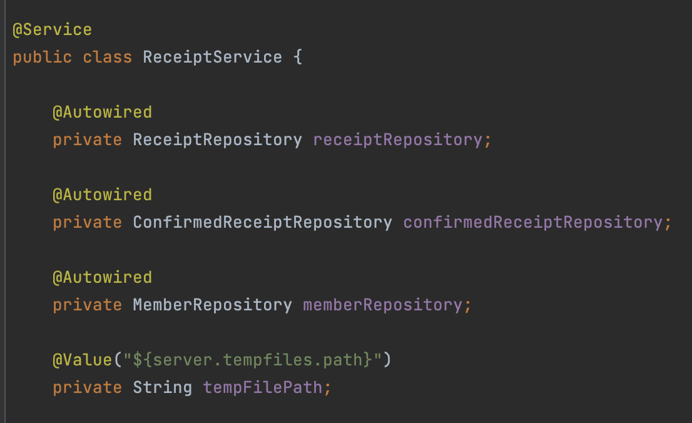
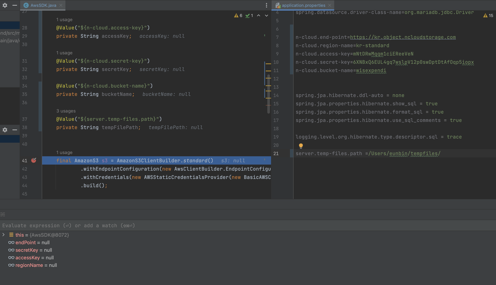
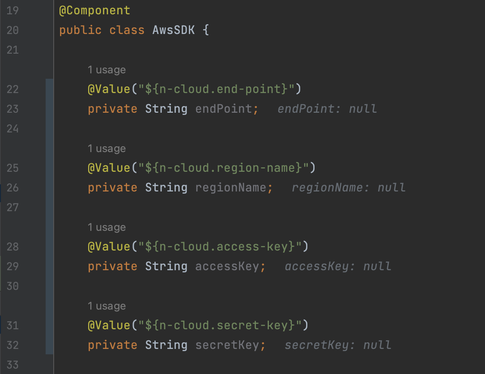
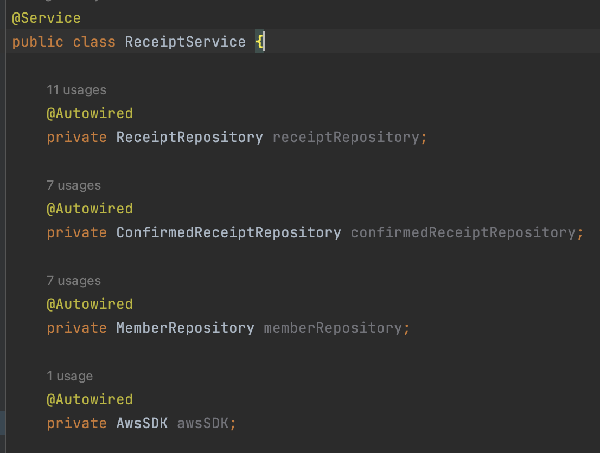

# 기존 소스

기존 프로젝트 소스에서 file path를 사용하기 위해 프로퍼티에 로컬 경로를 등록해 두었고, `@Value`로 잘 사용하고 있었다.



이후 로컬에만 사용할 것이 아니기 때문에 해당 파일을 서버로 보낼 통신이 필요했고, 네이버 클라우드 서비스인 Object Storage를 붙이기로 했다.

나는 약결합을 위해 해당 호출 클래스를 분리하고, 의존성 주입을 토대로 해당 클래스를 사용하고자 했다.

# 생겨난 상황

자바 SDK 파일을 예제 소스로 제공하고 있어, 해당 소스를 토대로 클래스를 만들었다.

그리고 `@Component`로 처리해 `@Value`를 사용할 수 있도록 해 두었다. ~~(스프링아 믿는다)~~

그런데 구동을 시작하자 애플리케이션이 멈췄다.

응? `@Value`로 주입한 값이 null이랜다 … 이런 상황은 처음이었다.



원인 분석을 위해 블로그를 찾아 여러 방식을 시도했다.

1번, **스펠링** 확인. 스펠링은 똑같았다. 혹시 몰라서 여러 번 복붙했지만 null인 것은 똑같았다.

2번, **빈 등록 여부** 확인. `@Component`를 사용했기 때문에 빈으로 등록되어 있을 것이다.

3번, **static 변수** 할당 확인. static 변수가 아니었다.



4번, **인스턴스 new 생성** 여부 확인. 인스턴스를 신규 생성한 것이 아니라 `@Autowired`로 잘 주입하고 있었다.



5번, **프로파일** 다른지 확인. 아직 개발 단계라 프로파일을 여러 가지 설정해 놓지도 않았어서 프로파일 문제도 아니다.

6번, **클린-재빌드**. 수십번 했다.

7번, **인코딩과 경로 확인**. `application.properties`의 인코딩은 **UTF-8**이었고, **루트 경로**(`src/main/resources`)에 잘 있었다.

8번, **컴포넌트 스캔 범위 확인**

- `@SpringBootApplication` 클래스 위치 : `package com.wisexpendi.second;`
- 호출하는 클래스 위치: `package com.wisexpendi.second.service;`
- 호출되는 클래스 위치: `package com.wisexpendi.second.common;`

`@SpringBootApplication`는 가장 상위에 있다. 문제가 아닐 것 같다.

# 해결 방안

이유는 의외로 너무 어이없는 곳에 있었는데….

Bean 등록은 된 거야? 하는 생각에 생성된 Bean의 목록을 가지고 오려고 하다가 보니,

아예 **Bean 생성이 안 된 것**을 확인할 수 있었다.

```
2024-01-02 01:54:14.321  WARN 29567 --- [           main] ConfigServletWebServerApplicationContext : Exception encountered during context initialization 
- cancelling refresh attempt: org.springframework.beans.factory.BeanCreationException: Error creating bean with name 'awsSDK' defined in file 
[/Users/eunbin/Documents/project/second/build/classes/java/main/com/wisexpendi/second/common/AwsSDK.class]: Instantiation of bean failed; 
nested exception is org.springframework.beans.BeanInstantiationException: Failed to instantiate [com.wisexpendi.second.common.AwsSDK]: Constructor threw exception; 
nested exception is java.lang.IllegalArgumentException: Access key cannot be null.
```

어? 그럼 뭐 때문이지?

하고 다시 소스를 본 결과…. 입이 떡 벌어졌다. 너무 어이없는 실수라서 ㅋㅋㅋ

```java
 final AmazonS3 s3 = AmazonS3ClientBuilder.standard()
        .withEndpointConfiguration(new AwsClientBuilder.EndpointConfiguration(endPoint, regionName))
        .withCredentials(new AWSStaticCredentialsProvider(new BasicAWSCredentials(accessKey, secretKey)))
        .build();
```

`@Value`의 주입 시점과 `final`의 문제였다.

나는 네이버에서 제공한 SDK 파일을 우리 프로젝트의 클래스로 수정하는 과정에서,

final로 정의된 해당 AmazonS3 초기화 변수를 그대로 둔 상태로 function을 빼서 작업을 했다.

그러나 **final 할당**은 **해당 클래스를 생성하는 시점**이다.

그리고 **@Value의 주입**은 **해당 Bean이 생성된 다음** 이루어진다.

아직 주입되지도 않은 값을 가져와서 초기화 시 넣고자 했으니, 당연히 AmazonS3 인스턴스를 생성할 때 오류가 나지!

해당 변수를 지역 변수로 수정하고 나서 모든 것이 평안해졌다.

# 회고

내용을 정리하고 나서 돌이켜 보니, 관련한 문제 해결 글들이 제법 파편화되어 있는 것을 발견했다.

**@Value 주입이 null인 이유**에 대해서 나는 세 가지로 정리해 볼 수 있었다.

## 1. 해당 클래스가 스프링 컴포넌트 스캔 범위 안에 있는지

- 해당 클래스가 **Bean으로 등록되어 있는지** 확인한다. (나처럼 초기화가 됐는지도.. ^^)
- 해당 클래스를 `@Autowired`, **스프링이 관리할 수 있도록 주입**했는지 확인한다.  (new 멈춰!)
- 해당 클래스가`@SpringBootApplication` 클래스의 하위 폴더에서 만든 것인지를 확인한다.

  : 아닐 경우 따로 팩토리 빈이나 ComponetScan 패키지 설정 / includeFilters 등을 통해 해당 컴포넌트를 스캔할 수 있도록 해 주어야 한다.

## 2. static 변수에 할당하려고 했는지

- **@Value의 주입 시점**은 **스프링 컨텍스트 활성화 이후**이기 때문에, @Value로 할당할 변수를 static으로 사용하는 것은 적합하지 않다.
- static 변수는 JVM 위에 클래스가 로딩되는 순간 할당되는데, JVM이 이미 클래스를 다 로딩한 상태에서 스프링 컨텍스트가 시작될 테니까.
- 그런 이유로 해당 @Value 값을 꼭꼭 static으로 사용해야만 한다면, **동적 할당**을 하자.
- Bean 생성 → @Value를 통해 인스턴스 변수 초기화 → static 메서드를 통해 static 변수에 동적 할당하는 것.

## 3. 스펠링 실수는 아닌지 / 클린-빌드는 해 보았는지 등

- 스펠링 실수가 아닌지 복붙도 해 보자. `properties` 변수의 케이스는 보통 Camel보다 Snake나 Kebab이다.
- 클린 빌드. 혹시 모르니까 한번 해 보자.

---

실수는 자주… 어이없는 곳에서 나온다. 찬찬히 찾아보는 습관은 그래서 중요한 것 같다.

`타인의 소스를 가져와서 수정하는 것`에서는 더더욱 그렇다.

타인의 예제 코드를 가져오는 것은 물론 컨트롤 씨브이 개발 사회에서, 빠른 개발이 필요한 사회에서 당연히 수반되는 일이다.

다만 **해당 코드 라인이 어떤 목적을 가지고 쓰여졌는지**를 이해하는 것이 중요한 이유는 이런 데서 나오는 것 같다.

내가 내 프로젝트에 맞게 재구성할 때는, 해당 라인의 목적이 어떤 것인지 잘 생각해 보자.

그래도 이번 이슈를 해결하면서 다시금 **스프링이 Bean을 생성하는 방식, Bean 생명 주기** 같은 것을 돌이킬 수 있어서 좋았다.

나와 같은 현상을 겪는 이들에게 내 문제 해결 방향이 도움이 될 수 있을 것 같아 글을 작성해 본다.

