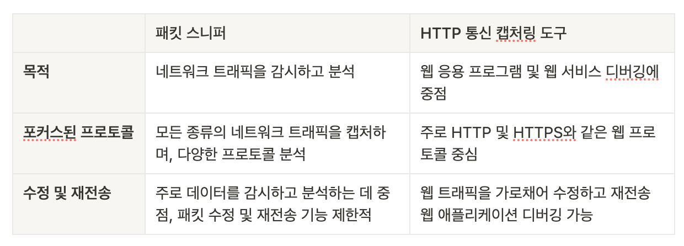
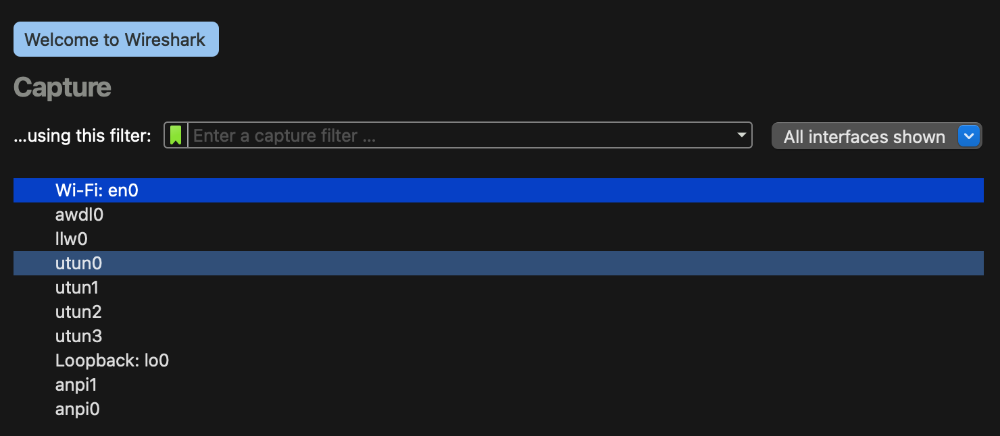
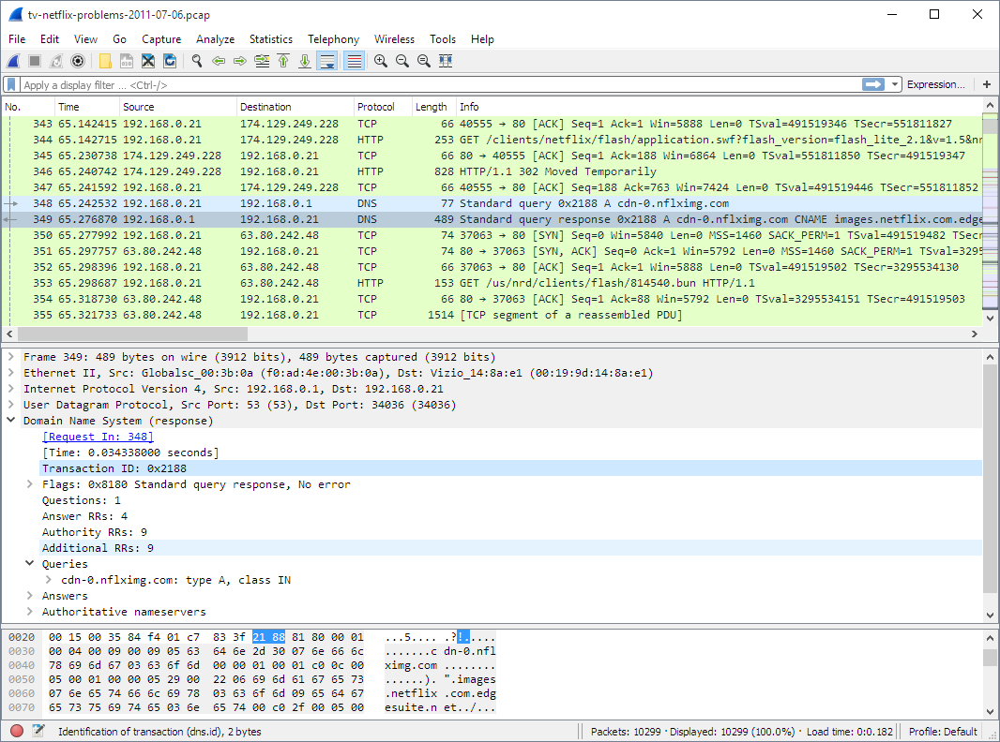
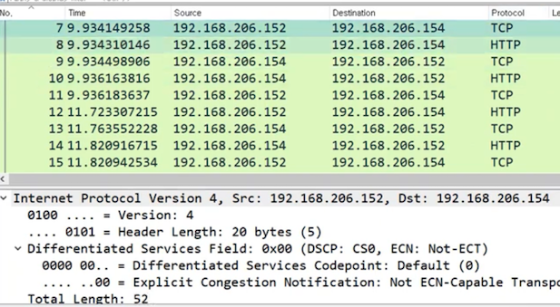
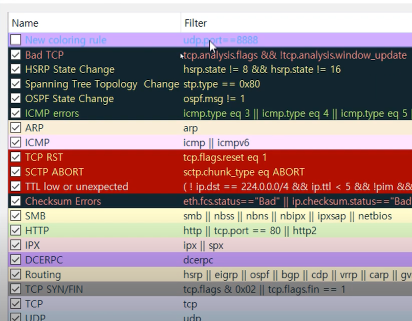
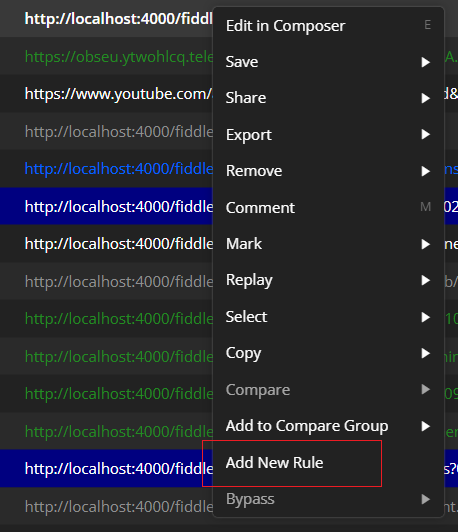
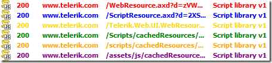
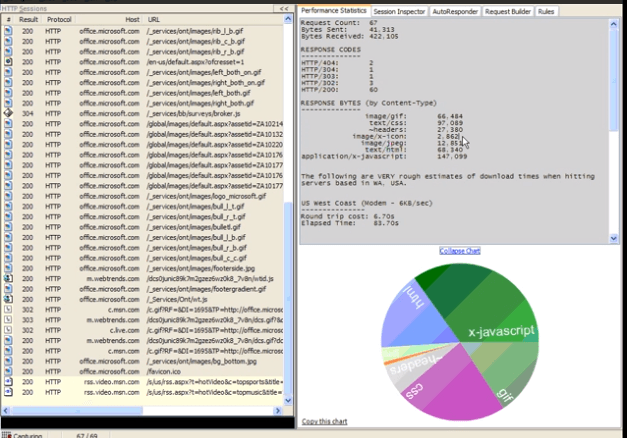
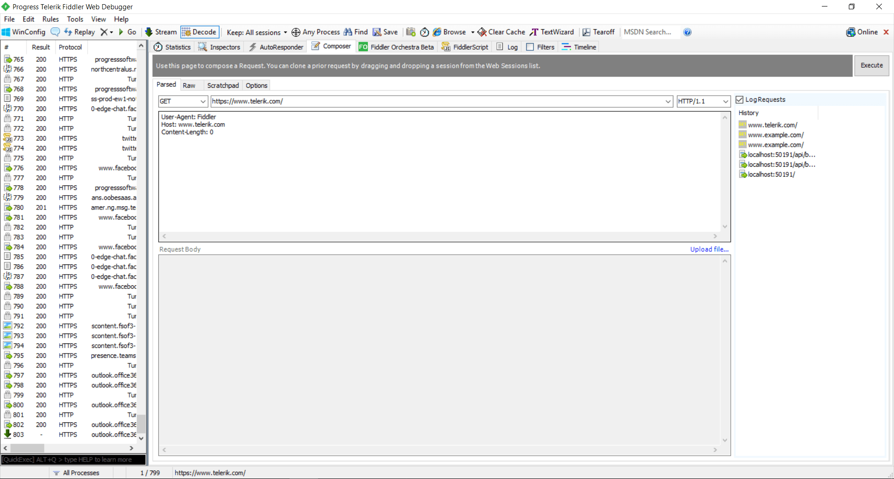

# Jmeter가 해 주던 통신 가져오기, 한번 해볼까?

## 통신 가져오는 목적이 뭔데?

> Jmeter가 하는 것만 있진 않을 거 아냐?

우리가 프로그램을 만들고 실행할 때, 로컬에서만 돌릴 프로그램이 아니라면, `네트워크`, 즉 통신은 당연하게 따라온다.

**통신에서 가장 중요한 것**은 무엇일까?

`데이터`의 측면에서는 **적절한 곳에 빠르게 데이터**를 보내 주는 것. **문제 없이 정확한 데이터**를 보내 주는 것.

`보안`의 측면에서는 **안전하게 데이터**를 보내 주는 것.

그러나 우리의 환경에서는 이 세 가지에서 **문제가 생기는 케이스**들이 종종 일어난다.

이러한 케이스들을 파악하기 위해, 우리는 클라이언트와 서버 컴퓨터끼리 주고받는 통신을 가지고 와야 한다.

*어떤 상황인지 알아야 문제 해결을 할 것 아닌가!*

1. **네트워크 트래픽 감시:** 네트워크에서 전송되는 데이터를 감시하고 분석
2. **디버깅 및 분석:** 네트워크 문제를 식별하고 해결하기 위해 디버깅 및 분석
3. **보안 검사:** 보안 측면에서 네트워크 트래픽을 확인하여 보안 문제를 식별

따라서, 주로 **위의 세 가지 문제**를 해결하기 위해 우리는 통신 캡처링을 진행하게 된다.

## 그럼 뭘로 가져올 수 있는데?

네트워크 트래픽을 분석하고 모니터링하는 도구 중 일반적으로 사용하는 것은 `두 가지`이다.

- HTTP 통신 캡처링 도구
- 패킷 스니퍼

둘의 차이는 **주된 사용자층**에서 뚜렷하게 나타난다고 생각한다.

목적과 주된 프로토콜이 다르기 때문이다.

## 두 개의 차이가 뭐야?

`패킷 스니퍼`는 **네트워크 전반에 대한 일반적인 감시**를 수행하는 데 중점을 둔다.

그래서 보다 **보안** 쪽에 많이 활용되는 특징을 가진다.

`HTTP 통신 캡처링 도구`는 **HTTP/HTTPS 통신**만 붙잡는다.

그에 따라 보통 **웹 트래픽**과 관련된 웹 개발자들의 디버깅에서 주로 사용된다.

이쯤 되면 당신은 이런 생각을 할 수도 있다.

*응? 그러면 패킷 스니퍼도 HTTP 통신 도구랑 똑같은 일을 할 수 있는 거 아냐?*

맞다! 사실은 **패킷 스니퍼에서도 HTTP 통신 캡처링 도구와 같은 작업을 할 수 있다.**

다만, **HTTP 통신만 잡을 입장**에서는 **굳이 설정을 추가해 가며 광범위한** 것을 쓸 이유가 없을 것이고,

그 외 **ARP 등 다양한 통신 패킷을 가져와서 분석할 입장**에서는 **프로토콜이 한정**된 것을 쓸 이유가 없을 것이다.

그러면 각각의 도구에 대해서 상세히 알아 보자.

# 패킷 스니퍼: Wireshark

`패킷 스니퍼`는 네트워크 상에서 전송되는 데이터 패킷들을 실시간으로 모니터링하고 캡처하는 도구이다.

그 중에서 가장 범용적으로 쓰이는 것은 `Wireshark(와이어샤크)`이다.

[Wireshark · Go Deep](https://www.wireshark.org/)

우리는 이 **와이어샤크**를 통해 HTTP를 포함해 다양한 네트워크 프로토콜의 통신을 가지고 올 수 있다.

처음 와이어샤크를 켜면 **내가 원하는 네트워크를 선택**해, **캡처를 시작**할 수 있다.

원하는 시간 동안 원하는 네트워크의 패킷을 모은 뒤 저장할 수 있다. 파일의 포맷은 두 가지로 사용할 수 있는데, `pcapng`와 `pcap`이 그것이다.

타 프로그램과의 호환을 원한다면 `pcap`, 아니라면 `pcapng`을 사용하면 된다.

통신 캡처만 딸랑 단순하게 되는 것이 아니라, 여러 가지 부가 기능을 제공한다.

## 기능 1: 필터 / 검색

- 캡처 필터
- 화면 필터

와이어샤크의 주된 기능 중 가장 많이 사용되는 것은 **필터**이다.

사용자는 두 가지의 필터를 걸 수 있는데, 하나는 `캡처 필터`이고, 다른 하나는 `화면 필터`이다.

`캡처 필터`는 패킷을 가져올 당시 **미리 제한을 걸어 두고 가지고 오는 것**이다.

특정 프로토콜이나, 특정 ip에서 시작 / 도착한 것 등 제한을 걸어서 가지고 오고 싶은 경우에 해당한다.

캡처 필터를 사용할 경우, **이후 필터링할 작업이 줄어든다**는 장점이 있다.

다만 필터를 **잘못 설정**했을 경우, **가지고 와야 할 패킷을 놓칠 수도** 있다.

`화면 필터`는 이미 가지고 온 패킷들에 대해서 **화면에서 필터링**을 하는 것이다.

캡처 필터를 걸지 않았다면 해당 시간 안에 캡처된 모든 패킷이 저장되어 있을 것이기 때문에,

그 안에서 **원하는 것만을 보기 위해 검색**을 하는 것이다.

두 가지 다 필터 설정 쪽에서 **화살표 모양**을 클릭하면 제안이 나오기 때문에 편하게 골라서도 사용할 수 있다.

**명령어를 혼합**해 여러 가지 필터를 걸고 싶을 경우에는, `프로그래밍에서 주로 사용하는 문법` (&&, ||)과 `영어` (and, or)로도 사용할 수 있다.

- src: Source
- dst: Destination

아래 요약에서 나요는 용어가 **Src** / **Dst**인 점이 ****약간 헷갈릴 수 있는데, 위에 있는 타이틀의 약어이다.

만약 `192.168.206.152`이라는 ip의 서버 컴퓨터에서 전송한 패킷만을 보고 싶다면,

`ip.src == 192.168.206.152` 와 같은 식으로 입력해 주면 된다.

## 기능 2: 컬러링 / 마크 / 주석

- 컬러링 / 마크
- 주석

쭉쭉 패킷을 보다가 수상한 것들을 발견했다. 나중에 해당 패킷을 찾고 싶다면 어떻게 할까?

**컬러링 / 마크 / 주석**을 통해서 **특정 패킷에 표시**를 할 수 있다.

**컬러링**은 원하는 조건을 달아서 화면에 표시될 때 원하는 조건의 패킷을 보다 잘 보이게 하는 것이고,

**마크와 주석**은 원하는 패킷에 직접적으로 표시를 함으로써 나중에도 볼 수 있도록 한다.

## 기능 3: 통계 / 문서화 등의 기능

- 문서화
- 통계

마크와 주석 등 기껏 표시 다 해 뒀는데 그 안에서만 확인하는 건 조금 아쉽지 않을까?

나중에 사용자는 해당 패킷들을 다른 프로그램이나 다른 PC에서도 볼 수 있도록 내보낼 수 있고, 특정 주석만을 골라서 파일로 내보낼 수도 있다. 즉 **문서화**가 가능하다.

또한 와이어샤크는 전체 패킷에서 어떠한 코드가 몇 퍼센트 들어왔는지, 얼마나 들어왔는지, 평균은 어떻게 되는지 등의 **통계** 기능도 제공하고 있다.

# HTTP 통신 디버깅 프록시 도구: Fiddler

- **피들러 에브리웨어 (Fiddler Everywhere)**: 신 버전 피들러 (구독형 사용) - 전 OS 지원

[Download Fiddler Web Debugging Tool for Free by Telerik](https://www.telerik.com/download/fiddler)

- **피들러 클래식 (Fiddler Classic)**: 구 버전 피들러 (다운로드로 사용) - 윈도우만 지원

[Fiddler Classic | Original Web Capturing Tool for Windows](https://www.telerik.com/fiddler/fiddler-classic)

**`Fiddler`**는 HTTP 웹 디버깅 프록시 도구로, **웹 브라우저**와 **웹 서버 사이의 통신**을 모니터링하고 조작할 수 있는 범용적인 툴이다.

피들러가 이용하는 방식은 프록시로, 지난 번 1번 게시물에서 **Jmeter 프록시를 이용한 방식과 동일**하다.

**통신 요청에 대한 수정과 테스팅**까지 제공하기 때문에, 개발 단계에서 원하는 것들을 테스트해 보거나 검증할 용도로도 사용할 수 있다.

**맥** 등 다른 OS에서는 `Fiddler Everywhere`라는 서비스로 **유료 버전**을 배포해 사용할 수 있도록 하고 있다. (Pro 기준 월 10달러)

그러나 윈도우에서는 **구 버전인** `Fiddler Classic`**을 무료로 다운로드** 받아서 사용할 수 있다.

## 기능 1: 웹 트래픽 모니터링

피들러를 실행하면 **웹 브라우저와 서버 간의 모든 HTTP/HTTPS 요청과 응답**이 **실시간으로 표시**된다.

이 트래픽 모니터링을 통해서 나의 **요청이 원하는 방향대로 이루어지는지** 확인해 볼 수 있다.

이 점에 대해서는 와이어샤크와 동일하며, 실행되는 모든 HTTP/HTTPS 통신을 붙잡는다.

다만, 두 가지 프로그램의 다른 점은

**와이어샤크**가 이용하는 것은 **네트워크 인터페이스에 대한 권한**을 얻어 **오가는 트래픽**을 붙잡는 것이고,

**피들러**가 이용하는 것은 **프록시**라는 점이다.

이후 저장했던 패킷들은 피들러의 **세션 저장 기능**을 통해 다시 불러올 수 있다.

## 기능 2: 필터링 및 검색 / 통계

피들러는 `Filters 옵션`을 통해서 필요한 패킷들만 따로 뽑아서 모니터링할 수 있다.

이는 이전에 설명했던 와이어샤크의 **캡처 필터 / 화면 필터**와도 같은 맥락이다.

이후 `검색 / Mark 기능`을 통해서 잡힌 패킷 중 원하는 주소 등을 검색해 체크해 뽑아낼 수도 있다.

또한 `통계`를 제공하여 **제공받은 컨텐츠에 대한 비율**을 확인할 수도 있다.

## **기능 3: 요청 수정 및 조작**

내가 생각하는 **와이어샤크와 피들러의 큰 차이점**이라고 한다면 여기에 있을 것 같다.

피들러는 **사용자의 요청에 대해서 조작**이 가능하다. 예를 들어 **요청 헤더나 바디 등을 임의로 수정**해서 어떻게 서버가 응답하는지 테스트해 볼 수 있다.

와이어샤크와 달리 **네트워크를 지켜보는** 게 아니라, (눈이 달린 것?)

**하나의 중계자처럼 작동하는 프록시**이기 때문에 가능한 것이라고 생각한다.

--- 

지금까지 두 가지 주요 네트워크 분석 툴에 대한 차이를 알아보았다.

다음 글에서는 이러한 **캡처링 도구를 구현**해 통신을 가져와 보고, 리스트로까지 한번 뽑아 보겠다.

**참고**

[IT보안을 위한 와이어샤크 네트워크 패킷 분석 실전](https://www.inflearn.com/course/wireshark_boanproject)

[피들러 공식 문서](https://docs.telerik.com/fiddler/configure-fiddler/tasks/configurefiddler)
