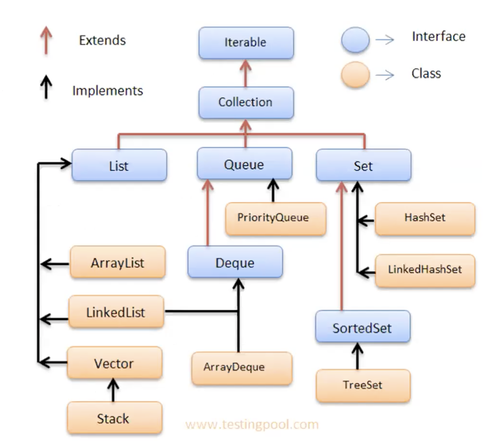
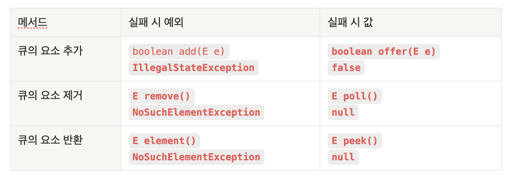
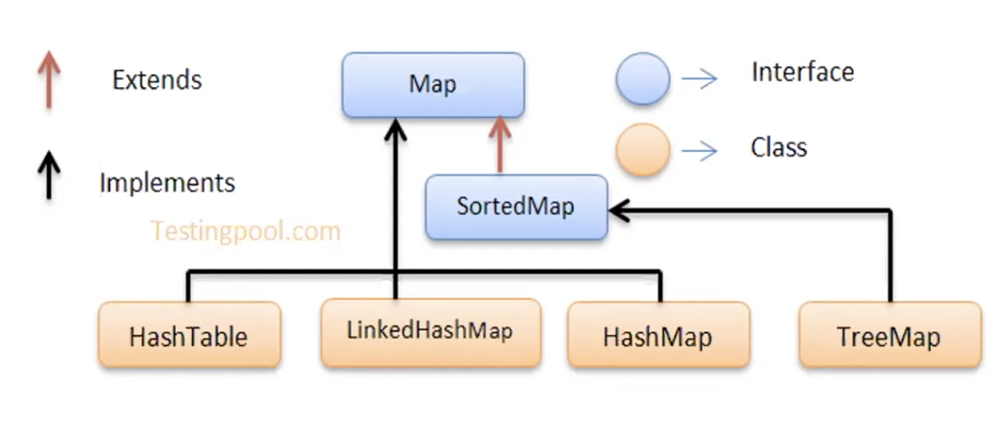

- 회사 교육 시 공유할 용도로 **주요 API의 핵심 내용**만 정리합니다.

- **어떠한 클래스가 왜 중요**한 건지,
- **어떠한 클래스에 공통적으로 들어 있는 메서드**는 무엇인지
- 개괄해 가는 시간이 되기를 바랄게요.

# java.lang

- **import문 없이도 사용 가능**

## Object

- 모든 클래스의 최고조넘, `Object`가 존재하는 곳
    - 사용할 때 반드시 **오버라이딩**
    - **중요한 메서드**: `equals(Object obj)` / `hashCode()`
    - 왜? 같은 객체를 식별하는 데 있어서 구분자가 되는 것이라서.
    - **`toString()`**
        - `클래스이름@해시코드값`을 반환한다.
    - **`equals(Object obj)`**
        - Call by reference를 **Call by Value**로 바꿔서 “논리적으로 같다”를 표현한다? 꼭 **오버라이딩.**
    - `hashCode()`:  `equals()`를 재정의했나요? 얘도 **같이 해야** 합니다.
        - → “논리적으로” 같은 객체로 식별하게 해 줘야 하니까. `equals()` **비교 값** 반환 추천.

    - 이걸 미리 해놓은 놈이 누구냐? `String` / `Integer` 클래스. 궁금하면 까 보세요!

## Wrapper Class

- `참조 자료형`: 박싱 / 언박싱
    - Number 상속 시리즈
        - Byte, Double, Float, Integer, Long, Short
        - AtomicInteger, AtomicLong: 멀티스레드 환경에서 동시성을 보장
        - BigDecimal, BigInteger: 문자열 형태로 숫자를 처리
    - Boolean / Character

- 반드시 byte, double, float, int, long 및 short로 변환할 수 있어야 함
- → `변수.문자형Value()` 하면 다 나온다는 말이겠죠? (ex. `변수.byteValue()`)

## System

- `System 클래스`: 운영체제, 시스템에 대한 정보를 확인하는 클래스
    - Logger 쓰라고 이야기해도 그냥 자주 쓰는 `print즈`! → `print` / `println` / `printf` (쓰지마세요)
    - **환경 변수**: `System.getenv("JAVA_HOME")`
    - **시스템 속성, Property**: `System.getProperties()`
    - **현재 시각** : `System.currentTimeMillis()` / `System.nanoTime()`

- **쓰지 마세요**
    - *C와 다르게 작동합니다. JVM에게 요청을 보낼 뿐입니다.*
    - GC 수행 메서드: `System.gc()`
    - JVM 종료 메서드: `System.exit()`

## String

- `indexOf(char ch)`: 지정한 문자의 위치 확인
- `substring(int beginIndex, int endIndex)` : 지정한 범위의 문자열 반환
- `split(String regex)` : 지정한 문자로 문자열을 배열 반환
- `getBytes()` : 문자열의 바이트 배열 반환
- `isEmpty()`: 문자열이 비어있는지 확인

- `startsWith(String prefix)` / `endsWith(String suffix)`
    - 문자열이 주어진 접두사(prefix)로 시작하는지 접미사(suffix)로 끝나는지 확인

- `replace(char oldChar, char newChar)`
- `replace(CharSequence target, CharSequence replacement)`
    - 문자열 내의 특정 문자를 다른 문자로, 문자열을 다른 문자열로 교체

- `contains(CharSequence s)`: 문자열이 특정 문자열을 포함하고 있는지 확인
- `split(String regex)`: 주어진 정규 표현식을 기준으로 문자열을 분할 후 배열을 반환
- ↔ `join(CharSequence delimiter, CharSequence... elements)`
    - 주어진 구분자로 문자열 배열 연결

- `format(String format, Object... args)`: 지정된 형식에 맞춰 문자열 생성
- `valueOf()`: 다른 데이터 타입의 값을 String으로 변환

- **불변 객체**: String
    - `+=` 를 통한 문자열 추가 (사실 추가가 아니라, **신규 생성 후 재할당**임)
- **가변 객체**: StringBuilder , StringBuffer (thread safe)
    - `append()` / `insert()`를 통한 문자열 추가
    - `toString()`을 통해 가변 객체를 끝내 주어야 함
    - thread safe, 동기화 보장
        - → 당연히 느리겠죠? **단일 스레드 환경**에서는 **StringBuilder** 쓰세요.

# **I/O**

## **File 클래스**

- `exists()`: 파일이나 디렉토리가 실제로 존재하는지 확인
- `list()`: 디렉토리 내의 파일 및 디렉토리 목록을 문자열 배열로 반환
- `mkdir()` : 디렉토리 하나 생성
- `mkdirs()` : 여러 개의 하위 디렉토리 생성
- `isDirectory()` / `isFile()` /  `isHidden()` : File 객체가 경로 / 파일 / 숨겨진 파일인지 확인
- `canRead()` / `canWrite()` / `canExecute()` : 현재 수행하고 있는 자바 프로그램이 해당 File 객체에 읽거나, 쓰거나, 실행할 수 있는 권한이 있는지 확인
- `lastModified()` : 파일이나 경로가 언제 생성되었는지를 확인, long 타입의 시간을 리턴
- `delete()` : 파일 삭제, 성공적으로 삭제시 true 반환
- `length()` : 파일의 길이(byte) 반환

## **InputStream과 OutputStream / Reader와 Writer**

- **InputStream과 OutputStream**
    - 바이트 단위의 문자열 처리를 위한 클래스 / 바이너리 데이터(이미지, 동영상, 사운드 파일 등)
- **Reader와 Writer**
    - 텍스트 단위의 문자열 처리를 위한 클래스 / 텍스트 데이터(문자열, 문서 파일 등)

- 간단하게 생각하면,
    - 바이트 단위 처리 작업은 `InputStream` / 쓰는 작업은 `OutputStream`
    - `char` 기반 문자열 처리 작업은 `Reader`, `Writer` 클래스

- **공통 - 읽을 때**
    - `read()`: 스트림에서 바이트/문자를 하나 읽고 읽은 바이트/유니코드 값을 반환
    - `read(char[] cbuf)`: 바이트/문자 배열의 데이터를 읽어옴. 읽은 문자 수 반환
    - `skip(long n)`: 입력 스트림에서 `n` 바이트/문자를 건너뜀. 실제로 건너뛴 문자 수 반환
    - `close()`: 스트림을 닫고 사용 중인 자원 해제

- **공통 - 쓸 때**
    - `write(int b)`: 지정된 바이트/문자를 출력 스트림에 씀
    - `write(byte[] b)`: 바이트/문자 배열의 모든 바이트/문자 출력 스트림에 씀
    - `write(byte[] b, int off, int len)`
        - 바이트/문자 배열의 지정된 오프셋에서 시작하여 지정된 길이만큼 출력 스트림에 씀
    - `flush()`: 출력 스트림의 모든 버퍼를 강제로 출력
    - `close()`: 출력 스트림을 닫고 이와 관련된 모든 시스템 리소스를 해제

- **InputStream 클래스 메소드**
    - `mark(int readlimit)`: 스트림의 현위치를 표시(mark)
        - 매개변수로 넘기는 것: 자리의 최대 유효 길이
        - 해당 값을 넘어가면 표시해둔 자리는 의미가 없어짐
    - `reset()`: 현재 위치를 mark()
        - 메소드가 호출되었던 위치로 되돌림
    - `markSupported()`: mark()나 reset() 메소드 수행 가능 여부 확인

- **Reader 클래스 메서드**
    - `read(char[] cbuf, int off, int len)`
        - `off` 위치부터 시작하여 `len` 만큼의 문자를 읽어서 `cbuf` 배열에 저장

- **Writer 클래스 메서드**
    - `write(String str)`: 주어진 문자열 `str`의 모든 문자를 출력 스트림에 씀
    - `write(String str, int off, int len)`: 문자열 `str`의 `off` 위치부터 시작하여 `len` 만큼의 문자를 출력 스트림에 씀

# java.util - Collection

1. **기본 메서드**
    - `int size()`: 컬렉션에 있는 요소의 수를 반환
    - `boolean isEmpty()`: 컬렉션이 비어 있는지 여부를 반환
2. **추가/제거 메서드**
    - `boolean add(E element)`: 컬렉션에 요소를 추가
    - `boolean remove(Object o)`: 컬렉션에서 첫 번째로 나타나는 지정된 요소를 제거
    - `boolean addAll(Collection<? extends E> c)`: 다른 컬렉션의 모든 요소를 현재 컬렉션에 추가
    - `boolean removeAll(Collection<?> c)`: 현재 컬렉션에서 다른 컬렉션에 포함된 모든 요소를 제거
    - `boolean retainAll(Collection<?> c)`: 현재 컬렉션에서 다른 컬렉션에 포함된 요소만 남기고 나머지 요소를 제거
    - `void clear()`: 컬렉션의 모든 요소를 제거
3. **검색 및 확인 메서드**
    - `boolean contains(Object o)`: 컬렉션에 지정된 요소가 있는지 확인
    - `boolean containsAll(Collection<?> c)`: 컬렉션에 지정된 컬렉션의 모든 요소가 있는지 확인
    - `Iterator<E> iterator()`: 컬렉션의 요소를 반복하는 데 사용할 `Iterator`를 반환
4. **변환 및 배열 관련 메서드**
    - `Object[] toArray()`: 컬렉션의 모든 요소를 포함하는 배열을 반환
    - `<T> T[] toArray(T[] a)`: 컬렉션의 모든 요소를 지정된 배열에 복사하고 해당 배열을 반환

## Set

- HashSet ← **Linked**HashSet / TreeSet

## List

- ArrayList / `Linked List` / Vector / (Stack)

1. **요소 찾기**
    - `E get(int index)`: 리스트의 지정된 위치에 있는 요소 반환
    - `int indexOf(Object o)`: 지정된 요소의 첫 번째 발생 위치를 반환
2. **요소 추가 / 변경 / 삭제**
    - `void add(int index, E element)`: 지정된 위치에 요소를 삽입
    - `E remove(int index)`: 지정된 위치의 요소를 제거하고 반환
    - `E set(int index, E element)`: 리스트의 지정된 위치에 새 요소를 설정하고 이전 요소 반환
    - `int lastIndexOf(Object o)`: 지정된 요소의 마지막 발생 위치를 반환
3. **리스트 복사 및 변환**
    - `List<E> subList(int fromIndex, int toIndex)`: 지정된 범위의 요소를 포함하는 새로운 리스트 반환

## Queue

- `Linked List` / Priority Queue

1. **요소 추가 및 제거**

2. **푸시 / 팝**
    - `void push(E e)`: 큐의 끝 요소를 추가
    - `E pop()`:  큐의 끝 요소를 제거

# java.util - Map

- HashTable / HashMap ← **Linked**HashMap / TreeMap

1. **기본 메서드**
    - `boolean containsKey(Object key)`: 주어진 키가 맵에 포함되어 있는지 여부를 반환
    - `boolean containsValue(Object value)`: 주어진 값이 맵에 포함되어 있는지 여부를 반환
    - `V get(Object key)`: 지정된 키에 연결된 값을 반환, 키가 없으면 `null`
2. **수정 메서드**
    - `V put(K key, V value)`: 지정된 키와 값을 맵에 추가하고, 이전 값 (또는 null)을 반환
    - `V remove(Object key)`: 지정된 키와 연결된 값을 제거하고, 제거된 값을 반환
    - `void putAll(Map<? extends K, ? extends V> m)`: 다른 맵의 모든 키-값 쌍을 현재 맵에 추가
    - `void clear()`: 맵에서 모든 키-값 쌍을 제거
3. **키/값 관련 메서드**
    - `Set<K> keySet()`: 맵의 모든 키를 포함하는 Set을 반환
    - `Collection<V> values()`: 맵의 모든 값을 포함하는 Collection을 반환
    - `Set<Map.Entry<K, V>> entrySet()`: 맵의 모든 키-값 쌍을 포함하는 Set을 반환

# Array

- `Arrays.asList(arr)`
    - 배열을 리스트로 변환
- `Arrays.stream(arr).collect(Collectors.toList());`
    - 배열을 Stream으로 변환

# Stream (java 1.8~)

- **생성**
    - `Stream.of(elements)`: 주어진 요소들로 스트림 생성
    - `Collection.stream()`: 컬렉션에서 스트림 생성
    - `map(Function<T, R> mapper)`: 각 요소에 대해 주어진 함수를 적용하여 새로운 요소 생성
- **필터링**
    - `filter(Predicate<T> predicate)`: 주어진 조건에 맞는 요소만 필터링
    - `distinct()`: 중복 제거
    - `limit(long maxSize)`: 최대 요소 수 제한
        - 기존에 스트림이 limit 사이즈를 넘을 경우, 첫 번째 요소부터 해당 요소 개수까지 반환
- **집계**
    - `count()`: 요소의 수 반환
    - `sum()`: 합계 반환
    - `average()`: 평균 반환
    - `min(Comparator<T> comparator)`: 최소값 반환
    - `max(Comparator<T> comparator)`: 최대값 반환
- **기타 연산**
    - `sorted()`: 요소를 정렬
    - `forEach(Consumer<T> action)`: 각 요소에 대해 주어진 작업 수행
    - `reduce(BinaryOperator<T> accumulator)`: 모든 요소를 하나의 결과로 축소
    - `collect(Collector<T, A, R> collector)`: 스트림의 요소를 수집하여 결과 생성

# Optional (java 1.8~)

- **반환**
    - `empty()`: 빈 `Optional` 객체를 반환
    - `get()`: `Optional`의 값을 반환
- **생성**
    - `of(T value)`: 주어진 값으로 `Optional` 객체를 생성
    - `ofNullable(T value)`: 주어진 값으로 `Optional` 객체를 생성
- **값 확인 (**`isPresent()`**)**
    - `isPresent()`: `Optional`에 값이 있는지 확인
    - `ifPresent(Consumer<? super T> consumer)`: `Optional`에 값이 존재하면 주어진 작업을 수행
- **값 확인 (**`orElse`**)**
    - `orElse(T other)`
        - 값이 존재하면 그 값을 반환 / 그렇지 않으면 주어진 기본값을 반환
    - `orElseGet(Supplier<? extends T> supplier)`
        - 값이 존재하면 그 값을 반환 / 그렇지 않으면 주어진 공급자(Supplier)의 결과를 반환
    - `orElseThrow()`
        - 값이 존재하면 그 값을 반환/ 아닐 시 예외를 발생
- **필터 / 재생성**
    - `filter(Predicate<? super T> predicate)`: 값이 주어진 조건을 만족하는지 확인
    - `map(Function<? super T, ? extends U> mapper)`
        - 값이 존재하면 주어진 함수를 적용하여 새로운 `Optional` 객체를 반환
    - `flatMap(Function<? super T, Optional<U>> mapper)`
        - 값이 존재하면 주어진 함수를 적용하고, 결과로 나온 `Optional`을 평면화하여 반환

# 날짜 관련 클래스 (java 1.8~): **java.time**

- **하나의 시간**

1. **LocalDate (년/월/일)**
    - `of(int year, int month, int dayOfMonth)`: 지정된 날짜로 `LocalDate` 객체 생성
2. **LocalTime (시/분)**
    - `of(int hour, int minute)`: 지정된 시간으로 `LocalTime` 객체 생성
3. **LocalDateTime (년/월/일/시/분)**
    - `of(int year, int month, int dayOfMonth, int hour, int minute)`
        - 지정된 날짜와 시간으로 `LocalDateTime` 객체 생성
4. **ZonedDateTime (시간대+년/월/일/시/분)**
    - `ofInstant(Instant instant, ZoneId zone)`
        - `Instant` 객체와 시간대 정보를 기반으로 `ZonedDateTime` 객체 생성

- **공통적으로 사용**
    - `parse(CharSequence text)`: 문자열을 토대로 해당 클래스 생성

---

- **기간**

1. **Duration → 시/분 단위**
    - 생성: `Duration.ofHours(long hours)`, `Duration.ofMinutes(long minutes)`
    - `between(Temporal startInclusive, Temporal endExclusive)`
        - 두 시점 사이의 `Duration` 객체 반환
2. **Period → 날짜 단위**
    - 생성: `Period.ofYears(int years)`, `Period.ofMonths(int months)`
    - `between(LocalDate startDateInclusive, LocalDate endDateExclusive)`
        - 두 날짜 사이의 `Period` 객체 반환

---

**참고**

- 자바의 신
- 자바의 정석
- 모던 자바 인 액션
- [Testing Pool: COLLECTIONS FRAMEWORK IN JAVA](https://testingpool.com/collections-framework-in-java/)