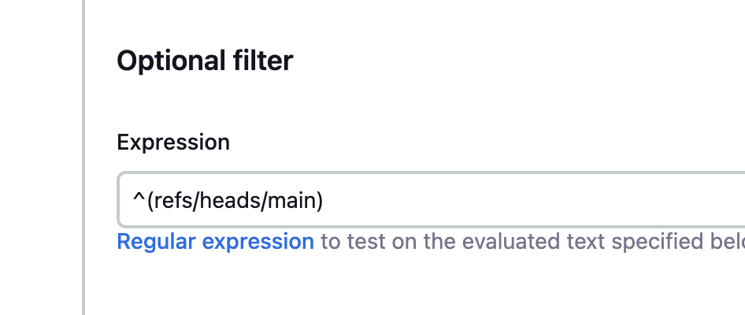
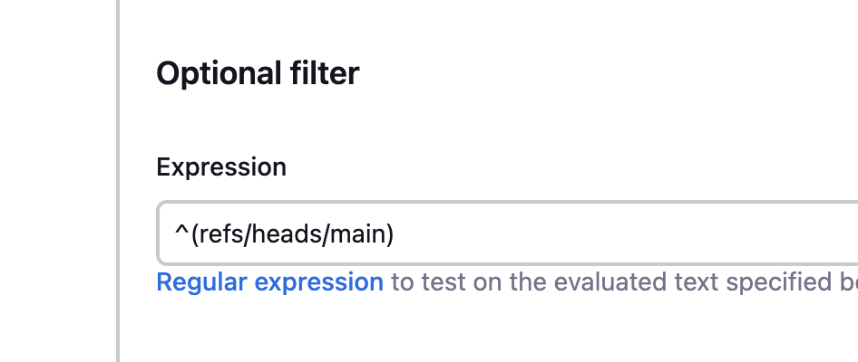
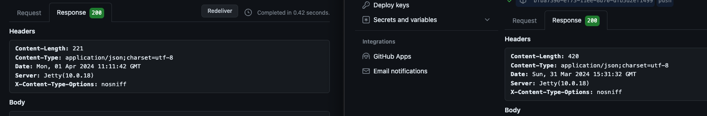
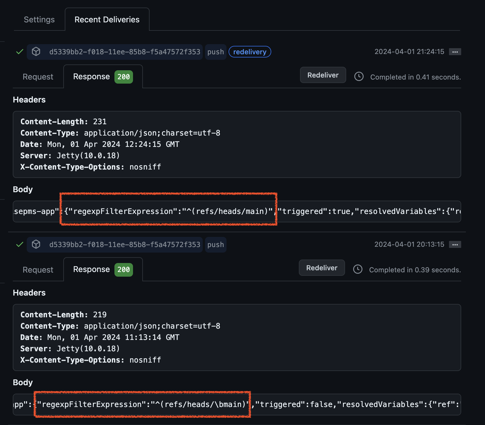

# 디버깅, 어떻게 하시나요?

> 외않되?

코드를 짜다 보면 종종 ~~(내 눈에만)~~ 말도 안 되는 일이 일어난다.

내 눈에는 아무리 봐도 말이 되는데, 

흐름을 하나씩 짚고 넘어가도, 아무리 봐도 말이 되는데...

프로그램은 말을 안 듣는다. 

다른 수 있나? 당연히 인간 잘못이다. 

내가 겪었던 실수들을 하나씩 나열해 가면서, 

누군가(과거의 나 같은)에게는 디버깅에서 의심할 수 있는 리스트로써 도움이 되었으면 좋겠다는 마음에 글을 적어 본다.

## 이스케이프 문자열

얼마 전 있던 일이다. 

Github Webhook을 통해서 젠킨스 자동 배포를 설정하고 있었는데,

**똑~같은 설정을 가진 A라는 URL**은 너무나도 웹훅이 잘 날아갔다. 

그런데 **똑~같은 설정을 가진 B라는 URL**은 계속해서 빌드가 미동도 없는 것이다. 

당최 이해가 안 갔다. 동일한 설정인데 이게 무슨 일일까? 

하나씩 선택지를 좁혀 갔다. 먼저 젠킨스 설정을 확인했다.

음, 역시 아주 똑같았다. 

(같은 세팅 캡쳐가 아니고, A와 B의 세팅이다...)

브랜치가 문제일까? 브랜치도 바꿔 봤다. 하지만 여전히 되지 않는다. 

그러면 깃헙이 웹훅을 잘 보냈고, 200을 받았을까?

A와 B는 200 응답을 똑같이 받고 있었다. 

둘 다 200이면 일단 훅은 잘 날아갔다는 건데......

정상적인 A의 응답과 B의 응답을 대조했다. 

그리고 발견했다...... `\b`를.

띄어쓰기 하나 안 다르고 모든 게 안 다를 때는 가장 의심해야 하는 놈.

`이스케이프 문자열`이다. 

리눅스와 윈도우간 전환에서는 CRLF / LF 이슈로 골머리를 썩히는 건 알았는데, 

이런 부분에서도 내 마음을 어지럽힐 줄은 몰랐다.

아무리 생각해도 여기서 안 된다면 우선 복붙을 해 보자. 

## 로그가 안 찍힐 때는...

* 서버가 같은지 확인하자.

---

해당 글은 계속해서 추가될 예정이다.

어떤 것이든 삽질한 만큼 성장한다고 믿는다.

나의 삽질 투 비 컨티뉴드! 
