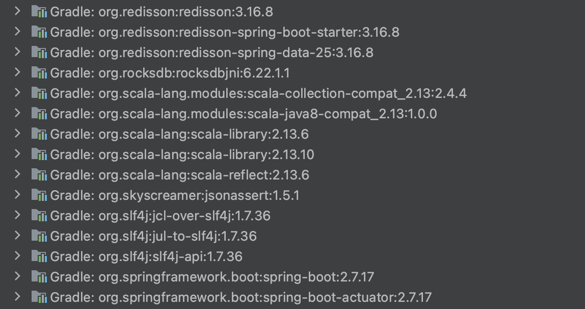
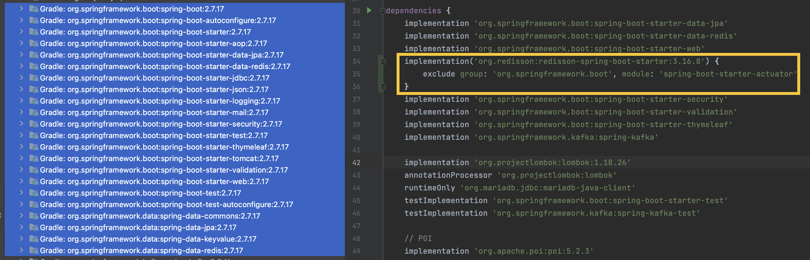

# Spring 경로 매핑 전략: Redisson 의존성 이슈를 확인하며


## Redisson Import Issue?


> 상황: Redisson 의존성 추가 후 프로젝트 빌드가 되지 않음

> 해결: spring-boot-starter-actuator conflict: 의존성 exclude 

기존 구축되어 있는 프로젝트에 **분산 락**을 붙일 일이 있어서 **redisson 디펜던시 추가**를 했다.

그런데 빌드를 하자마자 *SpringBoot 2.6 이상인 프로젝트에 springfox-swagger 3.0을 적용할 때 발생하는 NPE 에러*가 발생했다.


```gradle

Failed to start bean 'documentationPluginsBootstrapper'; nested exception is java.lang
.NullPointerException: Cannot invoke "org.springframework.web.servlet.mvc.condition
.PatternsRequestCondition.getPatterns()" because "this.condition" is null

```

검색 시 블로그에 나와 있는 해결 방안으로는 두 가지가 있었고, 주로 1번으로 해결이 되는 것 같았다. 

1. `spring.mvc.pathmatch.matching-strategy=ant_path_matcher` 추가
2. spring boot의 버전을 `2.5.x`로 낮춤

기존에 돌아가는 프로젝트이니 2번은 애초 적용하기 힘든 선택지였고, 

1번을 도전했으나 계속해서 빌드는 실패했다. 

캐시 문제인가? `.idea` 문제일까? `Invalidate Cache` / 파일 삭제 / 빌드 클린 등 여러 가지 시도를 해 보았다. 

여전히 되지 않았다.


그러다가 `spring-boot-starter-actuator`를 제외하면 프로젝트가 돌아간다는 글을 발견했다. 

나는 해당 의존성이 없는데.... 하다 문득 떠오른 생각. 

아, 설마. 방금 추가한 의존성 내부에 해당 의존성을 포함하고 있는 걸까? 하는 생각을 했고, 

exclude group을 통해 해당 의존성 모듈을 제거해 보았다. 


```gradle
    
    implementation('org.redisson:redisson-spring-boot-starter:3.16.8') {
        exclude group: 'org.springframework.boot', module: 'spring-boot-starter-actuator'
    }

```

그리고 결과는? 빌드 성공.






스웨거의 버전을 올리는 방법도 있겠으나, 기존 돌아가던 프로젝트기도 하거니와...

우선적으로 "추가"했던 것에서 문제를 찾는 방법으로, 사이드 이펙트를 낮춰 접근해 보았다.


## PathPatternParser? AntPathMatcher? 


문제는 해결했으니 질문을 바꿔 보자. 

왜 `springfox-swagger 3.0.0`과 `spring-boot-starter-actuator`간 충돌이 일어나는가?

그 이유는 SpringBoot 2.6 이상 버전에서 `Spring의 변경된 요청 매핑 구조`와 관련이 있다고 한다.

SpringBoot 2.6 이하 버전에서는 경로 매칭 방법으로 `AntPathMatcher`를 사용해 왔다. 

그러나 해당 구조의 메모리 등 비효율을 인식한 스프링 팀에서는 Spring 5.3부터 `PathPatternParser`를 도입하여, 

경로 탐색에 대한 효율을 높이게 되었다.

그리고 SpringBoot 2.6 버전은 도입된 `PathPatternParser`를 기본 매핑 방식으로 전환하게 되는 첫 버전이 되었다.

이제 아래의 방법이 왜 해결 방안인지 알게 된다.

1. `spring.mvc.pathmatch.matching-strategy=ant_path_matcher` 추가
2. spring boot의 버전을 `2.5.x`로 낮춤

`springfox-swagger 3.0.0`는 기존 방식인 `AntPathMatcher`를 지원하기 때문이다.

SpringBoot 2.6 어퍼에서 사용하는 PathPatternParser를 사용하지 않고 `AntPathMatcher`를 사용하도록 바꾸거나, 

`AntPathMatcher`를 사용하는 2.5 언더로 프로젝트를 변경하면 되는 것이다.

그러면 왜 나는 `spring-boot-starter-actuator`를 Exclude 했을 때 문제가 해결됐을까? 

그것은 `spring-boot-starter-actuator`의 **초기화 시 경로 매핑 방법**에 있다.

지정해 주지 않았을 경우, actuator는 `PathPatternParser`를 사용한 방식을 엔드포인트 기본 매핑 방식으로 사용하고 있기 때문이다.

actuator가 초기화될 때 `WebMvcEndpointHandlerMapping`도 함께 초기화된다.

* [WebMvcEndpointHandlerMapping](https://docs.spring.io/spring-boot/api/java/org/springframework/boot/actuate/endpoint/web/servlet/WebMvcEndpointHandlerMapping.html)

그때 매핑 기준은 스프링 기본 설정으로 지정되며, 

해당 스프링이 2.6일 경우 `PathPatternParser`으로 지정되게 된다. 

따라서 `spring-boot-starter-actuator`를 지우면 제대로 구동이 된 것이다. 


## 왜 이런 일이 벌어지는가?

스웨거는 `RequestMappingHandlerMapping`을 통해 어노테이션이 달린 컨트롤러 메서드(`@RequestMapping`...)의 경로 패턴을 찾는다. 

그리고 `PatternsRequestCondition` 안에 저장한다. 

그런데 경로 패턴을 찾는 과정에서 PatternsRequestCondition가 가진 **패턴을 초기화하는 조건을 인식하는 방식**이 달랐던 것이다! 

지금 에러를 보면 `documentationPluginsBootstrapper`라는 빈을 초기화하지 못했다는 에러가 나고 있다. 

```java
    @Component
    @Conditional(SpringIntegrationPluginNotPresentInClassPathCondition.class)
    public class DocumentationPluginsBootstrapper
    extends AbstractDocumentationPluginsBootstrapper
    implements SmartLifecycle {
        //... 
    }
```

해당 클래스에 접근해 보면 `AbstractDocumentationPluginsBootstrapper`를 상속받는 형식으로 구현이 되어 있다.

```java

public class AbstractDocumentationPluginsBootstrapper {
    
    private static final Logger LOGGER = LoggerFactory.getLogger(DocumentationPluginsBootstrapper.class);
    private final DocumentationPluginsManager documentationPluginsManager;
    private final List<RequestHandlerProvider> handlerProviders;
    private final ApiDocumentationScanner resourceListing;
    private final DefaultConfiguration defaultConfiguration;
    private final DocumentationCache scanned;

    private RequestHandlerCombiner combiner;
    private List<AlternateTypeRuleConvention> typeConventions;

    public AbstractDocumentationPluginsBootstrapper(
            DocumentationPluginsManager documentationPluginsManager,
            List<RequestHandlerProvider> handlerProviders,
            DocumentationCache scanned,
            ApiDocumentationScanner resourceListing,
            Defaults defaults,
            TypeResolver typeResolver,
            PathProvider pathProvider) {
            this.documentationPluginsManager = documentationPluginsManager;
            this.handlerProviders = handlerProviders;
            this.scanned = scanned;
            this.resourceListing = resourceListing;
            this.defaultConfiguration = new DefaultConfiguration(defaults, typeResolver, pathProvider);
        }
    }
```


생성자에서 필요한 필드 중 `List<RequestHandlerProvider>`를 한번 들여다 보자. 


```java


// RequestHandlerProvider 

public interface RequestHandlerProvider {
    List<RequestHandler> requestHandlers();
}

// RequestHandler

public interface RequestHandler extends Comparable<RequestHandler> {

    /**
     * @return declaring class
     * @deprecated @since 2.7.0 This is introduced to preserve backwards compat with groups
     */
    @Deprecated
    Class<?> declaringClass();

    boolean isAnnotatedWith(Class<? extends Annotation> annotation);

    PatternsRequestCondition getPatternsCondition();
    
    // ...
}

// PatternsRequestCondition

public interface PatternsRequestCondition<T> {
    PatternsRequestCondition combine(PatternsRequestCondition<T> other);

    Set<String> getPatterns();
}


```

그 안의 `RequestHandler`를 까 보면..? 

드디어 문제의 녀석, `PatternsRequestCondition`를 발견했다. 

springfox는 스프링의 [PatternsRequestCondition](https://docs.spring.io/spring-framework/docs/current/javadoc-api/org/springframework/web/servlet/mvc/condition/PatternsRequestCondition.html), 해당 객체를 래핑해서 사용한다. 

해당 객체가 초기화되지 않았기 때문에 우리는 getPatterns() 메서드를 호출하지 못한 것이다.


## TOBE

향후 프로젝트에서 Actuator를 다시 사용할 때는 HA(고가용성) 대응을 위해 헬스 체크를 해야 할 때일 텐데,

조만간 찾아오게 될 것 같아 그때 헬스 체킹을 하면서 스웨거 업그레이드를 함께 병행하면 좋을 것 같다. 

미리 해 두면 더 좋을 것 같고.

언젠가 도움을 받으실 분이 있으면 해서 새로운 글로 작성해 본다. 

비슷한 문제를 겪는 개발자들이 이 글을 통해 상황을 더욱 빠르게 해결할 수 있기를 바란다. :) 
