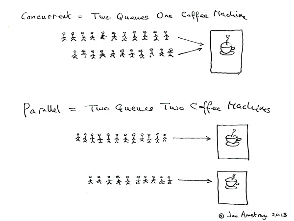
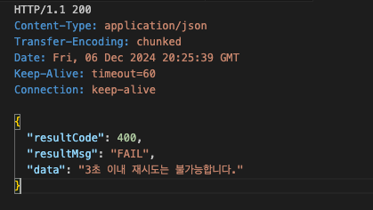
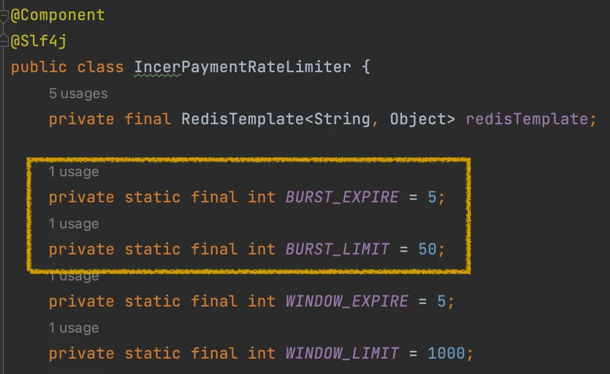
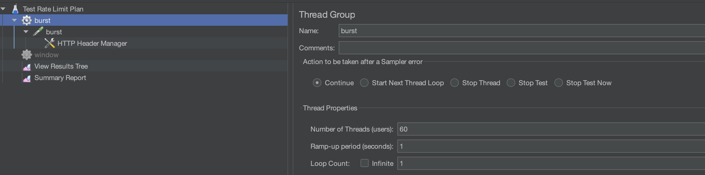
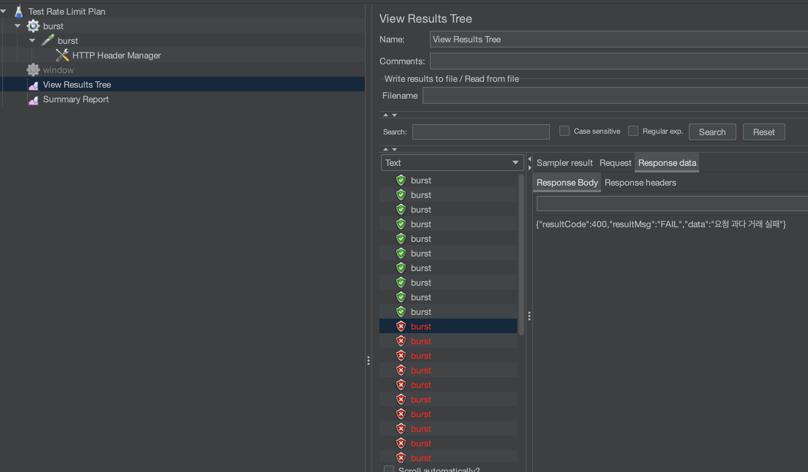
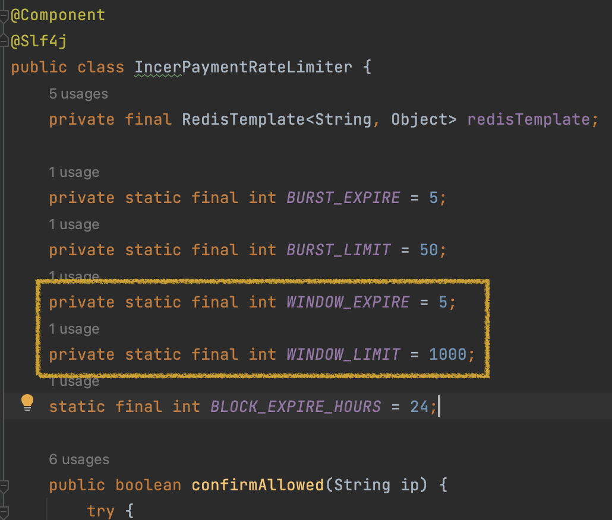
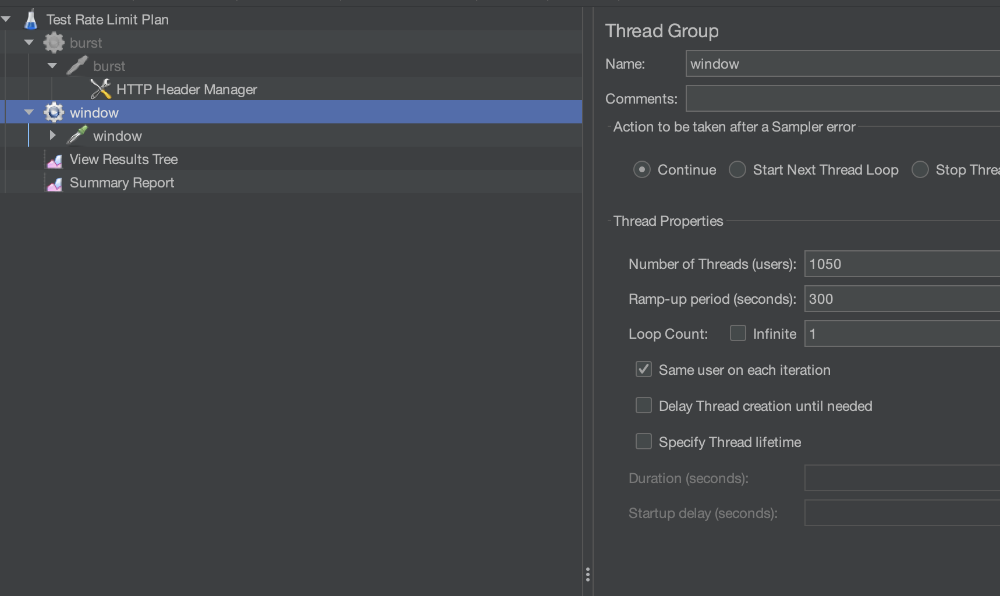
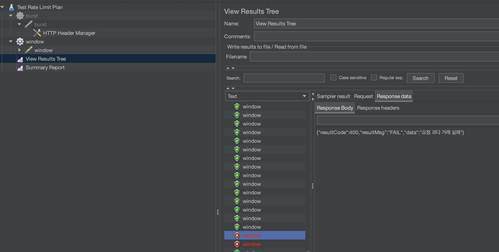

> 해당 시리즈는 [패스트캠퍼스 진행 INNER CIRCLE 1기](https://fastcampus.co.kr/b2g_innercircle_dev)에서,
> [IncerPay라는 **PG 서비스**](https://github.com/kail-is/incer-pay)를 구현하면서 고민하고 구현한 내용을 담습니다.
> 고민의 내용은 제가 담당했던 **BFF 서버**, 그 중에서도 **HA**에 집중되어 있습니다.

---

- **이번 글의 주제:** **`수신 제어`**에 대한 HA
  - *거래 ID 채번 + 3초 제어*를 통한 **멱등성 보장**
  - *Redis 기반 Fixed Window Rate Limit*을 통한 **DDoS 방어**
 
---

- #### [IncerPay Series]
  - [HA 1: 유량 제어](/incerpay-ha-1)
  - [HA 2-1: API 캐싱](/incerpay-ha-2-1)
  - [HA 2-2: Key 인증 과정에서의 Pub/sub](/incerpay-ha-2-2)
  - [HA 3: Fallback & MongoDB 캐싱](/incerpay-ha-3)
  - [HA α: "API 실패"에 대응하는 방법 (Resilience4j / Netflix Hystrix)](/compare-resilience-lib)


# HA?

IncerPay 구현 요구 사항 중 **HA를 보장하는 것**이 있었다.

> **고가용성: High Availability**


가용성, 즉 서버를 사용함에 있어서 높은 가용성을 보장한다는 것은 무엇일까?

내가 내린 정의는 다음과 같다.

- **안전하게 ⇒ 고장나지 않게**

- **“서버가 안전하다”는 것을 보장하는 것**
  - 이미 적재된 데이터가 손실되지 않도록 하는 것
  - 서버가 받고 있는 **트래픽이 안정적**으로 돌아가게 하는 것
    - **조회에 대한 부하**
    - **적재에 대한 부하**

**이미 적재된 데이터 손실, 훼손 방지**는 **이중화나 분산 저장 등의 솔루션**이 떠오른다.

**서버의 트래픽 제어에 관해서는 조회와 적재, 두 가지 관점**이 떠올랐다.

이미 적재된 데이터 손실 방지는 업무적으로 솔루션을 내는 것이 더 적합한 주제라고 생각했고, 특히 인프라 레벨에서 더 해결하기 좋은 과제라고 생각했다.

따라서 “코드” 레벨에서의 트래픽 제어에 집중하기 위해,

나는 이번 HA 섹션에서 **“빠른 응답 반환”**과 **“적재 부하 감소”**에 초점을 두고 싶다.

그런데 그 **두 가지에는 공통적인 부분**이 있다.

바로 **`“요청”`** 이라는 것이다.

# HA section 1, 요청 제어

클라이언트는 서버로 요청을 보낸다.

이때 가장 속도를 저해하는 케이스는 “동기-블로킹-단일 스레드”이다.

> **클라이언트가 요청을 보내면 → 하나의 스레드는 꼼짝하지 못하고 응답을 기다린 뒤 → 응답을 반환한다.**
>

비동기는 응답을 기다리진 않지만, 여전히 블로킹될 수 있다.

그렇다면 동기-블로킹-단일 스레드의 서버를 여러 개 두는 건 어떤가?

서버 대수만큼 여러 명의 사용자를 추가로 받게 되므로 전체 처리량은 늘어날 것이다. **멀티 프로세스**다.

하지만…



이 친구는 내가 과거, **병렬** 처리에 있어 동시성과 멀티 프로세싱을 이해하게 도와준 좋은 그림이다.

**멀티 프로세스는 여러 대의 커피 머신**을 두면 된다. 이에 따라 N개의 커피머신이 N개의 잡을 할 수 있게 될 것이다.

커피머신을 돌리는 사람이 한 명(단일 스레드)이라면, 그 사람은 **커피머신에서 한 번에 단 하나의 일**만을 할 수 있다.

여러 가지 일을 병행한다면 샷을 내리고, 스팀을 치고… 왔다갔다 하는 시간이 추가로 드는 것이다. (컨텍스트 스위칭)

그런데 이때, 하나의 커피머신이 사실은 충분히 여러 명의 사람이 커피를 내릴 수 있었다면 어떨까?

한 명이 샷을 내릴 때 또 다른 한 명이 옆의 머신에서 똑같은 샷을 내릴 수 있다면? 스팀을 칠 수 있다면? 굳이 그 머신을 놀릴 이유가 있을까?

그 머신이 감당할 수 있는 범위에 대해선 충분히 사용해 주면 훨씬 많은 커피를 동일한 시간에 내보낼 수 있을 것이다.

또, 만약 샷을 뽑다가 스팀을 치러 넘어가기도 머신 투 머신 이동보다는 빨라진다.

맞다. 동시성이다!


## Concurrency

**동시성, 그 중에서도 멀티스레딩**은 **하나의 프로세스 내에서 여러 작업 처리를 하는 것**을 이야기한다.

자바에서는 해당 동시성을 **멀티스레딩+비동기**로 제어할 수 있는 `Runnable`과 `CompletableFuture`를 가지고 있다.

내가 **멀티 스레딩**에서 가장 주요하게 생각하는 것은 두 가지이다.

- Thread Safety
- Context Switching

**스레드 간의 공유하는 변수에 대해 어떻게 무결성을 제어**할 것인가?

그리고 **스레드 간의 컨텍스트 전환 비용**을 얼마나 줄일 것인가?

스레드 간의 컨텍스트 전환 비용에 대해서는 좋은 인사이트를 얻었는데, 이건 추후의 포스팅으로 미뤄 두고 ㅎㅎ (한 1월쯤… 작성하고 싶다)

이번 작업에서는 동시성에서 가장 중요한 멱등성, 그 중에서도 데이터의 무결성을 이야기해 보고 싶다.

## 따닥 이슈?

우리는 동시성 제어에서 **여러 번 “요청”했을 때 어떻게 요청의 멱등성을 보장할 것인가**에 대한 고려를 가장 주요 고민으로 삼는다. 주로 다음과 같은 솔루션을 떠올리면서.

- Lock: 비관적 락 / 낙관적 락 / 분산 락
- Queuing

그러나 IncerPay에서는 어쩌면 가장 단순한 전략을 선택했다. **멱등성 보장을 위한 ID 채번**이 그것이다.

현재 로직에서는 **인증과 결제를 분리**하고 있다. 인증 요청을 할 때 해당 거래에 대해서 거래 ID / 결제 ID가 채번된다.

O2O 서비스로 비유했을 때 조금 더 직관적인 것 같아 대입해 보자면, **거래 ID는 상품 주문에 대한 ID**로 생각하면 될 것 같다.

우리가 주문 내역에 들어갔을 때 보이는, 그 채번된 ID를 거래 ID로 이름 붙였다.

결제 ID는 상품 주문에 대한 하위 ID인데, 거래 안에서 일어날 수 있는 모든 행위를 하나씩 신규 요청할 수 있는 하위 ID이다.

따라서 결제에 대한 따닥 이슈는 **거래 ID**를 통해 보장된다.

그럼 **거래 ID가 여러 번 채번되는 경우는 어떡해요?** 라는 질문이 있을 수 있다.



이는 3초 제어라는 방어 로직을 통해 해결하였다.

**사용자가 거래 ID를 채번한 지 3초가 지나지 않은 시점에서는 신규 거래 ID를 채번하지 않는 것**이 그것이다.

물론 사용자가 많아질수록 DB 조회 이슈가 생길 수 있는 부분인 것은 이해하고 있어서, 이후 대규모로 요청을 했을 때 Redis 등의 캐싱 작업을 토대로 탐색하는 등의 추가 제어 방법에 대해서 더 고민해 보면 좋을 것 같다.

## Rate Limit

폭포수는 떨어진다. 떨어지는 물은 정량적이지 않다.

우리의 프로세스가 감당할 수 있는 것이 10임에도 불구하고, 외부 프로세스가 감당할 수 있는 것이 10임에도 불구하고, 그 프로세스들에게 쏟아지는 요청은 15가 됐다 2가 됐다가 한다.

그렇다면 우리의 논리적 트랜잭션이 15라는 **트래픽 스파이크 상황**에 노출되지 않게 우리는 무엇을 해야 하는가?

15를 10으로 만들 수 있도록 어딘가에 묶어두는 작업이 필요하다.

**Rate Limit**은 두 가지 종류를 생각해 볼 수 있다.

- **수신 제어 (유입)**
- 요청 제어 (전송)

**이번 편에서는 수신 제어**를 다루고, 추후 요청 제어에 대해서는 MongoDB 적재 편에서 다뤄 보도록 하겠다.

# 수신 제어

기본적으로 우리의 “결제” 시스템에서 수신 제어는 분산 환경을 고려한 + 가장 안정적이고 + 보안을 고려하는 선택이어야 할 것이다.

**결제 요청에 대한 다수 요청 제어**는 위에서 Throttling을 통한 3초 제어로 갈음했다.

그렇다면 이제 **“시스템 부하”를 일으키는 요청, 보안을 위협하는 요청**을 제어할 필요가 있다.

### 보안 위협

> IP 차단 + Fixed Window
>

- **IP 차단**

수신 트래픽과 관련해 가장 간단하게 생각해 볼 수 있는 보안 문제는 **DDoS**다.

디도스의 케이스는 **요청 과다 / 과부하 요청 지속적 시도**가 있을 것이다.

과부하 요청이 자주 일어나는 케이스에 대해서는 쿼리 캐시 등의 해결 방안이 있겠으나,

기본적으로 우리 서비스에서 다수 테이블 JOIN이나 통신이 4번 이상 일어나는 케이스는 없기에 **요청 과다에 대한 것만 고려하기**로 하였다.

수신 트래픽에서 발생하는 디도스 문제는 우선적으로 **해당 IP에서 유입되는 트래픽을 최대한 제어**함으로써 방어할 수 있을 것이다.

나는 **해당 IP의 거래 관련 데이터를 Redis에 적재**함으로써, 기본적인 **IP 보안에 대한 제어를 구현**하였다.

## 구현 방식

- 초 단위 제어
- 분 단위 제어

```java
	
  public boolean confirmAllowed(String ip) {
      try {
  
          String burstKey  = "burst:" + ip;
          String windowKey = "window:" + ip;
          String blockKey  = "blocked:" + ip;
  
          if (isIpBlocked(blockKey)) {
              throw new IncerPayRateLimitException("시도 횟수 초과");
          }
  
          Long burstCount  = incrementAndSetExpiry(burstKey, BURST_EXPIRE, TimeUnit.SECONDS, ip, "burst");
          Long windowCount = incrementAndSetExpiry(windowKey, WINDOW_EXPIRE, TimeUnit.MINUTES, ip, "window");
  
          setLoggingByRate(burstCount, windowCount);
  
          boolean isAllowed = confirmInvalidIp(blockKey, burstCount, windowCount, ip);
  
          if (!isAllowed) {
              throw new IncerPayRateLimitException("시도 횟수 초과");
          }
  
          return isAllowed;
  
      } catch (Exception e) {
          log.error("Rate limiting failed for IP: {}", ip, e);
          return false;
      }
  }
```

해당 구현은 **Fixed Window 방식**으로 Redis에 3가지 Key를 두어 구현했다.

- 초:(burstKey) 1초에 50번 이상이 들어올 경우를 제어하는 Key
- 분(windowKey): 5분에 1000번 이상이 들어올 경우를 제어하는 Key
- 위의 조건을 넘어 제어된 IP를 적재하는 Key

초 단위로 체크하는 Burst Counter를 통해 짧은 시간 제어를, 분 단위로 체크하는 Window Counter를 통해 긴 시간 제어를 하고, 이 제한을 넘은 IP를 따로 저장하는 Key를 두었다.

**인터셉터**에서 IP를 확인하고 제어 컴포넌트로 넘기는 방식으로 구현했는데, **사실 어노테이션을 통해 위에 제한한 시간이나 숫자를 동적으로 지정**할 수 있게 하고 싶었다.

또 **HttpResponse를 직접 리턴**하는 게 마음에 들지 않는다.

이것들 덕분에 인터셉터에 구현된 것들을 AOP로 바꾸고 싶은데… 어노테이션 등은 구현을 해 두었으니 추후에 보완해 볼 수 있는 시간이 있다면 좋겠다.

## 구현 기능 테스트 (Jmeter)

구현을 마쳤으니 이제 테스트를 해 보자.

Jmeter를 통한 기능 테스트 / 테스트 코드를 통한 테스트를 진행해 보았다.


### **초 단위 제어**
- 1초에 50번 이상이 들어올 경우를 제어하는 Key

- 1초 안에 60번을 테스트
- 성공한 모습을 확인할 수 있었다.







### **분 단위 제어**
- 5분에 1000번 이상이 들어올 경우를 제어하는 Key

- 5초 안에 1020번을 테스트
- 성공한 모습을 확인할 수 있었다.








해당 Jmeter 테스트를 마치고, 구현한 테스트 코드를 복기해 보았다. 

## **테스트 코드**

- 정상 케이스 테스트: limit 이하면 그냥 통과시키고, increment가 2번 (burst랑 window) 호출되는지 확인
- burst limit 초과 테스트: 초당 50번 넘게 호출되면 reject 확인
- window limit 초과 테스트: 5분에 2000번 넘게 호출되면 reject 확인
- Redis 장애 상황 테스트: Redis가 죽었을 때는 안전하게 차단

네 가지 케이스에 대한 **테스트 코드를 BDD 방식으로 작성**하였다.


```java
  package incerpay.paygate.common;
  
  @ExtendWith(MockitoExtension.class)
  class IncerPaymentRateLimiterTest {
  
    private static final long BURST_LIMIT = 50;
    private static final long WINDOW_LIMIT = 2000;
  
    @Mock
    private RedisTemplate<String, Object> redisTemplate;
  
    @Mock
    private ValueOperations<String, Object> valueOperations;
  
    @InjectMocks
    private IncerPaymentRateLimiter rateLimiter;
  
    @BeforeEach
    public void setUp() {
      when(redisTemplate.opsForValue()).thenReturn(valueOperations);
    }
  
    @Test
    @DisplayName("정상적인 요청은 허용되어야 한다.")
    public void shouldAllowNormalRequest() {
      // given
      String testIp = "192.168.1.1";
      when(valueOperations.increment(anyString())).thenReturn(1L);
  
      // when
      when(valueOperations.increment("burst:" + testIp)).thenReturn(BURST_LIMIT);
      when(valueOperations.increment("window:" + testIp)).thenReturn(WINDOW_LIMIT);
  
      // then
      assertDoesNotThrow(() -> rateLimiter.confirmAllowed(testIp));
      verify(valueOperations, times(2)).increment(anyString());
    }
  
    @Test
    @DisplayName("burst 제한을 초과하면 요청이 거부되어야 한다.")
    public void shouldRejectWhenBurstLimitExceeded() {
      // given
      String testIp = "192.168.1.1";
      when(valueOperations.increment("burst:" + testIp)).thenReturn(BURST_LIMIT + 1);
      when(valueOperations.increment("window:" + testIp)).thenReturn(WINDOW_LIMIT);
  
      // when
      boolean result = rateLimiter.confirmAllowed(testIp);
  
      // then
      assertFalse(result);
    }
  
    @Test
    @DisplayName("window 제한을 초과하면 요청이 거부되어야 한다.")
    public void shouldRejectWhenWindowLimitExceeded() {
      // given
      String testIp = "192.168.1.1";
      when(valueOperations.increment("burst:" + testIp)).thenReturn(BURST_LIMIT);
      when(valueOperations.increment("window:" + testIp)).thenReturn(WINDOW_LIMIT + 1);
  
      // when
      boolean result = rateLimiter.confirmAllowed(testIp);
  
      // then
      assertFalse(result);
    }
  
    @Test
    @DisplayName("Redis 실패 시 요청을 차단해야 한다.")
    public void shouldBlockRequestWhenRedisFails() {
      // given
      String testIp = "192.168.1.1";
      when(valueOperations.increment(anyString()))
              .thenThrow(new RedisConnectionFailureException("Connection failed"));
  
      // when
      boolean result = rateLimiter.confirmAllowed(testIp);
  
      // then
      assertFalse(result);
      verify(valueOperations).increment(contains("burst:" + testIp));
    }
  }
```

이를 토대로 IncerPay로 들어오는 Rate Limit의 제어를 마쳤다.

## Fixed Window 방식?

사실 Rate Limit 의 구현 방식에는 Fixed Window만 있는 것이 아니다.

- Token Bucket : **지정된 양**의 토큰을 채우고 요청 시 소비. 토큰이 있어야 요청 가능.
- Leaky Bucket : 들어온 요청을 일정 **속도**로만 처리. 나머지는 큐잉.
- Fixed Window : **정해진 시간** 동안 **개수** 제한 (5분 / 10분 이렇게 잘리도록)
- Sliding Window : **현재부터 일정 시간 전까지의 요청 개수** 제한

사실 가장 간단한 방식은 **Token Bucket** 이다.

**기본적으로 토큰이 있다면 사용**하고 - **없다면 사용하지 않는 방식**을 따르고 있기 때문이다.


또한 Leaky Bucket 도 속도에 대한 제어만 있도록 큐를 채워주는 식의 단순한 구현 방식을 가지고 있다.

그런데 Fixed Window는 고정된 시간 간격에 대한 요청 개수를 재기 때문에 매번 시간 간격을 체크하고 + 개수가 넘었는지 비교하는 형태의 연산이 요청마다 한 번 더 들어간다.

이때 고정된 시간이 낳는 단점이 있다. 가령 5분 간격이라고 했을때, 직전 4-5분과 직후 1-2분에 연산이 몰릴 경우, 5분 사이에 있는 연산이 우리가 제한한 연산 개수보다 많아질 수 있는 경계 문제가 발생하는 것이다.

해당 문제는 Sliding Window가 해결하고 있다. 개별 요청에 대해 타임 스탬프를 통해서 시간을 측정하고, 해당 시간에 대한 “흐름”을 토대로 제어하기 때문에 경계 문제가 발생하지 않는다.

그렇다면 나는 왜 경계에서 문제가 생길 수 있는, 오히려 이전의 것보다 추가 구현이 필요한 **Fixed Window를 사용**했을까?

이는 **DDoS라는 보안적 관점**을 고려했기 때문이다.

단순한 유량 제어가 필요한 것이 아니라, **특정 IP가 초/분 안에 많은 트래픽을 발생시킬 경우** 제어하기 위한 두 가지의 지점을 둔 것이다.

그러면 경계 문제가 없는, **Sliding Window Counter를 사용하지 않은 이유**는 무엇인가?

이는 **구현의 복잡도**에 있다. 현재 상황에서는 경계에서 데이터가 몰리더라도 그 이상의 트래픽을 감당할 수 있다는 가정 하에 움직이기 때문에 큰 문제가 없는 상태이다.

그런데 각 요청의 정확한 timestamp를 저장하는 선택을 할 이유가 없다.

이는 불필요한 오버 엔지니어링이라고 여겼고, 그에 따라 Fixed Window를 선택하게 되었다.

오버 엔지니어링을 피하기 위한 알고리즘 선택은 언제나 내가 경계하는 것 중 하나다.

현재도 비효율이고 미래에도 비효율인 선택지를 개발적으로 보다 아름답기 때문에 선택할 이유는 없다.

## Redis 문제?

현재 나는 **Redis의 서버가 꺼져 있는 경우 요청이 실패**하도록 로직을 구성해 두었다.

Redis를 통한 검증이 일어나지 않으면 해당 IP에 대한 제어도 불가능하기 때문이다.

이 부분은 당연히 **SPOF 문제**를 낳을 수 있다. 가장 엔드포인트에서 모든 요청에 대한 검증이 일어나기 때문에.

내가 Redis를 쓸 때마다 언제나 걱정하는 문제 중 하나인데…

**Redis Sentinel / Redis 클러스터**를 구현하는 방식이 방어책인 것을 인지하고 있다.

아직 실무에서 Redis에 대한 SPOF를 경험해 본 적이 없어서 단언할 수는 없지만…

읽으시는 분이 해당 부분에 대해 조언해 주실 수 있다면, 알려주시면 감사하겠습니다.

다음 글에서는 HA 2편, **인증 키 캐싱하기**에 대해서 이야기해 보려고 한다.