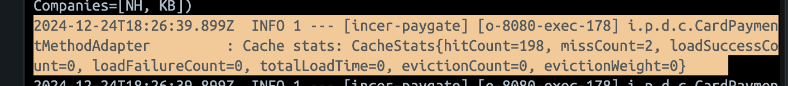

> 해당 시리즈는 [패스트캠퍼스 진행 INNER CIRCLE 1기](https://github.com/FC-InnerCircle/icd01-team04-fintech2-be)에서, IncerPay라는 PG 서비스를 구현하면서 고민하고 구현한 내용을 담습니다. 고민의 내용은 제가 담당했던 BFF 서버, 그 중에서도 HA에 집중되어 있습니다.
>


# HA?

이전 편에서 HA를 언급하며, HA를 다음과 같이 정리하였다.

- **안전하게 ⇒ 고장나지 않게**
- 이미 적재된 데이터가 손실되지 않도록 하는 것
- **서버가 받고 있는 트래픽이 안정적으로 돌아가게 하는 것**
  - `조회에 대한 부하`
  - 적재에 대한 부하

지난 편에서 **어떻게 요청을 제어할지**에 대해서 생각해 보았다.

이제 그 **요청을 토대로 “무엇을” 할 것인지**에 대해 고려해 보아야 한다.

따라서 나는 다음 두 가지의 HA 섹션에서 **“빠른 응답 반환”**과 **“적재 부하 감소”**에 초점을 두고 싶다.

이번 편은 그 중 **`빠른 응답 반환`**, 바로 **`캐싱`**이다.

# HA section 2, Caching

**서버 내 네트워크 IO나 연산 등은 서버의 부하를 증가**시킨다.

IO timeout을 통한 병목이 일어날 수도 있고, 해당 데이터를 얻기 위한 JOIN 연산이나 서비스 로직에서 부하가 일어날 수도 있다.

이 중 IO time과 연산 오버헤드 등을 획기적으로 줄이고, **데이터를 빠르게 반환할 수 있는 것은 캐싱**이다.

데이터 저장 시스템에 스트레스나 부분적 장애가 발생할 때, **캐시된 데이터**가 **대체 데이터 소스**로 활용될 수도 있을 것이다.

이러한 캐싱을 하려면 **캐싱을 할 곳이 필요**하다.

여기서 사용되는 두 가지는 Local 캐시와 Global 캐시이다.

# Local 캐시와 Global 캐시?

| **특징** | **Local 캐시** | Global **캐시 (Redis, Valkey…)** | DB |
| --- | --- | --- | --- |
| 위치 | 노드 내부 | 외부 Global 서버 | 외부 DB 서버 |
| 읽기 속도 | 초고속 (수 밀리초 이하) | 초고속 (수 밀리초 이하) | 상대적으로 느림 (수십 밀리초 ~ 초 단위) |
| 쓰기 속도 | 초고속 (수 밀리초 이하) | 초고속 (수 밀리초 이하) | 느림 (수십 밀리초 ~ 수초 단위) |
| 응답 시간 | 1~3ms 이내 | 1~5ms 이내 | 10~100ms 이상 |
| 데이터 접근 방식 | 메모리 기반 | 메모리 기반 | 디스크 기반 |
| 데이터 일관성 | 인스턴스 간 일관성 유지 어려움 | 여러 노드 간 일관성 유지가 가능함 | 가장 영속적 |

## DB

DB의 가장 큰 맹점은 디스크라는 것이다. 타 캐싱 방식에 비해 **디스크는 정보의 탐색 시간에서 큰 단점**을 지닌다.

대량의 동시 트래픽이나 복잡한 쿼리 요청 시 병목 현상이 발생할 수 있고, 트랜잭션 처리, 일관성 유지 등으로 인해 추가적인 오버헤드도 발생한다.

또한 RDB의 경우 스키마로 인한 낮은 확장성이나, 대용량 데이터가 쌓일 케이스가 존재하는데, 이럴 때의 솔루션으로 저장 공간을 분산하는 샤딩과 같은 기술을 도입해야 하기 때문에 **읽기에 들어가는 탐색 비용은 서비스를 운영할수록 올라갈 수밖에 없다.**

## 로컬 캐시

우리는 이런 것을 **로컬 캐시로 가장 먼저 보완**해 볼 수 있다.

애플리케이션 내부 메모리에 데이터를 저장하기 때문에 디스크 조회+통신 비용에 비해, 메모리 접근+통신 비용 없음을 통해 매우 빠른 속도(1-3ms)를 보장한다.

다만 클라우드가 도입된 이후로 스케일 업보다는 스케일 아웃을 추구하는 현재 애플리케이션 흐름 특성상, **로컬 캐시에 무언가 저장하는 것은 여러 노드에 동일한 캐시를 전파시키기에 어려움이 있을 수 있다**는 점에서 부하를 가지게 된다.

## Redis

Global 캐시 중 일반적으로 많이 사용되는 것은 Redis이다.

Redis는 외부 서버에 위치한 원격 캐시 시스템으로, 자주 변경되는 가변적인 데이터를 다루는 데 최적화되어 있다.

값 반환 시간은 **로컬 캐시와 비교하여 통신에 대한 시간이 추가**되는 것로 예상해 볼 수 있다. 이에 따라 로컬 캐시에 비해 조금의 부하는 발생할 수 있다는 점을 고려해야 한다.

그러나 특히 **분산 환경에서 사용하기에 적합하다**는 것이 현재 트렌드에 있어 로컬캐시와 비교해 가장 두드러지는 장점일 것이다.

이제 DB IO를 두 가지 캐시 시스템에 할당하기 위해, **부하를 감소시킬 수 있는 데이터**를 고려해 볼 시간이다.


# I/O가 일어나는 데이터

IncerPay 서비스에서 **읽기 부하를 감소시킬 수 있는 데이터**들을 찾아 보자.

현재 **MSA 구조**로 되어 있기 때문에, BFF 서버 입장에서 하기 정보들은 전부 **상점 도메인에서 API 통신을 통해 건네받는 데이터**이다.

> **결제 요청 서버(BFF 서버) → 상점 서버**
>

- 결제 수단 데이터 / 카드사 무이자 할부 등의 데이터 / 약관
- API 인증 코드
  - Public Key
  - Secret Key

## 결제수단 데이터 / 약관

> **로컬 캐시 + Redis**
>

- 카드 리스트 캐싱하기
- 1달 TTL
- 업데이트 가능성 → 캐시에 대한 업데이트가 필요

사용자는 카드를 사용할 때 필요한 약관에 대해서 송수신할 수 있다.

사용자는 어떤 카드사를 사용할지. 카드사 당 무이자 할부가 가능한 개월수 데이터는 어떤 건지 송수신할 수 있다.

**해당 데이터는 크게 가변하는 데이터가 아니다.**

이걸 BFF 서버 단에서 캐싱을 통해 끊는다면, 상점 API에 요청을 보내는 통신 비용이 감소할 것이다.

나는 해당 데이터를 로컬 캐시 + Redis를 이용해서 풀기로 했다.

우선 로컬캐시를 택한 이유는, 해당 데이터 중 **약관 데이터가 “갱신”을 아주 적게 하는 데이터**이기 때문이다.

현재 상점 쪽에서는 Seller라는 객체를 토대로, 해당 Seller 안에 어떤 결제 수단을 사용하는지, 카드사 정보를 어떤 걸 사용하는지 판단하는 단일 상점조회 API를 가지고 있다.

여기에 **약관 정보를 가지고 오는 API를 추가**할 경우 상점 기준에서 상점 정보 - 약관의 조회 분리라는 SRP에 맞는 설계를 가지고 갈 수 있게 된다.

약관 정보의 갱신은 거의 일어나지 않을 것이며 일어난다고 할지라도 전파가 어렵지 않다. 따라서 로컬 캐시에 저장한다.

카드사 데이터의 경우 단일 상점 조회 API에 따른 Seller 데이터를 Redis에 저장한다.

## Public Key

> **Redis**
>

인증 키는 모든 통신에 포함되어 있다. 따라서 상점 API를 토대로 키 값 검증을 해야 한다.

- 가장 IO가 많고 캐싱에 가장 리스크가 적은 키
- … 지만 결제 수단에 비해 동적으로 변하기 쉽고 리스크가 더한 키
- 사용자의 키 삭제라는 행위가 존재 + 분산 시스템에서 공유하기 쉽기 때문에 Redis를 선택

**Public Key는 가장 IO가 많을 수밖에 없는 키**다.

가맹점의 사용자가 결제를 위해 API를 호출할 때, 카드 리스트를 조회하기 위해 API를 호출할 때 등, **브라우저 환경에서 포함되는 해당 키**는 언제나 Public Key에 대한 검증을 거친다.

또한 **가장 리스크가 적은 키**다. 키 삭제 갱신이 10분 늦은 바람에 결제가 더 돼서 돈이 더 들어왔다고 그걸 싫어할 가맹점주가 있을까? 내 대답은 아니오였고, 이 결정에 따라 로컬 캐시도 고려해 봤었다.

그러나 현재 활성화된 **모든 Public Key를 로컬 캐시에 담는 선택은 캐시 갱신의 측면에서 옳지 못했다.**

가맹점주가 **해당 키를 “삭제” 할 수 있다**는 점이나, 추가될 때 캐시가 더해져야 한다는 점은 캐시 갱신이 서버 인스턴스 개수만큼, 동기적으로 혹은 비동기적으로 이루어져야 한다는 뜻이다.

따라서 지속적으로 일어나는 키 삭제-추가 동기화 이벤트 처리가 필요한데… Redis PubSub의 경우 도달하지 못할 가능성이 있고, Kafka를 쓰기에는 이 작은 “키 삭제”라는 이벤트에 EDA를 도입하는 것은 오버엔지니어링이라는 생각을 했다.

따라서 **Public Key는 Redis에** 담기로 했다.

### **Public Key** Redis에 적재하기

그러면 해당 Public Key는 **언제 Redis에 적재**하는가?

- 상점 서버에서 적재된 Key를 캐싱하는 곳을 Redis로 한다
- BFF 서버에서 Key 인증을 거칠 때 해당 Redis를 조회한다

나는 해당 Key의 적재 시점을 **1차 이용 시점**으로 생각했다.

**원래는 상점 서버의 Key 발급 시 DB → Redis의 순서로 적재를 하고, BFF에서 검증은 Redis로만 조회하려 했다.**

활성화 Key 조회를 위한 API 통신 비용이 불필요하도록 처리하기로 생각했기 때문에**.**

물론 **Write-Through에는 쓰기 지연**의 가능성이 존재하지만, Key라는 데이터의 특성상 Write-Behind와 같은 방식을 사용하게 되면 **데이터 손실 위험**이 있기 때문이었다.

그러나 구현을 하면서 조금 더 고민해 본 결과, 키는 어쨌든 TTL이 필요하다.

또한 “사용하지 않는” 사용자의 데이터를 레디스에 지속적으로 적재해 둘 이유는 없다.

따라서 **레디스의 데이터는 이용자 Ratio에 따른 TTL을 기준**으로 두기로 했다.

다만 **회원 탈퇴 / 키 만료 시 레디스 갱신은 필요**하기 때문에, 상점이 **Redis로 해당 만료 요청을 보내는 것은 추가 처리**하였다.

물론 캐시 관리 전략 관점에서 BFF가 전담하게 되면 캐시 책임이 온전하게 BFF에 있게 된다. 이는 일관성 관점에서 나을 수 있고, 동시에 상점과 BFF의 key도 통일할 필요가 없어진다.

그러나 탈퇴나 키 만료 시 상점에서 BFF로 통신을 보내고, BFF가 다시 Redis를 처리하는 것은 **추가적인 통신 부하**를 불러일으킨다. 차라리 내부 협의를 거친 뒤 상점이 Redis를 직접 바라보면 통신 부하가 1회 줄어들 수 있다.

### **Public Key TTL 의사결정**

**Public Key의 TTL은 7일**로 잡았는데, 이는 현재 판단 가능한 근거에서 시작했다.

보통 Key는 생성 뒤 삭제될 일이 거의 없다. 탈퇴 시나 노출 등의 이슈로 삭제하지 않고서야.

다만 **“활성화”의 측면**에서 접근했는데, 보통 상점은 여러 개의 키를 가지고 있어도 주 사용 키가 정해져 있을 수 있다. 또한 특정 상점은 아예 거래를 하지 않을 수도 있다.

이에 따라 **7일 이상 거래하지 않은 키는 Redis에 두지 않도록 만료 기한을 7일**로 잡도록 했다.

만약 분석 가능한 지표가 추가된다면 TTL도 더 정교하게 나오지 않을까 싶다.

예컨대 키별 얼마나 자주 쓰이는지(사용 빈도), 한번 쓰고 다시 쓸 때까지 시간이 얼마나 걸리는지(재사용 간격), 발급받고 처음 쓸 때까지 얼마나 걸리는지(첫 사용 시간), 그리고 삭제나 재발급은 얼마나 자주 일어나는지(변경 빈도)… 같은 지표들 말이다.

물론 지난번 글에서 말했듯 **레디스의 SPOF 문제**가 있을 수 있으니… 해당 부분에 대해선 보완점이 필요할 것 같다.

센티넬 방식을 가장 빠르게 고민해 볼 수 있을 것 같은데, 그 부분은 어렵지 않게 인프라단에서 추가할 수 있으니 다른 파트에서 다뤄 보도록 하겠다.

## Secret Key

> 캐시하지 않음
>

**Read Lock, 부하를 감내해야 하는 데이터**가 있다. **가용성보다 안정성**을 택해야 하는 데이터다.

나는 이것이 시크릿 키라고 생각했다.

그 이유는, 해당 정보는 **“민감 데이터 요청”에 대한 권한을 검증하는 Key**이기 때문이다.

사용자는 자신의 Secret Key를 토대로 **이번 달 결제 리스트 등 관련 정보**를 받아올 수 있는데, 그 키가 노출되었다거나 하는 특정 사유로 해당 키를 만료시키고 싶을 수 있다.

그 Key가 모종의 사유로 복제되지 않거나, 통신에서 손실이 일어나서 Key가 만료되지 않고 계속해서 사용된다면?

문제가 될 것이다.

그에 따라 **Secret Key의 코드 내 가용성 증가는 배제**했다.

레플리카를 토대로 읽기 부하를 줄이는 선택, 비동기의 선택을 **하지 않아야 하는 데이터**라고 생각한다.

의사결정을 마쳤다면 이제 캐싱을 하러 가 보자.


# 어떻게 캐싱할 것인가?

## 캐시할 때 고려해야 할 것

- TTL
- 캐시 갱신

**캐시는 반드시 만료**되어야 한다. **캐시의 목적**은 결국 **옮겨 놓은 뒤 빠르게 값 반환을 보장**하는 형태다.

즉, 옮겨진 것이 동기화되지 않은 정보일 수 있다는 의미이다.

이에 따라 **캐싱은 언제까지 해당 데이터를 둘 것인지, 어떻게 갱신시킬 것인지의 이슈를 수반**한다.

- **TTL (Time To Live)**

얼마만큼 해당 데이터가 불변할까? 그 의사결정은 도메인과 해당 업무, 정보의 특성에 따라 달라질 수 있겠다.

하지만 어떠한 캐시든 무조건 TTL을 가져야 하고, 그 시점에 삭제가 되어야 한다는 것은 달라지지 않는다.

기준은 비즈니스에 있어 무방한, 무결성을 보장할 수 있는 범위라고 세울 수 있을 것 같다.

- **갱신**

여기서 내가 말하는 갱신은 **캐시 무효화 후 재요청을 포함**한다.

먼저 첫 번째로, **API 통신을 통해 동기적으로 갱신**할 수 있을 것이다.

두 번째로, **EDA와 배치를 토대로 비동기적으로 갱신**할 수 있을 것이다.

나는 **이번 시나리오에서는 동기적인 갱신**을 기준 삼기로 했다.

그 이유는 내가 제공해야 하는 정보들이 결제에 있어서 리스크를 지니는 만큼 **무결성을 보장**해야 한다.

물론 Kafka를 통해 해당 무결성을 보장할 수도 있겠으나, 아까도 먼저 언급하였듯이 EDA는 현재 업무 기준으로는 오버 엔지니어링이다.

따라서 **EDA 중** **Pub-sub (Redis vs Kafka)에 대해서는 다른 글**에서 다뤄 보기로 했다.

또한 캐시 갱신 시 고려해야 할 문제 중에는 **캐시 스탬피드**가 있다. 캐시 만료가 동시에 되는 순간 Redis의 갱신 요청이 한 번에 DB로 몰리는 경우를 말한다.

이는 **TTL보다 짧은 갱신의 배치를 돌아 해결**할 수 있으니, 해당 요청도 **Redis 캐싱 시 활용**해 보기로 했다.

이제 이 유의점을 기준으로 우리의 데이터들을 캐싱해 보자.

## 카드 리스트 / 약관

- **BFF 서버 캐싱**
  - 카드 리스트 - Redis
  - 결제수단 리스트 - Caffeine

먼저 이야기했다시피, **카드리스트와 약관은 거의 변치 않는 데이터**이다.

특히 **약관의 경우** 인스턴스가 올라간 다음 바뀔 확률이 **거의 제로**에 가깝다고 판단했다.

따라서 **Redis의 Lettuce를 통한 글로벌, Caffeine을 통한 로컬 캐시 접근을 두 가지 다 활용**하게 되었다.

- **캐시 매니저**
  - 레디스 (Lettuce)
  - 카페인

```java

**@Cacheable(value = "seller", cacheManager = "redisCacheManager")**
public SellerCacheView getSeller(Long sellerId) {

  ResponseEntity<SellerApiView> view = api.getSeller(sellerId);
  isValidResponse(view);
  return SellerCacheView.from(Objects.requireNonNull(view.getBody()));
  
}

**@Cacheable(value = "terms", cacheManager = "caffeineCacheManager")**
public TermsApiView getTerms() {

  ResponseEntity<TermsApiView> view = api.getPaymentTerms();
  isValidResponse(view);

  return view.getBody();
}

```

```java

@Bean
@Primary
public CacheManager redisCacheManager(RedisConnectionFactory connectionFactory) {

    log.info("Redis Cache Manager {}", connectionFactory);

    RedisCacheConfiguration config = RedisCacheConfiguration.defaultCacheConfig()
            **.entryTtl(Duration.ofDays(7))**
            .serializeKeysWith(
                    RedisSerializationContext.SerializationPair.fromSerializer(new StringRedisSerializer())
            )
            .serializeValuesWith(
                    RedisSerializationContext.SerializationPair.fromSerializer(new GenericJackson2JsonRedisSerializer())
            );

    return RedisCacheManager.builder(connectionFactory)
            .cacheDefaults(config)
            .withCacheConfiguration("seller", config)
            .build();
}

@Bean
public CacheManager caffeineCacheManager() {
    CaffeineCacheManager cacheManager = new CaffeineCacheManager("terms");
    cacheManager.setCaffeine(Caffeine.newBuilder()
            **.expireAfterWrite(Duration.ofDays(30))
            .maximumSize(1000)**
            .recordStats());
    return cacheManager;
}
```

먼저 **레디스, Lettuce**의 경우 **seller 정보**를 담당하며, **TTL은 7일**로 설정하였다. 설정 시 키는 `StringRedisSerializer`, 값은 직렬화 시 타입 정보를 함께 저장하기 쉽도록 `GenericJackson2JsonRedisSerializer`를 통해 직렬화를 진행하였다.

**카페인은 약관(terms)** 데이터를 담당한다. **TTL은 30일**로 설정하였으며, **최대 1000개의 데이터**를 저장할 수 있도록 maximumSize를 제한하였다. 또한 통계 기록을 위해 recordStats 옵션을 추가하였다.

- **캐싱 완료**
  - 셀러 (SellerApiView)
  - 약관 (TermsApiView)

```java
SellerApiView: SellerApiView(sellerId=1, sellerName=1, apiKeyInfos=[incerpay.paygate.infrastructure.internal.dto.ApiKeyInfo@807d560], paymentMethods=[CREDIT_CARD, NAVER], cardCompanies=[NH, KB])
2024-12-22T19:30:33.781Z  INFO 1 --- [incer-paygate] [nio-8080-exec-2] i.p.d.c.CardPaymentMethodAdapter         : Cache stats: CacheStats{hitCount=1, missCount=1, loadSuccessCount=0, loadFailureCount=0, totalLoadTime=0, evictionCount=0, evictionWeight=0}
2024-12-22T19:30:33.781Z  INFO 1 --- [incer-paygate] [nio-8080-exec-2] i.p.d.c.CardPaymentMethodAdapter         : Cache key: SimpleKey [], Cache value: TermsApiView(terms=[hi])
2024-12-22T19:30:33.781Z  INFO 1 --- [incer-paygate] [nio-8080-exec-2] i.p.d.c.CardPaymentMethodAdapter         : TermsApiView: TermsApiView(terms=[hi])
2024-12-22T19:30:33.781Z  INFO 1 --- [incer-paygate] [nio-8080-exec-2] i.p.d.c.CardPaymentMethodAdapter         : ReadyView: ReadyView[paymentMethods=[CREDIT_CARD, NAVER], cardlist=[CardDataView[sort=1, cardCompanyCode=NH, cardCompany=농협카드, installmentPeriod=12, interestFreePeriod=3], CardDataView[sort=2, cardCompanyCode=KB, cardCompany=국민카드, installmentPeriod=12, interestFreePeriod=3]], termsOfService=[hi]]
```


해당 데이터들은 **로그를 통해서 캐싱되는 것을 확인**할 수 있었다.

- **스케줄러를 통한 캐시 미리 갱신**
  - TTL: 30일
  - 갱신 배치: 25일마다 실행 (스탬피드 방지)

```java
@Component
@Slf4j
public class CacheRefreshScheduler {

    @Autowired
    @Qualifier("caffeineCacheManager")
    private CacheManager cacheManager;
    private final RedisTemplate<String, Object> redisTemplate;

    public CacheRefreshScheduler(RedisTemplate<String, Object> redisTemplate) {
        this.redisTemplate = redisTemplate;
    }

    @Scheduled(cron = "0 0 0 */25 * *")
    public void scheduledCacheRefresh() {
        log.info("Starting scheduled cache refresh");
        try {
            refreshTermsCache();
            refreshAllSellerCache();
        } catch (Exception e) {
            log.error("Failed to refresh cache", e);
        }
    }

    public void refreshSellerCache(Long sellerId) {
        String key = "seller::" + sellerId;
        log.info("Manually evicting cache for key: {}", key);

        redisTemplate.delete(key);

        log.info("Evicted cache for seller ID: {}", sellerId);
    }

    public void refreshAllSellerCache() {
        log.info("Refreshing all seller caches");

        Iterator<String> sellerIds = scanRedisForSellerIds("seller:*");

        while (sellerIds.hasNext()) {
            String sellerKey = sellerIds.next();
            String sellerId = sellerKey.replace("seller::", "");

            log.info("Processing seller with ID: {}", sellerId);
            refreshSellerCache(Long.parseLong(sellerId));
        }
    }

    public Iterator<String> scanRedisForSellerIds(String pattern) {
        Set<String> keys = redisTemplate.keys(pattern);
        log.info("Retrieved {} seller keys from Redis", keys.size());
        return keys.iterator();
    }

    public void refreshTermsCache() {

        CaffeineCache cache = (CaffeineCache) cacheManager.getCache("terms");
        if (cache != null) {
            cache.clear();
            log.info("Terms cache cleared successfully.");
        }

    }
}

```

스케줄러를 통한 캐시 갱신의 경우, **TTL이 30일임에도 25일마다 배치가 실행되도록 구성**하였다. 이는 캐시 스탬피드를 방지하기 위함이다.

스케줄러는 `refreshTermsCache()`와 `refreshAllSellerCache()` 두 가지 작업을 수행한다. terms의 경우 카페인 캐시를 clear하는 단순 작업이며, seller의 경우 Redis에서 "seller:*" 패턴으로 모든 seller 키를 조회한 뒤 순차적으로 갱신을 진행한다.

seller 캐시의 경우 `refreshSellerCache()`를 통해 수동 갱신도 가능하도록 구성하였다. 이를 통해 특정 seller의 캐시만 선택적으로 삭제할 수 있다.

마지막으로 로깅의 경우 캐시 처리 실패 시 error 레벨, 정상 처리 시 info 레벨로 기록하여 모니터링이 용이하도록 구성하였다.


## Public Key

- 캐시를 먼저 찾고, 없으면 DB를 찾는다.
- DB 조회할 때 7일을 TTL로 하는 캐시를 만들면 된다.
- 갱신이 필요없다. 7일 안으로 “활성화”된 키만 둘 거니까.

로직은 단순하다. 캐시에 있으면 반환, 없으면 DB 조회를 위한 API 통신.

TTL 기준은 상기한 대로 7일로 잡았다. 해당 키는 활성화 키를 필요로 하기 때문에 갱신 또한 불필요하며, 불규칙적으로 수행되므로 캐시 스탬피드 문제가 발생하는 환경이 아니다.


**값 반환 - Redis 키 적재 - Redis 호출 - 상점 쪽 API가 “호출되지 않음”까지 확인함**으로써 1차적 단위 테스트를 마쳤다.

```java

 public ResponseEntity<Boolean> findKeyResponse(Long sellerId, String apiKey, ApiKeyState apiKeyState) {

      String redisKey = "publicKey::" + sellerId + ":" + apiKey + ":" + apiKeyState;

      if(redisTemplate.opsForValue().get(redisKey) != null) {
          return ResponseEntity.ok(true);
      }

      ResponseEntity<Boolean> response = api.getApiKeyInfo(sellerId, apiKey, apiKeyState);
      redisTemplate.opsForValue().set(redisKey, "true");

      return response;
  }
```

그러나 사실 구현 과정에서 한 가지 이슈가 있었다.

기존 로직과 동일하게  `Cacheable`  어노테이션을 붙여 보았는데도 Redis 캐싱이 되지 않았다.

문제는 **해당 소스코드가 잘 적재되는 redis 소스코드와 동일함에도 불구하고 캐싱이 안 되는 점**에 있었다.

다른 세팅도 동일했기 때문에 의아함을 느꼈는데, 한 가지 다른 점은 정상적으로 작동하는 데이터의 return 값은 객체라는 것이다. `Cacheable`  어노테이션은 해당 리턴 데이터에 따라서 캐싱을 결정한다.

그렇다면 상점 쪽 API가 단일 boolean 값을 반환하는 것이 원인이 아닐까? 이 추측을 토대로 객체의 반환값을 분리해 보는 등의 시도를 했다.

그러나 여전히 문제가 발생하는 바람에… 결국은 레디스에 직접 요청하는 원시적인 접근을 했다. 해당 키의 구조를 가진 캐시가 있으면 확인, 아니면 조회한 뒤 → set을 하는 방식이다.

이 방식으로 바로 해결될 거라고 생각했는데… 해당 흐름으로 접근했을 때  **boolean을 Value로 넣으면서 생겼던 캐스팅 이슈 런타임**이 있었다. String이 가야 할 value에 boolean이 들어가 문제가 발생한 것이다.

어, 그럼 혹시 객체의 경우에는 역직렬화를 토대로 String value 적재가 잘되는 반면 boolean의 경우에는 그게 안 되는 걸까? 라고도 생각해 봤지만, Boolean으로도 이미 리턴 값을 해 본 적이 있고 객체로도 사실 해 봐서…. 조금 더 파 볼 필요가 있겠다.

해당 `Cacheable` 어노테이션은 AOP를 통해 CacheInterceptor를 토대로 캐시 키 생성, 직렬화, 캐시 추상화 등을 위해 다양한 유틸리티 클래스 및 캐시 예외 처리에 대한 것을 구현해 두었다고 한다.

기본적 논리 흐름이 비슷할 테니 어떤 식으로 예외 처리를 하는지 파악해 보고, 이후 왜 boolean 값이 캐싱되지 않았는지 파악해 보았으면 좋겠다.

또한 한 가지 더 체크하고 넘어가고 싶은 것.

```java
Set<String> keys = redisTemplate.keys(pattern);
```

현재 Key를 가져오는 방식은 redisTemplate을 이용해 패턴을 사용한 “전체” 키 값 가져오기이다.

그런데 이 방식은 특정 순간 문제가 발생한다. 바로 **데이터가 많아질 때의 full scan 범위** 문제다.

해당 문제를 해결하기 위해서 조금 더 비용 효율적인 방법은, **SCAN을 토대로 한 커서 지정 조회**인 것을 인지하고 있다.

다만 현재로서 데이터가 엄청나게 많지는 않을 것 같아서 빠르게 개발하는 쪽으로 진행하였다. 추후 SCAN을 이용한 다른 게시글을 올려보고 싶다.


# 테스트 해 보기

자, 구현은 끝났다.

이제 해당 캐싱의 부하가 DB IO와 어떤 성능 차이를 보이는지 테스트해 보자.

## Bulk Insert

- 100만 건의 bulk insert
  - 179ms - PK / FK 제거 후 프로시저 돌림


부하를 일으키기 위해 SELLER와 API KEY에 100만 건의 데이터를 적재하고 시작했다.

**약관**의 경우 사실 일부러 Redis나 상점 서버에 부하 지연을 주지 않는 이상 테스트하기 모호한 데이터 같기도 하고.. 

현재 상황의 테스트가 의미있어 보이지는 않아서 **카드 리스트 조회와 테스트를 통합해 진행**하려 한다.

# 성능 측정 테스트 : 카드 리스트 / 약관

이제 캐싱에 대한 테스트를 해 보자.

> **MacBook Pro 14인치**
>
> - **칩**: M1 Pro (8코어 CPU, 14코어 GPU, 16코어 Neural Engine)
> - **RAM**: 16GB

테스트는 로컬에서 Docker Compose로 다중 인스턴스를 띄운 뒤, 모든 백그라운드 프로세스는 동일한 상태에서 진행하였다.

PC 사양은 상기 사양과 같으나 로컬 환경이기 때문에 숫자 자체에 의미를 두기보다 두 로직 차이에서 나오는 비교에 대해서 집중해 보겠다.

> BFF 상점 요청 → Key 인증 통신 → 상점 DB 탐색 → 상점 데이터 반환


**Key 인증 통신은** 비교의 공정성을 위해 **캐시 여부와 관계없이 동일한 API 통신 방식**을 유지했다.

현재 PK가 이미 숫자였기 때문에 DB 탐색 시간을 더 줄일 수는 없었다. 따라서 현재 상태에서는 1차적으로 상점 응답에 대한 캐싱에 집중하는 것이 가장 유리해 보인다.


내가 **테스트한 기준**은 다음과 같다. 

* **Number of Threads**: 100
* **Ramp-up**: 50
* **Loop Count**: 100

수천 건의 스레드를 1번만 요청하게 되는 경우 오차가 발생할 확률이 올라가므로 **원래는 infinite로 통신**하고자 했으나, 요청 스레드가 올라갈수록 / Ramp up이 많아질수록 CPU와 메모리 부하가 올라갔다.

내 로컬 PC에서 3개 서비스의 도커-Redis-인텔리제이를 띄우고 있어서 생긴 문제인 것 같았다. (CPU 사용량 95% / 14GB 메모리 사용)

이에 따라 10초, 30초 등의 시간 제한을 해 볼까 했는데 Jmeter 문제인지 작동하지 않아서…  **infinite와 유사하게 Loop를 100으로 부여**해 해당 값의 응답 속도를 보기로 했다.

요청 전에는 **서버 인스턴스 전체와 Redis를 내렸다 다시 올린 뒤 다른 데이터를 요청해 Warm-up을 처리**한 후 진행하였다.

### 캐시하지 않음


### 약관 캐시

 

| 구분 | Samples | Average(ms) | Min | Max | Std. Dev. | Error% | Throughput(/sec) | Received KB/s | Sent KB/s | Avg. Bytes |
| --- | --- | --- | --- | --- | --- | --- | --- | --- | --- | --- |
| No Cache | 10000 | 20435 | 1826 | 32289 | 2023.40 | 0.00 | 4.8 | 1.84 | 1.19 | 393.7 |
| Cache | 10000 | 9353 | 280 | 22743 | 1917.31 | 0.00 | 10.1 | 3.90 | 2.51 | 394.0 |

평균 응답시간은 **캐시 적용 시 9,353ms, 미적용 시 20,435ms**로 **약 2.2배** 빨라졌다.

**최소값은 5.7배, 최대값은 1.5배 감소**했다.

**TPS은 4.8에서 10.1로 2.1배 증가**했다. 종합하면 **54% 성능이 개선**된 셈이다.

예시로 100만건 DB를 적용했지만 데이터가 더 많아질수록, 요청 스케일이 1000건 이상으로 커질수록, 네트워크를 토대로 통신할수록 캐싱의 장점은 더욱 두드러질 것이라고 생각한다.

물론 스케일이 더 올라갔을 때 캐싱의 효율이 정비례하지도 않을 것이고, 히트율이 낮아질수록 캐시 안의 탐색 시간이 늘어나면서 비효율이 발생할 수도 있다.

그러나 해당 케이스에도 적절한 캐싱 전략을 설계했다고 가정한다면, 이 테스트 케이스에서는 더욱 큰 성능 차이를 기대할 수 있을 것이다.

# 성능 측정 테스트 : Key 조회

이번에는 Key 조회에 대한 성능 측정 테스트를 해 보자.

API 통신 시 언제나 거치는 로직이기 때문에, 상기 조회 API와 로직을 동일하게 사용하겠다.

다만 위에서 서술했던 API 통신을 통한 키 검증이 캐싱을 토대로 효율화될 것이다.

같은 API 사용 중 키 캐싱에 대한 부분만이 다르기 때문에, 위의 결과값을 사용하며 비교해 보려 한다.

### API Key + 약관 캐시


| 구분 | Samples | Average(ms) | Min | Max | Std. Dev. | Error% | Throughput(/sec) | Received KB/s | Sent KB/s | Avg. Bytes |
| --- | --- | --- | --- | --- | --- | --- | --- | --- | --- | --- |
| Cache | 10000 | 9353 | 280 | 22743 | 1917.31 | 0.00 | 10.1 | 3.90 | 2.51 | 394.0 |
| Cache API Key | 10000 | 2 | 1 | 70 | 1.94 | 0.00 | 201.7 | 77.61 | 49.83 | 394.0 |

**평균 응답시간**은 **Cache API Key 적용 시 2ms**, **일반 Cache 적용 시 9,353ms**로 약 **4,677배** 빨라졌다.

**최소값은 280ms에서 1ms로 280배, 최대값은 22,473ms에서 70ms로 325배 감소**했다.

TPS는 10.1에서 201.7로 20배 증가했다. **종합하면 거의 100%에 가까운 성능 개선**을 이루었다.

동시에 주목하게 된 점인데, 데이터를 보았을 때 **평균-최소-최대의 편차가 크지 않고 매우 균등**하게 나오는 것을 확인할 수 있다. 즉 **표준편차가 1917.31에서 1.94로 988배 향상**되면서, **언제나 유사한 응답을 받을 확률이 높다**는 것을 파악하게 되었다. 사용자 경험의 예측 가능성과 안정성이 크게 향상된 것이다.

이는 상점 API의 송수신에 가변적인 영향을 받는 것이 아니라, 데이터 원천을 Redis로 두고 있기 때문에 **상점 서버의 상태와 어느 정도 독립적으로 로직을 수행**해 갈 수 있다는 장점도 보장하는 것으로 판단했다. 이는 시스템 장애 격리에도 도움이 될 것이다.

# 성능 측정 비교 및 느낀 점

| 구분 | No Cache | Cache | Cache API Key | 개선율 |
| --- | --- | --- | --- | --- |
| **평균 응답시간** | 20,435ms | 9,353ms | 2ms | 10,217배 감소 |
| **최소 응답시간** | 1,826ms | 280ms | 1ms | 1,826배 감소 |
| **최대 응답시간** | 32,289ms | 22,743ms | 70ms | 461배 감소 |
| **TPS** | 4.8 | 10.1 | 201.7 | 42배 증가 |

평균 응답시간은 No Cache 시 20,435ms였으나, Cache API Key 적용 시 2ms로 **10,217배** 빨라졌다.

최소/최대 응답시간과 TPS 모두 비약적으로 개선되었는데, 특히 **TPS가 4.8에서 최종 201.7까지 42배** 증가했다.

### 아쉬운 점


다만 **로컬 PC 부하로 인해 더욱 유의미한 TPS 값을 테스트해 보지 못한 것은 조금 아쉽다.**

TPS를 올려보기 위해 스레드 1000-Rampup을 1000 추가해 보았는데 **스레드별 port가 초과하는 현상**을 겪어서 시도해 보지 못했다.

별도 테스트 환경을 분리하고 + 전체 스레드 수를 늘리고 + Rampup을 더 준다면 조금 TPS는 더 올라가지 않을까 생각한다.

다만 로컬 부하는 CPU/메모리 상태로만 확인해 봤고, 동적 포트를 덜 부여했나… 하는 생각도 들고. redis 등의 다른 네트워크 부하도 측정해 보면 좋을 것 같아서, 추후 프로파일링 툴을 토대로 부하를 측정헤 보면 더 정확한 확인을 할 수 있지 않을까 기대한다.

동시에 단일 서비스에서 테스트한 만큼, 부하 분산을 위해 다수의 서버, 그리고 또 한번 나오는 레디스 클러스터링 ㅎㅎ 을 도입하면 TPS는 더 올라갈 것이라고 생각한다.


### 로컬 캐시 히트

마지막으로 로컬 캐시와 관련해서.





해당 사진은 200번 요청 시 캐시 히트가 얼마나 나타나는지를 표시한 서버 로그이다.

해당 로그를 토대로 로컬 캐시가 정상적으로 기능하여 성능에 영향을 주고 있는 것을 파악할 수 있었다.

# 상점 API, 이외의 캐싱

상점 API 내부의 캐싱.

결국 나는 상점 API의 통신 응답에 대한 캐싱을 하는 것이다. 즉, 해당 응답의 연산은 상점 도메인에서 일어난다.

따라서 상점 API를 요청할 때, **미리 상점 도메인 쪽에서 캐싱한 데이터를 반환**해 준다면 응답 속도는 더 올라갈 것이다.

이 판단에 따라 실행 부분을 고민해 봤는데, **현재 BFF 통신 서비스에서는 넣지 않는 것이 좋겠다는 판단**을 내렸다.

현재 **BFF 서버에서 요청하는 정보**는 대체로 갱신 가능성이 있는 데이터이다. 인증이나, 아니면 달 단위의 데이터들이다.

BFF 서버에서 캐싱을 실패해 API 요청 → DB IO → 응답을 해 준다고 해도 그 데이터를 찾아오는데 큰 연산시간이 들지 않는데, **이중으로 캐시함에 따라서 관리점을 더 만들 만큼의 이점**을 찾지 못했다.

물론 **DB 통신에 대한 장애**가 발생할 수 있으나, 그 부분은 **충분히 BFF 캐시가 완충 작용**을 해 주고 있다고 생각한다.

만약 추후 상점 내의 데이터 중 count / 통계성 데이터 등의 **연산 부하가 있는 데이터**를 ****호출할 일이 생긴다면,

해당 부분에 대해서 **자주 접근하는 Hot Data를 캐싱**하는 것은 좋은 방법이 될 수 있을 것 같다.

또한 Public Key에 대해서도, 필요하다면 Hot Data 처리를 고려해 Redis 조회 직후 TTL을 짧게 로컬 캐시에 적재하고, 속도를 더 줄이는 방향도 가능할 것 같다.

# 깨달은 점

이번에 성능 부하 테스트를 진행하면서 세 가지의 관점을 터득하게 되었다.

- **예측하는 테스트:** 예정된 이벤트 상황
- **극복하는 테스트:** 병목이 되는 상황
- **Warm Up**의 중요성

현재 우리가 진행한 테스트는 **예측하는 테스트**에 가깝다. 방어하는 성능 테스트라고도 볼 수 있겠다.

충분히 예측 가능한 상황이 있는 상태에서 부하가 일어날 곳을 미리 테스트해 본 것이다.

현재로서는 DB 부하 - 통신 부하가 있었지만, 급격한 트래픽 발생으로 자주 나오는 예시인 쿠폰 발급에 대한 테스트도 유사하게 진행될 수 있을 것으로 보인다.

**극복하는 테스트**의 경우 실제로 서비스를 하다가 발생할 수 있는 테스트이다. DataDog 등의 프로파일링 툴을 토대로 병목 상황을 확인하고, 병목을 확인한 뒤, 교정한다.

마지막으로 **Warm up의 중요성.**

처음 요청을 할 때 유독 첫 요청에서 500ms → 이후 100ms 이하로 떨어지는 응답 속도를 보았다.

처음에는 이게 왜 발생하는지 몰랐는데, 생각을 해 보니 **캐싱이 없는 깔끔한 상황을 가정하기 위해서 Redis며 JVM 스레드며 전부 비활성화 된 상태에서 요청을 바로 날려서 생긴 이슈**였다.

실제 서비스 환경에서는 완전히 차가운 상태(Cold Start)에서 시작하는 경우가 거의 없다. 테스트 환경에서도 실제 서비스와 유사한 환경을 만들어 준 다음 → 조건에 대한 테스트를 하는 작업이 필요하다.

이러한 경험은 추후 다른 도메인의 성능 개선 프로젝트에서도 유의미한 도움을 줄 것 같아서 좋은 인사이트를 얻어가게 된 것 같다.

---

이와 같이 “**캐시”에서 짚어 봐야 할 부분**과 **내가 내렸던 IncerPay 내의 캐싱 전략**에 대해 이야기해 보았다.

다음번 글에서는 이번 글에서 짚었던 **EDA 중** **Pub-sub (Redis vs Kafka)에 대해서** 이야기해 보고자 한다.