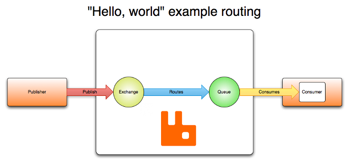

> 해당 시리즈는 [패스트캠퍼스 진행 INNER CIRCLE 1기](https://github.com/FC-InnerCircle/icd01-team04-fintech2-be)에서,
> IncerPay라는 **PG 서비스**를 구현하면서 고민하고 구현한 내용을 담습니다.
> 고민의 내용은 제가 담당했던 **BFF 서버**, 그 중에서도 **HA**에 집중되어 있습니다.


# 캐시는 갱신되어야 한다

이번에 HA 2, 캐싱 관련해서 의사결정을 내려 보면서, **캐시에 대한 갱신**을 고려하는 시간이 있었다.

> **캐시는 당연하게 손실 이벤트를 수반한다.**


TTL 만료, 서버 재시작으로 인한 캐시 초기화, 수동 캐시 무효화… 와 같은.

해당 ”손실 이벤트“가 발생했을 때, **캐시 갱신을 위해 데이터를 전달할 수 있는 방법**은 동기와 비동기의 두 가지.

동기로 하는 방법은 간단하다. 재조회 시 DB에서 단순하게 데이터를 받아오면 된다.

하지만 이 방법은 **한 번의 요청 시 DB (조회) → 내부 서버 캐시 (적재)라는 두 가지의 IO**를 발생시킨다.

또한, 사실 **트랜잭션 범위로도 좋지 않은 선택**이다.

**캐시 조회/갱신은 DB 트랜잭션과 별개의 관심사**(트랜잭션 원자성 침범)이며, **트랜잭션 시간을 불필요하게 증가**시킨다.

게다가 캐시 작업 중 발생한 예외가 DB 트랜잭션까지 롤백시킬 수 있는 위험도 존재한다.

# Key 갱신에 있어서의 의사 결정

캐싱에 대한 질문에서는 **캐싱 자체가 아니라 “왜” 캐싱하는지 아는 것**이 중요하다.

우린 기존 HA 2 글에서, 매 통신마다 발생하는 Public Key에 대한 검증을 없애기 위해 캐싱을 시작했다. 

해당 Public Key는 모든 통신에 사용되며, 상점은 해당 키를 어드민 페이지에서 발급받는다. 해당 키는 상점 삭제나 탈퇴 시 즉시 비활성화되어야 하므로 **실시간성이 매우 중요**하다.

우리는 기존 HA 2 글에서 **Redis를 통해 Public Key를 캐싱**했다.
이는 Key의 실시간성이라는 주요한 특성이 있었고, 로컬 캐시를 갱신하는 과정에서 생겨나는 키 갱신 딜레이 때문이었다.


### 로컬 캐시 vs Global 캐시


그러나… 사실 조금이라도 **더 빠른 것은 로컬 캐시**이다.

또한 해당 데이터는 사실상 많이 가변하는 데이터가 아니다. 따라서 로컬 캐시에 해당 Key를 적재하고 있다면 Redis보다는 큰 도움이 될 것이다. Redis의 서버 자원과 IO를 줄일 수 있으니까.


내가 Redis가 아닌 **로컬 캐시에 해당 키를 적재하고 싶다면 어떨까?**
**그리고 해당 캐시 갱신이 실시간성 범위를 충족할 수 있다면?**

로컬 캐시로 적재하는 것이 더욱 베스트일 것이다.

### N개의 서버, N번의 전파

그런데 모던 서비스는 **보통 HA를 위한 스케일 아웃**을 필요로 한다. 따라서 단일 서버가 아니라 다양한 서버 인스턴스에 해당 캐시를 전파시키는 과정이 필요하다.

그런데 이벤트가 일어나는 즉시 바로 모든 서버 인스턴스에 해당 캐시를 전달하면 어떻게 될까?

**서버 개수만큼의 IO가 키 갱신 시점에 발생**할 것이다.

음… 그렇게 썩 즐거운 형태는 아니다.

그렇다면 해당 **캐시 이벤트를 따로, 몰아서, 한 번에 처리**하면 어떨까?

캐시 전파라는 이벤트를 비동기로, 조금 지연시킨다면?

그렇다면 Redis라는 IO와 SPOF를 고려해야 하는 선택을 조금 더 덜 수도 있다.

# 캐시 이벤트 일괄 처리?

데이터를 바로 동기화하지 않고 지연시킬 때, 해당 이벤트를 **일괄로 처리해 성능을 개선하는 방법**에는 크게 5가지가 있다.

- Event Sourcing
- Write-Behind
- CDC
- Scheduled Batch Processing
- Pub-Sub

이 방법들을 하나하나 톺아 가면서, 우리가 HA에서 보완할 수 있는 부분에 대해 생각해 보자.

## Event Sourcing

**`Event Sourcing`**은 모든 상태 변경을 **이벤트로 저장**해서 **배치로 처리**하는 방법이다. MQ를 활용하며, 해당 MQ에는 RabbitMQ와 Kafka가 사용된다.

이벤트 소싱의 핵심은 “상태”가 아닌 **"상태를 변경시킨 이벤트"를 저장**하는 것이다.

예를 들어, 계좌의 현재 잔액인 50,000원이란 상태를 저장하는 게 아니라 “계좌 생성 (+100,000원)” / “출금 (-30,000원)”, “입금 (+50,000원)”, "출금 (-70,000원)” 같은 모든 **거래 이벤트를 순서대로 기록**한다. 현재 잔액은 이런 이벤트들을 순차적으로 적용해서 계산된다.

이렇게 저장된 이벤트들은 MQ에 쌓이고, 이를 구독하는 서비스들은 자신들의 상황(처리 능력이나 우선순위)에 맞춰 이벤트를 배치로 처리할 수 있다.

**RabbitMQ는 메시지의 즉각적인 전달**이 필요할 때 주로 사용되고, **Kafka는 대용량 이벤트 처리나 장기간 이벤트 보관이 필요할 때 선호**된다.

**이벤트 소싱의 장점**은 모든 변경 이력이 보존되어 있어 언제든 특정 시점의 상태로 되돌아갈 수 있고, 시스템 장애 시에도 이벤트를 재생해서 **상태를 복구**할 수 있다는 것이다.  또한 이벤트들을 분석하면 **유용한 비즈니스 인사이트**를 얻을 수도 있다.

**반면 단점**으로는 **구현이 복잡하고, 이벤트 스키마 변경이 어려우며**, 이벤트가 계속 쌓이면서 **저장공간을 많이 차지할 수 있다**는 점이 있다. 저장공간의 경우 스냅샷이나 이벤트 버저닝으로 보완이 가능하나, 해당 방식을 도입한다고 해도 저장 공간을 타 시스템에 비해 차지한다는 것은 사실이다.

## Write-Behind

**두 번째는 `Write-Behind`**로 핵심은 **쓰기 작업을 쌓아둔 다음 일괄 처리**한다는 점이다. 데이터를 큐에 모아뒀다가 시간이나 횟수가 충족될 경우 Worker가 DB에 메시지를 보내 해당 데이터들을 적재한다.

예를 들어 사용자가 상품 정보를 수정하면, 이 변경사항을 즉시 DB에 반영하지 않고 큐에 넣어둔다. 이후 특정 조건(예: 100개의 변경사항이 쌓이거나 5분이 경과)이 충족되면, 쌓여있던 변경사항들을 한 번에 DB에 반영한다. 큐 매체로는 Redis Queue나 RabbitMQ를 주로 활용한다.

이 방식의 **장점은 DB I/O 부하를 크게 줄일 수 있다**는 것이다. N번의 개별 업데이트 대신 1번의 배치 업데이트로 처리할 수 있기 때문이다. 특히 짧은 시간 동안 동일한 데이터가 여러 번 수정되는 경우, **최종 상태만 DB에 반영**하면 되므로 더욱 효율적이다.

반면 **단점으로는 데이터의 동기화 시스템을 정교하게 설계해야 한다**는 점이 있다. 캐시와 DB 간의 **동기화가 지연**되기 때문에, 이런 일시적 불일치를 허용할 수 있는 시스템에서만 사용해야 한다. 또한 시스템 장애 발생 시 아직 DB에 반영되지 않은 변경사항들이 유실될 수 있으므로, 적절한 **복구 메커니즘**도 필요하다.

## CDC

DB 변경 자체를 감지해서 로그에 쌓아뒀다가 처리하는 **`CDC (Change Data Capture)`**도 존재한다. 이는 DB의 변화를 로그성 데이터를 통해 적재해 두는 방식이다. DB가 실행되는 트랜잭션 로그를 저장해 확인하거나, 트리거를 통해 변경이 발생할 경우 별도의 테이블에 기록하거나, 주기적으로 DB를 폴링해 업데이트하는 방식으로 진행된다.

**장점으로는** DB를 토대로 이중화를 유지하기 때문에 **데이터 정합성**이 높고, **단점으로는** 로그 방식일 때 DB 밴더별 로그를 기준으로 하기 때문에 **밴더 종속적**이며, 로그 외의 케이스에서는 추가적인 **적재 매커니즘**이 여전히 부하를 일으킨다는 것이다.

## Scheduled Batch Processing

그리고 단순히 시간 기반으로 배치 처리를 진행하는 **`Scheduled Batch Processing`**이 있다. Spring Batch 등의 배치 프로세서를 활용해 특정 시점에 캐시를 대규모로 갱신하는 것이다.

새벽 등 트래픽이 적은 시간대에 **배치 Job을 실행해서 DB 데이터로 캐시를 한번에 갱신**한다. Spring Batch로 케이스를 분리해 보면, 청크 단위로 처리하고, 트랜잭션을 관리하며, 실패 시 재시도나 복구도 가능하다. JobRepository로 해당 작업의 이력도 관리할 수 있다.

**장점으로는** 구현이 매우 단순하고 예측 가능하며, 원할 때 시스템 리소스를 활용해 비용을 절감할 수 있다는 점이 있다. **단점으로는** 실시간성이 매우 떨어진다. 시간-일-주-월 단위의 배치를 통해 실행되기 때문에 실시간성이 중요한 데이터에는 적합하지 못하다. 애초 실시간성이 필요한 데이터를 “배치” 로 접근할 이유가 없기도 하다.

## Pub/Sub

`Pub/Sub`은 **EDA의 구현 패턴**으로, **Publisher와 Subscriber라는 이중 구조**를 가진다.

> ***Publisher가 이벤트를 발행하면 해당 Publisher를 구독하고 있던 Subscriber가 메시지를 수신한다.***


해당 메시지는 중간의 메시지 브로커(Redis, RabbitMQ, Kafka 등)를 통해 전달되기 때문에, 두 개의 서비스는 **약한 결합도**를 가지게 된다.

예를 들어 상품 정보가 변경될 때, 캐시 서비스, 검색 서비스, 알림 서비스 등은 여러 구독자가 각자 필요한 처리를 하도록 전파시킬 수 있다. 구독자들은 자신의 처리 능력이나 우선순위에 따라 메시지를 처리하며, 메시지는 브로커에 쌓여있다가 구독자가 준비됐을 때 전달된다.

위에 상술한 5가지 캐시 갱신 방법들을 고려하면서 로컬 캐시를 갱신하는 일을 가정해 보자.


이야기한 대로, **Event Sourcing**은 복잡한 구현 과정을 필요로 하기 때문에 현재 단순한 키 갱신 이벤트에는 적절하지 않다. 또한 감사 추적이나 상태 복구는 좋은데 결국 이벤트를 전부 “적재”하는 방식이기에 구현이 손쉬운 편이 아니다.

**CDC**는 DB와의 강결합이기 때문에 지금 의사결정에 적합하지 않으며, 현대의 트렌드와는 맞지 않는다.

**Scheduled Batch Processing**는 시스템 리소스를 최대 효율로 사용할 수 있지만 실시간성이 매우 떨어진다. 따라서 지금 의사결정에 적합하지 않다. (추후 스탬피드 방지를 위한 캐시 선제 갱신 처리는 HA 2-1에서 이미 작성한 적이 있다.)

그렇다면 남는 두 가지 선택지. **Write-Behind**와 **PubSub**.

**Write-Behind**의 경우 Redis를 사용한다면 갱신해야 할 포인트는 1개로 충분하다.

하지만 로컬 캐시를 사용한다는 의사결정을 내린 지금이라면? **Write-Behind를 사용하는 순간 작용해야 하는 Worker의 개수는 인스턴스만큼** 늘어나게 된다.

또한 처리 효율은 좋으나 데이터가 일시적으로 불일치할 수 있다는 / DB 저장 전 손실될 수 있다는 맹점을 해결할 방법을 찾아야 한다.

그러므로, 우리는 **멀티 인스턴스의 로컬 캐시 갱신을 위해 Pub/Sub 패턴을 도입**해 볼 수 있다.

# Pub/Sub?

**Pub/Sub**이 위의 패턴들에 비해 가지는 가장 큰 장점은 **“확장성”**과 **“느슨한 결합”**에 있다.

이게 무슨 뜻일까?


### 확장성

먼저 **확장성**에 대해 알아보자.

**`“확장성“`**이란 **시스템이 새로운 요구사항이나 변화에 얼마나 유연하게 대응할 수 있는지를 의미**한다.

Pub/Sub 패턴에서는 **새로운 기능이나 서비스를 추가**할 때 기존 시스템을 수정할 필요 없이 **새로운 구독자만 추가**하면 된다.

예를 들어 상품 정보가 변경됐을 때 캐시를 갱신하는 서비스가 있었는데, 검색 인덱스도 갱신해야 한다면? 기존 코드를 건드리지 않고 새로운 구독자만 추가하면 된다.

또한 각 구독자는 자신만의 처리 방식을 가질 수 있다. 어떤 구독자는 실시간으로 처리하고, 다른 구독자는 배치로 처리할 수도 있다.

심지어 특정 조건의 이벤트만 선택적으로 처리하는 것도 가능하다. 이런 유연성은 시스템이 커질수록 더 큰 장점이 된다.


### 느슨한 결합

그리고 **느슨한 결합**에 대해 알아보자.

**`“느슨한 결합“`**이란 **시스템 간의 의존성이 낮다**는 의미다. **Pub/Sub에서는 발행자가 구독자에 대해 전혀 알 필요가 없다.**

발행자는 그저 이벤트를 발행하기만 하면 되고, **이 이벤트를 누가 어떻게 처리하는지 알 필요가 없다.** 이는 시스템의 유지보수성을 크게 향상시킨다. 한 서비스의 변경이 다른 서비스에 영향을 주지 않기 때문이다.

이런 느슨한 결합은 특히 MSA 환경에서 큰 강점이 된다. 각 마이크로서비스는 독립적으로 개발, 배포, 확장될 수 있으며, 서로 다른 기술 스택을 사용할 수도 있다. 또한 **한 서비스의 장애가 다른 서비스로 전파되는 것을 막을 수 있다**는 점도 큰 장점이다.

Pub/Sub은 중앙의 메시지 브로커를 통해 모든 인스턴스에 동일한 메시지를 전달할 수 있고(**중앙 저장형**),

메시지 전달 즉시 각 인스턴스가 로컬 캐시를 갱신할 수 있다(**실시간성**).

특히 **키 무효화같은 중요 이벤트는 메시지 브로커가 전달을 보장**하므로, 모든 인스턴스가 확실하게 캐시를 갱신할 수 있다는 장점이 있다. 동시에 이벤트 손실이 일어났을 경우 재전송에 대한 비용이 거의 들지 않는다는 장점 또한 있다.

해당 Pub/Sub을 **구현하는 방식**으로는 주로 2가지가 있다.

Redis와 Kafka가 그것이다.

# Redis

**Redis Pub/Sub은 Message Queue의 Pub-sub(발행-구독) 패턴을 Redis 안에서 구현한 것이다.**

나는 해당 패턴을 묘사할 때 **`“무작정 배포”`**라고 이야기한다. 어쩌면 **무작위** 배포라고도 할 수 있겠다. 

찌라시 같은 걸 도로에 뿌리고 다니는 것과 같을까? 폭죽을 터뜨리듯이, 구독하고 있는 수신자 **모두에게 던지는 것**이다.

메시지를 수신했는지 여부를 따로 확인하지 않기 때문에 **전송에 대한 보장이 중요하지 않은 경우** 사용하기 편리하다.

메모리 기반인 만큼 속도는 보장된다. 물론 메모리의 특성인 **해당 데이터가 소멸되기 쉽다**는 특성도 함께 가진다.

기본 기조는 Pub/Sub의 패턴을 그대로 따른다.

Publisher는 자신을 구독하는 특정 채널에 메시지를 발행하고, Subscriber는 구독하고 있는 생산자가 발행한 메시지를 수신하는 것이다.

```java
// CacheUpdatePublisher : 생산자 - 메시지를 생성
@Service
public class CacheUpdatePublisher {
    private final RedisTemplate<String, Object> redisTemplate;

    public void publishUpdate(String key) {
        CacheUpdateMessage message = new CacheUpdateMessage(key, "UPDATE");
        redisTemplate.convertAndSend("cache:update", message);
    }
}

// CacheUpdateSubscriber : 구독자 - 메시지를 수신
// MessageListener를 구현 (onMessage @Override) 
@Service
public class CacheUpdateSubscriber implements MessageListener {
    private final RedisTemplate<String, Object> redisTemplate;
    
    @Override
    public void onMessage(Message message, byte[] pattern) {
        CacheUpdateMessage updateMessage = parseMessage(message);
        
        redisTemplate.delete(updateMessage.getKey());  // 캐시 무효화
        refreshCache(updateMessage.getKey());          // 신규 로드
    }
}

// Config
@Bean
public RedisMessageListenerContainer redisContainer() {
    RedisMessageListenerContainer container = new RedisMessageListenerContainer();
    container.addMessageListener(cacheUpdateSubscriber, new ChannelTopic("cache:update"));
    return container;
}
```

구독하는 쪽은 채널을 1개 이상 구독할 수 있으며, 와일드카드(*) 패턴 지정을 통해서 해당 패턴의 채널을 전부 구독할 수도 있다.

실제 해당 기능은 `Redis의 **PUBLISH/SUBSCRIBE** 명령어`로 동작한다.

위의 코드에서 볼 수 있듯이, **Spring에서는 RedisTemplate을 통해 이미 추상화**가 되어 있어서, 메시지 발행과 구독에서는 `convertAndSend()` 메서드 / `MessageListener`를 사용하기만 하면 되기에 특별하게 어려운 점이 없다.

주로 사용되는 곳은 **실시간 채팅 시스템**이다. 각 채팅방이 하나의 채널이 되고, 사용자들은 해당 채널을 구독하여 실시간으로 메시지를 주고받을 수 있다. 또 다른 예시로는 **실시간 알림 시스템**이 있다. 사용자별로 채널을 만들어 각각의 알림을 실시간으로 전달할 수 있다.

위와 같은 경우 메시지가 유실되더라도 크게 문제가 되지 않는다는 장점이 있다. 알림 내용은 별도의 DB에 저장해두고, Redis는 순수하게 실시간 전달 용도로만 사용하는 것이다.

이러한 특성 때문에 Redis Pub/Sub은 **실시간성이 중요하고 / 메시지 유실이 크게 문제되지 않는 기능에 적합**하다. 

게임의 실시간 순위 업데이트, 실시간 모니터링 데이터 전송 등에도 활용할 수 있다.

# Kafka

**Kafka Pub/Sub**은 **Message Queue의 Pub-sub(발행-구독) 패턴을 Kafka 안에서 구현한 것이다.**

난 해당 패턴을 묘사할 때 **`“파이프 배포”`**라고 이야기한다. 

**특정 수신자가 정확하게 정해져 있는 상태**에서, 해당 데이터를 순차적으로 넣어서 **수신자가 수신했는지 여부까지 명확하게 파악**할 수 있기 때문이다.

카프카는 주로 대용량 데이터를 다룰 때 사용되는데, Event 기반의 시스템, 대규모의 로그 수집, 데이터 파이프라인을 구축할 때 사용된다.

메시지를 **디스크에 저장한 뒤 복제**하기 때문에 **영속성과 안정성에 있어서 뛰어난 성능**을 보인다. 특히 대용량 처리에 강점이 있고, 속도를 위해 **파티셔닝을 이용한 병렬 처리**가 가능하다.

하지만 아무래도 분산 메시지 시스템인 만큼, **복잡한 구성**을 가지고 있어 **운영이나 개발하는 데 있어 부담이 크다**는 특징이 있다.

아래는 **카프카를 구성하고 있는 요소들을 정리한 그림과 표**이다.


_[사진 출처] 간편결제 프로젝트로 한 번에 끝내는 실전 MSA 초격차 패키지 Online - Part 4. IPC (Inter Process Communication, 통신) - 02. Kafka Topic 설계 시 유의사항)_


**Topic이 이벤트나 데이터의 종류를 의미**하고, **Producer는 해당 토픽으로 메시지를 발행**한다. 이후 **Cousumer Group이 메시지를 처리**하면서 프로세스가 완료된다.

특히 **이커머스 주문 시스템**과 같은 역할 기반의 파이프 시스템에서 많이 활용되는 편이다. 주문 / 결제와 같은 **각각 도메인이 Producer**가 되고, 해당 이벤트들은 **역할에 해당하는 Consume Group**에서 처리된다.

DB 기반이기 때문에 Kafka Pub/Sub은 **데이터 유실이 허용되지 않는 동시에 / 대용량 처리가 가능하기 때문에 트래픽이 많은** 케이스에서 도입하기 좋은 스택이다.

# 공통점과 차이점?


Redis와 Kafka의 차이점을 크게 몇 가지 관점으로 보면 아래와 같다.

가장 먼저 **데이터 저장 방식**이다. Redis는 **메모리에** 저장해서 휘발성을 가지는데, 이게 매우 높은 처리 **속도를** 보장한다. 대신 **장애가** 났을 때 메시지가 그대로 날아가는 게 문제. 

반대로 Kafka는 디스크 기반이기 때문에 장애가 나도 **복구할 수 있다는 장점이** 있다.

다음으로는 구현과 운영 관점이다. **Redis는 상당히 단순**해서 구현이나 운영이 편한데, **Kafka는 분산 시스템이**다 보니 구현도 **복잡하고** 운영할 때도 신경 쓸 게 많다. 대신 **확장성은 Kafka가 훨씬 좋다.**

그래서 실제로 많이 쓰이는 곳을 보면, **Redis**는 실시간으로 빠르게 처리해야 하는 **단순한 메시징**에 쓰이고, **Kafka**는 **대용량 처리나 메시지가 절대 유실되면 안 되는 중요한 케이스**에 쓰인다.

결국 각자가 잘하는 영역이 다르기 때문에, 시스템이 정말 중요하게 생각하는 게 뭔지를 먼저 정하고 선택하는 게 좋다.

**실시간성과 단순함이 중요하면 Redis, 안정성과 확장성이 중요하면 Kafka를 쓰는 식으로.**

# 지금은 뭘 초이스?

그렇다면 지금은 어떤 걸 선택해야 할까?

먼저 말했던 것처럼 **실시간성이 중요하고 메시지 유실이 크게 문제되지 않는 경우라면 Redis**를 선택하는 게 좋다. 구현도 쉽고 운영 부담도 적기 때문이다.

반면 **대용량 처리**가 필요하거나 **메시지 유실이 절대 발생하면 안 되는 경우라면 Kafka**를 선택해야 한다.

우리의 현재 프로그램은 어떨까?

**데이터 조회**는 괜찮다. 없으면, **Cache miss가 나면, 우리는 DB를 조회**하면 된다.

문제는 **탈퇴하거나 키를 삭제했을 경우**에 일어난다. 데이터 삭제가 일어났을 때 각각의 인스턴스는 해당 캐시 데이터가 **“삭제되었음”을 보장**해야 한다.

**Redis Pub/Sub에서는 이 작업이 불가능**하다. 이야기한 것처럼 무작정 배포 - ‘fire-and-forget’ 방식을 토대로 전송한 데이터의 수신 여부를 전혀 파악하지 않기 때문이다.

따라서 원래… 해당 프로세스에서는 단순한 작업일지라도 **Kafka Pub/Sub을 선택하는 것이 더욱 합리적**이다.

그런데 사실 **Key 갱신 하나로 Kafka Pub/Sub을 선택해서 클러스터를 만드는 선택은 옳은가?**

이 질문에 있어서는 **No**였다.

따라서 나는 경량 큐로, **RabbitMQ를 도입**하는 것을 고려하게 되었다.

# RabbitMQ

**RabbitMQ Pub/Sub**은 **Message Queue의 Pub-sub(발행-구독) 패턴을 RabbitMQ 안에서 구현한 것이다.**

그렇다. RabbitMQ도 MQ이기 때문에 Pub/Sub 패턴을 구현할 수 있다.

다만 카프카와는 그 모양새가 조금 다르다.

**Exchange가 메시지를 받아서 → 바인딩 된 Queue들로 분배**하고, → **각각의 Consumer는 자신의 Queue에서 메시지를 가져가는 구조**이기 때문이다. 이 패턴은 **메시지 라우팅**이라고도 불리운다.

RabbitMQ는 주로 **중소규모 메시지 처리에 사용**되는데, 실시간 알림 시스템, 비동기 작업 처리, 서비스 간 통신을 구현할 때 사용된다.

메시지를 **디스크나 메모리에 저장**할 수 있어서 Redis와 Kafka의 중간 단에 위치하는 **메시지 전달 보장** 옵션을 제공한다. Kafka만큼은 아니지만 안정적인 메시지 처리가 가능하고, Redis보다는 신뢰성 있는 전달을 보장한다.

구성이 Kafka보다 단순해서 **운영이나 개발 부담이 상대적으로 적다**는 특징이 있다.

아래는 **RabbitMQ를 구성하고 있는 요소**들을 정리한 그림과 표이다.


_[출처] RabbitMQ 공식 사이트 : https://www.rabbitmq.com/tutorials/amqp-concepts_


**Producer는 Exchange로 메시지를 발행**한다.

**Exchange는 말 그대로 메시지의 중개자 역할**이기 때문에, Producer가 발행한 메시지를 전달하는 역할만을 담당한다. 이후 해당 메시지는 **바인딩 된 Queue로 전달**되고, 해당 메시지를 **Consumer가 처리**하면서 프로세스가 완료된다.

특히 **마이크로서비스 간 통신**과 같은 메시지 기반 시스템에서 많이 활용된다. 각 서비스들이 **Producer가 되어 메시지를 발행**하고, **해당 메시지는 적절한 Queue로 라우팅**되어 처리된다.

메시지 전달을 보장하면서도 적절한 처리량을 제공하기 때문에 **안정성이 필요하지만 Kafka만큼의 대용량 처리는 필요 없는,** 딱 지금 같은 케이스에 도입하기 좋은 스택이다.

# Pub/sub의 단점?

그러면 **Pub/Sub은 만능인가? RabbitMQ는 만능인가?** 우리 서비스에서 문제를 일으킬 소재는 없는가? 있다면 어떻게 방어할까?


먼저 **결과적 일관성**이다. 우리의 시스템은 처음에 **일정 시간의 지연을 허용**한다고 이야기했다. Pub/Sub에서는 일반적으로 구현되었다 가정했을 때 밀리초 단위의 지연을 발생시킨다. 만약 이 지연 시간이 우리 프로그램에서 적합하다면, 해당 단점은 문제가 되지 않는다. Public Key의 경우 밀리세컨드 사이에 돈이 더 들어올 수 있어 봤자, 크리티컬하지 않다고 이야기했다. 따라서 큰 문제가 없다.

이후 **브로커 장애 대응 필요.** Pub/Sub 패턴의 가장 큰 단점은 메시지 브로커가 SPOF가 된다는 점이다. 브로커가 죽으면 전체 시스템에 영향을 준다. 또한 메시지의 정확한 전달을 보장하기가 어렵고, 시스템의 전반적인 복잡도도 증가한다. **RabbitMQ는 Cluster를 구성해 대응**할 수 있고, 디스크에 메시지를 저장하기 때문에 어려움 없이 복구도 가능하다.

그 다음은 **이벤트 유실 가능성.** 이는 가장 큰 장점 중 하나인 **메시지 전송 실패를 감지하면 자동으로 재발행하는 메커니즘**을 구현으로 보완할 수 있다. 특히 키 갱신은 이벤트 수가 많지 않아 재발행 비용이 크지 않을 것이다. 물론 메시지 전송 실패가 반복적으로 일어나면서 발생하는 부하를 제어하기 위해 fallback 처리는 고려하는 게 좋겠지.

어쩌면 가장 걱정하지 않아도 되는 부분인, **Exactly-once 보장. Redis에서는 어렵지만, RabbitMQ에서는 보장된다. 보장되지 않는대도 상관없다.** 여러 번 지운다고 해서 무엇이 문제가 될까? 전혀 문제되지 않는다.

마지막으로 **시스템 복잡도 증가**에 대한 부분이다. Exchange와 Queue 설정, 바인딩 관리 등 신경 써야 할 부분이 분명 Redis에 비해서는 존재하지만, **RabbitMQ의 세팅**은 ****도커로 진행했을 때 크게 어렵지 않고, Kafka에 비하면 수용 가능한 수준이다.

결론적으로, Pub/Sub의 일반적인 단점들은 우리의 키 갱신 유스케이스에서 큰 문제가 되지 않는다.

오히려 멀티 인스턴스 환경에서의 장점이 더 크기 때문에, 키 갱신을 위한 적절한 선택이라 할 수 있다.

지금까지 **멀티 인스턴스에 대한 캐시 갱신**을 가정하고, **변경이 일어났을 때 어떻게 해당 정보를 멀티 인스턴스에 전달할지**에 대한 이야기를 해 보았다.


# 한 가지 짚고 갈 점 

사실 현재 내 글에서는 밀리세컨드의 짧은 지연이 허용가능하다는 부분에 있어서, 디테일한 시간과 그에 대한 측정은 빠져있다. 그리고 비즈니스에서 실제 허용가능한지에 대한 이야기도 빠져 있다. 따라서 이론적 시나리오에 가까울 수 있다.

그러나 **비단 이론적이라고 하더라도, 해당 문제를 푸는 솔루션을 접근했을 때 가장 먼저 구현해 살펴봤을 방식**이라는 것은 달라지지 않는다. 현재 가정으로 세워 본 상황에서 가장 적합한 방식이기 때문이다.

또한 추후 실제 도입하는 순간이 오면, DataDog 등을 사용해 통신 지연 분석을 살펴 볼 수 있을 것이다.

해당 지연이 우리 서비스가 실제로 요구하는 사항을 충족하지 못한다면 HA 2-1에서 Global 캐시로 구현 되어 있는 현 Redis 방식을 유지할 수도 있고, 또 다른 캐시 시스템을 도입해 보는 등의 시도를 해 볼 수 있을 것이다.

실제 서비스에 도입해 보는 날을 기대해 보면서…

다음에는 이 시리즈의 마지막, HA 3번. **“결제 도메인”에 `적재`하기 위해 사용했던, MongoDB를 통한 retry와 서킷 브레이커 등의 fallback 처리**에 대해서 서술해 보려고 한다.