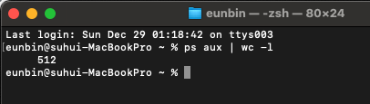

세상에는 참 많은 프로그램이 있다. 

지금 글을 쓰면서 확인해 봤는데, 511개의 프로그램이 내 PC에서 돌고 있다. 

이 프로그램들은 또 수많은 기술 스택을 통해서 구성되어 있을 것이다.

이 수많은 프로그램들은 어떤 의사결정을 토대로 제작되었을까?

프로그램을 만들 때 우리는 어떤 스택을 선택하고, 또 어떤 라이브러리를 가져와서 사용해야 할까?

아키텍처를 생각하면서 이런 고민이 들 때면 나는 몇 가지 질문이 떠오르는데,

**무엇을 해결할 것인가?**  
**누가 해결할 것인가?**  
**어떤 편의성이 제공되는가?**  
**얼마나 해결할 것인가?**  
**효율을 보장하는가?**

이 질문 흐름을 타고, 우리가 만들 가상 프로그램에 대한 의사결정을 해 보자.

# 무엇을 해결할까?

음, 먼저 **무엇을 해결할지**다.

우리는 데스크톱 애플리케이션을 만들 수도 있고, 모바일 앱 개발을 할 수도 있고, 키오스크와 같은 임베디드 시스템을 위한 프로그래밍을 할 수도 있다.

최근 개발 시장에서는 백엔드가 가장 다양한 프로그래밍 언어로 구현이 가능한 곳이다. 백엔드 프로그램을 만든다고 생각해 보자.

언어는 자바 / 코틀린 / 파이썬 / Go / JS / Scala / Rust / C++… 등등이 있을 것이고.

그리고 그 안에서 "백엔드"를 위해 만들어진 프레임워크를 사용할 것이다.

여기에서 무엇을 선택할까?

만약 해당 도메인의 문제 해결을 한 언어가 두드러지게 잘해낸다면, 여지없이 그 언어가 선택되어야 할 것이다.

예를 들어, 실시간 데이터 처리가 중요한 게임 서버나 증권 서버라면 C++이 유리할 수 있다.

그렇지 않고 모든 언어가 구현해내는 기능이 비슷비슷하다면?

이제 질문은 **누가 해결할 것인지**로 간다.

# 누가 해결할까?

만약 누군가 **혼자 단일 개발을 한다면** Go를 선택해도 된다. 심지어 Rust나 Scala도 아무 문제가 없다.

왜냐? 개발할 수 있는 인원이 해당 언어를 다룰 수 있으니까.

**그런데 만약 우리가 비즈니스를 한다면?** 프로젝트 규모가 커질수록 문제가 생긴다. 

해당 언어를 다룰 수 있는 인원이 매우 적다면, 교육 비용이라는 시간적-금전적 비용이 생겨난다.

그런데 만약 우리가 **<공부를 위한 프로젝트>를 한다면?** 해결 주체들끼리 으쌰으쌰 맘 맞는 걸로 하면 된다.

자, 여기서 한 가지가 선택되었다면? 이제 누가 해결할지에 대한 이슈까지 끝났다.

# 어떤 편의성이 제공되는가?

그럼 이제 개발 단계에서 선택해야 하는 것이 생겨난다. **어떤 편의성이 제공되는가?**

**즉, 어떤 프레임워크와 라이브러리를 쓰면 우리의 개발이 더 편해질까?**

프레임워크와 라이브러리도 하나의 프로그램이다. 우리가 지금 말하는 문제가 똑같이 적용된다.

그러므로 보통 이럴 때는 **사용된 지 오래되었으며 + 유지보수가 되고 있는 것**들이 정답을 주는 경우가 많다.

왜냐하면 **보안 리스크나 내결함성 같은 문제를 이미 해결했을 확률이 높기 때문**이다.

원래는 우리가 해결해야 할 문제를 선배님 아웃소싱해서 해결하는 셈이다.

또한 프로그램이면 → 문제가 생길 수 있다.

문제가 있다면? 구글링에 답이 있을 수도 있다. 먼저 해결한 인터넷 선배는 큰 도움을 준다.

그런데 최신 라이브러리가 도움이 되지 못할 때도 있다. 우리 조직과 맞지 않을 수도 있고, 현재 사용하고 있는 라이브러리와 충돌을 일으킬 수도 있다.

이때 꽤나 괜찮은 질문이 바로 다음 질문이다.

# 얼마나 해결할 것인가?

**언제까지 이 프로그램이 유지보수될 것인가?**

이 질문은 사실 *기술 부채를 얼마나 떠안을 것인가?* 와의 질문과 같다고 생각한다.

**우리의 서비스가 만약 1년 뒤에도, 3년 뒤에도 유지보수가 되어야 한다면** 어떨까?

그러면 우리 프로젝트에서 다른 라이브러리를 동시에 업데이트해 주거나,

심지어는 구조를 바꿔서라도, 다른 것들을 없애서라도 해당 라이브러리를 도입하는 게 좋은 순간이 온다.

**그런데 아니라면?**

라이브러리 구 버전이고 뭐고 갱신이고 다 필요없을 수도 있다.

사실 라이브러리 안 쓰고 구성만 맞춰도 괜찮을 수 있다.

아무것도 분리 안 하고 그냥 한 파일에 5000줄 짜리 코드 만들어도 괜찮을 수 있다.

또한 이 질문은 라이브러리에만 국한되지 않는다.

당장 내일 쓰고 말 거라면 아무거나, 현재 개발자들이 쓸 줄 아는 것 가지고 와서 사용하면 된다.

**그런데 만약 최신 스택이 우리 프로젝트의 복잡성을 더 높이면 어떻게 될까?**

그래서 이 질문이 함께 들어가면 도움이 된다.

# 효율을 보장하는가?

**효율을 보장하는가?**

이 효율에는 여러 가지가 있다.

*프로그램의 시간적 효율*이 될 수도 있고 *메모리와 DB의 공간적 효율*이 될 수도 있고.

심지어는 *개발 시간에 대한 효율*이 될 수도 있다.

사무실에 **프린터기**가 있다고 생각해 보자. 이 프린터기를 10년쯤 썼더니 얘가 죽어간다.

이제 바꿔 줄 때가 온 것 같다. 같이 사러 가 보자.

어, **새로 나온 A 프린터기**는 *분당 150장의 복사*를 해 준다고 한다. 엄청 빠르다. 초고속이다!

근데 *세팅하는 데 3일*이라는 시간이 걸린다. *부품은 1달에 5번* 갈아 줘야 한다고 한다.

또 다른 **B 프린터기**가 있다. 이 친구는 *분당 10장의 복사*를 해 준다고 한다.

*세팅하는 데는 3시간*이면 충분하고, 부품은 *특정 부품이 고장났을 때*만 갈아 주면 된다고 한다.

그런데 사실… 우리 사무실은 1분에 5장이면 충분하다. 그러면 저 초고속 프린터기는 도움이 될까?

이 프린터기가 *5장만 만들면 되는 A4용지를 150장 만들 수 있으면, 우리는 145장이라는 손해를 본 것이다.*

*추가 관리 시간과 구입 비용까지 동시에.*

B의 상태로 충분히 해결할 수 있는데, 복잡도를 올려가면서까지 A 프린터를 선택할 이유가 없다.

사실 이 글은 이 말을 하고 싶어서 시작했다.

**최신 스택, 최신 라이브러리, 핫한 기술이 정답이 아니다.**   
**Why를 적합하게 외칠 수 있는 기술이 정답이다.**

이 글이 최신 스택을 쓰지 마!!!! 라고 들릴 수 있는데… 절대절대 아니고.

서비스에서 리스크를 감수하고서라도 최신의 무언가를 도입하시는 프로그래머들을 나는 아주 존경한다.

~~(그리고 좋아한다. 연락주세요 010…)~~

그분들은 **해당 프로그램의 어떠한 가치와 효율을 높이기 위해 [최신 스택을 선택]**하신 것이겠지.

다만,

**개발자에게는, 그리고 특히 비즈니스에는 Why가 있어야 한다**고 생각한다.

> *어떤 문제가 있어서*  
> *→ 그걸 어떻게 해결하고 싶어서*  
> *→ 유사한 것과 이러한 트레이드오프가 있지만*  
> *→ 어떤 식으로 장점이 있고 단점이 있어*  
> *→ 이 단점을 이런 식으로 감당할 수 있어서*  
> *→ 선택했다*

이 답변을 하지 못하고 단순히 핫해서라고 한다면, 그냥 관성으로 선택했다면, 내놓은 답변이 비즈니스와 밀착해 있지 않다면,

"기술을 위한 기술이 아닌가"를 조금 돌이켜 볼 소재가 있다고 생각한다.

사실 처음에 스포일러를 좀 했다. 스포일러는 언어 선택 지점에 있었다.

**만약 해당 도메인의 문제 해결을 한 언어가 두드러지게 잘해낸다면, 여지없이 그 언어가 선택되어야 한다**는 것.

이러한 **"Why"에 대한 고민**은 비단 비즈니스를 위한 기술 선택에만 국한되지 않는 것 같다.

작게 진행되는 소규모든, 취업을 위한 프로젝트든… 모든 프로젝트에 해당되지 않을까.

DDD를 하면 좋으니까. 이런 책에서 이걸 봤으니까. 이걸 하면 그냥 빠르다고 하니까.

그게 왜 좋은가? 그 책에서는 그걸 언제 도입하라고 했나? 빨라진 건 왜 빨라진 것 같나?

이런 질문은 지속적으로 나에게 던질 수 있는 성찰적 질문일 것 같다.

상당히 가변적으로 돌아가고 있는 현재 소프트웨어 시장에서 위와 같은 의사결정은 한 달에도 여러 차례 일어나는 일일 것이라는 생각이 든다.

어쩌면 오답은 있고, 정답은 없는 것이 프로그래밍의 길이겠지만.

지금껏 경험했던 흐름이 가지는 틀은 이 다섯 질문에 머무르지 않나… 생각하게 된다.

내 글이 Why ###!이라고 외치고 싶은 분들에게 약간의 도움이 되었으면 하고,

동시에 다른 분들이 스택을 고민하실 때 내리시는 의사결정을 토대로 배워 가고 싶기도 하다.

여러분은 어떤 의사결정을 토대로 프로젝트를 제작할지 결정하시나요?