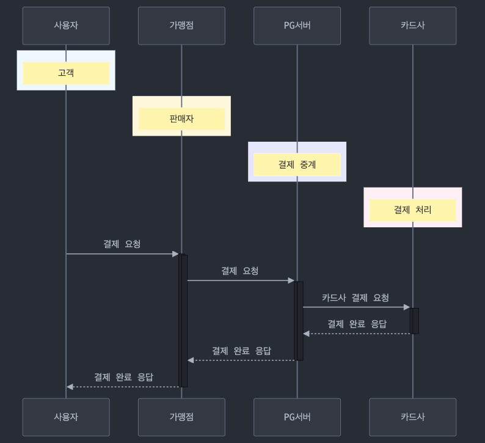
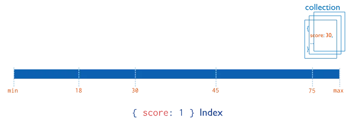
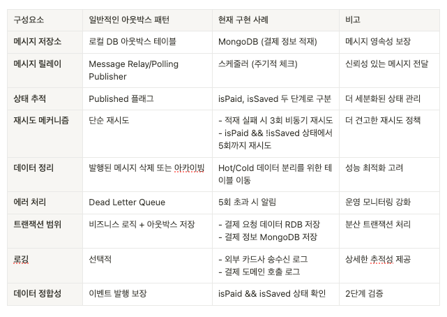

> 해당 시리즈는 [패스트캠퍼스 진행 INNER CIRCLE 1기](https://fastcampus.co.kr/b2g_innercircle_dev)에서,
> [IncerPay라는 **PG 서비스**](https://github.com/kail-is/incer-pay)를 구현하면서 고민하고 구현한 내용을 담습니다.
> 고민의 내용은 제가 담당했던 **BFF 서버**, 그 중에서도 **HA**에 집중되어 있습니다.

---

- **이번 글의 주제:** **`적재 부하`**에 대한 HA
  - 대내/대외 통신 시의 **다중 서버 트랜잭션 무결성** 보장하기

---


- #### [IncerPay Series]
  - [HA 1: 유량 제어](https://b-log.kr/incerpay-ha-1)
  - [HA 2-1: API 캐싱](https://b-log.kr/incerpay-ha-2-1)
  - [HA 2-2: Key 인증 과정에서의 Pub/sub](https://b-log.kr/incerpay-ha-2-2)
  - [HA 3: Fallback & MongoDB 캐싱](https://b-log.kr/incerpay-ha-3)
  - [HA α: “API 실패”에 대응하는 방법 (Resilience4j / Netflix Hystrix)](https://b-log.kr/compare-resilience-lib)


# 분산 시스템의 신뢰성 확보하기

우리는 지난번 두 번의 포스팅을 토대로 **유량 제어/Retry를 통한 안정성 확보**와 **캐싱을 통한 응답 속도 확대, 오류 상황 시의 대응**까지 구성했다.

하지만 아직 한 가지의 고민점이 더 있다. 우리의 프로그램은 **MSA 구조**를 가지고 있다는 것이다.

모놀리식 아키텍처는 트랜잭션 처리에 있어서 비교적 간단하다. 하나의 서비스, 하나의 데이터베이스. 모든 게 한 곳에 있었기에 트랜잭션도 단순했다.

하지만 MSA는 다르다. 수십 개의 서비스가 서로를 호출하고, 각자의 데이터베이스를 가지고 있다.

> **“분산 컴퓨팅의 첫 번째 오류: 네트워크를 신뢰할 수 있다고 여기는 것”**
*The fallacies of distributed computing: The network is reliable;
by L Peter Deutsch and others at Sun Microsystems*
>

여기서 우리가 고민해야 할 건 실패 자체가 아니다.

**실패는 언제든 일어날 수 있다. 아니, 당연히 일어난다. 따라서 중요한 건 그 다음이다.**

시스템이 불안정해질 때, 우리는 어떻게 대응할 것인가?

**그리고 그 시스템이 우리의 시스템 뿐만이 아니라 대외의 시스템까지 보장해야 한다면?**

이때 우리에게는 또 하나의 고민 포인트가 필요해진다.

*대외 이벤트를 어떻게 전달할까? 어떻게 그 이벤트가 처리되었음을 보장할까?*

여러 가지 방법이 있을 것이다. 이벤트 저장과 재처리. Circuit Breaker등을 통한 정교한 Fallback 시나리오의 구성… 이것들은 바로 Resilient한 시스템을 만드는 시작점이라고 생각한다.

오늘은 이 세 가지 전략을 중심으로, 내가 IncerPay를 보다 더욱 단단하게 만든 방법을 알아보겠다.

# Resilience?


[이미지 출처: https://oedd.org/economic-resilience/]

- 장애 격리 (Fault Isolation): Circuit Breaker
- 우아한 성능 저하 (Graceful Degradation)

Resilience란 서비스가 **장애에도 살아남을 수 있는 능력**을 말한다. 그 중에서도 장애 격리와 우아한 성능 저하는 가장 핵심적인 전략이다.

**장애 격리**는 특정 서비스의 장애가 전체 시스템으로 전파되는 것을 방지하는 방안이다. 예를 들어, **결제 서비스의 장애**가 발생하더라도 **주문 접수는 계속 가능**하도록 하는 것이다. 

이는 서비스 간 결합도를 최소화하고 장애 발생 시 대체 로직을 실행하는 등의 방식으로 구현된다.

**우아한 성능 저하**는 한 단계 더 나아간 개념이다. **일부 기능이 실패하더라도 최소한의 서비스는 제공하자**는 것이다. 예를 들어 **상품 추천 서비스가 실패**하면 **기본 상품 목록이라도 보여주는 식**이다. 

서비스 실패 시 **빈 배열을 반환**하거나, **캐시된 데이터라도 반환**하는 식으로 처리하면 이 기능의 구현 방식 중 하나가 된다.

이러한 전략들은 특히 **MSA 환경에서 더욱 중요**하다. 수많은 서비스들이 서로 얽혀있는 상황에서, 한 서비스의 장애가 도미노처럼 번지는 것을 막아야 하기 때문이다.

결국 Resilience는 **장애 상황에서도 서비스의 핵심 기능을 지속할 수 있게 하는 것**이다.

**특히 InnerPay와 같은 금융 서비스의 경우 이러한 Resilience 전략은 선택이 아닌 필수다.**

모든 트랜잭션이 중요하고 작은 오류도 큰 문제로 이어질 수 있기 때문이다. 따라서 각 **기능별 우선순위**를 정의하고 **장애 상황에서의 대응 방안을 미리 준비**해야 한다.

물론 이런 도구들을 사용하더라도 각 서비스의 특성에 맞는 임계치 설정과 fallback 전략 수립은 여전히 개발자의 몫이기 때문에, 해당 부분을 고려해서 우리의 IncerPay를 더 단단하게 만들어 보자.

# 결제 데이터를 적재?: MongoDB / RDB

IncerPay 시스템에서 고려한 데이터 처리 흐름에 대해 설명해 보겠다.

해당 데이터 흐름은 특히 **장애 상황에서의 데이터 무결성 보장**이 핵심이다.

결제 업무 프로세스는 다음과 같이 진행된다.





> **사용자의 결제 요청 → 가맹점의 결제 요청
→ 카드사 결제 요청 송신 → 카드사 결제 완료 수신
→ 가맹점 결제 완료 응답**
>

여기서 가장 중요한 것은 무엇일까? **카드사 결제에 대한 응답 정보를 바로 가맹점에게 보내 주는 것**이다.

즉각적이 아니어도 괜찮은 것은? 아마도 **가맹점에게 정산을 해 주기 위해 우리 서버에 거래 내역을 적재하는 일**일 것이다.

우리의 데이터는 **“가맹점에게 정산”해 줄 시에 정확하면 된다**는 판단이 들었다.

1초 안에 데이터의 정합성이 보장되지 않아도 되는 곳이자, 정산 시에 크로스 체크가 가능해지는 곳.

또한 **적재되지 않았을 경우 트랜잭션을 보장한다는 이유로 카드사에 취소 요청을 보내는 것이 더욱 리스키**할 수 있는 곳.

**금융인데, 서비스를 견고하게 하는 비동기**가 가능한 곳이 발견되었다!

## 주요 로직 의사결정

1. **사용자의 결제 요청 → 가맹점의 결제 요청 → 가맹점 여부 검증**
2. **MongoDB 거래 데이터 생성 → 카드사 API 호출 로깅 → 카드사 API 호출**
3. **카드사 API 응답 로깅 → MongoDB 거래 데이터 isPaid : true 처리**
4. **결제 API 호출 로깅 → 결제 API 호출**
5. **결제 API 응답 로깅 → MongoDB 거래 데이터  isSaved: true 처리**
6. **사용자/가맹점 결제 완료 응답**

- 만약 응답이 바로 이뤄지지 않는다면 Retry 3회
- 3회 이상 시에도 되지 않은 경우 스케줄링을 토대로 한 재적재 시도

---

이에 따라 내가 결제 API 통신 시를 가정하고 설계한 주요 로직은 이와 같다.

위의 흐름을 토대로, 하나씩 로직을 설명해 보겠다.

### (1) 가맹점 요청 / 검증

1. **사용자의 결제 요청 → 가맹점의 결제 요청 → 가맹점 여부 검증**

가맹점 검증부의 경우 상점 도메인에 요청을 하는데, 현재는 캐싱을 토대로 Redis에서 가맹점 검증 데이터를 가져오고 있다.

**관련 내용은 [이 글](https://b-log.kr/incerpay-ha-2-1)에 정리**해 두었으니 더 자세한 구현 부가 궁금하시다면 해당 글을 참조해 주시면 좋겠다.

### (2) 카드사 결제 요청

1. **MongoDB 거래 데이터 생성 → 카드사 API 호출 로깅 → 카드사 API 호출**
2. **카드사 API 응답 로깅 → MongoDB 거래 데이터 isPaid : true 처리**


이제 결제 로직이다. 먼저 MongoDB에 **현재의 거래 상태를 담는 데이터**를 만든다.

그리고 **카드사 결제 요청과 응답 시의 로그는 동기적으로 / RDB에 적재**한다.

“돈”이 달린 만큼 가장 무결성이 중요한 데이터이기 때문에, 결제 요청 전 RDB 적재를 선행하고,

해당 **로그 적재가 되지 않으면 진행 자체가 불가능**하도록 로직을 구성하였다.

따라서 **실제 결제가 되었지만 관련 내용이 우리 서비스에서 확인되지 못하는 부분이 존재한다면 먼저 확인해 보아야 할 곳**으로 해당 데이터를 저장할 예정이다.

카드사 API를 통해 **실제 결제가 완료**되고, **RDB에 로그 저장**까지 완료되면, MongoDB 내의 **isPaid 플래그를 업데이트**한다.

### (3) 결제 도메인 적재 요청

1. **결제 API 호출 로깅 → 결제 API 호출**
2. **결제 API 응답 로깅 → MongoDB 거래 데이터  isSaved: true 처리**

이제 **결제 도메인에 API 요청을 보내서 거래 완료에 대한 저장**을 할 타이밍이다.

물론 결제 도메인 **요청과 응답 시점에도 각각 로그**를 남기고,  결제 도메인에 데이터가 정상 적재되면 **isSaved 플래그가 업데이트**된다.

만약 **적재가 실패하면 3회까지 비동기로 재시도**한 뒤 이후 배치를 통해 해당 데이터를 재시도할 예정이다.

결국 적재 자체가 지연된 만큼 중요한 것은 **MongoDB 데이터의 상태 체크**다.

### 배치 프로세스

배치 프로세스는 **전일 정산을 비즈니스 요구사항으로 가정**하고 **1일에 1번 - 사용자가 적은 시간**에 돌리도록 한다.

아래와 같은 흐름으로 로직을 구성해 보았다.


---

### 사용자/가맹점 결제 완료 응답

자, 이제 모든 흐름에 대한 로직 제시가 완료되었다.

결제 요청을 보낸 가맹점에게 200 완료 응답을 보내면, 가맹점은 그 완료 응답을 토대로 사용자에게 결제 완료를 보여줄 것이다.

이 설계를 토대로 **장애 상황에서 데이터 무결성을 보장**하고,

동시에 **시스템 성능도 고려**하기 위해서 어떤 것들을 했는지 이야기해 보려고 한다.

## 결제 요청 - 결제 완료

가장 먼저 MongoDB에 **현재의 거래 상태를 담는 데이터**를 만들고,

**카드사 결제 요청과 응답 시의 로그는 동기적으로 / RDB에 적재**한다고 이야기했다.

- **MongoDB 거래 ID별 상태 관리**

해당 거래가 시작되었을 때, **두 가지 방식의 데이터베이스 접근**이 이뤄진다.

1. **MongoDB를 통한 상태 관리 데이터 저장**
2. **위에 언급한 RDB를 통한 로깅**

그리고 **카드사에게 “결제” 요청을 보낸 다음 응답을 받은 뒤 `state.makePaid()`를 토대로 업데이트**된다.

```java
@Override
public ApiAdapterView confirm(PaymentApproveCommand command) {
// **MongoDB를 통한 상태 관리 데이터 저장** 
    PaymentRealtimeState state = savePaymentRealTimeState(command);
    CardApiApproveView view = executePayment(command);
    state.makePaid(); // isPaid 업데이트
    return createApiAdapterView(view);
}

// **MongoDB를 통한 상태 관리 데이터 저장**
private PaymentRealtimeState savePaymentRealTimeState(PaymentApproveCommand command) {
    PaymentRealtimeState state = new PaymentRealtimeState(command);
    paymentService.savePayment(state);
    return state;
}

// 요청 로그 RDB 저장 - 카드사 API 통신 - 수신 로그 RDB 저장 인터페이스**
private CardApiApproveView executePayment(PaymentApproveCommand command) {

    log.info("Initiating payment execution for paymentId: {}", command.paymentId());

    logAndSavePaymentRequest(command); 
    CardApiApproveView view = processExternalPayment(command);
    logAndSavePaymentResponse(command.paymentId(), view);

    log.info("Payment executed successfully: {}", view);

    return view;
}

// 요청 로그 RDB 저장
private void logAndSavePaymentRequest(PaymentApproveCommand command) {
    log.info("Saving and logging payment request : {}", command);
    try {
        CardApiApproveCommand apiCommand = mapper.toApiCommand(command);
        paymentApiLogService.saveRequestLog(command.paymentId(), apiCommand);
        log.info("Saved request log for paymentId: {}", command.paymentId());
    } catch (Exception e) {
        log.error("Critical: Failed to save payment request log. PaymentId: {}", command.paymentId(), e);
        throw new RuntimeException("결제 요청 기록 저장 실패. 결제를 진행할 수 없습니다.", e);
    }
}
```

**MongoDB 데이터는 아래와 같이 생성**될 것이다.


**RDB 로그 적재**는 어떤 식으로 이뤄질까?

- **결제 요청/응답 시 RDB 로그 적재**


**Type에 따라 요청 - 응답 - 에러를 구분**하고, **요청과 응답에 대한 body와 식별자를 DB에 적재**하였다.

왜 RDB에 했을까? 우선 **결제 요청만큼 정합성이 중요한 데이터는 없다.**

우선 외부 통신을 전제로 하는 만큼 우리 서비스에서 **호출을 토대로만 컨트롤이 가능한 데이터**라는 점이 가장 크다.

**간단한 명령을 토대로 롤백할 수가 없다.**

또한 **완료 응답 수신의 경우**도 마찬가지다.

*거래는 완료되었는데 우리 쪽에서 응답을 못 받았다면? 우리 쪽에서 설정해 두었던 HTTP 연결 기한이 지나버려 응답을 받지 못한 상태로 거래가 끝났다면?*

**사용자는 결제가 되었다는데, 가맹점은 해당 데이터를 받은 적이 없다고 하고, 책임의 소재가 우리 서비스에 있게 된다.**

또한 스키마. **RDB는 명확한 스키마 정의**를 통해 **데이터 일관성**과 함께 **주요 필드 누락 가능성을 줄일 수 있다.**

따라서 해당 데이터는 부하를 감수하고 RDB에 적재하는 것으로 의사 결정을 마친 뒤, 적재된 것을 확인하였다.

탐색 비용보다는 로그성 데이터를 적재만 하는 것이기 때문에, 만약 **테이블 규모가 커진다면 파티셔닝**으로 대응할 수 있을 것 같았다.

---

### 한 가지 대응 상황, 카드사 API 실패 시

400 에러 등 잔액 부족의 케이스에서는 단순하게 에러 메시지를 전송해 주기 때문에 문제가 없다.

**다만 아까 가정한 상황이 있었다.**

> *거래는 완료되었는데 우리 쪽에서 응답을 못 받았다면? 우리 쪽에서 설정해 두었던 HTTP 연결 기한이 지나버려 응답을 받지 못한 상태로 거래가 끝났다면?*
>

이 케이스의 경우는 **굉장히 크리티컬한 상황**이지만 카드사의 API 상태를 뜯어볼 수 있는 환경이 아니라… 가상의 시나리오를 세워 보았다.


- **카드사에서 멱등키+조회 API를 보장**해 줄 수 있다면: 멱등키를 포함해 보냄으로써 해당 건을 토대로 결제 확인 후 재진행
- **카드사에서 목록 조회 API를 보장**해 줄 수 있다면: 최신 결제 중 - 동일 금액을 먼저 확인하고 → 시간 / 카드번호 뒷자리등을 검증 후 저장 프로세스
- **모든 협의가 되지 않는다면**: 이건 인간의 힘을 빌려야 하지 않나 싶다.

해당 시나리오는 카드사 API까지 수정이 필요한 부분이라 범위가 넓어지는 만큼 우선적으로 메시지 전송만을 구현해 두기로 했다.

---

### isPaid true 업데이트 후 결제 완료 반환

자, 결제가 됐다면 이제 응답을 처리할 시간이다. 카드사 결제 응답을 받았을 경우 **결제 요청은 200을 반환**해야 한다.

그리고 우리의 **RDB / MongoDB 데이터도 변화**해야 한다. 완료 통신 로직이 쌓이고, isPaid의 값이 true로 변하는 것이다.


만약 **API 통신이 실패**했을 경우 (400 / 잔액 부족 등) **카드사 API의 분리에 따라 적절한 에러 메시지를 노출**할 수 있을 것이며, **isPaid는 false로 유지**될 것이다.

성공했을 경우, 문제 없이 **RDB 로그와 isPaid 데이터가 true 저장**되어 있는 것을 확인할 수 있었다.

그리고 동시에 이 데이터를 토대로 **결제 도메인에게 정산 데이터 적재를 위한 요청**을 보낼 것이다.

## Retry와 비동기를 합쳐보기

음, 그래, 결제가 완료됐다.

이제 우리는 우리 결제 서버에게 “결제가 됐습니다” 하고 전달을 할 것이다.

**그런데 결제 도메인에게 저장하는 첫 시도에 즉각적으로 응답이 되지 않았다면?**

그리고 만약 **트랜잭션의 범위를 “결제 도메인 적재”**까지로 잡았다면?


~~(저장 실패 때문에 취소되는 게 어딨어? 결제했다매?)~~

한 가지 이슈가 드러난다.

우리 **결제 도메인에 정산을 위한 데이터가 적재되지 않았다는 이유**로, **카드사에 요청을 해서 결제를 취소**해야 한다는 것이다.

즉, **우리의 서버 결함** 때문에 취소 통신이 어떻게 될지 모르는 상태에서 **카드 거래 취소 통신을 다시 보낸 후, 응답할 때까지 응답을 기다린 다음에 반환**한다.

나는 이 부분이 영 탐탁치 않았다.

```java
public PersistenceView approve(PaymentApproveCommand paymentApproveCommand) {

    // 결제 상태 조회
    PaymentRealtimeState state = getPaymentRealTimeState(paymentApproveCommand);

    // 반복된 적재 실패 시 반환할 defaultView
    IncerPaymentApiView defaultView = createDefaultView(paymentApproveCommand);
    
    // 반복 적재 실행용 CompletableFuture
    CompletableFuture<IncerPaymentApiView> approvalFuture = executeAsyncApproval(state);

		// 실제 적재 실행
    IncerPaymentApiView view = processApprovalResult(defaultView, approvalFuture);

    return paymentViewToPersistenceView(view);
}

// 반복 적재 실행용 CompletableFuture
private CompletableFuture<IncerPaymentApiView> executeAsyncApproval(PaymentRealtimeState state) {
    return CompletableFuture.supplyAsync(() ->
            performPaymentApprovalWithRetry(state)
    );
}
```

따라서 이 **거래 ID는 이후의 “적재” 로직을 위해서 Retry + 비동기 여정**을 떠나야 한다고 생각했다.

사실 비동기는 “금융”이라는 도메인 구조상 안전한 구조가 아니란 것을 멘토님께 전달들었다.

그러나 **지금의 비동기는 조금 다르다**고 생각했다.

**지금의 비동기는 오히려 실패 시의 HA를 보장하고 트랜잭션의 범위를 보상 처리하기 위한 선택**인 것이지, **메인 로직은 아닌 것**이다.

**부가 로직이라는 것은 “실패 시”에만 실행되어야 한다.**

```java
// 결제 서버 저장 API 호출 - 성공 시 state 저장 / 실패 시 재시도 / 최종 실패 시 기본 값 반환
private IncerPaymentApiView processApprovalResult(
        IncerPaymentApiView defaultView,
        CompletableFuture<IncerPaymentApiView> approvalFuture,
        PaymentRealtimeState state
) {
    log.info("Processing approval result: " + defaultView.toString());
    try {
        return trySyncPaymentApproval(state); // !!! 동기 수행 !!! 
    } catch (IncerPaymentApprovalException e) {
		    // 실패 시... 
        log.error("Error processing approval result", e);
        return approvalFuture.getNow(defaultView);
    }
}
```

따라서 **완료 응답을 하기 전 한 번은 결제 서버로 동기적 요청**을 보내도록 해서 해당 염려부를 보완해 보았다.

이후 실패 시에는 바로 응답을 반환한 뒤 전체 비동기 처리를 하면서 **결제 서버에 적재를 시도**하게 될 것이다.

```java
// 비동기 반복 수행 
private IncerPaymentApiView performPaymentApprovalWithRetry(PaymentRealtimeState state) {

    int firstFallbackCount = 2;  // 기존 1번 수행됨
    AtomicReference<IncerPaymentApiView> result = new AtomicReference<>();

    IntStream.rangeClosed(firstFallbackCount, MAX_RETRIES) // 상수로 지정해서 확장성 높임 (현재 3)
            .filter(attempt -> !state.isSaved())
            .mapToObj(attempt -> tryPaymentApproval(state, attempt))
            .filter(Objects::nonNull)
            .findFirst()
            .ifPresent(result::set);

    return result.get();
}

// 실패 시 재시도 카운트 추가
private void handleRetryFailure(PaymentRealtimeState state, int attempt, RuntimeException e) {
    state.addRetryCount();
    try {
        // 점진적 재시도
        Thread.sleep(BASE_RETRY_DELAY_MS * attempt);
    } catch (InterruptedException interruptEx) {
        log.error("Retry delay interrupted", interruptEx);
    }
}
```

만약 **3번(최초 1+비동기 2) 시도가 넘은 경우**에는 **더 이상 재시도하지 않고 배치 때 처리**할 수 있도록 **defaultView를 반환**할 수 있게 했다.

이 의사결정의 이유는 **부하 분산**인데, Retry에서 가장 두려운 것이 반복적 재요청으로 인한 요청부하라고 생각했기 때문이다.

비슷한 염려를 **Redis 캐시 재요청에서 캐시 스탬피드**로 다룬 적도 있었다.


이제 저장과 비동기 Retry까지 완료되었다.

## 배치: Hot/Cold 데이터 분리

자, 우리의 결제 안 된 데이터! 적재된 데이터! 그리고 적재가 되지 않은 데이터!

전부 다 MongoDB에 쌓여 있을 것이다. 이 많은 데이터가 거래가 많아질수록 쌓이고.. 쌓이고.. 쌓이면서…

**불필요한 탐색 부하**를 만들어낼 것이다.


처리 완료된 데이터와 진행 중인 데이터를 **한 곳에서 관리**함으로써, 점차적으로 데이터가 많아지면서

**읽기 성능과 관리의 복잡성** 문제가 발생할 가능성이 생겨난다는 뜻이다. 아무리 NoSQL이라도.

음… 이렇게 둘 이유가 있을까? 내 대답은 아니오였다.

수많은 결제 완료 데이터들 사이에 신규로 결제가 진행되고 있는 데이터를 둠으로써 **탐색 비용을 늘릴 이유가 없다.**

나는 이 부하를 헷징하기 위해서 그 **데이터들을 예쁘게 정리**해 보기로 했다.


세 가지 컬렉션을 만들었다. 거래가 완료된 데이터, 실제 거래가 진행 중인 데이터, 거래가 되지 않은 데이터.


```java
@Scheduled(fixedRate = 5000)
public void processBatch() {
    List<PaymentRealtimeState> payments = findAllRealtimeState();
    payments.forEach(payment -> {
        PaymentStatus status = determinePaymentStatus(payment);
        processPaymentByStatus(payment, status);
    });
}
```

내부 프로세서에 해당 로직을 넣고, **스케줄링 어노테이션**을 **우선적으로 5초에 한 번 돌도록 세팅해 둔 뒤 더미 데이터**를 먼저 넣어 두었다.

```java
private PaymentStatus determinePaymentStatus(PaymentRealtimeState payment) {
  if (payment.isPaid()) {
      return payment.isSaved() ? PaymentStatus.COMPLETED : PaymentStatus.RETRY;
  } else {
      return PaymentStatus.UNPAID;
  }
}
```

그리고 이제 전체 조회를 하면서 데이터를 판단하고, ENUM을 토대로 상태를 명시했다.

이제 **ENUM의 값에 따라 데이터를 옮겨 주기만** 하면 된다.

### **완료된 데이터 제거: isSaved true일 경우 해당 키 데이터 삭제**

우선 완료된 데이터는 더 이상 이곳에 있을 필요가 없다. **completed**으로 옮기면 된다.

```java
  private void processCompletedPayment(PaymentRealtimeState payment) {
      mongoTemplate.save(payment, "completedPayments");
      mongoTemplate.remove(payment);
  }
```

원래는 완료가 된 뒤 즉각적으로 옮길까 생각해 보았는데, 미세하게라도 응답을 늦추는 작업일 거라는 판단이 들어서 해당 배치 로직 안에 넣도록 했다.

### **완료되지 않은 데이터 정리**


- **isPaid: false**

```java
private void processUnpaidPayment(PaymentRealtimeState payment) {
    boolean isError = checkCardApiErrorResponse(payment.getTransactionId());
    if (isError) {
        discordWebhookService.sendMessage("결제 확인 필요!! " + payment.getTransactionId());
    } else {
        mongoTemplate.save(payment, "unpaidPayments");
        mongoTemplate.remove(payment);
    }
```

이제 모여 있는 데이터 중 **isPaid: false**인 데이터를 확인해 본다.

**여기 있을 수 있는 데이터는 두 종류가 있다.**

- 결제가 완료되지 않은 데이터 (400 등)
- 결제가 완료된 데이터 && 인간 검증이 필요한 데이터

사실 이미 결제가 완료되었을 때 이슈가 있었던 건들은 보상 트랜잭션으로 처리가 됐을 거고, 관리자에게 알림도 갔을 것이다.

그래도 **1번의 검증을 위해** 아직도 **정상 실패 건이 아닌 데이터**가 남아 있다면 다시 한 번 알림을 보내도록 했다.

만일을 대비한 필터링이다.

그리고 **카드사 API 응답 로그와 매칭** 뒤 실제로 실패한 데이터라면 데이터를 이동시켜 둔다. (대부분 이럴 것이다)

---

- **isPaid: true, isSaved: false**

```java
private void processRetryPayment(PaymentRealtimeState payment) {
    if (payment.getSaveRetryCount() >= 5) {
        discordWebhookService.sendMessage("저장 5회 실패!! 응급!!" + payment.getTransactionId());
    } else {
        payment.addBatchRetryCount();
        mongoTemplate.save(payment);
    }
}
```

마지막으로 모여 있는 데이터 중, 우리 서버가 이슈인 곳.

2번의 Retry를 더 거치고, 그것도 실패하면 결제 서버 개발자에게 해당 메시지가 가도록 처리해 두었다.


데이터가 배치 후 정리되는 것과, 디스코드를 통해 웹훅 서버 알림 설정까지 확인하였다.

테스트가 완료되었으니 `@Scheduled(cron = "0 0 4 * * *")`을 통해 1일에 1번 배치가 돌아가도록 세팅했다.

### **질문, 인덱스로 하면 되지 않아?**




_[이미지 출처: https://www.mongodb.com/ko-kr/docs/manual/core/indexes/index-types/]_

MongoDB에서 **효율적인 인덱스를 설계**하면 진행 중인 데이터와 완료된 데이터를 구분하여 처리 속도를 높일 수 있다.

**isPaid를 확인하여 결제 서버에 데이터를 영속화하려는 목적**이라면, `isPaid` **가 false인 값만 타깃**으로 한 다음 조회할 경우 효율이 높아진다는 뜻이다.

이렇게 되는 경우 Hot/Cold 데이터를 나눌 필요가 없다. 배치도 스케줄링도 할 필요가 없다.

그냥 데이터 전체를 하나의 저장소에서 활용하고, `isPaid` **가 false인 값만 업데이트 시 처리하면 그만**이다.

그러나 이는 결국 데이터가 한곳에 집중되면서 **상태 관리의 직관성을 떨어뜨리고, 데이터 구조를 복잡하게 만들 가능성**이 있었다.

또한 내가 고민해야 하는 케이스가  `isPaid` 가 false인 **1가지 케이스만 있는 것이 아니다.**

이 배치 프로세스의 목적이 **전체 3가지 미완 데이터에 대한 재검증**을 거치는 과정이기 때문이다.

결국, **진행 중인 데이터와 완료된 데이터를 분리하는 것이 더 직관적이고 관리에 용이**하다고 판단해, 인덱스보다는 현재 구조를 유지하는 것으로 의사 결정을 마무리했다.

### 배치는 언제 돌릴까요?

또한, 배치를 돌리는 간격에 대해서도 고민해 보았는데… 우선적으로는 **1일 이내**가 필수적으로 보장되어야 하는 시간일 것 같다.

비즈니스 관점에서 생각해 보았는데, - *당일의 거래 내역은 차일 언제 처리된다* -  하는 식으로 충분히 고지가 가능할 것 같았기 때문이다.

그러나 더 빠른 정산 시간이 요구되고, 데이터가 많이 쌓이는 상황이라면 비용이 조금 더 올라가더라도 점차 시간을 줄일 필요가 있을 것 같다.

# 문제는 미리 차단하자: 서킷 브레이커 + Retry

자, 외부 API - 내부 서버 통신을 통한 DB 적재로 트랜잭션이 보장되었다.

그런데 한 가지 문제가 더 보인다.

우리는 위에서 Retry를 통한 성능 개선을 이뤄 보고자 **스레드에 점진적으로 timeout을 주는 방식**으로 구현을 마쳤다.

이러한 방식은 **로직이 명확**하고, 어떠한 시간 제한을 토대로 sleep을 주는지에 대한 **가중치에 대해 직관적으로 판단이 가능**하다는 장점을 가진다.

다만 부족한 점이 하나 있다. 우리의 **Resilience에 대한 고민**이다.

**통신이 실패했다는 건 그 서버에 문제가 있을 확률이 높다는 것 아닌가?**

**그런데 계속 죽어버린 서버에 요청을 보내는 것이 옳은가?**

음, 아무래도 아닐 것 같다. 이미 죽어버린 서버라면 지속적인 Retry 자체가 무의미하기도 하고, 동시에 살아나려는 서버일 경우 겨우겨우 회생되다가 내 요청 때문에 다시 죽어버릴 수도 있다.

따라서 서킷브레이커를 토대로 일어날 수 있는 **Retry 횟수 부하를 컨트롤**해 보기로 했다.

### 서킷 브레이커가 뭔데?


_[이미지 출처: https://www.iasgyan.in/daily-current-affairs/circuit-breakers]_

**Circuit Breaker는 장애 격리의 대표적인 패턴**이다.

서킷 브레이커는 외부 서버 요청 실패가 특정 임계치(timeout, 에러율 등)를 초과하면 해당 서비스로의 호출을 차단을 차단하고, 문제가 해결될 때까지 재시도를 제한하는 패턴이다. 

이를 통해 **무의미한 재시도**를 방지하고, **서버 과부하**를 막아 시스템을 보호한다.

예를 들어 **결제 시스템에서 포인트 적립 서비스가 불안정**해졌다고 하자. Circuit Breaker는 이를 감지하고 포인트 **적립 서비스로의 호출을 차단**한다. 

덕분에 핵심 기능인 결제 자체는 계속 진행될 수 있다. 물론 포인트는 나중에 **별도 보상 배치**를 통해 처리함으로써 무결성을 보장할 수 있다.


서킷브레이커의 상태는 **Closed(정상)**, **Open(차단)**, **Half-Open(상태 점검)** 세 가지로 나뉜다. 

실패 임계치와 대기 시간을 설정해 작동하며, Open 상태에서는 Fallback 처리를 제공해 서비스 품질을 유지한다.

**요청에 지속적으로 실패**했다고 해 보자. 서버는 서킷을 열어서 **해당 요청을 차단**한다. 

그러나 이후 요청을 지속적으로 차단할 수는 없으니, **점차적으로 요청을 시도**하면서 해당 서버가 **정상인지 여부를 판단**한다. 

요청이 지속적으로 성공할 경우, 서버는 해당 서버가 **정상이라고 판단하고 서킷을 닫은 뒤 정상적인 텀으로 요청**을 보내게 된다.

### 서킷 브레이커 사용 이유

자, 어떤 것인지는 알겠는데. 어떠한 이득이 있길래 사용하는가?

**클라이언트 서버 입장**에서는 해당 요청을 기다리거나 무의미한 재시도 자체를 빠르게 끊음으로써 **요청 실패나 요청 미루기를 토대로 빠른 응답 반환**이 가능해진다.

또한 **해당 요청을 받는 서버의 입장**에서 생각해 보자. 알바생 혼자 10만원짜리 영수증에 찍힌 음료수를 만들고 있는데 이후 갑자기 30명이 1개씩 더 음료를 시킨다면?

이야기한 것처럼 우리는 우리 서버의 상태를 확인한 뒤 제어하기 위한 목적으로 Retry를 활용한다고 했다.

그렇다면 서킷 브레이커의 사용은 **우리 서버의 비용을 감소시키기 위한 방식**으로도 기능할 수 있다.


실제로 MSA 환경, 가용성 패턴에 대한 고려가 시작된 것은 **Netfilx에서 처음으로 MSA라는 시스템을 적용**하면서였다.

MSA 구조에서 발생할 수 있는 통신 문제에 주목한 **넷플릭스는 Hystrix라는 라이브러리**를 만듦으로서, 특정 도메인 서버에서 발생하는 문제를 제어했다.

그러나 시간이 지남에 따라 해당 라이브러리는 유지보수가 되지 않게 되었고,

이에 따라 조금 더 모던한 방식으로 해당 라이브러리를 개편한 **Resilience4J라는 라이브러리가 등장**했다.

현재 해당 라이브러리는 `Spring Cloud Starter`에서 자동으로 포함되어 있으므로, 나는 **해당 라이브러리를 사용하여 우리의 서비스를 구현**할 에정이다.

해당 라이브러리에서는 서킷브레이커를 실제로 인스턴스 선언한 다음, 해당 인스턴스를 내가 원하는 소스가 실행됐을 때에 함수로 전달함으로써 적용하는 형태로 구성이 되고 있다.

자, 이제 소스코드로 가 보자.

### 적용

- **Config 객체**

```java

public class PaymentResilienceConfig {
	@Bean
	public CircuitBreaker paymentCircuitBreaker() {
	    CircuitBreakerConfig config = CircuitBreakerConfig.custom() ... 
	
	    CircuitBreaker circuitBreaker = CircuitBreaker.of(CIRCUIT_BREAKER_NAME, config);));
	
	    return circuitBreaker;
	}
	
	@Bean
	public Retry paymentRetry() {
	    RetryConfig config = RetryConfig.custom()... 

	    Retry retry = Retry.of(RETRY_NAME, config);
	
	    return retry;
	}
}
```

- 먼저 **서킷 브레이커 / Retry를 위한 Config 객체**를 만들었다.
- 해당 클래스의 Bean을 토대로 의존성 주입을 실행할 것이다.

---

- **Wrapper 객체**

```java
@Component
public class ResilienceWrapper {
    private final CircuitBreaker circuitBreaker;
    private final Retry retry;
    

    public ResilienceWrapper(
            @Qualifier("paymentCircuitBreaker") CircuitBreaker circuitBreaker,
            @Qualifier("paymentRetry") Retry retry
    ) {
        this.circuitBreaker = circuitBreaker;
        this.retry = retry;
    }

    public <T> T execute(Supplier<T> supplier) {
        // decorateSupplier로 비동기 작업을 처리하고 값을 반환
        return Retry.decorateSupplier(retry,
                        CircuitBreaker.decorateSupplier(circuitBreaker,
                                ThreadPoolBulkhead.decorateSupplier(threadPoolBulkhead, supplier)))
                .get();
    }

    public <T> CompletableFuture<T> executeAsync(Supplier<T> supplier) {
        // decorateSupplier로 비동기 작업을 처리하고, CompletionStage로 반환
        CompletableFuture<T> result = Retry.decorateSupplier(retry,
                        CircuitBreaker.decorateSupplier(circuitBreaker,
                                ThreadPoolBulkhead.decorateSupplier(threadPoolBulkhead, supplier)))
                .get(); // 이 부분에서 CompletionStage를 반환받고 이를 기다려 결과를 얻음! 
        return result;
    }
```

- **재시도 - 서킷 브레이커의 두 가지 로직을 동시에 지정**할 예정이기 때문에 객체를 하나 만들었다.
- 해당 객체를 **주입한 뒤, execute / executeAsync를 실행**하기만 하면 된다.

### 테스트

- **서킷 브레이커 Open 시 예외 처리 로그**


- **서킷브레이커 상태 변경 시 로그**


- **재시도 시 로그**


많은 요청이 발생하는 상황을 가정하고 아주 낮은 값으로 테스트를 해 보았는데, 로그가 잘 찍히는 것을 확인할 수 있었다.

실제 구현을 직접 진행했다면 횟수에 따른 제어 등을 따로 고려하는 저장소라든지… 수많은 로직이 필요했을 텐데, 라이브러리를 쓰니 매우 적용이 빨랐다.

이번 구현을 토대로 **결제 API와 통신이 실패**할 때 **빠른 fallback을 토대로 한 “성공” 응답**을 줌으로써 **결제 서비스의 오류 전파를 방지**할 수 있었다.

**처리되지 못했던 데이터는 이후 배치를 토대로 재적재됨으로써 무결성이 보장**될 것이다.

# 요청 버튼을 미리미리: 벌크헤드

음, 이제 재시도 패턴과 그에 대한 제어가 완료되었다.

즉 거래 시도 시의 루트에 대해서는 내결함성을 보완한 것이다.

**하지만 우리의 서버는 한 번에 한 가지 일만을 하지 않는다.** 그렇게 동기적으로 처리할 것 같았더라면 이 모든 것들을 생각할 이유도 없다!

서버와 서버가 통신할 때는 **RestClient 등 통신 클래스에 이미 설정된 Connection Pool을 사용**한다. 이 Connection Pool에서 **Connection을 가져다 쓰는 방식으로 통신**이 이루어진다.

**그런데 Retry를 할 때마다 Pool의 Connection을 소비한다면?**

우리는 Pool이 고갈되는 상황을 맞이할 수 있다. Connection Pool 고갈은 시스템 전체에 영향을 미친다.

이것을 우리는 **벌크헤드**를 토대로 개선해 볼 수 있다.

### 벌크헤드가 뭔데?


[이미지 출처: [https://en.wikipedia.org/wiki/Bulkhead_(partition)](https://en.wikipedia.org/wiki/Bulkhead_%28partition%29)]

벌크헤드는 **선박이나 비행기에서 [격벽]**을 의미하는 영어 이름이다.

해당 탈것(?)에서는 다양한 상황이 일어나는데, 이중에서 물이 차오르거나, 압력이 빠지거나… 하는 특수 상황이 발생할 수 있다. 

이에 대비해 물리적인 격벽을 쳐 두고, **해당 문제 상황을 격리함**으로써 다른 부분의 구동에 문제가 생기는 것을 제어한다.

서버에서의 벌크헤드 또한 실제 사용되는 것과 동일하게, **시스템을 격리된 구획으로 나눔으로써 전체의 성능이 망가지는 것을 제어하는 패턴**이다.

각 서비스별로 독립된 스레드풀을 할당하고, 해당 스레드풀에서 처리할 수 있는 동시 요청 수를 제어함으로써 장애의 전파를 최소화한다.

### 벌크헤드 사용 이유

우리는 우리 로직 안에서 스레드풀을 미리 생성해 둠으로써 해당 스레드 생성 비용을 없애고, 가용할 수 있는 스레드의 수를 줄일 수 있다. **무제한으로 많은 스레드를 만들었을 때의 부하를 컨트롤**하기 위함이다.

말했다시피, 1번의 요청은 1번의 커넥션 소비를 만든다. 지속적인 Retry는 스레드 풀이 고갈되지 않도록 설정해 두어야 효율을 보장할 수 있게 될 것이다.

이제 소스코드를 변경함으로써 해당 사용 이유를 코드에 녹여 보자.

### 적용

구현은 간단했다.

우선 **Config 클래스에 Bulkhead를 Bean으로 추가**했다.

```java
@Slf4j
@Configuration
public class PaymentResilienceConfig {

    @Bean
    public CircuitBreaker paymentCircuitBreaker() {
	    // .. 
        return circuitBreaker;
    }

    @Bean
    public Retry paymentRetry() {
	    // .. 

        return retry;
    }

    @Bean
    @Qualifier("paymentBulkhead")
    public Bulkhead paymentBulkhead() {
        BulkheadConfig config = ...
        Bulkhead bulkhead = Bulkhead.of(BULKHEAD_NAME, config);

        bulkhead.getEventPublisher()
                .onCallPermitted(event ->log.debug("[{}] Call permitted",
BULKHEAD_NAME))
                .onCallRejected(event ->log.warn("[{}] Call rejected - max concurrent calls reached",
BULKHEAD_NAME))
                .onCallFinished(event ->log.debug("[{}] Call finished - available concurrent calls: {}/{}",
BULKHEAD_NAME,
                        bulkhead.getMetrics().getAvailableConcurrentCalls(),
                        config.getMaxConcurrentCalls()));

        return bulkhead;
    }
}
```

그리고 만들어 준 **래퍼 클래스**가 있기 때문에, 그 클래스에 **데코레이터 패턴으로 추가**해 주기만 하면 됐다.

```java
@Component
public class ResilienceWrapper {
    private final CircuitBreaker circuitBreaker;
    private final Retry retry;
    private final Bulkhead bulkhead;

    public ResilienceWrapper(
            @Qualifier("paymentCircuitBreaker") CircuitBreaker circuitBreaker,
            @Qualifier("paymentRetry") Retry retry,
            @Qualifier("paymentBulkhead") Bulkhead bulkhead
    ) {
        this.circuitBreaker = circuitBreaker;
        this.retry = retry;
        this.bulkhead = bulkhead;
    }
    
    public <T> T execute(Supplier<T> supplier) {
      return Decorators.ofSupplier(supplier)
              .withBulkhead(bulkhead)
              .withCircuitBreaker(circuitBreaker)
              .withRetry(retry)
              .decorate()
              .get();
    }
    
    public <T> CompletableFuture<T> executeAsync(Supplier<T> supplier) {
      Supplier<T> decoratedSupplier = Decorators.ofSupplier(supplier)
              .withBulkhead(bulkhead)
              .withCircuitBreaker(circuitBreaker)
              .withRetry(retry)
              .decorate();
    
      return CompletableFuture.supplyAsync(decoratedSupplier);
    }
}
```


이 또한 상황을 가정하고 `maxConcurrentCalls`옵션을 아예 0으로 해 테스트를 해 보았는데, `onCallRejected` 로그가 잘 찍히는 것을 확인할 수 있었다.

데코레이터 패턴으로 연결을 해 두었기 때문에**, 벌크헤드가 실패하면서 재시도가 발생**하고, 지속적 실패에 따라서 **서킷 브레이커가 구동**되는 것까지 확인할 수 있었다.

체이닝을 통해 구현했기 때문에 **“어디에서 문제가 발생했지?” 라는 시점**이 생길 수 있는데, EventPublisher를 토대로 **로그를 찍어 줌으로써 포인트를 명확히** 하고자 했다.

이렇게 벌크헤드를 적용함으로써 우리의 요청 스레드에 있어서 더더욱 가용성과 안전성을 보장할 수 있게 되었다!

# Outbox 패턴


[이미지 출처: https://docs.aws.amazon.com/prescriptive-guidance/latest/cloud-design-patterns/transactional-outbox.html]

이렇게 구현을 마치고 문득 떠오른 생각.

분산 트랜잭션에서 데이터 정합성을 보장하는 패턴 중 **Outbox 패턴**이 있다.

이 패턴은 분산 시스템에서 데이터베이스 변경사항과 메시지 발행의 원자성을 보장한다.

변경 사항을 **로컬 트랜잭션에서 Outbox 테이블에 함께 저장**하고, 별도의 프로세스가 **이를 폴링하여 `메시지 브로커`로 전달하는 것**이다. 실패 시 재시도가 가능하며, 메시지의 최소 1회 전달을 보장한다.

어? 어디서 본 것 같지 않은가?

나도 그랬다. 



사실 아웃박스 패턴을 구현해야겠어! 하면서 고민한 것은 아니었는데, 글을 적으며 돌이켜 보니 **일종의 아웃박스 패턴**이라는 사실을 깨달았다.

아무래도 의도하고 구현하지 않은 만큼 동일하지는 못하고, 디폴트(?) 아웃박스 패턴과 비교했을 때 살짝 다른 지점이 존재하는 것 같아서 표로 한번 정리해 보았다.

같은 역할을 구현할 때 의사결정을 하는 방향이 다르다는 비교를 해 볼 수 있었는데,

가장 크게 다가오는 트레이드 오프는 **Queue vs MongoDB** 여부였다.

### MongoDB 입장에서 생각해 보기


현재의 경우 MongoDB라는 저장소가 해 주는 역할은 **상태 관리 / 직관성**인 것 같다.

- **직관적인 상태 관리**
- **운영 관리 비용 감소**
    - **Queue 관리 비용 없음 - MongoDB 하나로 로그 + 트랜잭션 확보**

나는 **결제 여부 / 저장 여부라는 변수 두 가지**를 토대로 어디까지 프로세스가 진행되었는지, 몇 번이나 Retry를 진행했는지 확인할 수 있도록 하였다.

만약 아웃박스 패턴을 토대로 이 상황을 연출하고 싶었으면 **또 다른 저장소**를 만들거나, 로그에서 조회를 해서 카운트를 하는 식으로 진행하는 로직을 만들었어야 할 것이다.

비슷한 이유로 **직관성**. **하나의 거래 ID에 이슈**가 있다면 ID 하나로 해당 이슈의 진행 상태를 확인할 수 있다.

### **아웃박스 기준에서 생각해 보기**


[이미지 출처: https://levelup.gitconnected.com/architecting-for-scale-key-event-driven-patterns-you-need-to-know-71599fb4e62c]

이제 **아웃박스 기준**으로 분산 트랜잭션을 관리한다고 했을 때 생길 수 있는 장점을 함께 생각해 보자.

- **탐색 시간 / 스케줄링 처리 불필요**
- **Queue를 토대로 상태 파악 - 특정 상태에 있는 거래 ID를 바로 파악 가능**

우선 아웃박스 패턴을 기준으로 했을 경우 Retry를 위해 전체를 재조회할 필요가 사라진다.

MongoDB 상태 관리의 경우 다시 한 번 데이터를 탐색하고 → 업데이트하는 과정을 위한 스케줄링이 필요한데, 아웃박스 패턴은 **Queue를 토대로 상태를 진행**시키면 되기 때문이다.

또한 **[거래가 결제 완료 상태인지 / 적재 완료 상태인지]**를 어떤 메시지 브로커에 어떠한 거래가 있다는 방식으로 확인할 수 있다는 장점이 있다.

물론 MongoDB 로직에서도 Hot/Cold 데이터 분리를 토대로 완료된 상태의 거래를 분리하지만, 결국 **다시 한 번 업데이트나 배치를 필요로 한다**는 점에서 메시지 브로커가 가지는 장점이 조금 더 커지는 것 같다.

만약 초당 수천 건의 거래가 일어난다면 MongoDB에서도 세 배의 IO 비용이 일어나야 할 테고, 그에 따라 돌려야 할 스케줄링의 모수도 늘어날 것이기 때문이다.

**따라서 조금 더 관리 비용이 낮아야 한다면 MongoDB, 시스템 비용을 추가하는 것이 더욱 가용성을 높이는 프로젝트에서는 EDA를 수단으로 한 아웃박스 패턴을 선택하게 될 것 같다는 판단이다.**

또한 글 작성 중 로직을 다시 복기하면서 떠오른 질문이 있는데,

> **카드사 결제는 되었으나 결제 쪽에 저장이 안 된 상태에서 환불 요청이 들어오면?**
>

이라는 질문이었다.

물론 카드사 결제 여부가 저장되지 않았더라도 우리는 요청 → 확정이라는 두 가지 루트를 타고 있기 때문에, 해당 데이터가 MongoDB에 있는지 여부를 확인한 뒤 환불 요청을 하면 된다.

다만, EDA를 사용하면 [있는지 여부]를 판단할 필요가 없다. 그냥 환불 요청을 보낸 뒤 처리하게 하면 되니까.

조만간 혼자만의 큐 프로젝트(ㅋㅋ)를 토대로 EDA와 Kafka 정복하기를 시도해 볼 예정이라 그 부분에서 개선을 다뤄 봐도 좋을 것 같다.


## 재미있는(?) 여담

또한 부가적으로 한 가지.

아까 전 넷플릭스가 처음으로 MSA라는 지평을 세상에 열면서 가용성을 보장하는, Hystrix라는 친구가 생겼던 이야기를 한 적이 있다. 그리고 개선된 라이브러리인 Resilience4j가 나왔다는 이야기도.

해당 라이브러리를 사용해 보면서 Netflix Hystrix와 비교해 보면 재미있을 것 같다는 생각이 들어, 아래와 같은 글을 작성해 보았다.

- [“API 실패”에 대응하는 방법 (Resilience4j / Netflix Hystrix)](https://github.com/kail-is/compare-resilience-lib)

같이 한번 봐주시고 코멘트 남겨 주시면 더 좋겠다!

---

이 글을 마무리로, 내가 **INNER CIRCLE을 진행하면서 성능 개선을 가정하고 고민했던 부분**들을 전반적으로 정리하고 공유해 보았다.

사실 HA를 위한 트러블 슈팅은 “예상”하는 것이 어려운 영역이라고 생각한다.

기본적으로 어떠한 프로그램을 잘 설계할 때 고민하는 것도 중요하지만 **“예측 불가능”한 영역들을 처리하는 것이 80% 이상의 작업**이라고 생각하기 때문이다.

물론 나는 그러한 환경에 처해 있지 못하고, 따라서 무언가를 대응하는 형식의 공부는 불가능했다.

하지만 먼저 고려해 볼 수 있는 것들을 가정하고 짚어 가면서, HA에 대한 대응 패턴들을 미리 접해 보고 경험해 볼 수 있었다.

이후 INNER CIRCLE 후기에 보다 자세하게 적겠지만, 접해보지 못했던 것들을 구상해 볼 수 있었고, 특히 업무에서 모놀리식 기반으로 진행하던 나에게는 **MSA 기반의 사고**가 확립되었다는 것이 나에게는 큰 성과였다.

INNER CIRCLE도, HA 글도 여기에서 마무리되지만, 나는 계속해서 공부하고, 무엇을 배웠는지 적어 나가는 과정으로 성장할 것이다.

블로그를 꾸준히 올릴 테니 봐주시는 분들이 있다면 더더욱 좋겠다 :)