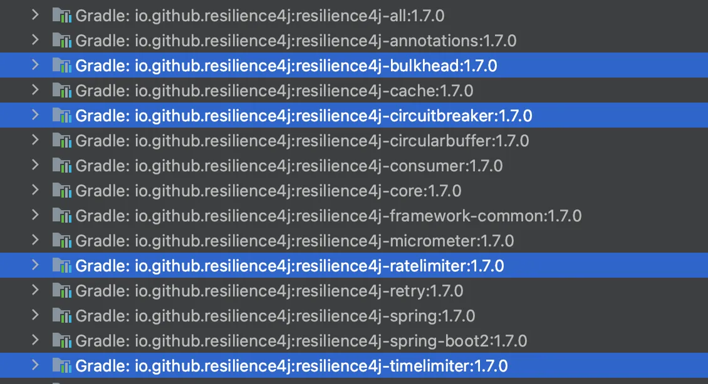

# 서버 개발 시 가장 두려운 것?

여러분이 생각하는 서버에서 발생할 수 있는, 가장 큰 변수는 무엇인가?

내가 생각하는 **서버 개발에서의 가장 큰 변수는 런타임**이다.

네트워크는 자주 끊긴다. 연산이 느릴 수도 있다. 생각보다 CPU 부하가 클 수도 있다. 메모리가 터질 수도 있다.

에러는 발생한다. 서버는 예기치 못한 상황을 툭툭 뱉는다.

그런데 죽어가는 서버한테 계속 요청을 보내면 어떻게 될까?

음, 그 서버는 오바인 무게를 치다가 후들후들 무너져내릴 것이다.

그리고 그 서버가 무너지는 순간 우리의 서비스도 똑같이 와르르 무너져 내릴 것이다.

우리의 나약한 서버. ~~(내가 나약하게 만든 서버?)~~

잘 케어해 주기 위한 방법이 있을까?

# 어떻게 달래지?

맞다. 스포일러를 했다. 우선 무게 안 주기일 것이다.

바로 떠오르는 비유는 **교통 통제**가 아닐까 싶다.

교통 사고가 난 도로로 계속해서 차가 들어오면 그 차들은 이도저도 못한 채로 그 도로에 갇혀 있고, 사고 또한 치워지지 못한 채로 막혀 있는 상황이 오래도록 지속될 것이다.

근데 아예 안 줘 버리면? 쉬게 해 버리면? 거기로 못 가게 해 버리면?

**아주 널널하게 해당 사고를 후딱 처리한 뒤 다시금 그 도로를 이용할 수 있을 것**이다.

우리는 종종 회복 탄력성이라는 단어를 일상에서 사용한다. “탄력성”은 위와 같은 것이다.

**빠르게 정상의 상태로 되돌아오는 것.**

아주 빠르게 문제를 해결한 뒤 도로가 바로 뚫리게 되는 것.

**빠르게 부하를 해결하는 “탄력성(Resilient)”**을 가진 것.

그러한 개념을 통신에서도 미리 구현해 둔 라이브러리들이 있다.

Spring Cloud 기반의 개발에서 해당 부분을 도와주는 친구 중 과거에는 Hysrix가 있었고, 최근에는 Resilience4j가 있다.

# Netflix Hystrix?

2011년도에 나온 글인 **[Making the Netflix API More Resilient](https://netflixtechblog.com/making-the-netflix-api-more-resilient-a8ec62159c2d) ** 라는 글에서, 넷플릭스는 **무엇을 위해 자신들이 Netflix Hystrix 개발을 진행**하게 됐는지 이야기한다. (이제 14년전 글이 되어버렸다..)

넷플릭스는 **“실패는 당연하게 일어나는 일”**이라고 지정한 뒤, 어떻게 이 실패를 보완할지에 대해 고민하고 해당 일에 대한 해결 방식을 `Circuit Breaker 개념`을 차용해 해결했다.

`Circuit Breaker`? 주식을 하는 사람들에게는 익숙한 이름일 수 있겠다.

장에 갑자기 거래가 몰릴 때 거래를 시도하는 사람이 많은데도 거래가 딱 멈추는 상황이 있다. 해당 부분을 서킷 브레이커가 걸리면서 상킷/하킷이 걸렸다… 는 이름으로 부르는데. 아무튼. 해당 상황은 구매 / 판매 **수요가 과열되었을 때 발생**한다.

한 마디로 요약하면 **거래 오가는 데 문제가 있으니까 못하게 막는다**는 것이다. 

SW 안에서의 Circuit Breaker도 **시스템이 과부하 상태에 빠지거나 요청이 반복적으로 실패할 때**, 이를 감지하여 **트래픽을 제한하거나 요청을 차단**한다.

이처럼 “문제가 생길 가능성이 높은 상태에서 추가적인 요청을 제한한다”는 점에서, 주식과 SW 영역 모두 "방어"라는 공통된 의미를 공유한다.

### **실패에 대한 대응 솔루션 3가지**

마이클 니가드의 책 - *Release의 모든 것 (Release It! Design and Deploy Production-Ready Software)*에서 해당 개념을 차용한 넷플릭스는 이 부분을 실제로 구현하며 **실패에 대한 대응 케이스를 세 가지**로 분리한다.

1. **Custom fallback:** 대체 동작을 수행하거나 대체 데이터를 반환
2. **Fail silent** : 실패를 사용자에게 노출하지 않고 조용히 무시하거나 기본값을 반환
3. **Fail fast** : 오류를 감지하면 즉시 실패를 선언

**Custom fallback**에서 넷플릭스는 통신 실패 시 **대체 데이터를 반환**한다. 해당 대체 데이터는 로컬 캐시나 쿠키 등에 있는, 통신이 불필요한 데이터가 된다.

가령 사용자 추천 데이터 API 통신이 성공하면 해당 데이터를 보여주지만 실패할 경우 디바이스에 존재하는 추천 데이터를 UI로 반환하는 식이다.

**Fail silent**에서 넷플릭스는 통신 실패 시 사용자에게 **에러를 노출하지 않은 채로 프로세스를 진행**하게 한다. 서비스 내에 있는 API가 5개라면, 2개가 실패하더라도 프로세스에 문제가 없을 때는 정상 반환을 하는 것이다.

가령 로그 같은 프로세스 무결성에 영향을 주지 않는 API가 누락될 경우에는 정상 반환을 해 준다.

**Fail fast** 에서 넷플릭스는 통신 실패 시 **아예 실패를 선언**해 버린다. 이는 해당 요청이 매우 중요하거나 손실되면 안 될 경우 수행된다.

가령 결제 API나 사용자 정보 저장 같은 무결성 보장이 필수 수반되는 프로세스들이 이에 해당한다.

### 그럼 Hystrix에서는 어떻게 구현하는데?

1. **Custom fallback:** 대체 동작을 수행하거나 대체 데이터를 반환
2. **Fail silent** : 실패를 사용자에게 노출하지 않고 조용히 무시하거나 기본값을 반환
3. **Fail fast** : 오류를 감지하면 즉시 실패를 선언

- **Custom fallback**
    - `@HystrixCommand` 애노테이션 or `run()` 메서드를 실행
    - `fallbackMethod` : 해당 메서드가 실패할 때 대체 로직을 실행

하기 비교하는 코드에서 이야기해 볼 예정이지만, Hystrix에서는 두 가지 방법으로 fallback을 구현한다.


```java
// 어노테이션
@HystrixCommand(fallbackMethod = "fallback")
public String fetchData() {
    // 수행 로직 
}

public String fallback() {
    // 실패 로직 
}

// 소스 코드
public class ExampleCommand extends HystrixCommand<T> {

    @Override
    protected String run() {
        // 수행 로직 
    }

    @Override
    protected String getFallback() {
        // 실패 로직 
    }

}
```

`HystrixCommand` 를 상속해 run() 메서드를 오버라이드해서 구현하거나 / 커스텀 메서드에 해당 어노테이션을 붙이는 식이다.

즉 **상속을 통해 객체를 만들어서 해당 로직을 수행시키는 방법**과 **어노테이션을 통해 커스텀 메서드로 수행**시키는 보다 간단한 방법인 두 가지를 포함하고 있다.

실패할 경우 Hystrix는 개발자를 대신해 재시도 등의 로직을 수행하다가, 최종 실패 시 `fallbackMethod`에 지정되어 있는 함수를 호출하여 에러에 대한 처리를 진행하도록 만들 수 있다.

- **Fail silent**

위에서 `HystrixCommand`가 개발자를 대신한다고 했다. Fail Slient도 같은 방식으로 구현된다.

```java
public FailSilentCommand(T input) {
    super(Setter.withGroupKey(HystrixCommandGroupKey.Factory.asKey("FailSilentCommandGroup"))
        .andCommandPropertiesDefaults(
            HystrixCommandProperties.Setter()
                .withExecutionTimeoutInMilliseconds(1000) // 타임아웃 설정
                .withCircuitBreakerEnabled(false)         // 서킷 브레이커 비활성화
                .withFallbackEnabled(false)              // Fail Silent 구현 (fallback 호출 비활성화)
        )
    );
    this.input = input;
}

public SuccessRequiredCommand(T input) {
    super(Setter.withGroupKey(HystrixCommandGroupKey.Factory.asKey("SuccessCommandGroup"))
        .andCommandPropertiesDefaults(
            HystrixCommandProperties.Setter()
                .withExecutionTimeoutInMilliseconds(1000) // 타임아웃 설정
                .withCircuitBreakerEnabled(true)         // 서킷 브레이커 활성화
        )
    );
    this.input = input;
}

// 실행 함수 
// run으로 정의된 메서드는 "어떤 메서드를 호출할 것인지 설정"
// execute를 통해 실제 인스턴스에서 호출 - Hystrix가 정상 상태일 때 run 호출 

new FailSilentCommand.execute();  -> 수행 실패 시 실패를 조용히 처리 (특정 로직 수행 X) 
new SuccessRequiredCommand.execute(); -> 수행 실패 시 fallback 함수 실행 
```

`HystrixCommand`를 초기화할 때는 **메서드 체이닝을 토대로 한 세팅을 인자로 넣어서 인스턴스**를 만들 수 있다.

해당 부분에 타임아웃 - 실패 조건 등의 처리를 함으로써 어떤 메서드의 실패 시에 `fallbackMethod`를 수행하지 않을지 결정할 수 있게 된다.

- **Fail fast**

실패의 경우에도 `HystrixCommand` 틀 토대로 관리된다.

`HystrixCommand`는 특정 실패 조건 초과 시 바로 **서킷을 Open 상태**로 열면서 호출을 즉각적으로 차단함으로써, 즉각적으로 fallback 메서드가 실행된다. 즉, run 메서드 자체의 수행을 막는다.

해당 라이브러리는 개발자가 수행해야 할 서킷브레이커 로직, **Open - Half Open - Closed 라는 행위를 위임받아 수행**함으로써 개발자가 보다 로직에 집중할 수 있는 환경을 만들어 준다.

# Resilience4j?

그런데 Hystrix는 더 이상 유지보수되지 않는다.

2025년 1월 현재 기준 같은 기능을 하는 주요 라이브러리는 Resilience4j이다.

**Spring Cloud Circuit Breaker는 기본적으로 Resilience4j를 지원**하며, 2024년 12월 5일에 올라온 [baeldung 글](https://www.baeldung.com/spring-cloud-circuit-breaker)에서도 Resilience4j를 기반으로 설명하고 있다.

해당 라이브러리는 위에서 Hystrix가 상속 / 어노테이션 등으로 진행한 **세팅을 함수형으로 진행**할 수 있어, 모던 자바에 익숙한 사용자에게 더욱 직관적인 구현을 보여준다.


또한 RxJava의 Vavr를 사용함으로써 **체이닝 방식으로 메서드를 지정**해 진행할 수 있도록 구현해 두었다. 이 부분은 함수형 패러다임을 라이브러리에 그대로 차용하기 위한 방법으로 판단된다.

위 캡처는 예시 중 하나로 들고 온 **Resilience4j의 ResultUtils라는 클래스**인데, `isFailedAndThrown` 라는 메서드에서 Vavr의 Either를 토대로 예외에 대한 클래스를 검증하고 있는 것을 확인할 수 있다.

비롯해 오버로드 인자로 들어간 `Function<T, Boolean> thrownChecker`의 경우, 해당 클래스에 대한 로직 검증까지 포함해 결과값을 반환하게 된다. (true / false)

이러한 로직은 제네릭을 토대로 클래스 검증 등의 절차를 **사용자가 보다 더 자유도 높게 수행**하도록 도와준다.

상술했듯 **Hystrix가** 하나의 메서드 정의를 위해 Command를 지정하는 등의 **번거로운 초기화 절차**를 거치는 반면, 
**Resilience4j는 위와 같은 함수형 패러다임**을 통해 모듈 설정을 빠르게 하고 상세한 검증 로직을 보다 간편하게 처리할 수 있도록 구성해 두었다.


# 공통점

두 라이브러리의 공통 추구 철학은 결국 **[더 많은 성공을 위한 빠른 차단 - 빠른 회복]**이다.

에러의 지속적 전달로 발생할 수 있는 부하를 선제 차단한 뒤, 시도/재시도를 토대로 해당 통신을 성공시키는 전략이다.

그리고 회복성(Resilience) 패턴이라는 철학을 코드로 추상화한 뒤 다른 사람이 편리하게 사용하도록 만든 라이브러리가 되겠다.

그래, 요악하면 결국 **[빠른 에러의 전파 방지 및 회복]을 토대로 [높은 가용성]을 추구**하는 것이다.

보통 **Resilience 패턴과 관련된 작업은 크게 5가지**가 있다.

- **Circuit Breaker**: 반복적인 실패 발생 시 시스템을 보호하기 위해 호출 가능 여부 제어
- **Bulkhead**: 스레드 풀 / 네트워크를 격리해 하나의 서비스 실패가 다른 서비스로 전파되지 않도록 방지
- **Timeout**: 요청이 설정된 시간 안에 완료되지 않으면 강제로 종료함
- **Retry**: 실패한 작업을 자동으로 재시도
- **Rate Limiter**: 시스템 과부하를 방지하기 위해 호출 수를 제한

그런데 동일 개념을 두 라이브러리가 구현하는 내부 방향이 조금씩 다른 측면이 있다.

먼저 해당 라이브러리들이 제공하고 있는 방식을 본 다음, 그 방식을 어떤 식으로 풀어나갔는지 내부 라이브러리를 뜯어 보도록 하자.

# Circuit Breaker 패턴

가장 기본적인 초기화 패턴이다. 두 라이브러리 모두 다 생성자로 인스턴스를 만들어야 요청을 하겠지.

**초기화 방식**은 사실 사용자 측면에서는 유사하게 느껴질 수 있다.

**성공할 때 수행될 run 함수를 지정하고 → 실패할 때 수행될 fallback 함수를 지정하는 형태**이기 때문이다.

코드로 한번 알아보자.

### Hystrix

```java
  @Component
  public class HystrixCommandComponent extends HystrixCommand<String> {
  
      private Logger logger = LoggerFactory.getLogger(getClass());
      
      // 상속 - 오버라이드 방식
      public String riskyServiceCall() {
          return new HystrixCommand<String>(HystrixCommandGroupKey.Factory.asKey("riskyServiceCallGroup")) {
  
              @Override
              protected String run() {
                  logger.info("[riskyServiceCall][HystrixCommandComponent]");
                  if (Math.random() < 0.5) {
                      throw new RuntimeException("fallback");
                  }
                  return "run";
              }
  
              @Override
              protected String getFallback() {
                  logger.info("[riskyServiceCall][HystrixCommandComponent] getFallback");
                  return "getFallback";
              }
          }.execute();
      }
  
  } 
  
  // 어노테이션 방식
  @HystrixCommand(fallbackMethod = "annotaionFallbackMethod")
  public String riskyServiceCallByAnnotaion() {
  
      logger.info("[riskyServiceCall][riskyServiceCallByAnnotaion]");
      if (Math.random() < 0.5) {
          throw new RuntimeException("annotaion fallback");
      }
      return "annotaion run";
  }
  
  public String annotaionFallbackMethod() {
      logger.info("[riskyServiceCall][HystrixCommandComponent] annotaionFallbackMethod");
      return "fallback response";
  }
```


처음 **HystrixCommandComponent는 `HystrixCommand<String>`를 상속**받은 뒤 run과 getFallback을 오버라이드한다.


해당 오버라이드 안에 **성공할 때 실행할 메서드 - 실패할 때 실행할 메서드**를 넣게 된다.

어노테이션 방식은 조금 더 단순하고 직관적이다.

원하는 **성공 메서드 위에 어노테이션을 토대로 fallback 메서드**를 지정하면 된다.


### Resilience4j

```java
@Component
public class Resilience4jCommandComponent {

    private Logger logger = LoggerFactory.getLogger(getClass());

    private CircuitBreakerFactory circuitBreakerFactory;

    // 의존성 주입 방식
    public String riskyServiceCall() {

        return circuitBreakerFactory.create("slow").run(() -> {
            logger.info("[riskyServiceCall][CircuitBreakerFactory]");
            if (Math.random() < 0.5) {
                throw new RuntimeException("fallback");
            }
            return "run";
        }, throwable -> {
            logger.info("[riskyServiceCall][CircuitBreakerFactory][fallback] throwable:{}", throwable.getClass().getSimpleName());
            return "throwable";
        });
    }

    // 어노테이션 방식
    @CircuitBreaker(name="riskyServiceCallByAnnotaion", fallbackMethod = "annotaionFallbackMethod")
    public String riskyServiceCallByAnnotaion() {

        logger.info("[riskyServiceCall][@CircuitBreaker][riskyServiceCallByAnnotaion]");
        if (Math.random() < 0.5) {
            throw new RuntimeException("annotaion fallback");
        }
        return "annotaion run";
    }

    public String annotaionFallbackMethod(Throwable throwable) {
        logger.info("[riskyServiceCall][@CircuitBreaker] annotaionFallbackMethod");
        return "throwable";
    }

}

```


Resilience4j의 경우에도 크게 다르지 않다.

다만 **Resilience4j는 보다 스프링-함수형 패러다임**에 맞는 구현을 할 수 있는데, **CircuitBreakerFactory에 대한 DI**를 마친 다음 해당 인스턴스를 토대로 **create를 통해 초기화**를 진행할 수 있기 때문이다.

```java
  return circuitBreakerFactory.create("name").run(() -> {
      // 성공 로직 
  }, throwable -> {
      // 실패 로직
  });
```

또한 성공-실패 메서드를 전달하는 과정에서도 함수형 패러다임을 토대로 초기화를 하고 있는 것을 확인할 수 있다.

어노테이션 방식의 경우 Hystrix와 사실 크게 다르지는 않다.

초기화는 이렇게 유사한 형태로 되어 있는데… 내부 구현은 어떨까? 조금씩 뜯어 보자.


# 상태 관리

- **Open - Half Open - Closed**

서킷 브레이커는 3가지 상태값을 토대로 해당 요청을 받지 않을지 - 점차 열지 - 닫을지를 결정한다.

해당 상태 값을 두 라이브러리가 어떻게 구현해 두었는지 살펴 보자.

### Hystrix


상술한 것처럼 Hystrix는 **HystrixCommand**라는 객체를 생성해 그것을 토대로 로직을 수행한다.

HystrixCommand를 사용할 때는 `run()` **메서드를 오버라이드**하여 초기화를 진행한다.

run() 메서드가 수행되기 전, **HystrixCircuitBreaker의 상태에 따라 실행할 함수가 달라진다.**

HystrixCircuitBreaker 안에는 **allowRequest / isOpen / markSuccess** 등의 상태를 관리하는 public 메서드가 존재하고, 이들은 Override를 통해 속성에서 **Open / Close등을 확인**해 로직을 분기한다.

```java
// 실제 Hystrix 라이브러리 코드 
@Override
public boolean allowRequest() {
    if (properties.circuitBreakerForceOpen().get()) {
        // properties have asked us to force the circuit open so we will allow NO requests
        return false;
    }
    if (properties.circuitBreakerForceClosed().get()) {
        // we still want to allow isOpen() to perform it's calculations so we simulate normal behavior
        isOpen();
        // properties have asked us to ignore errors so we will ignore the results of isOpen and just allow all traffic through
        return true;
    }
    return !isOpen() || allowSingleTest();
}
```

**allowRequest()**부에서 해당 분기가 이루어지는데, 해당 값이 true일 경우 요청이 허용되고 - false일 경우 요청이 차단된다.

서킷 브레이커가 열렸는지 여부를 실제로 확인하는 것은 **isOpen()** 메서드인데, 해당 메서드 안에는 지역변수인 서킷브레이커 오픈 여부 AtomicBoolean, **CircuitOpen**이 존재한다.

```java
// 실제 Hystrix 라이브러리 코드 
@Override
public boolean isOpen() {
    if (circuitOpen.get()) {
        // if we're open we immediately return true and don't bother attempting to 'close' ourself as that is left to allowSingleTest and a subsequent successful test to close
        return true;
    }

    // we're closed, so let's see if errors have made us so we should trip the circuit open
    HealthCounts health = metrics.getHealthCounts();

    // check if we are past the statisticalWindowVolumeThreshold
    if (health.getTotalRequests() < properties.circuitBreakerRequestVolumeThreshold().get()) {
        // we are not past the minimum volume threshold for the statisticalWindow so we'll return false immediately and not calculate anything
        return false;
    }

    if (health.getErrorPercentage() < properties.circuitBreakerErrorThresholdPercentage().get()) {
        return false;
    } else {
        // our failure rate is too high, trip the circuit
        if (circuitOpen.compareAndSet(false, true)) {
            // if the previousValue was false then we want to set the currentTime
            circuitOpenedOrLastTestedTime.set(System.currentTimeMillis());
            return true;
        } else {
            // How could previousValue be true? If another thread was going through this code at the same time a race-condition could have
            // caused another thread to set it to true already even though we were in the process of doing the same
            // In this case, we know the circuit is open, so let the other thread set the currentTime and report back that the circuit is open
            return true;
        }
    }
}
```

**HealthCounts** 객체 안에 들어 있는 **서킷브레이커 관련 변수들의 값을 체크**하고, 둘 다 패스했을 경우 서킷브레이커가 Open되어야 하는 형태이기 때문에 실제로 오픈하거나, 혹시 해당 로직이 실패하더라도 fallback 로직으로 강제 return true를 해 로직이 진행되지 않도록 한다.

allowRequest() 로직을 다시 살펴보면 `properties`에 대한 강제 제어부 →  `properties.circuitBreakerForceClosed()` 은 강제로 요청을 막고 / `properties.circuitBreakerForceOpen()`는 요청을 무조건적으로 허용하되 isOpen 메서드는 수행하도록 한다.

allowRequest의 반환에 따라 우리가 선언한 `run()`이 실행될지의 여부가 결정되는 것이다.

### Resilience4j


Resilience4j의 서킷브레이커 상태 관리는 조금 다르다.

**내부의 State라는 ENUM**을 가지고 있어, 해당 ENUM을 토대로 OPEN 등의 상태를 보다 명시적으로 체크한다.

Hystrix가 속성의 값으로 체크하던 `FORCED_OPEN` 등을 ENUM으로 처리하기 때문에 로직 안에서 더욱 이해가 명확해질 것이다.

```java
private void stateTransition(State newState,
    UnaryOperator<CircuitBreakerState> newStateGenerator) {
    CircuitBreakerState previousState = stateReference.getAndUpdate(currentState -> {
        StateTransition.transitionBetween(getName(), currentState.getState(), newState);
        currentState.preTransitionHook();
        return newStateGenerator.apply(currentState);
    });
    publishStateTransitionEvent(
        StateTransition.transitionBetween(getName(), previousState.getState(), newState));
}

// ...

// 실제 State 변환 이벤트 호출
private void publishStateTransitionEvent(final StateTransition stateTransition) {
    if (StateTransition.isInternalTransition(stateTransition)) {
        return;
    }
    final CircuitBreakerOnStateTransitionEvent event = new CircuitBreakerOnStateTransitionEvent(
        name, stateTransition);
    publishEventIfPossible(event);
}
```


또한 State가 바뀌는 것을 `StateTransition`을 통해 정의해 두어서, **변화 자체에 대한 OCP**를 지키는 동시에 **잘못된 상태 전이를 컴파일 타임에 방지 가능한 구조적인 제약**을 둚으로서 **에러 발생을 최소화**했다.

### Event: 객체지향의 구현과 상속을 모두 취한

더욱 인상 깊었던 것은 **Event 객체의 구현**이었다.


```java
abstract class AbstractCircuitBreakerEvent implements CircuitBreakerEvent {

    private final String circuitBreakerName;
    private final ZonedDateTime creationTime;

    AbstractCircuitBreakerEvent(String circuitBreakerName) {
        this.circuitBreakerName = circuitBreakerName;
        this.creationTime = ZonedDateTime.now();
    }

    @Override
    public String getCircuitBreakerName() {
        return circuitBreakerName;
    }

    @Override
    public ZonedDateTime getCreationTime() {
        return creationTime;
    }
}

```

- `CircuitBreakerEvent`라는 **인터페이스**를 통해 **골격을 지정**하고
- `AbstractCircuitBreakerEvent`라는 추상 클래스를 토대로 해당 인터페이스를 구현했다. (has-a)
- 그리고 모든 `CircuitBreakerEvent`는 해당 **추상 클래스를 상속받아 확장**하도록 구현해 두었다. (is-a)

- ***CircuitBreakerEvent (Interface)***
  - **getCircuitBreakerName**
  - **getEventType**
  - **getCreationTime**

이 `CircuitBreakerEvent` 인터페이스 안에는 **getCircuitBreakerName** / **getEventType** / **getCreationTime**이라는 공통 메서드와 함께 상기한 Type 객체 ENUM으로 **OPEN / CLOSED 등의 상태**가 정의되어 있다.

- ***AbstractCircuitBreakerEvent (abstract Class)***
  - @Override **getCircuitBreakerName**
  - @Override **getCreationTime**

`AbstractCircuitBreakerEvent`에서는 **공통으로 지정**할 수 있는 **getCircuitBreakerName  / getCreationTime**에 대해서만 `@Override`를 진행하고,

실제 Event에 가서야 인지하고 반환할 수 있는 **getEventType**을 실제 구현체에서 `Override` 를 진행함으로써 최대한의 공통화를 진행한 것 같았다.

(객체지향.. **🥹**)

```java
public class CircuitBreakerOnSuccessEvent extends AbstractCircuitBreakerEvent {

    private final Duration elapsedDuration;

    public CircuitBreakerOnSuccessEvent(String circuitBreakerName, Duration elapsedDuration) {
        super(circuitBreakerName);
        this.elapsedDuration = elapsedDuration;
    }

    public Duration getElapsedDuration() {
        return elapsedDuration;
    }

    @Override
    public Type getEventType() {
        return Type.SUCCESS;
    }

    @Override
    public String toString() {
        return String
            .format("%s: CircuitBreaker '%s' recorded a successful call. Elapsed time: %s ms",
                getCreationTime(),
                getCircuitBreakerName(),
                getElapsedDuration().toMillis());
    }
}

```


**Resilience4j의 모듈화**는 여기에서 끝나지 않는다.

Hystrix와 비교하는 형태로 두 라이브러리의 구성에 대해 더 이야기해 보자.

# 모듈화

### Hystrix

- 기능에 따른 초기화 객체가 하나: HystrixCommand 초기화 시 세팅을 통해 설정
- **높은 결합도**: 어떤 기능을 원하든 하나의 객체에서 세팅을 지정해 기능을 조절해야 함
- 오류 가능성: 속성이 잘못해서 바뀌는 경우 **오류 상황 발생 가능성**


Hystrix의 경우 **HystrixCommand 객체 안에 들어있는 모든 기능**들이 **하나의 초기화 객체**를 통해 세팅되어야 하는 형태이다.

따라서 어떤 기능을 원하든 하나의 객체에서 세팅을 지정해 기능을 조절해야 하는 **높은 결합도**를 가지게 된다.

속성을 통해 구별하는 방식은 **유지보수의 관점에서 더욱 문제**를 가지고 오는데, 속성이 잘못 바뀌는 경우 발생할 수 있는 오류 또한 걱정해야 할 거리가 된다.

만약 줄줄이 나열된 속성에서 모르고 속성 하나를 빼 먹는다면?

소스에서 바로 원하는 로직이 실패하고, 짧은 시간 안에 원인을 파악하기도 힘들 것이다.

그렇다면 Resilience4j는 어떨까? ~~(뭔가 다른 좋은 게 있으니까 비교하려고 했겠지?)~~

### Resilience4j

- 모듈화를 토대로 필요한 기능에 따라 분리
- 1개만 필요한데도 세팅을 여러개 하는 등의 불필요 작업 제거
- SRP 달성 - 이후 개발자에게 목적 명확하게 드러냄
- 애초 다른 클래스이기 때문에 추후 유지보수시 오류가 날 확률이 적어짐



Resilience4j를 살펴보면, **모듈화를 토대로 필요한 기능에 따라 분리**되어 있는 것을 확인해 볼 수 있다.

우리가 언급한 기능들이 개개의 클래스로 개발되어, 안에서 개만 필요한데도 세팅을 여러개 하는 등의 불필요 작업이 제거되었다.

이는 모듈화를 통해 SRP를 달성하면서 이후 개발자에게 목적을 명확하게 드러내는 효과를 가진다.

또한 애초에 다른 클래스이기 때문에 추후 유지보수시 오류가 날 확률이 적어지는 구조적인 장점을 가지게 된 것이다.

그냥 넘어갈 수 없으니 구조를 한번 둘러보자.


두 가지 클래스는 기본적으로 같은 구조를 공유하면서 구조화를 통해 이후 유지보수를 할 개발자의 직관성을 더한다.

만약 코어를 수정해야 하는 것이 아니라, **개개별의 구조에 동일한 기능을 더하고 싶다**면, 목적 없이 클래스들이 **분리되어 있었을 때 어떻게 파악**할 수 있을까?

전체 로직을 다시 훑어봐야 하는 등의 비효율과 동시에 에러 발생 확률도 올라갈 것이다.

그러나 해당 구조를 사용한다면 추가한 클래스에 있는 메서드를 그대로 가져다 긁어서 복사붙여넣기 하는 식으로 쉬운 확장을 진행할 수 있어진다. (OCP)

# Bulkhead

**CircuitBreaker**가 장애를 빠르게 감지하기 위해 **서킷을 열어 호출 자체를 차단**한다면,

**Bulkhead는 최대 동시 실행수를 `제한`하는** 방식으로 특정 리소스가 병목 현상에 빠지지 않도록 보호한다.

이 패턴은 선박에서 문제가 있는 부분에 **아예 접근 자체를 막아버리는 방식**의 격벽에서 영감을 받아 만들어졌다.

만약 여러 가지 동일한 스레드가 돌아가고 있는 과정에서 **하나의 스레드에 부하가 걸리거나 문**제가 발생하면 어떻게 될까?

해당 스레드에는 더 이상 호출 자체를 하면 안 될 것이다.

동시에 **해당 스레드에 적합한 부하**를 정해 두고 그 안에서만 요청이 이루어져야 할 것이다.

음, 접근이 좀 어렵다면 비유를 해 보자. 내가 생각하기에 좋은 비유는 **급식이 나오는 식당에서의 식판 반납**이다.

식당에서는 하나에서 꽉 차는 문제를 방지하기 위해 여러 개의 반납 시설을 둘 수 있다.

이때, 만약 해당 구간에서 식판을 반납하는 곳이 150개가 max라면?

혹시 다른 식판 반납함에 들어갔을 때 파편화가 되기 때문에 비효율적이라면?

특정 반납함에만 요청을 주는 식의 **Bulkhead**와 같은 패턴으로 반납 시설을 운용해 보다 빠른 식판 제어가 가능할 것이다.

이제 이 패턴을 Hystrix와 Resilience4j에서 어떤 패러다임으로 구현했는지 파악해 보자.

### Hystrix

- HystrixCommand 초기화 시 함께 설정
- `HystrixThreadPoolProperties.Setter`
- **동시 처리 가능한 요청 수**를 스레드풀 제한으로 설정
- **세마포어 제한**도 가능하나 Hystrix가 권장하는 방식(스레드)이 아님

```java
HystrixCommand.Setter setter = HystrixCommand.Setter
    .withGroupKey(HystrixCommandGroupKey.Factory.asKey("ExampleGroup"))
    .andThreadPoolPropertiesDefaults(
        HystrixThreadPoolProperties.Setter()
            **.withCoreSize(5)  // 최대 스레드**
    );
```

우리는 Hystrix가 언제나 HystrixCommand를 베이스로 돌아간다고 이야기했다.

이번 패턴에서도 똑같이 **속성을 기반으로 한 구현**이 이루어진다.

HystrixThreadPool의 최대 CoreSize를 설정하면 특정 작업 그룹에서 동시에 실행할 수 있는 **스레드의 개수**가 해당 지정 개수로 제한된다.

이 방식은 **스레드풀** 기반이기 때문에 요청을 처리하는 데 별도의 스레드를 생성하고 스레드의 분리를 통한 병렬성을 통해 안정성을 높일 수 있다.

별도의 스레드를 할당함으로써 동시에 처리 가능한 작업의 최대 개수를 제한하게 되고, 이에 따라 하나의 작업이 지연되더라도 다른 작업이 영향을 받지 않게 되기 때문이다.

그런데 **Bulkhead를 구현하는 방식에**는 스레드 풀만 있는 것이 아니라 **세마포어 방식**도 존재한다.


세마포어 방식은 **스레드 수가 적은 환경**이나 **작은 규모의 비동기 작업**에서 더 유리하다.

실행되는 작업의 카운트를 제어함으로써 오버헤드를 줄이고, 리소스 관리가 간단하다. 예를 들어, 블로킹이 없고 빠르게 완료되는 경량 작업이 예시가 되겠다.

Hystrix는 **세마포어 방식도 제공**하지만, 기본적으로 **스레드풀 방식을 권장**한다.

언급한 것처럼 **세마포어가 조금 더 구현이 편리할 텐데 왜** 그럴까?

우선은 세마포어의 경우 **단일 스레드 환경에 조금 더 적합**한 패턴이다.

**스레드풀을 기반으로 병렬 리소스를 관리하는 Hystrix의 특성**상, 세마포어가 가지는 단일 스레드 처리가 오히려 자원의 활용 효율을 낮추게 된다.

또한 접근하는 스레드가 결국 동시접근자를 제한함에 따라 단일 스레드를 사용하도록 해 자원의 효율이 낮아지고, 이에 따라 블로킹이 아닌 호출 환경에서는 스레드풀 방식이 더 안정적으로 동작하기 때문도 있다.

**여러 스레드가 비블로킹 호출을 처리하는 것을 가정한 Hystrix는 스레드풀 방식이 더 효율적이고 안정적으로 작동한다고 생각**한 것이다.

또한 **Hystrix는 넷플릭스라는 고가용성 시스템을 지원하면서 만들어진 것**이다.

당연히 부하를 가정하더라도 스레드풀 방식으로 가는 것이 더 효율적이었을 것이다.

### Resilience4j

- Bulkhead 인스턴스를 토대로 수행
- **동시 처리 가능한 요청 수**를 세마포어 기반으로 설정

```java
BulkheadConfig bulkheadConfig = BulkheadConfig.custom()
    .maxConcurrentCalls(5)  // 동시 실행 가능한 작업 수
    .maxWaitDuration(Duration.ofMillis(500))  // 대기할 수 있는 최대 시간
    .build();

BulkheadRegistry bulkheadRegistry = BulkheadRegistry.of(bulkheadConfig);
Bulkhead bulkhead = bulkheadRegistry.bulkhead("Resilience4jBulkhead");
```

Resilience4j에서는 해당 객체를 기반으로 해, Config 인스턴스를 생성할 수 있다.

설정을 체이닝 방식으로 지정하는 방식이 Hystrix와 유사해 보이지만, 해당 객체가 오직 Bulkhead를 위한 설정이라는 점에서 가지는 장점이 있다.

일단 **Bulkhead를 위한 세팅만이 제약**된다는 것이다. 구현에서의 자유도가 낮아짐으로써 안전성을 보장하게 된다.

또한 Bulkhead라는 **명확한 이름을 토대로 무슨 패턴을 구현하고 싶은지에 대한 직관적인 이해**가 가능하다.

그런데 **Resilience4j에서는 또 세마포어**를 쓴다고 한다. 이게 대체 무슨 상황일까?

이는 **Hystrix와 Resilience4j의 설계 철학 차이**에서 비롯된다.

Resilience4j는 복잡한 스레드풀을 관리하는 대신 기본 설계 자체를 보다 범용적이고-가볍게 가져가는 것에 집중한다.

스레드풀을 관리하는 것은 기타 모듈로 제어하고, 세마포어를 기준으로 삼는 방식을 토대로 먼저 무거운 효율을 처리하게 하지 않고, **필요한 사람들만이 스레드풀을 사용하도록** 선택지를 바꾼 것이다.

이러한 차이는 **Resilience4j가 더욱 사용자-프로세스 친화적이려고 노력**했다는 점을 시사한다.

다음으로는 언급했던 Resilience를 위한 5가지 방법 중 3번째 방식인 timeout에 대해 이야기해 보자.

# Timeout

**스레드는 종종 무한 루프 등으로 인해 응답을 하지 않을 수 있다. 서버 과부하** 때문에 문제가 생길 수도 있다. 다른  서비스와 통신할 경우 **응답 지연**의 케이스도 있다.

이러한 스레드는 **유용 가능한 자원을 잡고 있음으로서 비효율**을 높이게 된다.

그런데 모두 **동일한 Timeout 시간을 줘 버리면** 어떻게 될까? 너무 긴 timeout은 이미 비활성화된 스레드를 오래 잡고 있을 수 있고, 너무 짧은 Timeout은 정상 지연인 경우까지 리소스를 해제하는 일이 발생할 수 있다.

이처럼 **언제나 같은 Timeout은 적절한 프로세스 수행에 문제**를 줄 수 있으니 로직 안에서의 평균~그에 상회하는 값이지만 / 로직의 HA를 방해하지 않는 적절한 시간을 테스트 등을 토대로 커스텀한 TImeout 의사결정할 필요가 있다.

그렇다면 해당 커스텀 시간을 Hystrix와 Resilience4j에서는 어떻게 설정해 두고 있을까?

### Hystrix

- HystrixCommand 초기화 시 함께 설정
- `HystrixCommandProperties.Setter().withExecutionIsolationThreadTimeoutInMilliseconds(1000)`

HystrixCommand 내의 timeout의 경우에는 **HystrixCommand 초기화 시 세팅**을 토대로 시간을 지정할 수 있다.

`withExecutionIsolationThreadTimeoutInMilliseconds`라는 옵션은 직관적으로 해당 스레드가 얼마만큼의 밀리세컨드 안에서 수행되어야 하는지를 세팅하는 구간이다.

### Resilience4j

- TimeLimiter 인스턴스를 토대로 수행

```java
TimeLimiterConfig config = TimeLimiterConfig.custom()
        .timeoutDuration(Duration.ofMillis(1000)) // 타임아웃 설정
        .build();

TimeLimiter timeLimiter = TimeLimiter.of(config);
```

Resilience4j도 `TimeLimiterConfig`에서 `timeoutDuration`이라는 **속성을 통해 직관적으로 해당 스레드의 타임아웃 시간을 지정**할 수 있다.

물론 BulkHead와 동일한 관점인 “개별 클래스를 통한 세팅”이라는 철학은 동일하게 가지고 있다.

해당 속성들을 제어함으로써 **사용자는 원하는 timoout을 설정**해 보다 **가용성이 높은 프로그램**을 만들 수 있을 것이다.

그렇다면 나머지, Retry / RateLimiter도 동일한 상황이 일어날까?

# Retry / RateLimiter

* `Retry`

**Retry**는 **네트워크 오류가 발생할 때, 일시적인 서비스 장애**가 발생했을 때 바로 로직을 끝내는 것이 아니라 **추가로 요청**함으로써 가용성을 높일 수 있는 방식이다.

가령 잠시 외부 API 서버에 문제가 생겼을 때 우리의 사용자가 요청을 했다. 그런데 문제가 생겼을 경우라 요청이 실패했다. 

그런데 외부 API 서버는 일시적인 문제였기 때문에 0.1초 후에 복구가 되어 버렸다. 그렇다면 그 사람은 0.1초 사이로 정상 진행을 실패한 것이다.

이러한 상황을 조금 더 보완하기 위해 **Retry**를 설정함으로써 가용성을 높인다.

물론 **적절하지 않은 Retry는 오히려 서버 부하를 가중할 수 있다**는 이면을 가지고 있으니 유의할 필요가 있다. 

가령 이미 지속적으로 문제가 생기고 있는 서버에게 **Retry**를 지속할 경우 불필요한 리소스가 낭비될 수 있는 등의 이슈를 고려해야 한다는 뜻이다.


* `RateLimiter`

**RateLimiter**는 **동시 요청이 많을 때** 서버가 과부하되지 않도록 **요청의 수를 제한**하는 데 사용된다. 일반적으로 초당 요청을 기준으로 한다.

요청의 수를 제한한다는 점에서 **Bulkhead**와 일견 유사해 보일 수도 있겠다.

그러나 Bulkhead와 다른 점은 **Bulkhead가 공간, 즉 어디로 보낼지**를 제어한다면, **RateLimiter**는 들어오는 **시간 안에서의 요청 제어**를 처리하는 것이다.

이 때문에 둘은 동의어가 아니며,  **Bulkhead가 제약을 둔 안에서 RateLimiter가 사용될 수 있다.**

이러한 방식을 Hystrix와 Resilience4j에서는 어떻게 구현했을까?

### Hystrix

- **직접적으로 지원하지 않음 → 자체 구현이 필요함**

어쩌면 조금 슬픈 소식일 수도 있겠다. Hystrix에서는 Retry와 RateLimiter를 제공하지 않는다.

이를 위해서는 명시적으로 **Retry와 RateLimiter를 제공하는 라이브러리를 사용**하거나 혹은 **직접 로직을 구현**해야 했다.

그런데 Resilience4j에서는 이 부분이 대폭 개선된다.

### Resilience4j

- 해당 클래스 인스턴스를 토대로 수행
- **Retry Context**: **재시도** 관리 / 재시도 횟수나 지연 시간 등의 세부 사항을 추적
- **RateLimiter**: **요청의 처리 속도**를 제한하는 데 사용

```java
// Retry 설정
RetryConfig retryConfig = RetryConfig.custom()
    .maxAttempts(3)
    .waitDuration(Duration.ofMillis(500))
    .build();
RetryRegistry retryRegistry = RetryRegistry.of(retryConfig);
Retry retry = retryRegistry.retry("Resilience4jRetry");

// RateLimiter 설정
RateLimiterConfig rateLimiterConfig = RateLimiterConfig.custom()
    .limitForPeriod(10) 
    .limitRefreshPeriod(Duration.ofSeconds(1))
    .timeoutDuration(Duration.ofMillis(500))
    .build();

RateLimiterRegistry rateLimiterRegistry = RateLimiterRegistry.of(rateLimiterConfig);
RateLimiter rateLimiter = rateLimiterRegistry.rateLimiter("myRateLimiter");

```

RateLimiter / Retry도 Bulkhead와 동일하게 Config와 해당 클래스 이름을 통해 인스턴스를 생성한다.

timeoutDuration / waitDuration 등 설정 옵션은 다르지만 다 개개별로 필요한 옵션을 토대로 인스턴스를 만들 수 있다.

이 두 가지 클래스를 토대로 Resilience4j 사용자는 원하는 기능을 더더욱 빠르게, 동시에 같은 패러다임을 공유하며 구현을 해나갈 수 있다.

## 그리고, 데코레이터 패턴

Resilience4j는 이러한 관점으로 Hystrix와 다른 철학을 고려하며 라이브러리를 보완해 나갔다.

특히 사용자 활용 메서드 쪽에서 함수형 패러다임을 적용한 점에 대해서는 Hystrix보다 모던한 방식을 택했다고 생각한다.

내가 **Resilience4j에서 지원하는 클래스**에서 둘러봤던 로직 중 가장 함수형 기반이라고 느꼈던 것은 **`decorate` 메서드**와 **`context`를 기반으로 한 함수 실행 관리**였다.

- `decorate*` 메소드들은 **함수를 인자**로 받아서 해당 함수가 **실행될 때마다 로직**을 적용할 수 있도록 래핑
- **함수 실행 성공 시**  `context.onResult(result)`를 호출
- 값 유효 시 `context.onComplete()`로 완료된 상태로 반환
- `context.onResult(result)`를 호출한 후,
  - 이 값이 유효하면 더 이상 재시도를 하지 않고 결과를 반환
  - 유효하지 않으면 로직을 계속 시도
  - (bulkhead면 계속 막고 있기, retry면 계속 try, rate limiter면 제약 계속 수행)


```java
// 실제 Retry 코드

/**
 * Creates a retryable callable.
 *
 * @param retry    the retry context
 * @param supplier the original function
 * @param <T>      the type of results supplied by this supplier
 * @return a retryable function
 */
static <T> Callable<T> decorateCallable(Retry retry, Callable<T> supplier) {
    return () -> {
        Retry.Context<T> context = retry.context();
        do {
            try {
                T result = supplier.call();
                final boolean validationOfResult = context.onResult(result);
                if (!validationOfResult) {
                    context.onComplete();
                    return result;
                }
            } catch (Exception exception) {
                context.onError(exception);
            }
        } while (true);
    };
}

/**
 * Creates a retryable runnable.
 *
 * @param retry    the retry context
 * @param runnable the original runnable
 * @return a retryable runnable
 */
static Runnable decorateRunnable(Retry retry, Runnable runnable) {
    return () -> {
        Retry.Context context = retry.context();
        do {
            try {
                runnable.run();
                context.onComplete();
                break;
            } catch (RuntimeException runtimeException) {
                context.onRuntimeError(runtimeException);
            }
        } while (true);
    };
}
```

모든 패턴들이 해당 데코레이터 함수를 내부적으로 활용할 수 있다. 그 중에서도 예시 코드로 Retry 클래스를 가지고 와 봤다.

**해당 decorate 함수들**은 클래스를 이용하는 사람들이 **함수형 패러다임에 걸맞는 방식으로 코딩할 수 있도록 두 번째 인자로 람다**를 받도록 처리하고 있다.

run을 만저 실행한 후 이슈가 생길 때 내장된 컨텍스트를 토대로 런타임 에러를 던지게 된다. 즉 수행 후 예외가 나올 때까지 재귀를 돌리는 형태다.

이런 구조를 토대로 사용자는 잘 추상화된, 보다 간편한 방식으로 **run / throwable을 주입**해 원하는 로직을 구현할 수 있다.

```java
  return circuitBreakerFactory.create("name").run(() -> {
      // 성공 로직 
  }, throwable -> {
      // 실패 로직
  });
```

# 결합해 보기

아까 이야기했듯이 Bulkhead가 제약을 둔 안에서 RateLimiter가 사용될 수 있고, 요청 중의 Circuit Breaker도 충분히 적용이 가능하다.

이러한 상황을 **해당 라이브러리를 엮어서, 조합해서 적용**해 볼 수는 없을까?

### Hystrix

- Hystrix에서 지원하는 것의 경우 HystrixCommand 내에서 세팅으로 처리 가능
- 지원하지 않는 것은 별도 모듈을 토대로 HystrixCommand를 호출하는 형식으로 처리 가능
  - 예: retry의 경우 Retry 클래스 구현 뒤 내부에서 HystrixCommand를 처리

```java
public class HystrixCommandWithBulkhead extends HystrixCommand<String> {

    private final Logger logger = LoggerFactory.getLogger(HystrixCommandWithBulkhead.class);

    public HystrixCommandWithBulkhead() {
        super(Setter.withGroupKey(HystrixCommandGroupKey.Factory.asKey("Group"))
                    .andCommandKey(HystrixCommandKey.Factory.asKey("CircuitBreaker"))
                    .andThreadPoolKey(HystrixThreadPoolKey.Factory.asKey("Bulkhead"))
                    // 서킷브레이커 설정
                    .andCommandPropertiesDefaults(HystrixCommandProperties.Setter()
                        .withExecutionTimeoutInMilliseconds(1000) // 타임아웃 설정
                        .withCircuitBreakerRequestVolumeThreshold(10) // 서킷브레이커 요청 수 임계값
                        .withCircuitBreakerErrorThresholdPercentage(50) // 에러 비율 임계값
                        .withCircuitBreakerSleepWindowInMilliseconds(500) // 서킷브레이커 대기 시간 설정
                    )
                    // 벌크헤드 설정
                    .andThreadPoolPropertiesDefaults(HystrixThreadPoolProperties.Setter()
                        .withCoreSize(10) // 스레드 풀의 기본 크기
                        .withMaxQueueSize(10) // 큐 크기
                        .withKeepAliveTimeMinutes(1) // 스레드 유지 시간
                    ));
    }

    @Override
    protected String run() throws Exception {
        // 실제 서비스 호출 또는 작업
    }

    @Override
    protected String getFallback() {
       // fallback
    }
}

```

HystrixCommand의 경우 **지원하는 옵션에 대해서는 속성을 추가**한 다음 구현할 수 있다.

**HystrixCommand를 원하는 만큼 만들어** 순차적으로 진행할 수도 있고, **하나의 Setter 속에서 여러 가지의 속성을 부여하는 방식으로도 구현**이 가능하다.

다만 전자나 후자나 역시 “무엇”을 구현하는지 변수명이나 주석으로 체크하는 작업으로 선후 관계나 구현의 명확성을 더해 주는 것이 필요해 보인다.

### Resilience4j

- 데코레이터를 토대로 지연 실행
- **엄청 깔끔!**

```java
// Config 등을 통한 초기화
TimeLimiter timeLimiter = ... 
Retry retry = ... 
Bulkhead bulkhead = ... 

Supplier<String> supplier = () -> {
  // 실행 로직
};

// 각 모듈을 데코레이터 형태로 적용
Supplier<String> decoratedSupplier = TimeLimiter.decorateSupplier(timeLimiter, 
    Retry.decorateSupplier(retry, 
    Bulkhead.decorateSupplier(bulkhead, supplier)));

// 결과 실행
String result = decoratedSupplier.get();  // 타임아웃 + 재시도 + 벌크헤드 적용

```

반면 Resilience4j는 언급했던 **데코레이터 형태의 함수**를 이용할 수 있다. 이러한 방식은 이후 유지보수하는 개발자가 로직을 더욱 빠르고 명확하게 이해할 수 있도록 돕는다.

또한 구현에 있어서도 **서로의 로직을 간섭하지 않는 상황**이지만 **주요 기술 시나리오 안에서는 밀접하게 결합**되어 가용성과 안정성을 높이는 방식이 될 것이다.

# 스레드 전략

Bulkhead에서도 언급한 부분이지만, Hystrix와 Resilience4j는 **다른 스레드 전략을 선택**했다.

그런데 이전 언급에서는 단지 왜 그 전략을 선택했고, 철학이 어떤 것인지 이야기하는 것에 그친 면이 있다.

따라서 내부 구현을 뜯어 보며 스레드 전략을 어떻게 풀어냈는지에 대해 조금 더 상세하게 이야기해 보는 시간을 가져 보자.

### Hystrix

- 전략 분리 가능: 스레드풀 - 세마포어
- 스레드 격리를 통한 그룹 생성으로 병렬처럼 처리되도록 할 수 있음


Hystrix는 **ExecutionIsolationStrategy**라는 ENUM을 토대로 해당 전략을 분리할 수 있도록 만들어 두었다.

해당 세팅을 이용하고 싶은 사용자는 HystrixCommand를 생성할 때 **HystrixCommandProperties**안에서 지정할 수 있으며, 내부적으로는 ExecutionIsolationStrategy로 관리된다.

THREAD가 설정된 경우 Hystrix가 내부적으로 **전역적인 스레드 풀**을 사용해 관리하게 된다.

그러면 만약 만들어진 HystrixCommand의 속성을 서로 다른 것으로 변경하고 싶으면 어떨까? HystrixCommandProperties를 변경하면 되지 않을까?

**동적으로 변경하는 일은 아쉽지만 불가능**하다. 다시 한 번 그룹을 생성할 때 지정해 준 뒤 그룹을 변경하는 방식으로의 구현이 필요하다. 이는 유연성에서 다소 제약이 될 수 있겠다.

### Resilience4j

- Resilience4j에 사용자가 **외부 스레드풀**을 주입
- 외부 스레드 풀(`ExecutorService`나 `ThreadPoolTaskExecutor`)을 주입할 수 있음
- 동적으로 변경이 가능 → 조금 더 유연


Resilience4j는 Hystrix와 달리 **외부 스레드 풀을 주입할 수 있는** 기능을 제공한다.

이를 통해 `ExecutorService`나 `ThreadPoolTaskExecutor`와 같은 사용자 정의 스레드 풀을 주입할 수 있어, 더욱 **유연한 스레드 관리**가 가능하다.

이와 같은 방식을 통해 사용자에게 더 많은 선택권을 주며, 필요한 경우 **실행 중에도 스레드 전략을 동적으로 변경**할 수 있다.

예를 들어, **Bulkhead**나 **RateLimiter** 같은 전략을 활용하면서도, 외부 스레드 풀을 주입하여 애플리케이션의 요구 사항에 맞는 방식으로 스레드를 처리할 수 있게 된다. 이 점에서 Resilience4j는 Hystrix보다 **더 높은 유연성**과 **효율성**을 제공한다.

따라서 Resilience4j는 스레드 격리와 관리를 더 세밀하게 제어할 수 있으며, **동적 변경**이 가능하기 때문에 애플리케이션이 보다 복잡한 요구 사항으로 변경되는 등의 시점에 더욱 확장성이 높아질 수 있다.

# 비동기 수행

### Hystrix

- 비동기 자체 수행 불가능

```java

 private String asyncHystrixBreaker() throws Exception {

    HystrixCommand<String> command = new HystrixCommand<String>(
            HystrixCommandGroupKey.Factory.asKey("asyncHystrixBreaker"),
            HystrixCommandProperties.Setter().withExecutionIsolationThreadTimeoutInMilliseconds(1000)) {

        @Override
        protected String run() throws Exception {
            // 실제 서비스 호출 또는 작업
        }

        @Override
        protected String getFallback() {
            // 실패 로직
        }
    };

    // Hystrix는 비동기로 실행할 수 없음
    // HystrixCommand를 비동기로 호출해서 따로 처리
    CompletableFuture<String> future = CompletableFuture.supplyAsync(() -> {
        try {
            return command.queue().get();
        } catch (Exception e) {
            throw new RuntimeException("Error executing Hystrix command", e);
        }
    });

    // 비동기 결과 처리
    future.whenComplete((result, throwable) -> {
        if (throwable != null) {
            // 실패 로그
        } else {
            // 성공 로그
        }
    });

    return future.get();
}
```

역시나 지원하지 않는 것의 재등장이다. 물론 내가 Resilience4j가 지원 가능한 것들을 이야기하면서 Hystrix의 지나간 역사에 대해 이야기하고 있으니 어쩌면 당연할 수도…

아무튼, Hystrix에서는 **비동기 처리**를 위해 `HystrixCommand`를 사용할 수 있지만, 비동기 호출을 직접적으로 지원하지 않는다.

대신, `HystrixCommand`의 `queue()` 메서드를 사용해 비동기적으로 실행할 수 있도록 `CompletableFuture`를 활용할 수 있다. **외부에서 `CompletableFuture.supplyAsync()`를 사용해 명령을 비동기적으로 실행하는 로직**이다.

이렇게 서두를 열었다면 역시 Resilience4j는 지원을 한다는 이야기겠지? 어떻게 지원되는 것인지 톺아 보자.

### Resilience4j

- 비동기 수행 자체 지원
- 서킷브레이커 초기화 클래스

```java

private String asyncResilience4jBreaker() throws Exception {

      // CircuitBreakerConfig & CircuitBreakerRegistry
      CircuitBreakerConfig config =  ...; 
      CircuitBreakerRegistry registry = CircuitBreakerRegistry.of(config);

      // CircuitBreaker 생성
      CircuitBreaker circuitBreaker = registry.circuitBreaker("asyncCircleBreaker");

      CompletableFuture<String> future = CompletableFuture.supplyAsync(() -> circuitBreaker.executeSupplier(() -> {
          // 실제 서비스 호출 또는 작업
      }));

      future.whenComplete((result, throwable) -> {
          // 예외 시 예외 던짐
      });

      return future.get();
} 
```

Resilience4j는 **비동기 실행을 기본적으로 지원**한다. `CircuitBreaker`는 `executeSupplier()` 메서드를 사용해 **서킷 브레이커가 적용된 비동기 작업**을 쉽게 구현할 수 있다.

이 메서드는 비동기적으로 작업을 실행하고 결과를 `CompletableFuture`로 반환하기 때문에, 비동기 코드가 더욱 간결하고 직관적이다.

또한 내가 두 가지 라이브러리를 비교하며 좀 신기했던 부분이 있었는데… 바로 리액티브 프로그래밍이다.

# 리액티브 프로그래밍

### Hystrix

- **서블릿 기반의 동기식 애플리케이션**에서 **단일 쓰레드** 모델을 사용
- WebFlux 사용 어려움

Hystrix는  **전통적인 서블릿 기반의 동기식 애플리케이션**을 기반으로 설계되었다. 따라서 기본적으로 **단일 스레드** 모델을 적용한다.

이로 인해 **스레드 격리**를 통해 각 명령을 실행하는데, 그 자체가 스레드를 차지하고 블로킹이 발생하는 동기적인 특성을 가지므로 **WebFlux**와 같은 비동기 리액티브 환경에서는 사용에 제약이 있다.

어라? 스레드? 아까 이야기한 부분이다. 단일 스레드 모델을 적용했기 때문에… 어쩌구.

음, 이 부분이 어쩌면 내가 생각하는, Hystrix가 가지는 스레드풀 중심 개발에서의 가장 큰 이슈라고 볼 수 있겠다.

**Hystrix는 동기적이다. 따라서 단일 스레드에 취약하다. 이 취약성을 보완하는 것은 스레드풀이다.**

그렇기 때문에 Hystrix는 세마포어를 지양하고, 스레드풀을 보다 높은 고가용성이라고 이야기하는 것이다.

단일 스레드 환경은 “병렬” 처리해야 빨라지니까. 단일 스레드 환경에서 카운트를 제어한다는 것은 더더욱 가용성을 낮추는 행동이 될 수 있으니까.

**그러면 Resilience4j는? 세마포어라고 했다.**

**그래, 맞다! 비동기와 아주 착붙이다.**

### Resilience4j

- 자체 지원한다
- 웹플럭스 초기화 클래스


Resilience4j는 **리액티브 전용 API**를 제공하며, `CircuitBreaker`나 `RateLimiter` 등과 같은 기능을 비동기적으로 사용할 수 있도록 설계되어 있기 때문에 **WebFlux**와의 통합이 원활하다.

Resilience4j는 WebFlux 초기화 클래스를 활용해 **리액티브 환경에서의 적용**이 자연스럽게 이루어질 수 있도록 세마포어 기반으로 설계되어 있다. 이 덕분에 **서버의 스레드를 효율적으로 활용**하면서도 안정성을 높일 수 있는, 현대적인 방식으로 애플리케이션을 구성할 수 있다.

결국, Resilience4j 환경에서 `Mono`와 `Flux`를 적극 활용하는 것은 **Hystrix**보다 훨씬 더 효율적이고 자연스러운 선택이 될 수 있으며, 리액티브 시스템을 위한 훨씬 더 확장성 있고 효율적인 옵션을 제공한다.

이와 같이 두 가지 라이브러리를 열심히 뜯어보면서 비교해 보았다.

**앞에서는 주요 개념**을 구현한 위주로 살펴 보았고, **뒤쪽에서는 Resilience4j에는 있으나 Hystrix에는 없는 것**을 차차 풀어내 가려고 노력해 보았는데 잘 표현되었을지 모르겠다.

사실 모든 사용 방식과 레퍼런스를 먼저 보지 않고 라이브러리 소스부터 쳐다봤기 때문에 비효율적으로 돌아간 시간도 있었지만… 

오히려 그 부분에서 **사고의 제약 없이 찾아보고 → 추론한 뒤 → 실제 활용 소스를 알게 되는 과정** 자체를 얻게 된 것 같다. 퍼즐을 풀고 답지를 보는 기분?

비유하자면 외국어 공부할 때 대화 먼저 해 보고 그 문장을 찾아보는 형태의 공부 방식이 된 것 같아 재미있는 시간이었다.

## 여담

여담으로, 가장 처음 넷플릭스가 활용한 철학을 이야기하며 언급되었던 *Release의 모든 것* - 의 경우 아마존에서는 개정판이 471 Ratings를 달성한 책이었다.


국내에서는 리뷰 19건 정도의 도서인데, 나만 몰랐던 유명한 도서인 것 같다….

이번에 멧돼지 책 찬찬히 다시 읽기를 올해 목표로 세우고 있어서 ㅎㅎ

해당 도서가 함께 구입한 도서에 있는 걸 보니 함께 읽어 보면 좋을 것 같다.

## 정리

Spring 진영에서 개발을 할 때 HA를 위해 사용할 수 있던, 그리고 그를 토대로 발전한 라이브러리 두 가지에 대해서 둘러보는 시간을 가졌다.

내가 입에 달고 사는 말 중 하나인데, 라이브러리와 프레임워크는 **“선배님들에게 경험 외주 맡기기”**라고 생각한다.

**`해당 라이브러리가 해결하고 싶었던 것 → 실제로 해결한 모습 → 그것을 보완한 모습`**을 바라본 것은 좋은 지름길을 밟아가는 일이라고 생각했고, 이번 기회에 새로운 시야를 얻어가게 된 것 같다.

물론 코드 간의 유기성을 한눈에 - 그리고 이것을 통해 달성하려고 했던 목표를 내가 들여다본 잠깐 사이에, 한눈에 파악할 수는 없을 것이다. 경험과 함께 시간이 걸리는 일이기도 하고.

다만 해결하고 싶었던 이슈에 대해 간접적으로 경험해보는 과정은, 그리고 그들의 소스코드를 살펴볼 수 있는 그 상황에서 멀리 떨어져 있는 내 현재 상황에서 좋은 공부가 되었다!

다음번에도 재미있는 라이브러리를 까 보는 시간을 또 마련해 봐야겠다.

바로 떠오르기로는 **Gson과 Jackson이 가장 비교해 볼 요소**가 많지 않나 싶기는 한데… 특히 직렬화를 진행하는 측면에서 배울 게 좀 있을 것 같다.

내가 라이브러리를 까볼 때 가장 집중하는 것이 **Object와 Generics의 사용을 비교**하는 일인데, 들어올 수 있는 객체는 다양하고 - 범용적으로 사용되는 만큼 두 가지를, 그 객체의 Ensure를 위해 Refletion을 사용할 수밖에 없기 때문이다.

때문에 다양한 **객체(Object)와 Json 간의 직렬화 / 역직렬화 속에서의 “타입 안정성”**을 어떻게 보장하는지가 상당히 궁금하고 ㅎㅎ 타인이 라이브러리를 사용할 때의 **“제약”을 위해 Generics를 어떻게 보장**해 두었는지가 매우 궁금하다.

이 부분은 투 비 컨티뉴드~