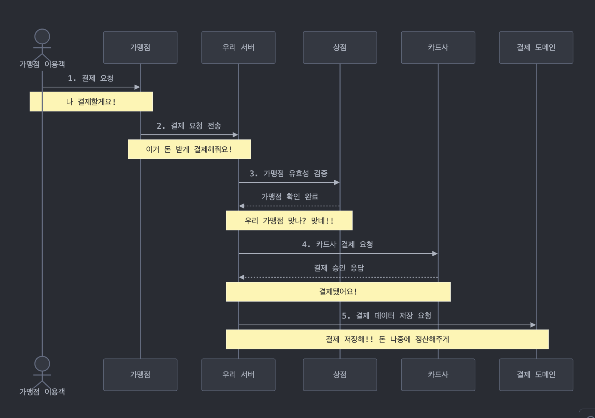

# 나는 연차에 걸맞은 개발자인가?

개발자로 만 3년을 채워 가며 드는 의문이 있었다.

**나는 이 연차에 걸맞는 개발자일까? 그리고 내가 가지고 있는 환경의 제약이 나의 성장을 막고 있는 것이 아닐까?**

**서버 개발을 본격적으로 시작하게 된 것은 INNER CIRCLE 과정 시작 시점에 있어서 1년이 조금 넘기 시작한 때**였다. 

기존에는 JSP 기반으로 개발을 배웠고(그때는 국비 과정에 스프링이 거의거의 없었다. 진짜임), 입사 후에는 iOS와 함께 채널 쪽 업무를 접근했다가… 

도메인 관점의 개발을 하고 싶어서 BE 중점의 개발자가 되기로 3년차 때에서야 의사결정했기 때문이었다. 

그리고 나는 **그것을 제대로 활용해 볼 수 없는 환경**에 있었다.

**SI라는 회사 특성**상, 그리고 금융이라는 업무 특성상 워터폴 방식을 통한 프로젝트 설계-완성 경험, 여러 프로그램을 접해 보며 다양한 환경을 직간접적으로 공부한 것은 많았다. 

사내에서 두 가지 프로그램을 설계하고 매니징하고 만들어 가면서 얻은 것들도 많았다.

그런데, “서버” 개발자로서 내가 이 연차에 걸맞는 사람이라고 주장할 수 있을까?

이것은 조금 다른 이야기였다.

# 마주친 공고


실제 진행해 보지 않은 것은 사실 일천한 이론에 불과하다고… 생각하고 있던 그때, **INNER CIRCLE 모집 공고**를 보았다.

**개발 3년차 이상을 대상으로 한 교육**에 대한 안내였다. 

**진태양 리더님께서 기술적 전문성 면에서 업계에서 뛰어난 분이라는 것을 이미 알고 있었기 때문에 프로그램 자체에 대한 믿음**이 있었다.

비롯하여 **유사한 3-4년차 서버 개발자들과 함께라면 배워갈 점이 정말 많을 거라는 생각**이 들었다. 

내가 가장 부족했던 **“경험”에 대한 이야기를 가장 옆에서** 들을 수 있을 것 같았다. 간만에 Hrd.net에 접속하고, 1-2차 지원서를 제출한 뒤 선발될 수 있었다.

지원서를 작성하면서 나는 어떠한 개발자가 되고 싶고, 어떠한 것들을 해 왔는지 쭉 정리하는 시간을 가졌다.

새삼 해 온 것이 있다는 생각도 들고… 또 막상 적으려고 보니 많지 않은 것 같아서 부끄럽기도 하고. 뽑히는 것을 생각했을 때는 많은 성장에 대한 기대를 하게 되기도 했다.

그리고… 선발이 되었다! 사실 그 당시에는 실력에 대한 부끄러움을 가지고 있기도 했고, 내가 제출한 경험이 임팩트가 작다고 생각해 큰 기대를 하지 않아서 그런지 더 기쁨이 컸던 것 같다.

과정은 크게 세 가지로 진행 되었다.

- **온보딩 프로젝트**
- **라이브러리 만들기**
- **팀 기반 프로젝트 구현**

# 온보딩 프로젝트


온보딩 프로젝트에서는 **구글 form이라는 동적 데이터를 정적 컬럼 기반인 RDB라는 구조** 안에서 구현하는 방법에 대해 접근하는 시간을 가졌다.

사실 요구사항을 들을 때만 해도 MongoDB로 하면 금방 아닌가..? 라고 생각하고 있었는데, 리더님이 그걸 읽으셨다는 듯이 그러면 당연히 너무 쉽다고, RDB로 해야 한다고 말씀하셨다. - -;;

## 온보딩 프로젝트 과정

최대한 효율적으로 설계하기 위해 노력한 결과, 여러 테이블이 맞물리게 설계되었다.

**요소가 여러 개가 있으니 설문지 자체에 대한 PK를 담은 테이블 → 설문 항목에 대한 테이블 → 설문 요소에 대한 테이블… 미친듯이 테이블이 꼬리를 물고** 늘어났다.

이걸 또 JPA를 사용하여 RDB 구조를 객체지향적으로 매핑하려다 보니, **객체지향 사고방식을 관계형 데이터베이스 모델에 맞게 변환하는 과정**이 **제법 고통스러운 일**임을 깨닫기도 했다.

## **결과 (얻게 된 것)**

구현을 어느 정도 마친 이후 듣게 된 피드백 과정에서 리더님은 **컬럼 개수를 대폭 늘리는 것도 하나의 방법**임을 조언해 주셨다. 

이 접근법은 내 복잡한 설계를 넘어서는 시각이었다. (다음 교육을 받으실 분들에게 스포일러가 될 수 있으니 여기까지만 적겠다.)

NPE에 대한 막연한 두려움을 가지고 있던 나는, 이게 자바적 사고방식 (ㅋㅋ) 일수도 있다고 생각하면서, 

**DB 컬럼을 늘리는 것이 반드시 안티 패턴은 아니라는 것을, 데이터에 `null`을 포함**하는 것도 **그렇게 두렵지 않은 일**임을 깨달을 수 있었다.

# 라이브러리 만들기


다음 섹션은 **라이브러리 만들기**였다.

라이브러리 활용이 아니라 만들기? 일단 생소했지만 접근을 시작했다.

## 라이브러리 만들기 **과정**

어떤 라이브러리를 만들까 고민하다가 **자바 21 안의 패턴 매칭을 자바 8에서도 수행해 줄 수 있는 라이브러리**를 만들기로 했다.

라이브러리 예시 중에 있기도 했고, **실제로 자바 21이 구현해 주었지만 아직도 점유율이 떨어지지 않은 자바 8에서는 불가능하니, 사용할 수 있게 만든다면 재미있는 경험**이 될 것 같기도 했다.


기능은 단순했다. 인스턴스를 인자로 넣고, 해당 인스턴스가 동일한 객체인지, 동일한 타입인지 등의 여부를 판단하여 그에 따라 행동을 해 주는 라이브러리.

우리는 보통 해당 기능을 구현하기 위해 아래와 같은 다중 if - else문이나 타입을 토대로 한 switch문을 사용한다.

```java
    if (type == "A") {
        playA();
    } else if (type == "B") {
        stopB();
    } else {
        defaultAction();
    }
```


```java
    match(타입)
        .with("A", () -> playA())
        .with("B", () -> stopB())
        .otherwise(() -> defaultAction());
```

보다시피 해당 "행위"를 반환하는 만큼 인자로 함수를 받아야 하는 것을 확인할 수 있다.

함수형 패러다임에 대해서 고민해 본 적은 있었고 실제로 몇 번 누군가 짜 둔 라이브러리를 통해 활용해 본 적은 있었으나, 

**실제로 행위를 인자로 연결한 뒤 그것을 이후에 수행하게 만드는 체이닝을 직접 구현(!)해 보는 것은 처음**이었다.

TS 패턴 매칭 라이브러리인 ts-pattern의 기능을 자바에서 똑같이 구현하는 것으로 목표를 잡고 시작하느라 불필요한 메서드가 생기는 등의 시행 착오가 있었으나…

## 라이브러리 만들기 **결과 (얻게 된 것)**


완성 후 **[PPT로 발표](https://github.com/kail-is/JPatternMatch/blob/main/JPatternMatchPPT.pdf)**도 하고, 실제로 **[Jitpack 배포](https://jitpack.io/#kail-is/JPatternMatch)**도 하고, 동료분의 코드 리뷰도 받아보는 과정에서 더욱 성장할 수 있는 기회를 얻었다.

**[코드 리뷰](https://github.com/kail-is/JPatternMatch/pull/6/files)**를 통해서 앞으로의 성장 방향을 더 잡을 수 있었으며,


**라이브러리를 실제로 배포해 보는 경험**도 매우 흥미로운 경험이었다.

(여러분도 사용해 보실 수 있으니 재밌어 보이신다면 한번 사용해 보고 따끔한 이슈를 남겨주시면 좋겠다.)

이 경험을 토대로 이후 **함수형 패러다임을 베이스로 한 라이브러리인 Resilience4j를 까 볼 때 더더욱 빠르게 접근**할 수 있었다. 

그들도 인자를 고차 함수로, _Runnable, Supplier, Callable_ 과 같은 여러 가지 인자로 받아서 run할 수 있도록 구성되어 있었다!

# 팀 기반 프로젝트 구현

이후 프로젝트 시간이 되었다. 도메인을 선택하는 옵션이 있어서, 나는 아무래도 금융을 하기 위해 개발을 시작한 사람인 만큼? 강경 핀테크파였다.

그리고 마주한 요구사항은… **PG 서비스를 만드는 것**이었다. 어라, 내가 생각해 왔던 것과 다르다. 카드사의 데이터를 가맹점에게 보내 준다고?

## 팀 기반 프로젝트 **과정**

업무 설계가 안 되니 도메인 설계부터 막혔다. **용어 선택의 어려움**을 정말 깊게 깨달았다.

가령 서버 개발을 할 때 Client라는 이야기를 자주 하게 되는데, 나는 얼마 전까지만 해도 서버가 아닌 **FE / APP 등에서 API 콜을 보내는 곳만을 클라이언트**라고 생각했다. 

(이제는 서버 이야기가 주가 되는 곳이라면 이 클라이언트가 “클라이언트 서버”로 쓰인다는 사실을 인지하고 있다.)

동일한 일이 업무 설계에서 일어났다. **<실제 결제를 하는 사람(가맹점 이용 고객) - PG 서비스를 이용해 결제를 받는 가맹점주 - PG 서버>라는 루트를 설계하는 것부터가 꽤나 시간을 잡아먹게 된 이후**였다. 

PG 서비스를 이용하는 주체가 나(가맹점 이용 고객)라고 생각해서 더 어려웠던 것 같다.


_[이미지 출처] : https://martinfowler.com/articles/headless-component.html_

프론트엔드의 요구사항도 어색했다. [헤드리스 컴포넌트?](https://martinfowler.com/articles/headless-component.html) 처음 보는 것들이 많았다. PG사 디바이스는 결국 카드 리더기 아닌가? 이러면서.

요구 사항을 토대로 기획이 되어 행위가 이미 정리되어 있는 글을 따라 구현해 본 경험이나, 실제로 요구사항을 내가 만들어서 구현해 본 경험 보유자인 나는 아예 **도메인 이해 후 설계에 대응해 보는 일이 낯설게 느껴졌다.**

하지만 **비즈니스 요구사항을 토대로 필요한 도메인을 분리**했고, 이 도메인 개수가 현재 개발을 진행하는 백엔드 개발자와 동일하게 나오는 것을 확인했다.

이 흐름을 타 DDD를 골자로 한 **MSA**(마이크로서비스 아키텍처)라는 의사결정을 하였고, 개개별로 API를 설계했다. 

(개발 과정에 대해 소개하는 글은 아니니 도메인 분리의 경우 이해를 위해 간략하게만 적고 넘어가겠다.)


- **고객** (고객은 N개의 상점을 가질 수 있다)
- **상점** (상점은 가맹점 이용객에게 결제를 받을 수 있고, 정산을 할 수 있다)
- **결제** (상점의 결제 데이터를 저장한다)
- **BFF** (가맹점 이용객이 실행한 결제에 대해 결제 도메인에 저장 요청을 한다)

# HA를 보장하며 쓴 글들

위의 과정에서 나는 **BFF**를 맡게 되었다. **BFF는 “요청”을 위주로 한 서버**였다.

**가맹점에서 요청을 받고 → 고객 맞나 확인하고 → 결제 후 → 데이터 저장까지 해 달라고 `요청하는 역할`**의 서버.



그럼 그냥 _서버들한테 요청 전달만 해 주는 거잖아?_ 라는 생각이 드는 서버라고 생각한다.

따라서 MSA 환경 안에서 이 **<요청 전달>** 이외의 것들을 어떤 식으로 보장하고 도울 수 있는지에 대한 고민 사항을 **HA, 고가용성**에 초점을 맞추면 좋을 것 같았다.

## 팀 기반 프로젝트 결과 1: 지평 확장

이를 토대로 **Retry / Caching / Resilient에 대한 공부를 비롯하여 구현**을 해 봄으로써 MSA 환경에서 발생할 수 있는 요청 수신 부하, API 통신 부하, 트랜잭션 이슈에 대해 고민해 볼 수 있었다.

또한 **라이브러리 까보기**를 토대로 탄력성에 대한 개발 히스토리에 대해 파악하고, 신규 라이브러리를 구상할 때 어떤 포인트를 짚어볼 수 있는지 확인해 볼 수 있었다.

- [HA 1: 유량 제어](./incerpay-ha-1)
- [HA 2-1: 호출 API 캐싱하기](./incerpay-ha-2-1)
- [HA 2-2: Key 인증 과정에서의 Pub-sub (Redis vs Kafka)](./incerpay-ha-2-2)
- [HA 3: MongoDB 캐싱](./incerpay-ha-3)
- [HA α: “API 실패”에 대응하는 방법 (Resilience4j / Netflix Hystrix)](./compare-resilience-lib)

더 자세한 이야기들에 대해서는 포스팅을 해 두었으니 심심한 분들은 들어가서 읽어주시고 코멘트도 달아 주신다면 큰 기쁨이 될 것 같다.

## 팀 기반 프로젝트 결과 2: 업무 도움

또한 프로젝트 경험을 토대로 얻은 것에 대해 추가로 한 가지 언급을 하고 넘어가자면.

얼마 전 *회사에서 주어진 모호하게 주어진 요구사항*에 대해서 **확장성 있는 설계**를 할 수 있었다.

> **트리거 포인트와 변동 지점을 파악**해,
**활용할 수 있는 메서드를 분리**하고 **요건 변경까지 고려**했다.

우선 **요구 사항이 상당히 모호**했다. 해당 부분이 가져오는 값의 출처만 적혀 있고 어떤 행위가 일어날 때 해당 값이 변동되는지 등의 내용은 전혀 적혀 있지 않았다.

또한 업무 요건을 토대로 추정해 보았을 때, 이럴 때 이게 바뀌게 도와 주세요~ 하는 **요건 변경이 분명히 나올 것 같았다.**

따라서 값이 어떤 상황에서 변경되어야 하는지를 **사용자의 행위**와 **서비스 내에서의 액션**으로 분리했다.

만약 **시점이 추가**되어야 한다면 해당 시점에 **대응하는 액션을 추가 할당**해 주거나, 

**액션이 추가**되어야 한다면 기존 액션 목록에서 **해당 액션만 더하는 식으로 추가**해 줄 수도 있을 것이다.

**이것도 간단하게 정리하면 다음과 같다.**


# 그래서요?

경험한 내용들을 전부 다 담아 보고 싶다 보니 이야기가 길어졌다.

그래서… 이 모든 경험들을 기반으로 무엇을 얻었냐 하면.

**나는 내가 꽤나 원하던 개발자가 되었다.**

음, 그래. 결론부터 말해 본다. 나는 과정 이후 확실히 내가 원하던 개발자의 모습과 가까워졌다.

내가 처음 INNER CIRCLE 지원서를 작성하면서 남겨 두었던 이야기가 있다.

**어떤 개발자가 되고 싶냐는 질문.** 나는 내가 가진 **철학**을 이야기했다.

**개발이라는 1의 투자를 통해 N의 가치**를 주는 일.

그리고 누구에게나 균등한 SW의 특성에 따라, 효율적이고 풍부한 가치를 얻을 수 있도록 교두보가 되는 것.

그런데 **지향점으로 나아가는 데 있어서 방법이 없다면 그것은 허황된 꿈**이 된다.

`필요한 것은 배와 노 같은 이동할 수 있는 이동 수단.`

- **더 많은 사람들에게 베풀기 위한 트래픽을 감당할 수 있는 개발자**
- **도메인 적합도를 발휘할 수 있는 개발자**

나에게는 이 두 가지가 지향점에 다가가기 위한 이동 수단이자 하나의 마일스톤이었다.

## 되고 싶었던 개발자?

나는,

- **서버 개발을 하면서 로직을 파악하고 설계할 수 있는 개발자**가 되기를 원했다.
- **기술 도입에 있어 트레이드 오프를 파악하는 개발자**가 되기를 원했다.
- **비전공자라는 타이틀에 갇히지 않는 개발자**가 되기를 원했다.
- 추상화된 **라이브러리를 사용하는 것이 아니라 그것을 실제로 개발하고, 내부 로직을 까 보면서 원리와 기능을 파악할 수 있는 개발자**가 되기를 원했다.
- 세상에 퍼져 있는 개발 이야기에 **“모른다”고 주눅들지 않는 개발자**가 되기를 원했다.

그리고… 동시에 **SW라는 구심점을 가진 회사 안에서 SW 엔지니어링 패러다임에 대해 이해할 줄 모르는 부끄러운 조직원**이 되고 싶지는 않았다.

그리고 위에서 이야기했던 과정을 통한 성장으로, 나는 그것들을 컨트롤할 수 있는 개발자가 되었다.


## 지원과 합격

비롯해서, 합격.

기존 나는 서버 개발에 대한 두려움을 / 지원에 대한 어려움을 가지고 있었고, 서류 합격이 떨어지는 것을 "나의 부족함"이라고 여기고 있었다.

우선 금융 SI 특성상 매우 레거시한 것을 개발하게 되고, 그게 서버 개발자로서의 역량에 적합하다는 증빙이 되기 어렵다고 생각했기 때문이다.

이 생각을 증명하는 것처럼 **처음에는 서류가 무수히 많이 떨어지는 경험**을 했다.

하지만 **멘토링에서 나왔던 조언들을 바탕으로 이력서를 재구성**하고, **INNER CIRCLE 프로젝트 중 경험했던 개발적인 부분**들과 함께,

**내가 가진 경험을 어떻게 적용했는지, 그것이 어떤 결과를 가져왔는지**를 적어 본 뒤 이력서 재지원을 시작했다.

이후 **3주** 내로 **4곳의 스타트업 기술 과제 및 면접 합격 / 1곳의 스타트업 최종 합격 / 시리즈 C 스타트업 미팅 제의**를 받을 수 있었다.

모두 백엔드 엔지니어, 내 경력에 맞는 지원처였다.

특히 해당 기간 내에는 들어가지 않았지만, **판교 테크노밸리 기업 서류 합격**이 주는 만족감이 컸는데,  

**개발자로서 내 경력이 무의미하지 않다는 것을 증명**했다는 생각이 들었다.

특히 합격한 회사는 굉장히 가고 싶었고, 시리즈 C 스타트업도 협업하고 싶은 마음이 컸는데... 

현재 회사에서 카카오뱅크 투입 핵심 인원으로 배정되어 나오게 됨으로써 해당 회사들과 함께할 수는 없었던 것이 아직까지도 아쉬운 부분이다.

(왜 사람의 몸은 한 개인지 모르겠다.)


**또한 이번 과정을 토대로, 개발이 아닌 부분에 있어서도 많은 것들을 얻어 갈 수 있었다.**

# 다른 개발자들과의 이야기, 간접 경험

사실 비전공으로 개발을 하다 보면 **다른 개발자들과 만날 수 있는 경험은 뛰어다녀야 얻을 수 있는 것**이 된다.

그것도 스터디 등의 목적을 가지고 진행한다면 간헐적으로 만나는 만큼 현재 상황에 대한 스몰톡보다는 목적 위주의 이야기가 될 확률이 높다.

그래서 꾸준히 소통하고 이야기해 볼 수 있는 시간을 이번에야 가지게 되었는데, 세상에는 정말 많고 다양한 개발자와 조직이 있다는 것을 이번에 깊게 깨달았다.

**특정 회사에서 어떤 비즈니스적 고민을 하고 있는지, 어떤 식으로 개발 조직이 구성되어 있는지, 무엇을 사업 방향으로 추구하면서 나아가고 싶어 하는지.**

그 **모든 것들을 비슷한 연차의 개발자들과 나누면서 우리 회사와 얼마나 다른지 생각**해 볼 수 있었다.

여기에 직접적으로 적어 볼 수는 없지만, 내가 접해보지 못했던 솔루션이나 인하우스 개발자들의 이야기, 기업 규모에 따른 이야기, 

도메인을 이유로 달라지는 조직 문화 사이에서 느끼는 고충 이야기를 들으며 어떤 방식으로 개발을 해 나갈 수 있는지 간접적으로 경험해 볼 수 있던 좋은 경험이었다.

# 관점이 다른 조직에 머무르며

포함된 조직 안에서 "다르다"는 기분을 느껴본 적이 있는지?

사실 나는 SI에 머무르다 보면 종종 벽을 만나게 됐다.

_성장하는 것에 관심을 두기보다 **결과물에 중점**을 두는 상황, 개발에 있어 **공통화를 고민하지 않는** 상황, 레거시한 작업 환경에서 오는 업무 비효율._ 

_**관료주의**로 인해 프로그램에 대한 나의 주장이 귀기울여지지 않는 경험, **원청과 회사** 사이의 정산 관리…_

**그 모든 것이 틀렸다고 생각하지는 않는다. 이것이 비단 SI에서만 일어나는 일이라고도 생각하지 않는다.**

_성장보다 **일상을 원하는 것도 개인의 선택**이다. 레거시한 작업 환경에서 시스템이 안정적으로 돌아가고 있다면 그 **안정성을 토대로 기반을 다져나가는 것도 조직의 선택**이다._ 

_공통화를 고민하지 않는 것은 **급한 일정**에 따른 효율적 선택일 수도 있다._

_관료주의 사회는 한국의 문제일 수도 있다. 원청과 회사 사이의 관계는 B2B 사업체와도, B2C 소비자 관계에서도 일어나는 일일 수 있다._

**그러나 그들의 길과 나의 길이 많이 다를 수 있다는 것은 이번에 INNER CIRCLE을 진행하면서 많이 깨닫게 되었다.**

**`추구하는 방향점이라는 게 가장 중요하다는 것.`**

함께 갈 수 있다는 것은 이 지향점이 맞을 때 서로를 북돋으며 가능하고, 그것을 함께하고 이끌어가도록 돕는 일이 조직원의 역량이라는 것.

그에 따라 **조직에게 걸맞는 방식**이라는 것이 있다는 것. 

그것에 대한 개선 의지가 존재하는지 아니고의 여부는 내가 바꿀 수 없는 것이며, **이것을 해내고자 하는 노력 자체가 실제 해당 조직을 플러스로 만드는지 돌이켜 보아야 한다는 것.**

**지향점이 맞는 조직과 / 시니어와 이야기하고 일하는 일**이 나에게 꽤 만족감을 주는 일이란 것을 깨달았다.

나는 사실 조직을 바꾸려고 했던 사람이었고, 많은 것을 전파하려고 했다. 우리 회사는 나에게 애정이 있는 공간이었고, 그런 곳이 더 내가 생각하기에 좋은 방향으로 가기를 원했다. 

나는 내가 처음 나열한 것의 역이 좋은 방향이라고 생각했고, 그래서 그것들을 우리 조직에 심고 싶었다.

그런데, 이것은 해당 조직에게는 맞지 않은 방식의 기여였던 것일까, 하는 생각이 들었다.

**어쩌면 나는 조직에게 맞지 않는 방식을 기여하고 있지 않았나? 이번 경험을 통해 돌이켜 보게 되었다.**

만약 나와 같은 벽을 느끼시는 분이 있다면, 이러한 집단과 함께 개발을 해 나가고 고민을 개진해가는 과정 안에서, 

기존 회사에서 가져가지 못했던 안정감을 얻을 수 있을 것이라 생각한다.


# 여담

세상에는 여러 가지 성장의 방법이 있다.

혼자 무언가를 헤쳐나갈 수도 있고, 좋은 멘토를 만날 수도 있고, 괜찮은 팀과 함께해가며 프로젝트를 진행해 갈 수도 있다.

**혼자 진행하는 것의 장점**이라고 한다면 시간의 제약이 없고, 자유도가 높아 원하는 것을 내가 원하는 시간에 맞춰서 이뤄 볼 수 있다는 것이 아닐까.

혼자 하는 것이 돈이나 시간을 아끼는 길로 느껴지기도 한다. 이런 교육을 듣는 일이, 이런 프로젝트를 하는 일이 나한테 이만큼의 효율을 가져다 줄까? 하는 질문이 들기 때문에. 

그런데 사실 **내가 생각하는 프로그래밍은 지난한 삽질의 길**이다.

그리고 **프로그램을 함께 진행하는 것의, 멘토링을 거쳐나가는 과정에서 얻을 수 있는 것은 “든든함”과 “경험”을 통한 삽질 효율**이라고 생각한다.

## 든든함, 그리고 효율적인 삽질 방법

**누군가와 함께 진행한다는 것**은 생각보다 든든한 일이다. 혼자 했다면 그냥 치워버리고, 대충하고 끝낼 법한 일도 함께 할 때는 생각보다 꼼꼼해진다. 

가장 두렵다고 여겨지는 팀원과의 트러블조차도 그들과 나의 욕구를 조율하는 과정에서 성장의 포인트가 된다.

**또한… 멘토링.** 

누군가의 성장 지점을 배워 가는 과정에서 얻어갈 수 있는 효율은 어마어마하다는 생각이 들었다.

**멘토님들께 궁금했던 많은 것들을 질문했고, 그 질문에서 나오는 키워드를 통해 다시 찾아본 다음 이후에 다시 질문드리는 방식을 토대로 내가 몰랐던 것들의 그물을 단단하게 만드는 작업**을 진행할 수 있었다.

**내가 주로 얻은 것들은 크게 다섯 가지였다.**

* 코드 방식의 조언
* 아키텍처 방식에서의 조언
* 현 회사 내 개발 진행 방향에 대한 조언: 사내에서 풀지 못하는 질문들
* 개발자로서의 성장 방향에 대한 조언
* 임파워링


라이브러리 코드와 지향하고자 하는 포인트에 대해서 조언을 아끼지 않아 주시던 **태양 리더님**, 

프론트엔드 쪽에서 질문할 것이 있다면 얼마든지 불러 달라고 문을 열어 주시던, ZEP에서 든든하게 함께해 주시던 **태곤 리더님**,

1-2주마다 참여하는 개발 밋업에서 언제나 질문하는 것들을 토대로 핵심을 짚어 주시고 공부할 수 있는 각종 키워드를 주셨던 **C 멘토님**,

마지막 멘토링 때 주어진 시간보다 더 오랜 시간 대화해 주시며 큰 자신감을 안겨 주셨던 **하람 멘토님(ㅎㅎ)**께 감사의 말씀을 전하고 싶다. 

덕분에 이력서를 넣을 때도, 면접을 다녀올 때도 내 자신에 대한 믿음을 가질 수 있었다.

또 좋은 과정 마련해 주시고 일심양면 뛰어 주시던 *박영준 매니저님과 서지훈 매니저님을 비롯한 패스트 캠퍼스 담당자 분*들께 감사하다.

과정이 마무리된 지금도 **1기 분들과 꾸준히 소통**하고 있는데, **비슷한 연차의-비슷한 고민을 지니고 있을 든든한 커뮤니티**를 한 곳 얻은 것 같아서 마음이 뜨끈하기도 하다.


## 우수 수료생 선정

**INNER CIRCLE은 BE / FE / 기획 / UXUI 과정당 1명의 MVP / 1명의 우수 수료생**이 선정된다.

즉 MVP 1명, 우수 수료생 1명으로 총 8명이 선정되는 것이다.

내가 속한 BE 파트에서도 이 부분은 동일하게 적용되어, 마지막 **오프라인 수료식 날 해당 부분이 발표**되었다.

MVP는 모두 예상한 분들이 나오셔서 당연하다고 고개를 끄덕이면서 축하드리고 있었다.

그런데 우수 수료생 선정을 이야기하실 때... 


내 이름이 나왔다?


사실 전혀 기대하지 않았던 것이어서 조금 놀랐다. 더 많이 노력하신 분들이 있을 텐데, 하는 생각도 들었고.

동시에 **내가 노력해 나갔던 것에 대한 부분**에 대해서 **업계 내 수년간의 개발 경험과 전문성이 있는 분이 인정해 주신다**는 것이 너무나 감사했다.

**우수 수료생에게 주어지는 특전(?)으로, 리더님의 코멘트가 링크드인에 달리는 것이 있었다.**


나는 태양 리더님께 코멘트를 받았는데, 종종 링크드인을 접속해 볼 때마다 훈장을 얻은 것마냥 마음이 든든해진다.

해당 코멘트를 발판 삼아서, 더 내 이상에 걸맞은. 그 가치를 기여하는 개발자가 되기로 다짐해 본다.


---

지금까지 내가 INNER CIRCLE이라는 과정을 어떻게 밟아 왔는지, 그를 토대로 얻은 것들은 무엇인지 이야기해 보았다.

이번 글 제목에서 **나는 성장의 과정에서 좋은 집단은 곱하기가 된다**고 이야기했다.

**내가 넣는 1의 노력은 다른 분들의 조언과 경험을 통해 곱해졌고 지금과 같은 성과를 얻어갈 수 있었다**고 생각한다.

이 글을 읽는 다른 분들도 자신에게 적절한 성장의 방법을 찾아 도약하실 수 있기를 기원해 본다.