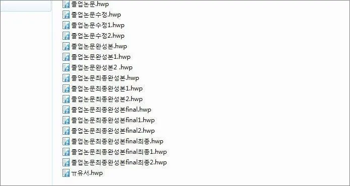
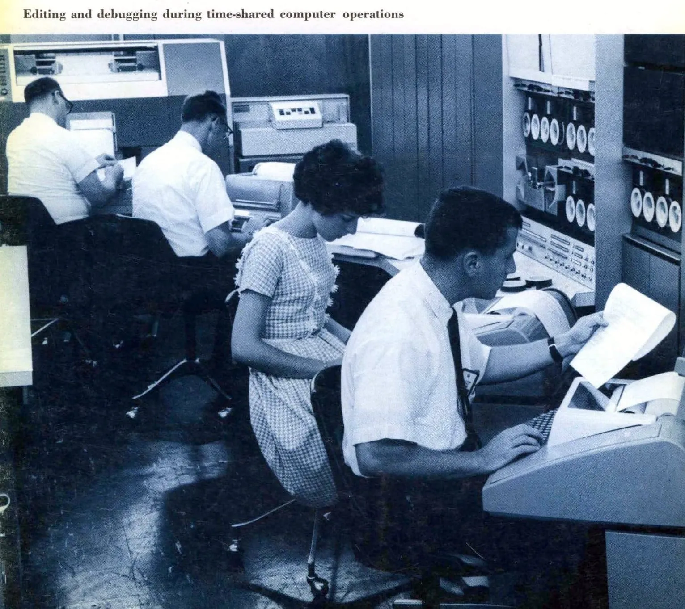
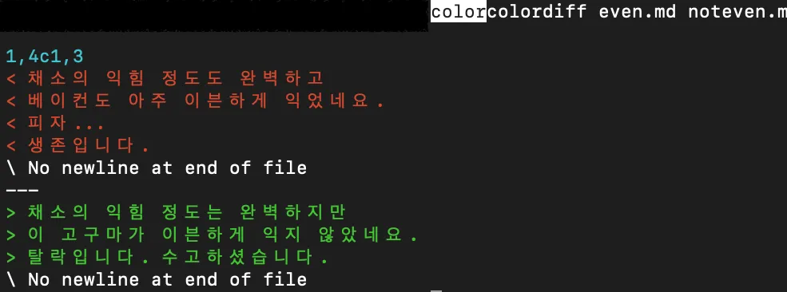
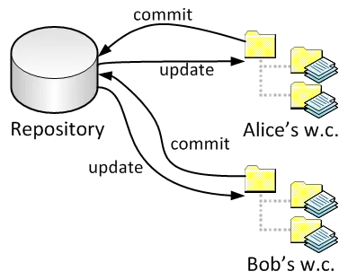
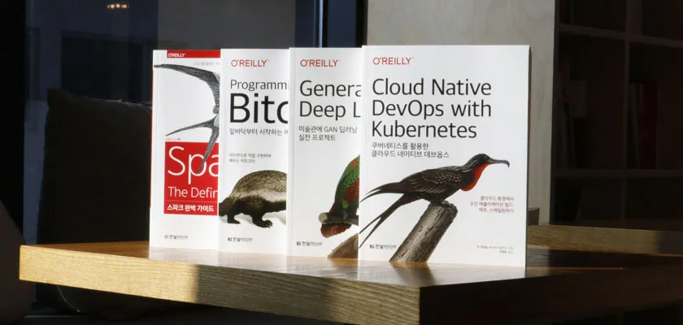
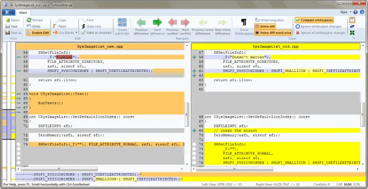
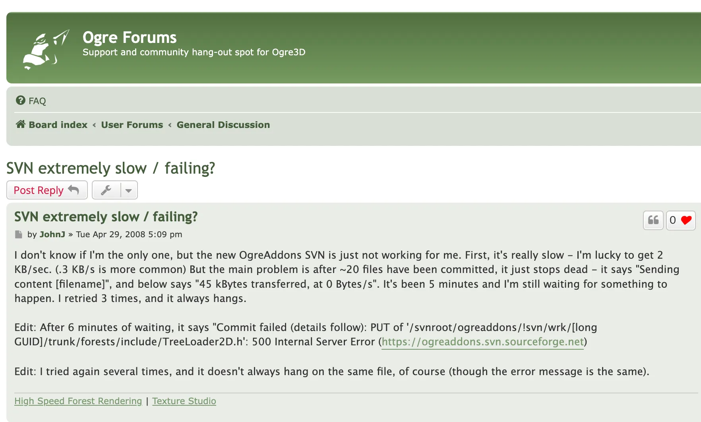
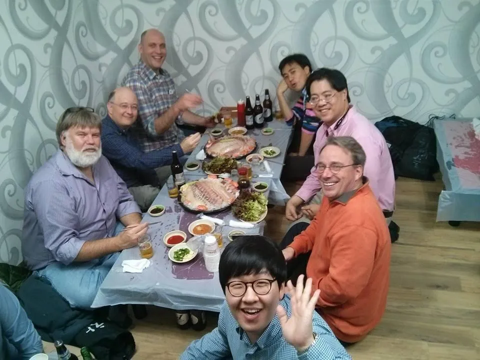
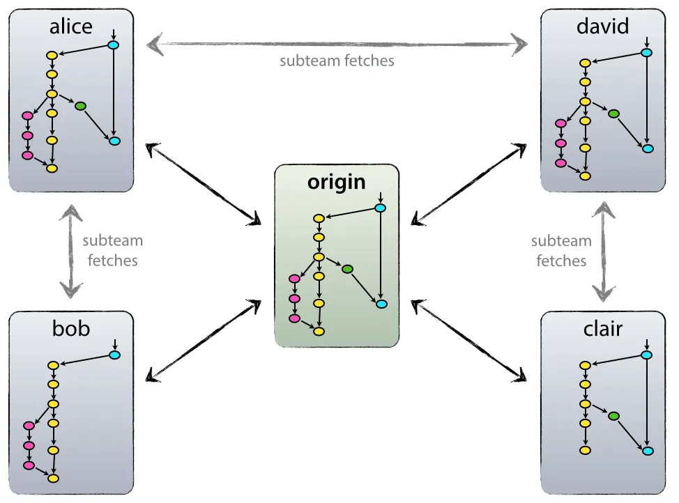
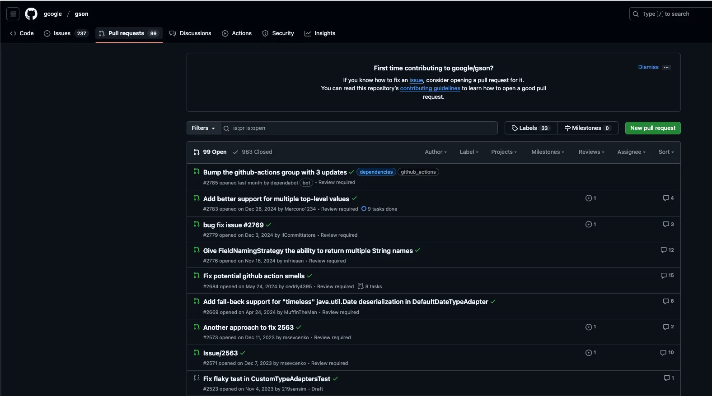

최근 우연찮은 기회로 **분산 버전 관리 시스템을 부담스러워 하는 분**들을 만나게 됐다.

그런 분들께 분산 버전 관리의 이점에 대해 설명해드리는 과정에서, **나도 관성적으로 Git이라는 형상 관리 방법론을 사용하고 있었나?**

**어떠한 장점이 있길래 중앙 집중형에 비해 인기있어졌을까?** 하는 생각이 들었다.

물론 프로젝트를 나가서 **거북이 툴로 SVN**도 사용해 보았고, 형상 관리가 국비 지원에서 보편적인 개념이 아닐 때 (그럴때가 있었습니다) 

**zip으로 공유해서 프로젝트 소스코드를 관리**하는 ㅋㅋㅋ 모습도 꽤나 봤던 것이었기 때문에… 나의 역사를 그대로 밟아온 분들이 Git을 만들지 않았겠는가? 하는 생각도 들었고.

**소프트웨어 형상 관리의 역사**를 토대로 **어떤 흐름을 가지고 발전**했으며 **어떠한 장점**을 가지고 있고,

**어떤 상황에서 활용**될 수 있는지, 그리고 이후에는 **어떤 식으로 변화해 가는지**에 대해 한번 톺아 보는 시간을 가져 보고자 한다.

# 형상 관리의 등장

소프트웨어 개발에서 형상 관리가 중요해진 것은 언제부터였을까?

우선 여러 명이 동일한 프로그램을 개발하기 시작하면서부터… 일 것이다.

그리고 아마도 그건 컴퓨터라는 제품이 점점 규모를 더해갈 무렵일 것이다.

**운영체제도 하나의 프로그램이니까!**

1960년대 후반, IBM을 비롯한 컴퓨터 제작 기업들은 늘어나는 OS 소스의 관리를 위해 체계적인 방법을 찾기 시작했다고 한다.

처음에는 **수작업으로 백업하고 문서화하는 것이 일반적**이었으나, 프로젝트 규모가 커지고 복잡도가 증가하면서 자동화된 도구의 필요성이 대두되었다. ~~(위 짤만 봐도 알겠죠?)~~

특히 **IBM의 OS/360 개발 과정에서 발생한 여러 문제점**들을 토대로, 이 **프로젝트의 책임자**는 느낀 점에 대해서 이것저것 적어 두었다.

이 책에서 처음으로 **형상 관리라는 개념에 대한 언급**이 나오게 되고, 그 이론적 베이스를 토대로 형상 관리가 발전하게 된다.

그리고 이건 **소프트웨어 분야의 엄청난 고전**이 되는데… 아마 읽어 보셨을 수도 있겠다.

바로 **맨먼스 미신(The Mythical Man-Month)**이다.

> (이 책에서 나오는 가장 유명한 ㅎㅎ 격언은 아마도…  
> *__No Silver Bullet, 은탄환은 없다__*__.__  
> 일 것이다.)

컴퓨터, SW의 발전과 함께 점점 틀이 요구되던 형상 관리 방식은 **Unix 유틸리티 중 한 가지의 등장으로 새로운 국면**을 맞게 된다.

혹시 **diff 명령어를 리눅스에서 사용**해 본 적이 있는지?

Unix에서 해당 유틸리티가 만들어지면서 **"텍스트 파일의 비교"**라는 개념이 처음으로 제시되었다고 한다.

우와, 이제 **파일 비교가 비교적 쉬워졌다.**

인간이 한 땀 한 땀 비교하면서 뭐가 다른지 확인할 필요가 없어졌다!

**그런데 내가 A라고 수정한 파일을, 소스를, 누가 그 사이에 바꿔버렸다면?**

Diff 명령어가 분명 같은 코드로 보이는데도 그냥 아예 빨간 줄을 죽죽 뱉는다면?

끔찍한 상황이 벌어진다……..

## **1세대**: 파일 잠금 방식

이에 따라 **파일을 선점하는 방식**이 시작된다.

**1970~80년대의 초창기 형상 관리 시스템은 기본적인 파일 잠금 방식으로 동작**했다고 한다.

아까 이야기했던, 누군가 내 파일을 수정해 버리는 바람에 또 한번 더 diff 명령어를 비교하고, 다시 처리하는 방식을 간소화하기 위함이었다.

이 시스템들은 충돌을 방지하기 위해 **딱 한 번에 한 명의 사용자만 파일을 편집**할 수 있도록 했다.

동시에 1970년대 벨 연구소에서 **파일 단위의 버전 관리(SCCS)**가 등장하면서, **변경 이력까지 추적하며 이전 버전으로의 복구**가 가능해졌다고 한다.

내가 예전에 수정한 버전을 돌아볼 수 있게 된 것이다. ~~(scss가 아니다.)~~

그래, 파일 하나를 꽉 쥐고 있기 때문에, 아무도 내 파일을 수정할 수 없게 된다는 점은 좋은데…

**그럼 내 파일 안에 있는 다른 코드를 수정하고 싶은 사람은 어떻게 하지?**

그리고 이때는 코드가 몇천 줄을 넘어가는 것도 예사였다고 한다. (듣기로는 꽤 근래까지도 그랬다고 한다.)

**몇천 줄 중에서 다른 사람이 자신의 작업을 위해 2줄을 수정하려면, 점유한 다른 사람이 그 파일을 놔줄 때까지 기다려야 하는 것이다.**

음… 파일에 대한 깔끔함은 보장됐지만, 작업의 효율성이 떨어져 버렸다.

## **2세대: 중앙집중형 시스템**

더는 견디지 못한 개발자들은 결국 새로운 시스템을 개발하기에 이른다.

**1990년, CVS와 SVN이 등장한 것이다.**

**CVS**, Concurrent Versions System의 약자인 이 형상 관리 시스템은 **파일을 수정하는 데 있어**서 싱글 프로세스로 ㅋㅋ 작업하는 것이 아니라, 

**병렬적으로 처리할 수 있도록 편집 권한을 오픈**해 두었다. *(;; 아니, 개발자 농담 아니다. 얘 이름이 진짜 Concurrent다.)*

**SVN,** Subversion은 **CVS의 한계를 개선**하기 위해 **2000년**에 등장했다.

음. 이제 좀 익숙한 이름이 등장했다.

SVN은 파일 하나에 대한 병렬성만을 보장하는 게 아니라, **디렉토리 관점에서 실제로 파일이 어디 있다가 이동**했는지도 형상 관리에 담았다.

그리고 **Commit을 분할할 수 없도록 했다.**

커밋을 분할할 수 없다? 파일 단위로 적용하는 것이 아니라 **"커밋" 단위로 반영**을 마치는 것이다.

이를 **원자적 커밋**이라고 부르는데, _특정 파일은 바뀌었고 / 어떤 파일은 바뀌지 않은 상태를 방지_하게 된다.

(여담으로 SVN은 CollabNet이라는 회사에서 만들어졌는데, 이 회사를 설립한 사람이 그 유명한 *팀 오라일리Tim O'Reilly*다. 개발자라면 표지에 열심히 동물을 그려 주는 출판사를 알 것이다.)

또한 **중앙 서버를 통해 변경 사항을 관리**했다.

**하나의 서버에 파일의 버전, 커밋의 버전을 전체** 올려 두고, 해당 서버와 함께 **내 로컬 코드를 비교**하는 식으로 동작하는 것이다.

이때부터 나오는 농담 중 하나가 "**커밋은 선X**"이다.

컨플릿이 없는 코드는 스무스하게 바로 커밋을 할 수 있다.

그런데 겹치는 코드가 생긴다면? **뒤에 커밋을 시도하는 사람이 코드에 대한 비교**를 시작한다.

기존 작성한 사람을 찾아가서, **이 버전을 이렇게 수정해도 되는 것인지** 물어봐야 한다.

동시에 모든 것을 정리하고 **커밋을 하는 순간 내 이름**이 박히게 된다.

**마지막 커밋 수정에 대한 책임**을 지게 되는 것이다.

그런데 **중앙 서버를 토대로 변경 사항을 관리**한다고? 모든 데이터가 중앙 서버에 들어가 있다는 이야기이다.

**해당 중앙 서버가 망가져 버리면** 어떻게 할까? 

백업이 제대로 되어있지 않은 상태에서 서버가 망가지면, 모든 버전 관리 기록과 최신 코드를 잃을 수 있다.

내가 갑자기 **해외로 나가는 바람에 서버에 접속하는 데 있어서 오랜 시간**이 걸린다면? 

지금도, 그렇게 네트워크 환경이 빠르고 좋다는 한국에서조차 프록시를 토대로 무언가 작업하려고 하면 오랜 시간이 걸리는데, 심지어 2000년대였다면 어땠을까?

또한 브랜치 생성과 병합이 무거웠다고 한다. SVN에서 브랜치를 만들면 **원격 서버에 전체 소스코드를 복사하는 것**과 같았기 때문에 개발자들은 브랜치 사용을 꺼리게 되었다.

특히 **오픈소스 프로젝트가 성장**하면서, 전 세계 개발자들이 자유롭게 협업할 수 있는 새로운 형태의 버전 관리 시스템이 필요해졌다. 

오픈 소스를 중앙 서버에 놓은 뒤 형상 관리 하는 식으로 진행하게 되면 **원격 서버 관리 비용을 누가 감당할 것인지… 등의 문제**가 발생할 테니까.

우선, 다른 것보다, **관리하는 서버의 소스코드가 커지면 커질수록 SVN이 느려지는 현상**이 가장 강력했다.

이는 **3세대 분산 버전 관리 시스템의 탄생**으로 이어졌다.

## **3세대: 분산 버전 관리 시스템**

2000년대에는 **Git과 Mercurial과 같은 분산 버전 관리 시스템이 도입**되었다.

최초로 분산 개발 시스템이 **본격적으로 SW로써 자리잡은 것은 BitKeeper였다.**

이 소프트웨어 툴은 **BitMover**라는 회사에서 만든 것이었는데, BitKeeper는 대용량 프로그램에도 사용될 수 있을 정도로 자리잡게 된다.

그러나 BitKeeper의 영광은 그렇게 오래 가지 못했다.

**리눅스의 창시자인 리누스 토발즈**는 2005년, SVN의 한계에 지친 상태였다고 한다.

SVN에서는 브랜치를 만들 때마다 **중앙 서버에 전체 소스코드를 복사**해야 했다. 리눅스 커널처럼 거대한 프로젝트에서는 이런 방식이 치명적이었다.

또한 **전체 이력을 중앙 서버에서 관리**하면 서버에 문제가 생길 경우 모든 개발이 중단될 수밖에 없었다.

이러한 의견에 따라 상기되었던 **BitKeeper라는** 분산 버전 관리 상용 툴을 사용하던 토발즈는 BitKeeper와 다툼을 벌이게 된다.

원래 **BitKeeper는 리눅스와 같은 오픈 소스 한정으로 무료 개발을 할 수 있도록 열어 주고 있었는데,**

**BitKeeper가 더 이상 오픈 소스 또한 무료 사용이 불가능하다**면서 선을 긋게 된 것이다.

**이에 화가 났던 토발즈는 Git 개발을 시작했고, 초안을 약 10일만에 완성했다. (엥?)**

~~BitKeeper는 그렇게 자기랑 싸우던 게 누군지도 모르고 덤볐다가 역사 속으로 바스라졌다….~~

### Git의 등장 (드디어)

Git은 **중앙 집중형으로 서버에 소스를 보관하는 방식을 제거**했다. 이제 더 이상 중앙 서버는 필요하지 않다.

그리고 개발자의 **로컬 환경에 전체 이력을 복제**한 뒤, 브랜치는 **단순한 포인터로 관리**한다.

Java 개발자 입장에서 보면 마치 Spring이 EJB의 복잡성에 질려서 만들어진 것처럼, Git도 비슷한 배경에서 탄생하게 된 것이다.

현재 모두가 쓰고 있어서 알겠지만, Git은 **GitHub / GitLab등의 솔루션을 토대로 아주 공고한 입지**를 다지고 있다.

Git 브랜치를 처음 공부하다 보면 많이 보는 이 그림은 Vincent Driessen이 2010년에 제시한, **Git-Flow라는 Git 브랜치 전략**이다. 해당 전략은 사실상 현대 프로그램 개발에 있어서 표준이 되었다.

또한 **Pull Request 기반 협업**은 각종 오픈소스에서도 알 수 있듯이 **전 세계 개발자들의 기본 작업 방식**이 되었다.

[Git의 역사에 대해 재미있는 만화](https://joone.net/2022/10/02/47-git/)를 만들어 주신 분이 있어서 추가해 본다. ㅎㅎ

## 중앙 집중형은 "구 세대"의 방식인가?

1960년부터 지금까지, 약 60년의 역사를 돌아왔다. 길었죠?

사실 우리의 글 목적은 초입에 이야기했던, **"왜 중앙 집중형보다 분산 버전 관리 시스템을 선택해야 하는가?"**에 대한 필요성과 그에 대한 비교였다.

분산형 버전 관리 시스템의 장점은 명확하다. 개발자가 로컬에서 완전한 저장소를 가지고 작업할 수 있어 **네트워크 연결 없이도 커밋, 브랜치, 머지 등 모든 작업이 가능**하다.

브랜치와 머지 작업이 로컬에서 이루어져 매우 빠르며, 또한 모든 개발자가 전체 저장소의 복사본을 가지고 있어 서버 장애가 발생하더라도 쉽게 복구가 가능하다는 안전성도 갖추고 있다.

| 기준 | Git | SVN/Perforce |
|------|-----|--------------|
| **네트워크** | 오프라인 작업 가능 | 항상 연결 필요 |
| **속도** | 브랜치/머지 빠름 | 중앙 서버 거쳐야 함 |
| **대용량 파일** | 전체 이력 복제로 비효율 | 효율적인 관리 가능 |
| **학습 난이도** | 개념 이해 필요 | 직관적이고 단순 |
| **활용** | 일반적인 개발 | 게임/하드웨어 개발 |

반면 **중앙집중형 시스템도 특정 상황에서 장점**이 있다. **모든 변경사항이 중앙 서버를 통과**해야 하므로 엄격한 접근 제어와 감사가 가능하다.

특히 **대용량 바이너리 파일을 다룰 때는 전체 이력을 복제할 필요가 없어 효율적**이다. 개념이 직관적이라 학습 곡선이 낮고, 기존 기업의 보안 정책과도 잘 맞는다.

실제로 **게임 개발에서는 대용량 에셋 파일 동기화 시간을 줄이기 위해 Perforce를 많이 사용**하고 있으며, **학습 비용이 소프트웨어 개발 속도에 영향을 미치는 경우에도 사용**이 되고 있다고 한다.

사실 이 이야기를 듣고 나서 이 긴 여정을 시작했다. ㅎㅎ

> **아직도 중앙 집중형 시스템을 택하는 곳이 있다**는 이야기.

즉, 특정 환경에서는 **"분산 관리 시스템을 채택하는 것이 비효율"인 것**이다.

오히려 분산 관리 시스템을 선택하는 일이 복잡성을 가중할 수도 있다는 이야기.

*그러나 그런 환경이 아니라면.*

대용량 애셋 관리가 필요한 환경이 아니라면, 학습 비용을 충분히 감당할 수 있는 구성원이라면.

**분산 관리 시스템을 선택하는 것은 훨씬 더 효율적인 선택**이 될 것이다.

(현재는 게임 개발 시에도 Git을 사용하는 곳이 훨씬 많으며, Perforce에 git을 연동해서 사용할 수 있기도 하다고.)

## 앞으로는?

SVN이 2000년대에 등장했다는 사실을 알고 나서 많이 놀랐는데, 당장 20년 전이었다는 사실이 그다지 믿기지 않았다. 나는 90년대쯤일 줄 알았기 때문에…

당장 2010년도에 넷플릭스에서 MSA가 나온 걸 보면 SW 시장이 얼마나 빠른 시간 안에 여러 발전을 거쳤는지 알 수 있는 대목이었다.

현재 형상 관리는 단순히 소스 코드를 관리하는 것을 넘어, DevOps와 CI/CD의 핵심 요소로 자리 잡고 있기도 하다.

파이프라인 등을 토대로 자동화를 하기도 하고, 배포 시의 사용자 시점까지 고려하는 식의 발전(무중단 배포)을 거듭하고 있다.

이 속도라면 5년, 10년 뒤에는 또 한 번 패러다임을 바꾸는 형상 관리론이 나올 수도 있지 않을까?

나는 현재 로봇이 코드 리뷰를 해 주는 것처럼 형상 관리에도 AI가 도입되어 현재 서비스에 더 적합한 방식을 추천하고 제안하는 형식으로 발전하지 않을까… 상상해 보았다.

다른 분들은 형상 관리가 어떤 식으로 발전할 것이라고 생각하는지, 여태껏 회사에서 겪어왔던 형상 관리 도중의 이슈는 없었는지 의견을 들어보고 싶다.

---

**[자료 출처]**

https://ericsink.com/vcbe/html/history_of_version_control.html

https://en.wikipedia.org/wiki/The_Mythical_Man-Month

https://en.wikipedia.org/wiki/History_of_IBM_mainframe_operating_systems

https://www.ibm.com/docs/ko/aix/7.2?topic=s-sccs-command

https://www.nongnu.org/cvs/

https://en.wikipedia.org/wiki/SourceForge#History

리눅스 토발즈: https://lkml.org/lkml/2005/4/6/121