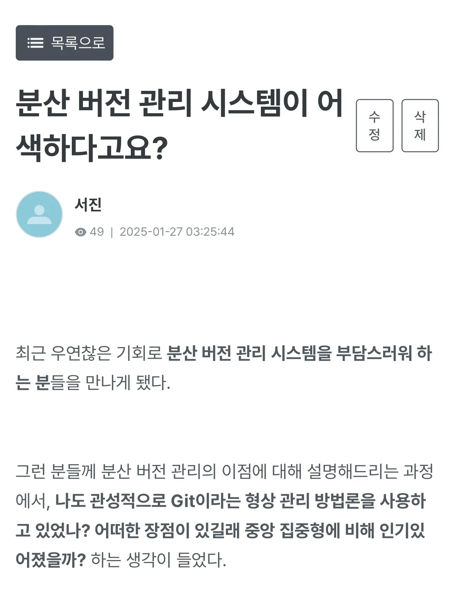
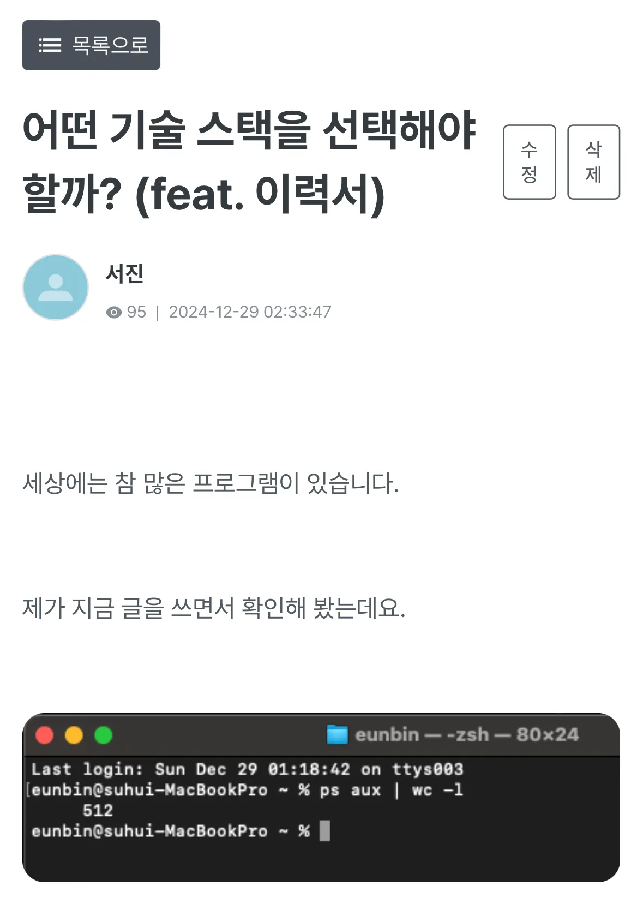
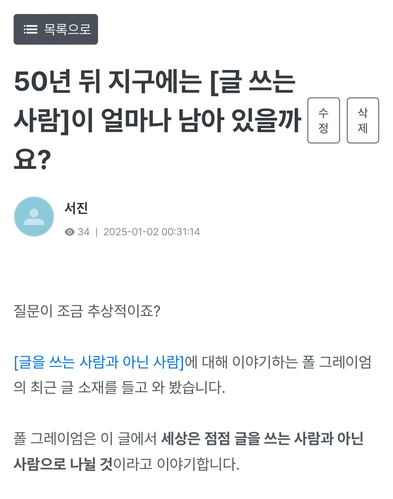
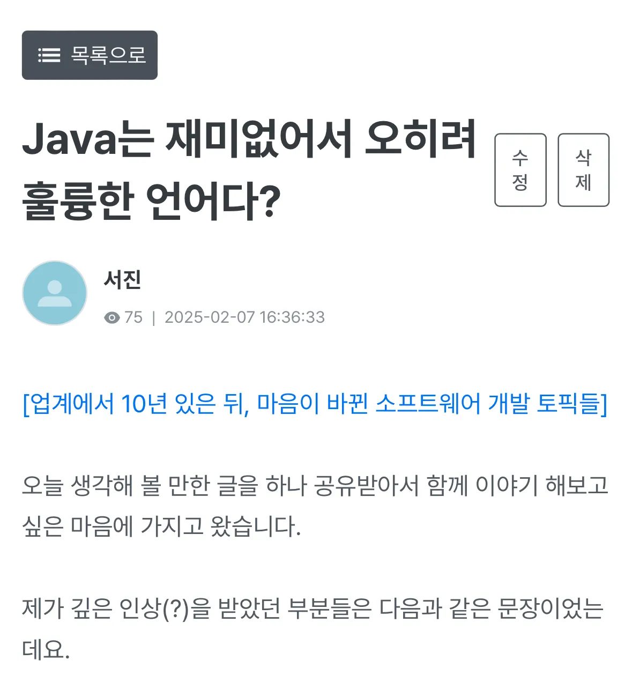

> F-lab에서 3개월 간 진행하였던 DEV CLUB 서포터즈 후기를 담습니다.

DEV CLUB 서포터즈를 진행하면서, 활동 중 **자유 게시판과 질문 게시판에 글을 기고하는 것**이 포함되어 있었다.

이런 거 그냥 하면 또 재미없다. 하나 하면 확실하게 해야지.

원래는 기술 관련 글을 적어 보려고 여러 가지 초안을 작성해 두었는데, 전반적으로 캐주얼한 글을 올리시는 분위기라 조금 접어 두고…

사설이나 웹진 같은 곳에 올리는 듯한 글을 적어 보면 좋지 않을까? 해서 여러 가지 구상을 해 보았다.

이에 따라 나온 글 중 몇 가지.

## 블로그에도 함께 올렸던 글

- [어떤 기술 스택을 선택해야 할까?](./how-do-i-decide-tech-stack)
- [분산 버전 관리 시스템이 어색하다고요?](./history-of-scm)

## F-lab에만 있는 글 링크 (데브클럽에 가입하시면 보실 수 있습니다!)

- [50년 뒤 지구에는 [글 쓰는 사람]이 얼마나 남아 있을까요?](https://lms.f-lab.kr/contents/free/15228)
- [Java는 재미없어서 오히려 훌륭한 언어다?](https://lms.f-lab.kr/contents/free/16085)

새로운 과정인 만큼 내가 기존에 블로그 기고하던 글보다는 더 재미있는 걸 적어 보고자 했는데.

**내가 궁금해하면서 다들 재밌어할 법한 주제가 뭔지 생각해 보고 컨텐츠를 만드는 과정**은 생각보다 유익했다.

특히 형상 관리 시스템을 분석하면서 찾아보던 것들이 가장 재미있었고, 내가 소프트웨어를 만드는 철학에 대해 공유하는 과정이 참 좋았다.

언제나 내 의견은 정답이 아니라 의견 1이라고 생각하는 만큼 다른 분들의 의견도 더 들어보고 싶은데, 블로그 댓글을 github 로그인으로 바꾸면 좀 더 들을 수 있을까? 하는 생각도 있다.

## 줏대 있는 개발자

음… 비롯해서 내가 **이 글들을 토대로 서브 커뮤니케이션 할 수 있는 것들**에 대해서 생각해 보았는데.

최근 면접을 다니면서 **“줏대 있는 개발자”**가 얼마나 유의미한 것인지 생각하고 있다.

싸울 수 있는 개발자는 왜 자신의 주장을 내세울 수 있을까?

나는 **건강한 싸움을 위해 필요한 것은 성장 의식이고, 또한 그에 대한 적절한 근거**라고 생각한다.

그렇다면 나는 어떤 개발자인가.

모든 것이 트레이드오프겠으나 **나는 “협업”을 추구하는 줏대가 강한 것 같고, 거기서 성장을 놓지 않으려는 경향이 강하다는 것**을 깨달았다.

면접에서 자주 나오는 질문인, **“기술 선택을 놓고 싸우는 상황이 오면 어떻게 하시나요?“**에서

나는 **[전체 의견을 수렴하지만, 적절하지 못한 것은 이득을 보여 주며 설득합니다]** 라고 대답하는 편이기 때문에.

이게 나쁘다기보단, 강력하게 내 주장이 옳다! 라고 하는 것보다 설득의 힘이 약하다고는 생각한다.

따라서 이런 정보를 기여하는 모습을 공유하는 일은 **나의 줏대인 “함께 성장”의 관점**을 더 보여줄 수 있는 기회가 되기도 하는 것 같다.

> 이득을 보여 주는 모습을 보일 수 있으니까. 그 모습을 토대로 “나는 이런 사람입니다” 설득할 수 있으니까.

원래 내가 앞에서 말로 하는 것보다 글로 보여지는 게 더 설득력이 있지 않나? 아무튼.

비롯해서 이런 정보들을 많이 공유되는 채널을 더 주기적으로 찾아보는 버릇도 생겼다.

**GeekNews나 디스콰이엇 같은 컨텐츠**를 최근 못 보고 있었는데 이런 곳들도 더더욱 살펴보게 되었고, **다른 분들이 작성해 주시는 글을 토대로 생각해 볼 수 있는 것도 / 접할 수 있는 컨텐츠도** 많아졌다.

다양한 정보들을 빠르게 접하면서 느낀 점은… 생각보다 트렌드에 (조금) 열린 개발자는 그다지 어렵지 않겠다는 점이었다.

현재는 CS나 이론 같은 컨텐츠로 많이 나와 있는 것을 보는 시간에 더 많은 투자를 하고 있지만, **지금처럼 간헐적으로라도 1-2분 재미있는 글을 하나씩 읽어 나가는 것도 좋을 것 같다**는 생각을 해보게 되었다는 이야기.

동반 성장이라는 관점에서 가장 중요한 것들을 한 번 더 생각해 보는 좋은 기회가 아니었나, 싶다. ㅎㅎ 