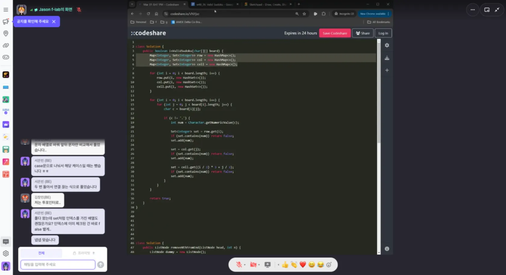

> F-lab에서 3개월 간 진행하였던 DEV CLUB 1기 서포터즈 후기를 담습니다.

# 진행되는 프로그램

DEV CLUB에는 꽤 많은 프로그램이 있다.

이 프로그램들은 그때그때마다 생겼다 사라질 수도 있지만 현재 상태에서는 이런 구성을 가지고 있는 상태인데.

해당 프로그램에서 어떤 것들을 하는지 궁금해 물어보는 분들이 종종 있어서,

내가 참여한 후기와 함께 느낀 점 같은 것들을 정리해 봄으로써 팀메이트를 만드는(?) 작업을 진행해 보고자 한다. ㅎㅎ

# 오늘도 한 페이지

**오늘도 한 페이지**는 **일주일에 한 번, 한 가지의 책을 정해 두고 정해진 분량까지 읽은 뒤 멘토님과 해당 책에 대해서 이야기해 보는 시간**이다.

현재 캡처해 둔 것처럼, **책으로만 읽었을 때 놓칠 수 있는 개념에 대한 설명을 보다 자세하게** 해 주신다.

비롯해서 그 책에 대해서 **멘토님이 질문을 가져 오신 걸 토대로 답변**을 할 수 있는데, 이에 따라 보다 체화해 볼 수 있는 프로그램이라는 점이 좋았다.

질답을 적극적으로 참여해 주시는 분들이 많을수록 더 많은 의견을 주시고, 동시에 다른 분들의 답변을 토대로 상호 성장할 수 있는 만큼 더 많은 분들이 참여하셨으면 하는 프로젝트이다.

개인적으로는 계속 참여하고 싶은데 지금 몸이 한 개라 아쉬운 프로그램…. ㅜㅜ

# 멘토에게 무엇이든 물어보세요

한 번의 참여였음에도 정말 많이 도움 받은 프로그램.

궁금한 게 있는 상황에서 먼저 걸어간 사람의 한 마디라도 도움이 될 때가 있는데, 이 프로그램이 그랬다.

작은 질문지라도 친절하게 답변 주시는 모습이 참 감사하기도 했고, 동시에 내가 이력서에서 어떤 것을 어필해야 하는지도 보다 잘 캐치할 수 있는 계기가 된 것 같다.

# 알고리즘 스터디

개인적으로 가장 열심히 참여해 보고 있는 프로그램! 

아무래도 코딩 테스트가 나의 가장 큰 약점이라서… 매일 하나씩 스테디하게 풀어 가고 있지만, 문제를 접근하는 것을 비롯해서 함께 풀어 보는 경험이 도움이 되는 것을 알고 있다.

멘토님이 1주에 1번 leetcode에서 문제 여러개를 내 주시고, 그 문제를 풀어본 다음 하나씩 이야기해 보는 형태로 구성되어 있는데, 서로간의 풀이 과정을 이야기한 다음에 다른 지점을 짚어보는 것도 도움이 됐다.

나는 30분~1시간 정도 풀어본뒤 답이 안 나오거나 도무지 모르겠으면 답지를 본 다음, 안 보고 옮겨 적는 식으로 공부를 진행하고 있다.

# 모각코

온라인과 오프라인을 토대로 모여서 각자 코딩을 진행하는 프로그램도 있다.

**온라인으로는 ZEP**을 토대로, 오프라인은 **F-lab이 현재 위치해 있는 마루360의 회의실** 안에서 이루어진다.

나는 오프라인 모각코를 참가했었는데, 중간에 네트워킹 시간도 있어서 다들 모여서 리프레시하고 소통하는 시간도 가질 수 있고, 다과도 종종 준비해 두시는 것 같아 좋았다.

다같이 이야기하면서 코딩하는 것도 좋았지만 확실히 옆 사람이 열심히 하는 만큼 나도 열심히 하게 되는 것이 모각코의 장점인 것 같다.

너무 집중한 나머지 중간에 눈이 아파서 산책도 잠깐 하고 왔을 정도로 남다른 집중도라 ㅋㅋㅋㅋㅋ

다음번에도 열리면 꼭 참여해 볼 생각이다.

함께하는 사진을 잊고 못 찍어버리는 바람에 1층 카페의 거북이 메론빵과 퇴근길(?)의 역삼역을 찍어 둔 사진을 토대로 참석 인증을 해 본다.

여담으로 나는 주로 새로운 지역에 가면 맛있다는 카페에 가서 음료를 마시는 걸 좋아하는데, 모각코 참여하는 날에 찾아보던 카페가 마루360 1층에 있어서 웃기고 재미있었다는 이야기.

# 장기간 프로젝트

매주 있는 다른 프로그램도 좋지만 다른 분들께 가장 제안해 보고 싶은 경험은 **DEV CLUB에서 주최하는 해커톤과 사이드 프로젝트 진행**이다.

최근 해커톤이 열리는 것을 보기가 드문 것 같은데, 개발자들이 모여 무박 2일! 동안 열정을 쏟아내는 것을 볼 수 있는 기회라고 생각하고 있다.

- [사이드 프로젝트 프로그램 안내](https://community-guide.f-lab.kr/side-project?utm_source=home_page&utm_medium=display&utm_campaign=side_project)

동시에 사이드 프로젝트 진행. 하… 이거 할 말이 많은데. 내가 공지 채널에 들어가지 않는 바람에 손꼽아 기다렸음에도 신청 기한을 놓치고야 말았다. ㅜㅜ 내가 바보다.

다음 번 기수도 진행된다고 하는데 해커톤도 프로젝트도 반드시 참석해 볼 생각이다. 시간을 최대한 뻬 놓는 걸로…

두 프로그램 다 다음 차수를 고대하고 계신다고 하니 한번 참여해 보시는 것도 좋을 것 같다.

ㅎㅎ 만나면 글 봤다고 인사해 주셔도 감사하겠다.

**개인적으로 이런 프로그램들을 토대로 성장하는 일의 장점은 두 가지 같은데.**

결국 **[효율적 성장]**이라고 생각한다. 누군가 제시해 준 루트를 밟는 것은 언제나 그 사람의 경험을 빌리는 일이니까.

또 **같이 하는 데서 느껴지는 유대감**도 무시하지 못한다는 생각을 한다. 느슨한 결합이지만 자주 마주치는 분들을 보면 약간의 유대감이 생겨나니까 ㅋㅋ

만약 데브 클럽을 하게 되신다면 저 캐릭터 보일 때 인사 한번 해 주시길. 

블로그 보고 왔다고 하시면 이모지 폭탄을 드리겠습니다. 👍