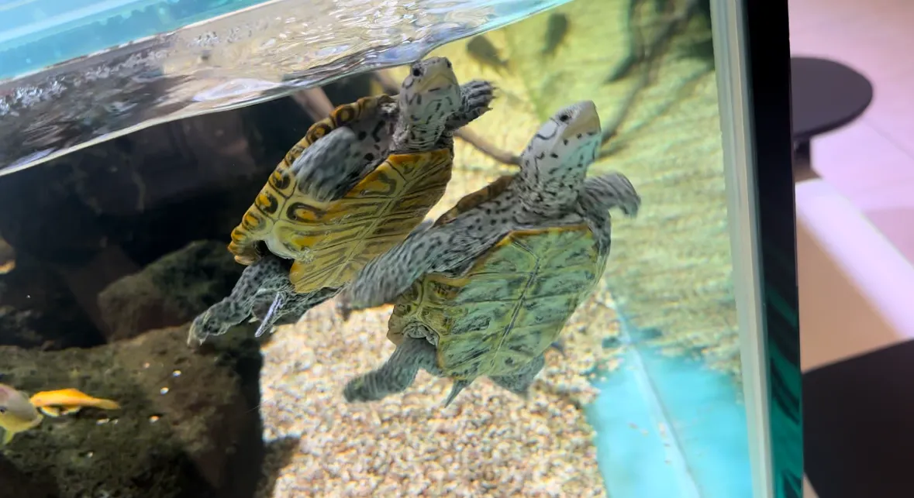
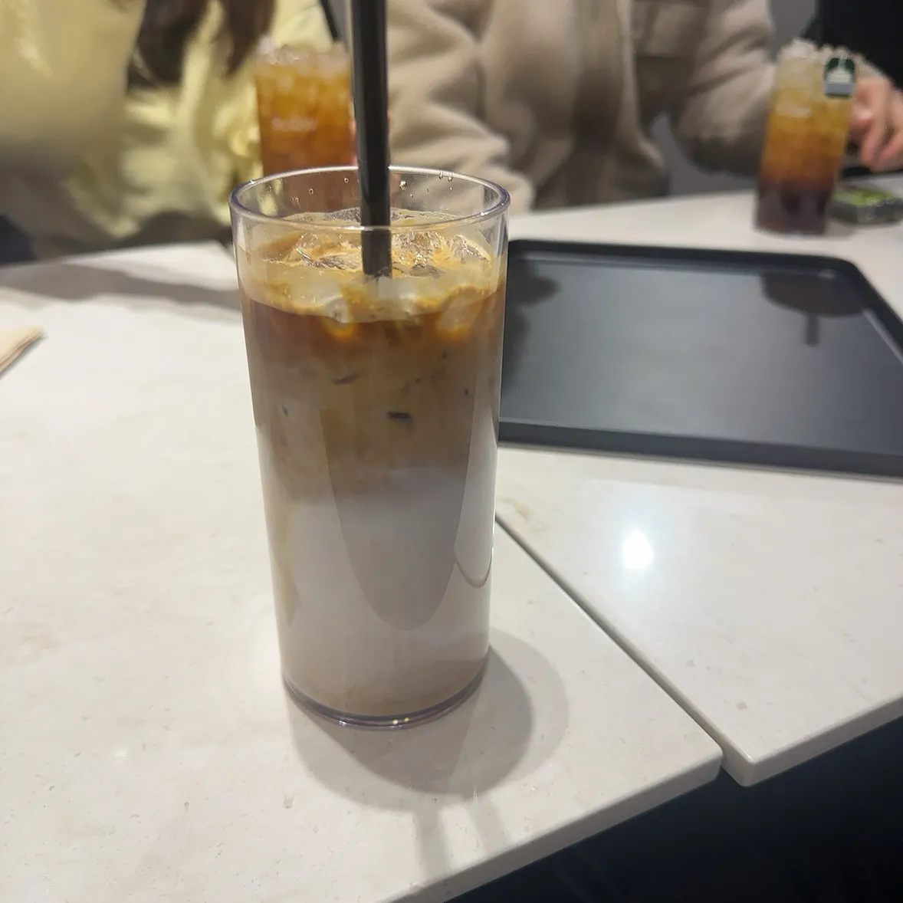

> F-lab에서 3개월 간 진행하였던 DEV CLUB 서포터즈 후기를 담습니다.

**우리는 한국인이다. 한국인은 뭐다? 밥 없으면 못 산다.**

언제나 프로그램을 시작할 때는 밥 한 끼 먹으면서, 마무리할 때도 밥 한 끼 먹으면서 마무리하는 게 한국인 아닌가.

그 정서에 발맞춰서 데브 서포터즈에서도 밥 한 끼로 여정의 시작과 끝을 마무리했고, 그 이야기를 한번 적어 보려고 한다.

# 고기 굽굽의 만남

12월 초. **F-lab에서 진행하는 데브 서포터즈 1기가 시작**되었다!

지원서를 넣고 받았던 자리인 만큼 꽤나 정예 멤버(ㅋㅋ)라는 생각이 들었는데, 첫 미팅 때부터 다들 블로그가 남다르시더라.

시작을 기념하는 차원에서 F-lab 측에서 저녁 즈음 만나서 고기를 함께 굽는 자리를 마련하기로 제안해 주셨다.

만남은 **역삼역 땅코참숯구이**에서 있었는데, 다들 맛있다고 해서 제법 기대했는데 기대한 만큼의 고기가 나왔다.

사진에 맛이 담길까 싶기는 한데... 고기 질도 좋았고, 제대로 된 고깃집 분위기도 한 몫했다. 테이블 챙겨 주시던 선생님의 기개가 남다르셨다.

나중에 친구 데리고 한번 가 봐야겠다 싶은 곳.

그리고 짜글이 같은? 종류의 찌개도 시켰는데, 국물 그렇게 좋아하지 않는데도 다들 맛있게 드시니 나도 홀린듯 맛있게 먹은 것 같다.

처음 사람들을 만나는 자리라 살짝 어색할 줄 알았는데, 의외로 빠르게 분위기가 풀려서 금방 재미있어졌다.

서포터즈분들 전체가 다 오셔서 신기하기도 했고.

처음 만나는 자리인 만큼 서로 어떠한 일을 하는지 나누면서 자연스럽게 이야기가 이어졌다.

개발 얘기 뿐만 아니라 취미 이야기도 하고… 다들 여가 시간에 어떤 것들을 하는지에 대한 정보까지 알아갈 수 있을 정도로 가까워지는 시간이었다.

테이블이 둘로 나눠져서 이야기를 나눴다 보니 같은 테이블에 있는 분들이랑 조금 더 많이 이야기를 나눌 수 있었는데, 

1기가 마무리되는 지금 돌이켜 보니… 내 테이블에 함께 있던 분들은 과반수가 2기로 다시 오셨다 ㅋㅋㅋㅋㅋ 조금 신기하네.

2차를 못 가시고 집에 귀가해야 하시는 분들이 있어서 조금 아쉬웠지만, 다음을 기약하고.

두 번째 자리로 갔던 카페에서는 거북이와 도마뱀이 있는 카페였는데, 작은 거북이들이 헤엄치는 게 귀여워서 한참을 보던 기억이 난다.

느지막한 시간까지 다같이 이야기하면서 즐거운 시간을 보내다 귀가했다.

이후 F-lab 진행 행사에 다녀왔는데, 그때도 서포터즈 분들을 마주쳐서 반갑게 인사할 수 있었다. 

# 치킨에 맥주? 저 집에 안 가겠습니다.

그리고 이제 3개월의 여정 마무리를 앞두고 한 번 더 모인 자리. 

3개월 만에 다시 만나는 것인데도, 분명 오랜만인데도 어색함 없이 자연스럽게 이야기할 수 있었다.

게시판에서 계속 소통했던 덕분인 건지 첫 만남 때보다 훨씬 더 가까워진 느낌도 있었고.

이번에는 치킨집에서 만나서 이것저것 다양하게 시켜봤다. 구운 치킨에 문어까지 튀긴 치킨, 거기에 맥주랑 피자까지 곁들였는데….

크다고 해서 음! 다 먹을 수 있겠지! 하고 시켰는데, 아니 진짜 크더라고. 과하게. 진짜로. 

큰 사이즈라고 해서 그냥 그런가 했는데, 내 손이 꽤 큰 편인데도 비교해 보니까 확실히 엄청 크길래 ㅋㅋㅋ 

나와 있는 말이라도 과장되어있다고 생각하면 안 되는구나... 믿어야 하는구나... 내 예상을 훌쩍 뛰어넘는 것도 있구나.. 싶었다.

분명히 PT를 하고 있었는데. 그랬지만. 식단 생각은 잠시 접어두고 아주 맛있게 먹었다. 

딸기 맥주……. 라는 새로운 맥주도 시도해 보고, 회사 관련해서 큰 고민이 있어서 그 이야기도 나누고, 

개발자 미팅(진짜 그 미팅 맞음 ㅋㅋ) 주선해 보겠다는 얘기도 하면서 꽤 유익하고 즐거운 시간을 보냈다.

언제나 사람들과 이야기를 나누다 보면, 

**잊고 묻어 두었던 것들을 하고 싶어지는 순간이 오거나, 못하겠던 것들을 보다 더 가볍게 결심하게 되는 것 같다.**

이번 자리에서도 내가 고민하던 부분을 꺼내놓고 이야기하다 보니, 단순히 혼자 끙끙대던 것보다 훨씬 더 명확하게 정리되는 느낌이었다.

비롯해서 기술 이야기나 개인적인 사이드 프로젝트 등을 토대로 규모를 확장하고 계신 이야기를 듣다 보면 나도 다시금 새로운 것들을 해 보고 싶은 마음이 드는 것 같다.

1기의 모임 중 일부 분들은 2기에도 인연을 이어가게 되었으니 기존 1기 분들의 이야기도, 새로운 2기 분들과도 더 재미있는 경험과 일상을 나누면서 다채로워 보고 싶다.

1기에서 함께한 민제님, 헤인님, 제우님, 수지님, 인애님, 경태님, 종하님 전부 너무 반가웠습니다. 

또 봬요!

## 번외. 

앱 두 개 홍보하고 갑니다. 한번 받아보세요.

[**COFFICE**](https://apps.apple.com/kr/app/coffice/id6450617682)

지도를 통해서 [작업하기 좋은 모든 카페]를 받아볼 수 있는 애플리케이션입니다. 👍

이제 나도 혼자는 지겹다. 아주 잘 맞는 인연을 좀 맺어 보고 싶다..? 하는 분이 있으시다면?

[커피팅](https://www.coffeeting.kr/)이라는 애플리케이션도 추천드립니다. 👍

