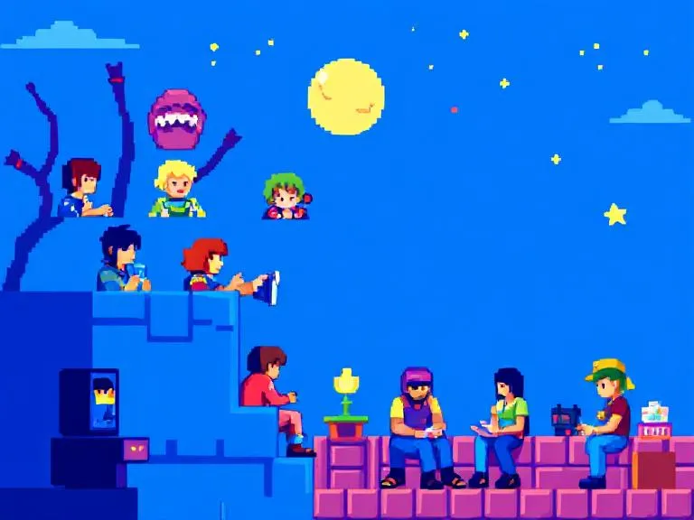
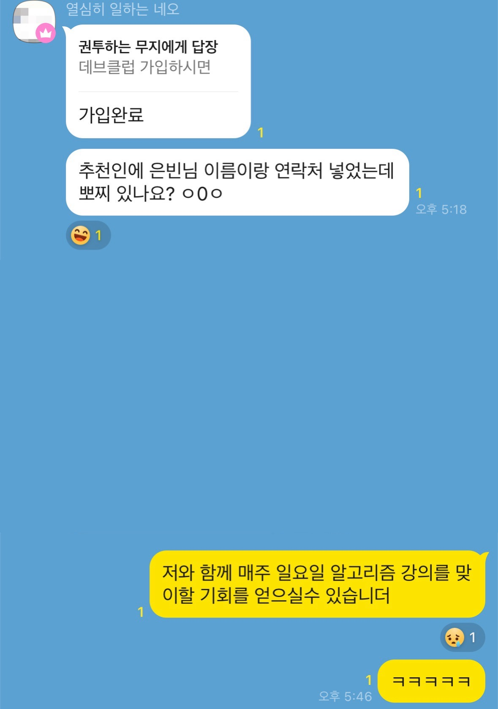
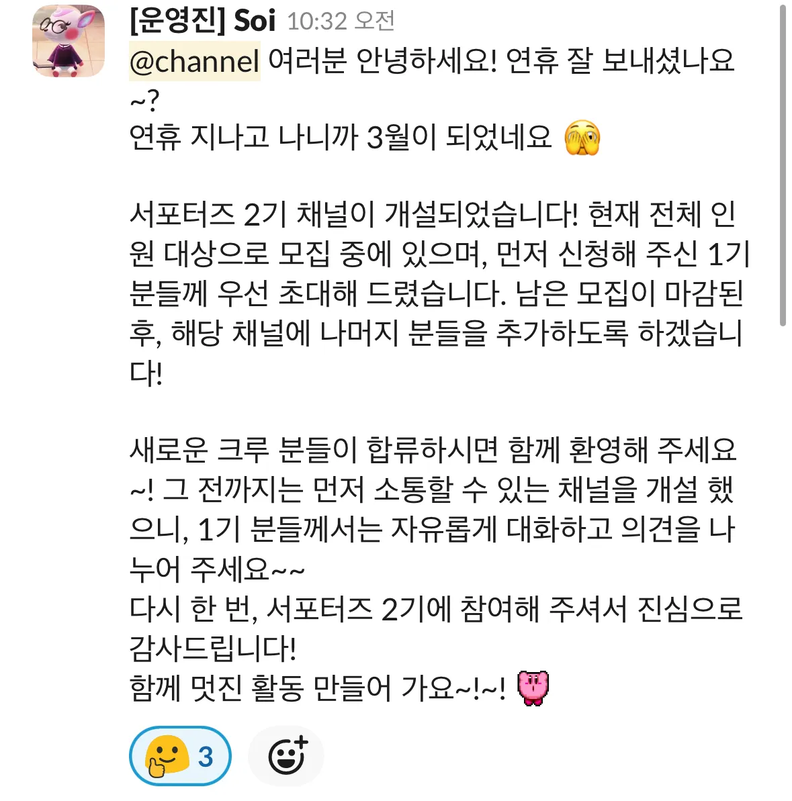

> F-lab에서 3개월 간 진행하였던 DEV CLUB 서포터즈 후기를 담습니다.

# 서포터즈를 마무리하며 

이번에 **F-lab에서 진행되는 DEV CLUB 서포터즈 활동을 약 3개월간(2024년 12월~2025년 2월)**시작하고 마무리했다.

가벼운 마음으로 진행을 시작하긴 했지만... 뭐든지 시작하면 제법 책임감을 수반하는 나로서는 ㅋㅋ 이것저것 머리를 굴리려는 노력을 많이 해 봤다.

사실 '서포터즈'라는 활동이 무엇일까 처음에는 다소 막연한 감이 있었다.

그저 한 달에 몇 가지 활동을 하면서 간단히 도움을 주는 것일 거라 생각했지만 실제로 활동을 하면서 보람을 느끼고 나의 성장도 가져가게 되었다.

1기를 마무리하며, 이번 서포터즈 활동으로 내가 진행해 봤던 것들에 대해 적어 보고자 한다.

# 커뮤니티에 대한 니즈

사실 DEV CLUB에는 이미 노출되어 있던 상태였다. F-lab 수강생으로서 자연스럽게 참여할 기회가 있었기 때문이다.

F-lab 진행 시 접속해 뒀던 슬랙 안에서 올라오는 공지만 잠깐 보던 만큼 자발적으로 참여해야겠다! 는 생각을 해 본 적이 덜했었는데, 

이번 서포터즈 과정에서 **개발 문화 공유와 커뮤니티의 중요성**을 새롭게 인식하게 되었다.

F-lab 진행 네트워킹 모임들에 나갈 때, 또 이번 서포터즈 활동을 할 때도 오히려 수료생분들보다 DEV CLUB 진행하시는 분들을 많이 뵀던 것도 사실이라…

가입한 분들의 니즈를 생각해 봤을 때, **다양한 기술 스택을 가진 개발자분들이 한 공간에 모여 지식을 공유하고 네트워킹하는 것을 사람들이 얼마나 필요해 하는지 깨닫는 기회**가 되었고. 

데브클럽은 그 부분을 꽤나 잘 충족해 주고 있다는 집단이라는 생각이 들었다.

단순히 정보를 얻는 것이 아니라, 자기 발전을 위한 장기적인 네트워킹이 이루어지는 장소가 아닐까 해서.

나도 여러 오픈 채팅방이나 개발자 커뮤니티에서 활동하지만, 정기적으로 만나 서로 의견을 나누는 기회는 드물고 흔치 않으니까. ㅎㅎ

이에 따라 주변 개발자분들께 종종 추천을 드렸는데, 이번에 DEV CLUB이 파격 구독료 인하를 추진하면서 동시에 많이들 가입하시는 현상을 보았다. 

**개발자 분들이 간단한 접근을 통한 유용한 콘텐츠와 커뮤니티를 얼마나 원하고 있었는지 깨닫게 되는 순간**이었다.

안타깝게 뽀찌를 드릴 깜냥이 되지는 않았으나... ㅜㅜ ㅋㅋㅋㅋㅋ

# 서포터즈에서 내가 얻어간 것

나는 진행한 다양한 활동 중에서 개발자들이 필요로 할 법한 콘텐츠를 생각해 보고 만들어 제공하는 일에 대해 가장 성취감을 느꼈던 것 같다. 

단순히 기술적인 내용뿐만 아니라 개발자들의 관심을 끌 수 있는 재미있는 콘텐츠를 어떻게 만들 수 있을지 고민했다. 

그리고 그 콘텐츠에 댓글이 달릴 때마다 뿌듯함도 조금씩 있었고.

또 기존 진행되던 좋은 프로그램들을 발굴한 경험 자체가 큰 소득이었다.

되게 좋은 컨텐츠들이 옆에 있었는데 그걸 옆에 두고도 모르고 있었으니 ㅋㅋ

이에 대한 자세한 이야기들은 아래 게시물에 적어 두었으니 한번 둘러봐 주셔도 좋을 것 같다.

- [재미있는 개발 컨텐츠를 만들어 볼까?](./funny-dev-content)
- [프로그램으로 성장하기](./dev-club-programs)

# 서포터즈에서 전달할 수 있었던 가치?

~~소이 매니저님이 2기 참여를 반겨주시는 모습~~

ㅋㅋㅋ 사실 전반적으로 게시판에 대한 QA를 제법 열심히 했던 것 같다. 

DEV CLUB 사이트를 이용하면서 발생한 문제나 오류를 찾아내고, 그것들을 운영진분들께 전달하는 과정이 가장 직접적인 기여였던 것 같고.

이외에도 주변에서 **F-lab에 대한 의견이나, Dev Club에 대한 의견을 알게 되었을 때 직접적으로 전달** 드릴 수 있었다는 것도 기여가 아니었을까.

실제로 몇몇 개발자분들의 피드백을 수집해 전달했을 때, 운영진분들이 진지하게 들어주시고 실제로 의견을 전달주시는 것을 보며 

주변 사용자 의견을 다양하게 전달드리는 것도 서포터즈의 역할이라는 생각을 하게 되기도 했고. 

앞으로도 **서포터즈 2기**를 다시 한 번 시작하게 된 만큼 새로운 것들을 많이 기획하고 계신 것 토대로 다른 가치들도 기여해 볼 수 있으면 좋겠다.

# 같이, 함께 성장하는 것

**나는 언제나 윈윈하는 자세를 가장 중요하게 생각한다.**

어떤 프로젝트를 진행하더라도, 함께하는 분들에게 영감과 같은 작은 것이라도 기여하는 일을 선호하고, 나도 한 가지의 것이라도 배우고 가는 일을 선호한다.

2기 서포터즈 활동에서도 DEV CLUB이 한국 개발 문화에서 재미있는 역할을 가져가 볼 수 있도록 이것저것 찔러드리는 경험을 해 보고 싶다.

나는 어떤 것을 얻어갈 수 있을지 또 운영진 분들을 찔러 보면서 ㅎㅎ

개발자들이 함께 성장하고 교류할 수 있는 건강한 커뮤니티 문화 조성에 작은 기여라도 할 수 있다면 제법 보람찰 것이다.

그러면 다시 한번, Hello Dev Club ~