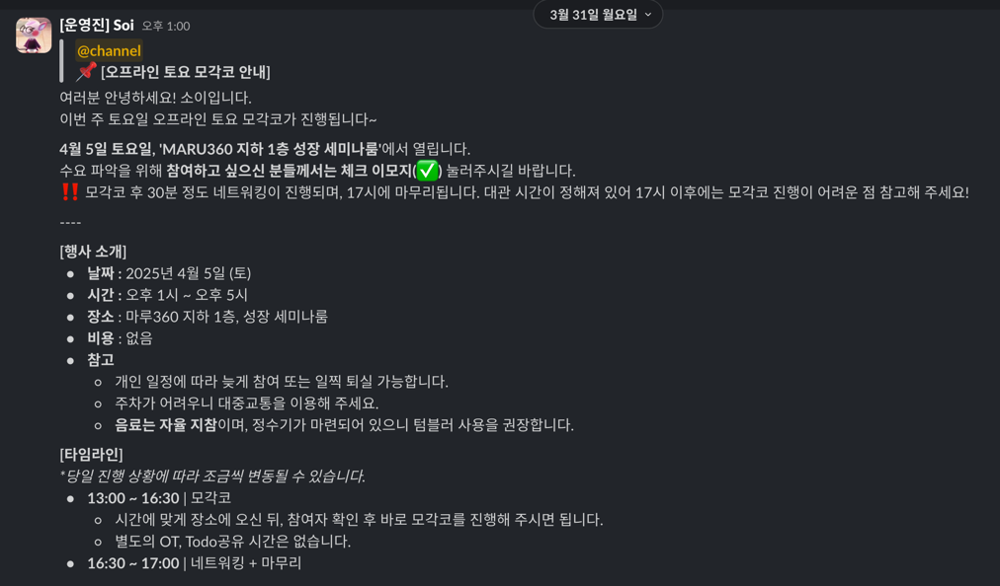

# 혼자서는 어려워

휴식 시간에 개발해 보신 분? 휴일에 개발해 보신 분?

사실 이런 블로그에 들어와서 글을 읽으시는 분이라면 모두 열심히 개발하는 분일 것 같아서, 

두 가지 질문에 대해서 [저요!] 라는 답변을 내놓으실 것 같다.

혹시 그렇다면 집에서 개발해 보신 분? 

나는 유독 집에서 공부하면 다른 행동들을 많이 하게 되고, 집중력이 떨어진다. 

그래서 무조건 **주말 루틴은 카페에 나가기.**

카페에 나가서 노트북을 펴놓고 있다 보면 어쩐지 시선을 의식하게 되기도 해서,

휴대 전화를 보다가도 금방 내려놓기 마련이다.

이런 나의 주말 루틴을 도와주기 위해 찾아온 구원자가 하나 있으니.

# 공유 오피스에서 모여서 개발하기 

[DEV CLUB](https://f-lab.kr/dev-club)에서는 **매주 토요일 오프라인 모각코**가 열린다.

최근 해당 행사는 최대한 루틴을 잡고 참석하기 위해 노력하고 있다. 

사실 다른 것들도 하고 싶은데 짬이 안 나기 때문에... 내가 할 일을 부스팅할 수 있는 가장 적합한 곳이라고 생각해서. 

대관 시간이 정해져 있으니 **주말에 나가는 일을 괜히 미루고 뒹굴거리는 것도 방지해** 주는 효과가 있다.

사실 가장 최근 번에는 조금 늦게 찾아가긴 했는데. 그래도 나가는 일을 결심하는 것에 도움을 준다.

유명한 공유 오피스에서 공부해 볼 기회를 얻는 것은 덤. 

# 개발자들과의 이야기 시간

그리고 한 가지 더 추가. 

**중간에 이야기를 나눌 수 있는 시간**이 주어지는데, 이 시간이 생각보다 다양한 이야기를 들을 수 있는 기회를 준다.

가장 최근에 이야기를 나눴던 분은 백엔드 개발자 분들이었는데, 

**환경이 다른 만큼 그 회사에서 할 법한 것들을 상상해 볼 수 있는 시간**을 가지게 됐다.

이야기를 들으면서 함께 고민도 털어내 볼 수 있는 기회가 되고.

가장 최근에 뵀던 분과는 **손실이 되면 안 되는 서비스에 왜 Redis를 쓰는지**에 대한 열띤 토론을 했다. 

그분의 상사분에 대한 판단이 이해하기 어렵다는 점에 대해서 이야기했던 것인데...

보통 친구들과 이야기하고 토로할 때는 이해할 수 없는 단어 때문에 내가 왜 힘들어하는지를 감정으로만 전달할 수 있지 않은가. 

그런데 이렇게 개발자들과, 특히 새로운 개발자들과 이러한 이야기를 나누다 보면 공감대가 커지고, 위로도 되는 것 같다.

다음 번에는 프른트엔드 개발자 분과 이야기를 좀 나눠 보고 싶다. 요즘 팔자에 안 맞는 프론트 하느라 힘들어 죽겠어서. 

# 너무 늦게 나갔다...

최근 스터디가 진행되고 있는 곳은 [마루360](https://www.facebook.com/MARU180ANF)이다. 

이번에는 회의실 예약이 되어 있는 시간에 맞추어 끝까지 이용을 했었는데, (사실 늘 그렇긴 한데)

1층 카페가 문을 닫는 시간에 나가니 어둑어둑해서 살짝 외롭기도 했다.

어두우니까 일찍 귀가하세요. 큼큼. 

~~아니면 저랑 같이 대관 예약 시간까지 해 주세요. 큼큼.~~ 

많은 분들이 찾아오셔서 더 많은 이야기를 나눌 수 있는 기회를 가졌으면 좋겠다.

많이 찾아오세요. 기다리고 있겠습니다. ~~프론트엔드 개발자 환영~~

# 작은 홍보

그리고 .... 살짝 번외로. 혼자 공부하면서 카페가 필요하신 분이라면 한번쯤 둘러 보셨으면 해서.

[COFFICE](https://apps.apple.com/kr/app/coffice/id6450617682)라는 iOS 애플리케이션에 대한 작은 홍보를 하고 갑니다.

지역 경제와도 상생하고(?) 원하는 개발 역량도 키울 수 있는 기회를 COFFICE에서 경험해 보세요 👍