> 2025의 요약. 분주했고 얻었고 조금 아쉽다.

# 분주했고

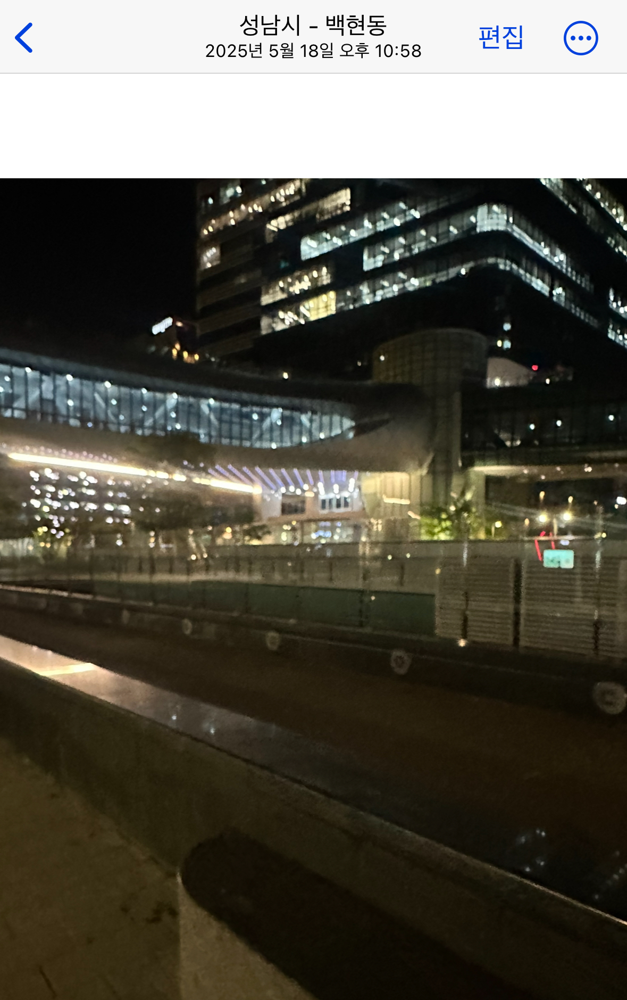

적절한 야근은... 아니, 야근은 뭐가 좋은지는 사실 잘 모르겠다. 효율 떨어지는 성장?

**정말, 엄청난 야근을 했다.**

3시까지 하고 돌아갈 때도 있었다. 철야도 1번 해 봤다. 머리 뜯기는 스트레스도 받았다.

와, 나 이래도 되는 거야? 하는 생각을 하면서 지냈다.

알파돔 1층에 있는 파인애플 햄버거만 30번은 먹어 본 것 같다. 

여기 왜 포인트를 못 쌓게 해 줬을까... 다른 것도 많이 먹었지만 유독 파인애플 햄버거가 기억에 남는다.

그러면서도, 그렇게 살면서도 꽤 많은 걸 했더라. 

새삼 1년을 정리하면서, 참 분주한 한 해를 살았다는 생각을 했다.

# 얻었고 

2025는 조금 다른 성장을 원했다. 다양하고 깊은 성장.

2024에는 [이너서클](https://b-log.kr/innercircle-driven-growth)로 많은 것들이 채워졌지만, 

2025에는 조금 더 다른 방향의 성장을 원했던 것 같다.

**이제 어쩐지 기본 라인은 할 줄 알게 되었다는 어느 정도의 확신이 생겨서, 백엔드 개발자로서의 다양성과 깊이를 전부 다 가져가기를 원했다.** 

다양한 여러 가지 것들을 많이 흡수하고 싶었다. 이야기를 듣고 싶었다.

이 판단에 따라 **2025년에는 6개의 스터디와 2개의 사이드 프로젝트**를 했다.

## 스터디

- **`JVM 밑바닥까지 파헤치기`**
- **`인프런 워밍업클럽: TDD`**
- **`인프런 워밍업클럽: DevOps - 쿠버네티스`**
- **`테디노트의 랭체인을 활용한 RAG 비법노트`**
- **`IT Super: System Insight`**
- **`IT Super: 그래서 그놈의 도메인이 대체 뭔데?`**

### JVM 밑바닥까지 파헤치기

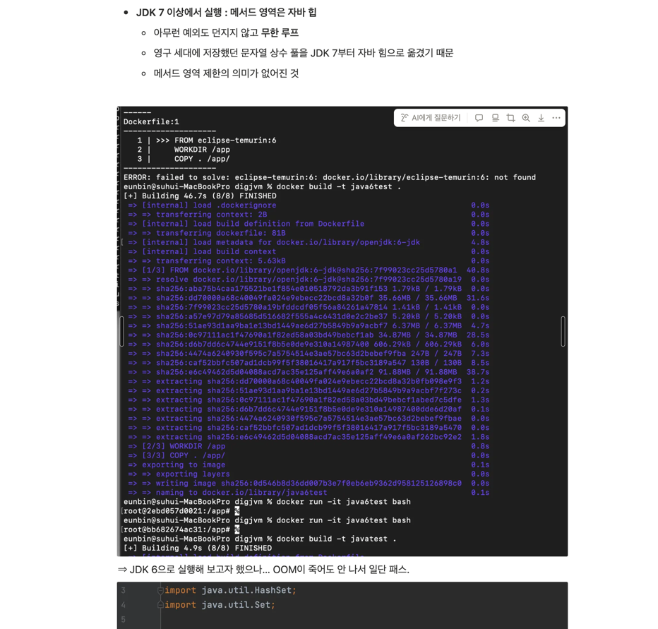

이 스터디는 사실 할 말이 조금 없는 스터디이다. 

2월부터 5월까지 했던 스터디인데, 2부까지만 열심히 참여하고 그 이후로는 어느 정도 놓은 것 같아서.... 

아는 분이 제안을 해 주셔서 참여했고, 매주 한 섹션씩 강의를 정리한 뒤 온라인으로 이야기를 나눴다. 

개인적으로는 앞장에서 얻을 것이 많았고, 뒤로 갈수록 내가 현재 이것을 왜 보고 있어야 하는가?에 대한 의문을 가지게 되었지만. 

그래도 힙 덤프도 뜨면서, 메모리 부하를 어떤 식으로 측정하고, 도달 가능성 분석 알고리즘을 파악하고, 경량 락 / 중량 락 / 편향 락과 같은 개념을 

보다 자세하게 정리할 수 있는 시간이어서 꽤나 얻어갔던 스터디인 것 같다.

마지막 오프라인 모임을 못 참여해서 너무너무 아쉬웠던.... 

### 인프런 워밍업 클럽 - TDD / DevOps

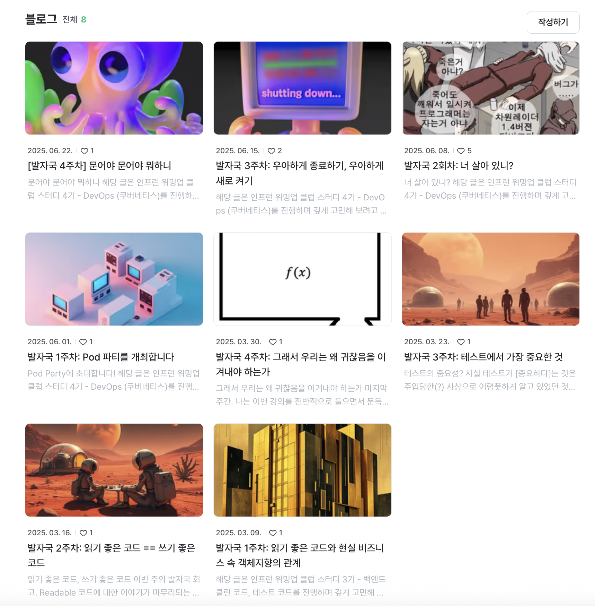

다음은 인프런 워밍업 클럽. 2기 / 3기를 진행했다. 

일단 클린 코드와 테스트 코드에 대한 이야기, 그리고 k8s 강의.

두 가지 다 **회사 작업 때문에 진행**했다. 

우선 **클린 코드와 테스트 코드**의 경우 회사에서 내가 주도하에 진행하고 있던 프로젝트를 개선하고 싶은 마음에서 수강했다.

해당 프로젝트에서 테스트 코드를 크게 진행하지 않았던 측면이 있었기 때문에, 사내에 도입할 때 조금 더 인사이트를 줄 수 있을 방법이 있을지 싶었고.

그리고 그냥 우빈님이 하시는 말씀을 듣고 싶었다. 어떤 목적으로 이 강의를 만드셨는지. 

**일프로 님의 k8s**의 경우 회사에서 실제로 Pod를 띄우는 방식으로 프로젝트를 운영하고 있었기 때문에, 

개념 이해도가 보다 명확해야 DevOps들과 이야기를 함에 있어서 더 깔끔한 이야기를 나눌 수 있을 것 같아서. 

두 가지 다 수강 만족도는 높았는데, 일프로님 세션이 너무 좋았다. 이번 강의를 토대로 확실히 더욱 쿠버네티스에 대한 이해가 올라갔다는 생각이 들었다.

카카오뱅크 외주를 중간에 멈추고 이직을 하게 되면서 두 가지 다 실제로 이것저것 운영에 참여해 보며 대입해 볼 수는 없었지만... 

당시 **배포가 되었음에도 서비스가 정상적으로 작동하지 않던 것이 Pod 재기동 실패 문제**임을 헬스 체크로 파악하고 이야기한 적이 있는데, 그것만으로도 큰 의미가 있던 스터디 같다.

### IT Super

* **`System Insight`**
* **`그래서 그놈의 도메인이 대체 뭔데?`**

그리고 IT Super라는 스터디 그룹에 합류를 하게 되었다. 약 10년째 이어져 온 스터디라고 하셔서 굉장히 멋있다는 생각을 했는데, 합류할 수 있다니 영광이었다....

해당 그룹에서는 두 가지 스터디를 진행했다. 

**System Insight**라는 핵심 시스템을 설계하고 개발, 리뷰해 보면서 서로의 설계를 바라보고 이야기를 나눠 보는 스터디.

**그래서 그놈의 도메인이 대체 뭔데?**라는 도메인 주도 개발 / 객체지향 관점에서 이론을 학습하고 설계를 진행해 보는 스터디.

### IT Super: System Insight

> 핵심 시스템을 설계하고 개발하며 리뷰하는 실습 중심의 스터디

- 랭킹 시스템
- 선착순 쿠폰 시스템
- 추천 시스템

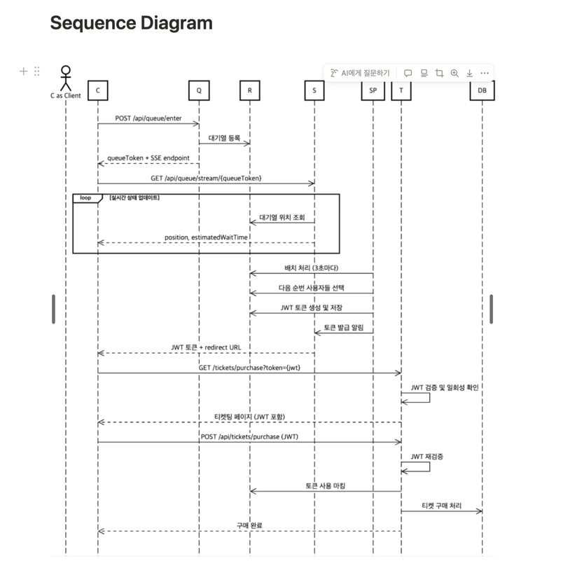
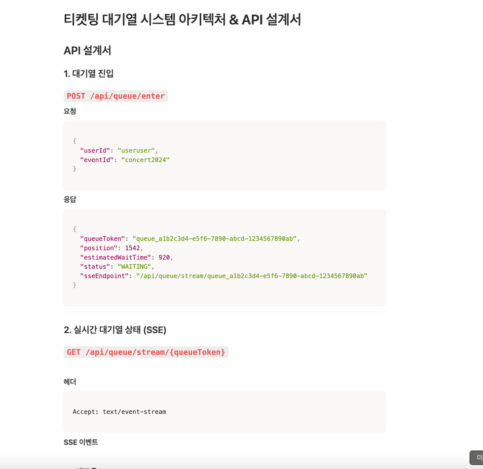

이 스터디도 참 아쉬움이 많이 남은 스터디.

이번에는 **세 가지 시스템을 설계한 다음 실제로 만들어 보고 부하 테스트를 진행한 뒤, 이슈가 있던 부분에 대해 공유를 하는 스터디**였다.

이게 서로간의 설계를 아무것도 공유하지 않은 상태에서 작업 후 공유를 하다 보니, 바라보는 개념 자체는 비슷한데 구현 방향이 다른 게 많아서 너무 신기했다. 

그리고 다들 **나보다 연차가 훨씬 많은 분들이라 설계하신 걸 보는 것만으로도 큰 공부**가 되었다.

나는 **랭킹 시스템**에 있어서는 사용자들이 게임 플레이 후 점수를 등록하면, 해당 데이터를 기반으로 최상위 10명의 플레이어 랭킹 정보를 조회하는 시스템을 설계했다. 

해당 랭킹을 위해 Redis ZSET을 도입하는 방식으로 실시간성과 일관성을 보장하려 했다.

그리고 원천 데이터 테이블과, 아웃박스테이블, TOP10 순위를 분리해 데이터 일관성을 보장하고 싶었다. 

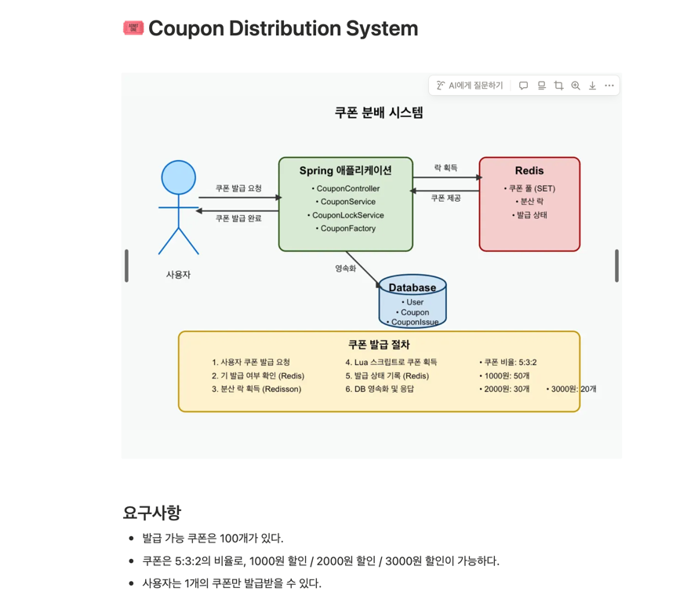

**선착순 쿠폰 시스템**에 있어서는 쿠폰 SET 미리 생성 > 분산 락 제어 / 발급 여부 확인 키를 토대로 실제로 쿠폰이 정확하게 발급되었는지를 표시하고자 했다. 

그런데 아쉬웠던 점은.... 쿠폰 시스템에 대해서 사전 조사만 하고 구현을 진행하지 못했다. 야근이 이유였다.

다른 것들은 설계도 구현도 진행했지만, 1차 구현만 마치고 실제로 부하테스트를 돌려 보거나 성능 테스트를 돌려본 뒤 가져가지를 못하기도 했다.

물론 구현은 했다. 만들어 보기는 했다. 근데 잘 만들었나? 이걸 가지고 얻을 만큼 얻었는가? 하면 조금 아쉽다. 

다시 한 번 내가 짰던 것들을 구현하고 테스트해 보는 시간을 가지고 싶다고 생각해 두었는데, 다른 일로 계속 미뤄지다가 결국 올해가 끝났다.

야근이 핑계가 되고 싶지 않은데 참 쉽지가 않다.

### IT Super: 그래서 그놈의 도메인이 대체 뭔데? 

> 도메인 관련 이론을 훑고, 도메인을 정해 실습 설계해 보는 스터디

여기서는... **내가 팀장을 맡게 되어 버렸다!**

첫 번째 스터디가 끝나고, 새로운 스터디에 대한 의견을 받는다고 하셨을 때, 내가 낸 두 가지 안은 **도메인**과 **멀티스레딩**이었다. 

두 가지를 고른 이유는 다음과 같았다. 

**도메인.** 너무나 핫한 키워드지만, 그걸 실제로 설명하라고 이야기했을 때 정말 내가 많은 맥락과 관점에서 설명할 수 있나? 라는 의문이 들어서. 

**멀티스레딩.** 언제나 해야 할 것으로 보이지만 내가 잘하고 있는지에 대한 의문이 들었던 것. 

많은 분들의 이야기를 듣고 싶어서 냈던 주제였다. 

사실 이야기하면서도 크게 이끌어 갈 자신은 없었다.  

그런데 과반수로 내 의견이 선정되면서... 내가 팀장이 되어 버렸다....

(의견을 낸 사람이 팀장이 되는 시스템이다. ㅠㅠ)

나보다 훨씬 연차도 많은 분들을 이끌고 스터디를 진행한다는 게 여간 부담이 되는 일이 아니었는데,

다행히 다들 칭찬해 주시고 응원해 주시는 덕에 스터디장이라는 무게를 가볍게 안으려고 노력하며.... 

이론과 실습을 나눠서 설계를 했다.

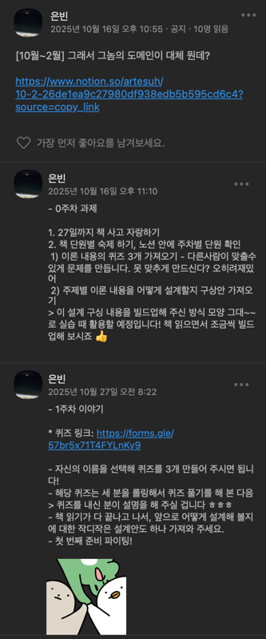

사실 **객체지향과 OOAD를 함께 이야기해 보고 싶어서 유명한 2가지 객체지향 책을 함께 가져가는 [조영호님 플랜]**을 짤까 했는데,

다들 읽어 보신 책이라고 해도 짧은 시간 안에 이 모든 걸 해내는 건 내 욕심이라는 생각이 들어서.

책은 한 가지로 수렴이 되었다. 가장 베이직한 에릭 에반스의 도메인 주도 설계.

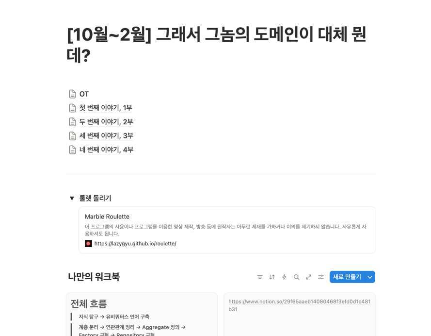

이론 스터디를 그냥 하는 건 너무 재미가 없기도 하고, 언제나 한 사람의 설명이 되고 - 모두가 집중하기 어려운 아쉬운 시간이 되는 것이 아쉬웠다.

그래서 한 가지 묘안을 냈다. **퀴즈를 내고 랜덤 룰렛을 뽑은 뒤 순서대로 맞히는 식**으로 진행. 

2주에 1번, 1부를 읽어온 뒤 서로 퀴즈를 내도록 하고, 다 안 읽어 오셔도 되니 한 명당 문제만 내고 오시도록 부담을 낮춰드리고자 했다. 

사실 4개 부탁드렸던 것 같은데 너무 많으시다고 해서 ㅋㅋㅋㅋㅋ 2개로 줄였습니다. 

그리고 사람들의 문제로만 하니까 양이 좀 적다는 생각이 들어서.... NotebookLM의 힘을 빌려 기본 10문제씩을 가져갔다.

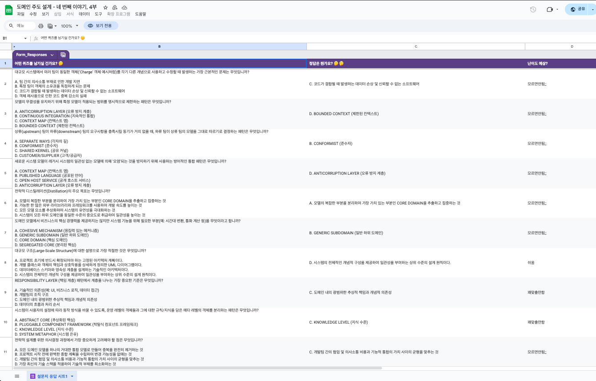

이렇게 네 번을 진행하고 12월 말, 이렇게 진행했던 이론 스터디가 끝이 났다! 

이 이론을 바탕으로 실습을 진행하는 스터디는 2026 초에 예정이 되어 있다. 

잘 마무리 할 수 있기를.

----

여담인데, 1차 스터디 진행 중 한 분께서 카톡이 오셔서, 은빈님 혹시 이너서클 하셨었나요? 하시길래 깜짝 놀랐는데.

알고 보니 이너서클 다른 멘토 분이 스터디에 계셨다!

어쩌다 보니 1기 백엔드 멘토님들과 전부 인연이 생겨 버렸다. ㅋㅋㅋㅋㅋㅋ

### RAG

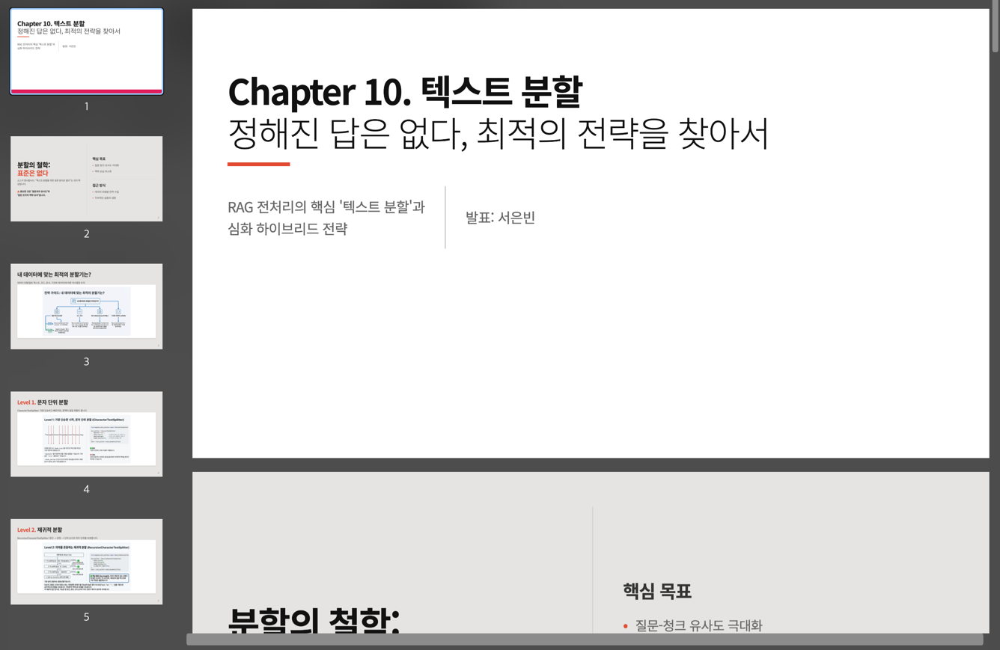

그리고 RAG.

회사에서 진행 중이던 RAG 챗봇 작업을 개선해 보는 것을 위해 참여한 스터디. 

`테디노트의 랭체인을 활용한 RAG 비법노트(기본편)`을 기반으로 스터디가 진행되었다.

**1주/2주때에는 책을 기반으로 개인별로 섹션을 나눠서 조사해 오는 이론 기초-심화 스터디**를 하고, 

**3주 째에는 개인적으로 만들어 보는 프로젝트**를 하기로 했는데, 

나는 1/2주차때 각각 텍스트 분할과 임베딩,

3주차때는 실제로 **실무에서 진행하고 있던 사내 문서 검색 RAG 프로젝트 개선**을 주제로 했다.

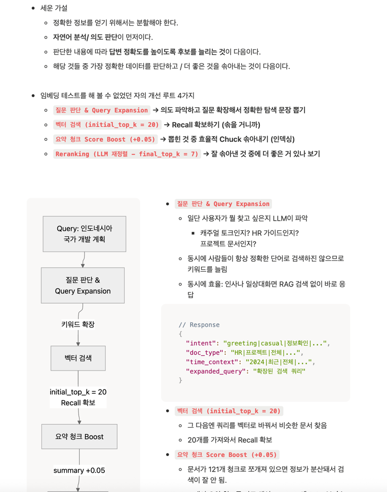

실습 과제 안에서 어떤 식으로 내가 원하는 답을 내기 위해 프롬프트를 세팅하고, 문서를 탐색하게 하고, 

리트리버와 리랭킹을 관리할지에 대한 고민을 거쳤으며, 꽤 괜찮은 고민과 성과를 낼 수 있는 시간이 되었다.

비롯해서 참여해 주시는 모든 분들이 정말 대단하신 분들이라, 약 3주 간의 스터디였음에도 정말 큰 성장을 얻을 수가 있었다.

PPT 만드는 작업도 정말 오래간만에 해 봤는데 AI를 토대로 발표 자료를 만들 때 시간이 얼마나 단축될 수 있는지도 체감했다.

## 외부 활동 - 사이드 프로젝트

올해는 다양성을 추구한다고 이야기했다. 그러려면 더 많은 사람들을 만나야 한다고 생각했다.

갇혀 있으면 발전이 없다고 생각했고, 이너서클에서 많은 분들을 보면서 큰 자극을 받기도 했다. 

그래서 내린 결정. 사람들을 만나자! 올해, 그런 시도를 했던 이야기들이다.

### F-lab 데브클럽 서포터즈

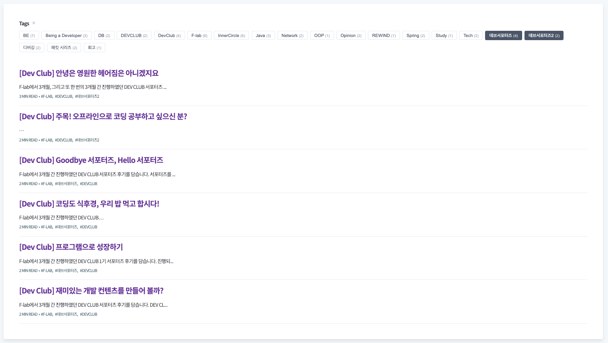

**데브 서포터즈.** 약 6개월간의 이야기. 

작년 말, F-lab에서 Dev Club이라는 여러 가지 성장형 프로그램과 네트워킹을 토대로 성장을 함께하는 커뮤니티를 만들었다. 

수강생이던 나는 자동으로 해당 클럽에 포함이 되어 있었는데, 운 좋게도 서포터즈 신청에서 선정이 되어 들어올 수 있었다.

많은 프로그램들을 함께 수강했고, 함께 만나는 시간도 있었고, 온라인으로 네트워킹하고 이야기 나누는 시간이 있었다.

덕분에 링크드인에 [글도 하나 작성](https://www.linkedin.com/posts/kailis_dev-club-supporters-%ED%95%A8%EA%BB%98%ED%95%98%EB%8A%94-6%EA%B0%9C%EC%9B%94-%EC%84%B1%EC%9E%A5%ED%95%98%EB%8A%94-%EA%B3%B5%EA%B0%84%EC%9D%B4-activity-7334450978206752768-YdYK?utm_source=share&utm_medium=member_desktop&rcm=ACoAADmJsDUBDqA4AgeQfNxgj9AyNjB3oqxtqcI)할 수 있었고.

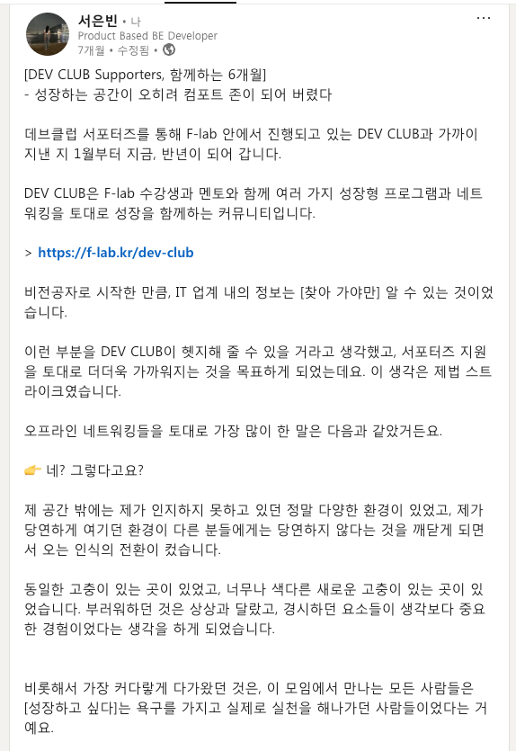

이건 솔직히 블로그에 제법 글을 많이 쓰는 바람에 ㅋㅋㅋㅋ 혹시나 궁금하신 분들은 제 블로그에서 [데브서포터즈] 태그를 한번 봐주시면 감사하겠습니다.

그리고 후술하겠지만, 마지막으로 썼던 글처럼, 안녕은 정말 영원한 헤어짐이 아니었다.

### Coffice ☕️

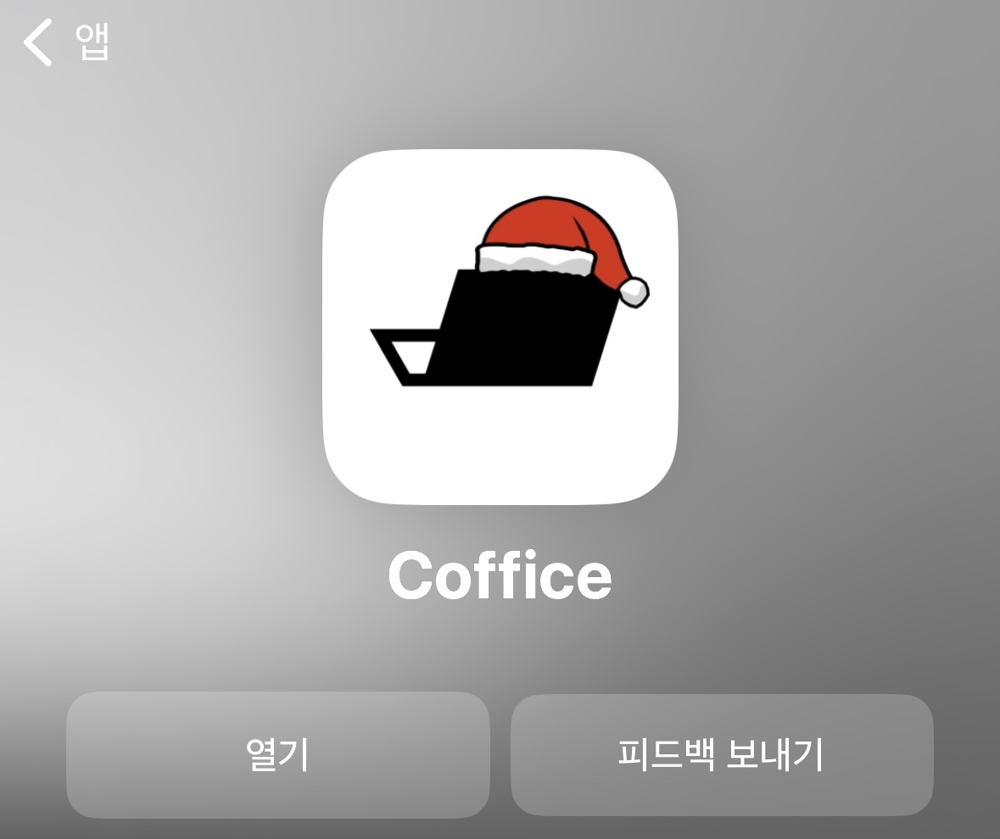
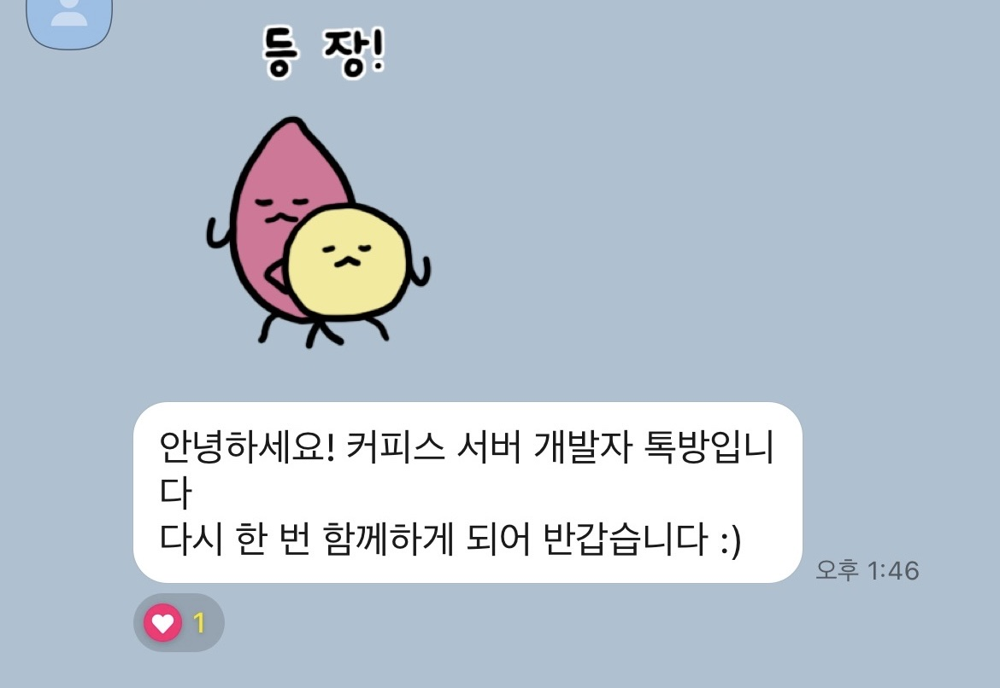

그리고 2025년 4월, **Coffice에 합류**했다.

Coffice를 잘 모르는 분들을 위해서. 해당 애플리케이션은 [작업하기 좋은 카페를 추천하는 iOS 애플리케이션](https://apps.apple.com/kr/app/coffice/id6450617682)이다.

Coffice에 조인한 것은 4월.

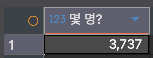

내가 조인한 이후 약 3,700명의 사용자가 늘어났다.

인프라 세팅을 하고, Spring Data JDBC를 오랜만에 건드려 보고, 

어떻게 저비용으로 프로젝트를 개선할지 어떻게 저비용으로 모니터링할지 고민하던 8개월의 시간.

엄청난 TPS가 일어날 일은 없는 애플리케이션이지만, 자린고비 메타로 돌아가고 있는 만큼 어떻게 아끼는지에 집중하고 싶다,

그리고 어떻게 MAU를 올릴 수 있을지 고민해 보고 싶은, 새로운 기능을 만들어 보고 싶은 앱.

### Fixture Monkey

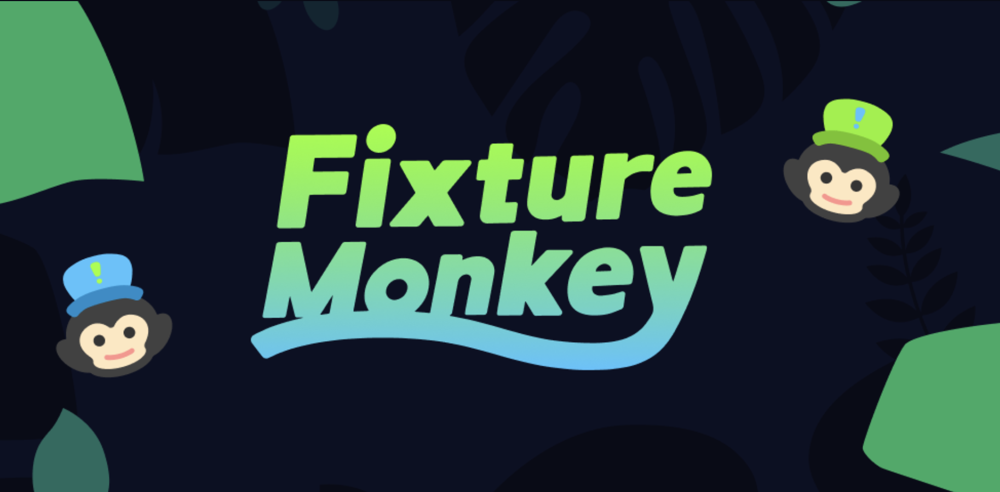

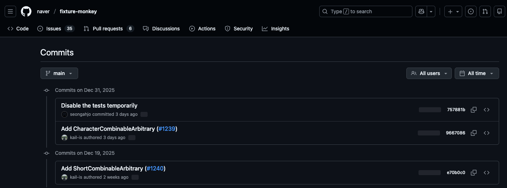

개인적으로 개발자로서 가장 해 보고 싶었던 것. 오픈소스 주기적 컨트리뷰션.

그 염원 해제의 시작, 이번에 Fixture Monkey 컨트리뷰션에 참여해 볼 수 있었다.

F-lab 수강 시 엘케인님에게 정말 많이 들었던, **오픈소스 기여하기**.

간단한 작업일 수는 있겠지만 개발자로의 한 발자국을 내딛은 것 같다는 생각을 했다. 

사실 비전공자로서 남들이 전공 시즌에서 겪어볼 수 있는 것들을 못 겪었다는 사실을 아쉬워하고 있던 중이었다.

오픈소스 컨트리뷰션에 대한 이야기는 많이 들었지만 그걸 할 때면 `어떤 걸 기여하지?` 하는 생각이 들고는 했는데,

이번에 좋은 기회로 메인테이너 분과 이야기를 하면서 참여할 수 있는 기회를 얻었다.

작년 이너서클을 진행하면서 [오픈 소스를 만들어 본 적](https://github.com/kail-is/JPatternMatch)은 있었지만, 이건 실제 사용자가 없었으니 아쉬움이 있었는데,

이건 실제로 사용자가 꽤 되는 라이브러리에 흔적을 남길 수 있었다는 것만으로도 만족하고 있다.

다른 과제를 하나 얻어냈는데 이번 것도 잘할 수 있으면 좋겠다는 생각.

## 이직

그리고 9월, 이직을 했습니다!

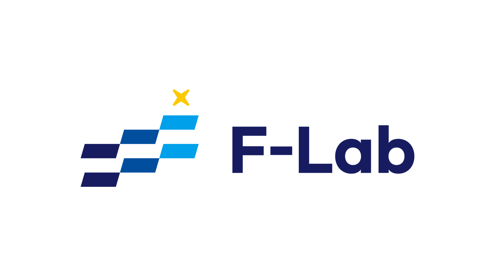

카카오뱅크 외주 9개월 차, 카카오뱅크를 마무리하고 F-lab에 정식적으로 합류했다.

약 6개월 간 데브클럽 서포터즈를 하면서 안면을 가지고 있기도 했고,

작은 업무들을 해 드리면서 F-lab의 코드 환경에 대해서도 알고 있던 상태였지만,

그래도 아예 백엔드 작업과는 동떨어진 RAG 작업이었기 때문에 정말 코드에 대해서는 아무것도 모르는 상태였다.

지속적인 야근에 지쳐 있던 찰나, 딱 타이밍 좋게 채용 글이 올라와서 지원을 했고, 기술과 핏 면접을 거쳤고, 합격을 했다.

완전히 새로운 스택으로 새로운 시스템을 구축하고 예전 프로젝트를 마이그레이션할 수 있다는 게 얼마나 기뻤는지. 

이건 여담인데, 입사하고 나서 아무래도 카카오뱅크에서 기존 업무를 하고 있던 만큼  한 달 먼저 하루 연차를 내고 와서 와서 인사도 드리고 하는 시간을 내 달라고 부탁드렸다.

들어와서 사무실에 조용히 앉아 있는데...

그때 INNER CIRCLE에서 뵈었던 지훈님이... 들어오시는 것이다?

엥?

> 오랜만에 뵙습니다...? 하고 인사를 했는데.

피츠가 어? 어떻게 아세요? 아~ 이너서클 하셨지! 하길래 끄덕끄덕 했더니.

> 인사드리겠습니다. 이번부터 `F-lab의 부사장`님이십니다.

네????????

알고 보니, 내가 오는 그날이 딱 인사를 하시러 오신 날이었던 것이다.

이런 우연이.

함께할 수 있어서 감사한 분 중 한 분이기 때문에, 올해는 부디 건강을 더 큰 가치로 챙기셨으면 좋겠다는 바람을 가지고 있다.

**그리고 든든하고 멋진 피츠와 팀원들.**

내가 설명에 있어서 대명사를 많이 쓰는 편이라, 맥락이 생략된 문장을 이해하기 어려운 분께는 의미 전달이 어려운 부분이 있다는 걸 이번 프로젝트에서 어느 정도 인지했기 때문에...

초반에는 의식하지 않고 설명해도 명확하게 내 말을 이해해 줘서 고맙다고 인사를 할 정도로.

정말 똑부러지고 깔끔하고 일 잘하는 정예 멤버들만 모여 있다는 사실이 너무 든든하다.

좋은 팀원들이 업무 효율에 정말 엄청난 도움을 준다는 걸 이번에 아주 큰 무게로 깨닫게 됐다.

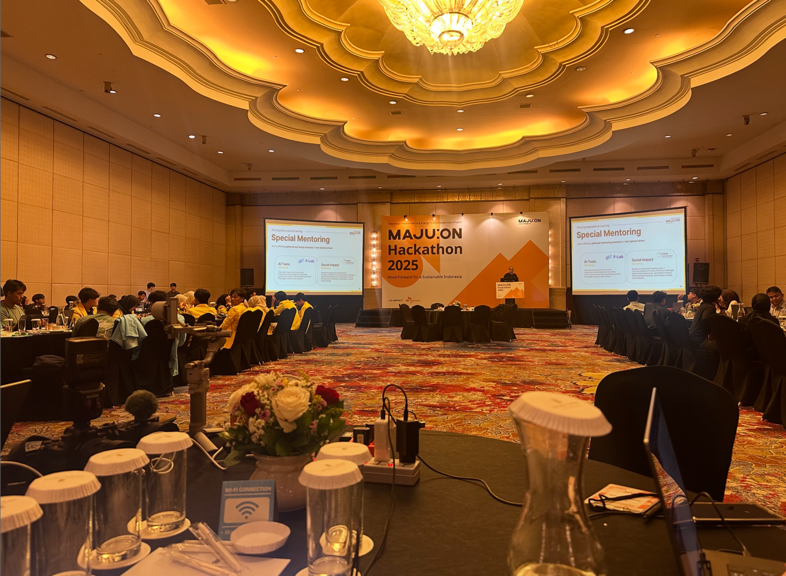

그리고 이번에 유디임팩트에서 진행한 **인도네시아 해커톤 출장**도 다녀왔는데, 이 부분도 아주 큰 인사이트가 됐다.

다른 국가에서 어떤 마음을 가지고 어떤 것들을 추구하며 살아 가는지에 대한 다양성도 깨달을 수 있었고.

처음으로 비즈니스에서 영어로 커뮤니케이션을 할 수 있는 시간이었는데, 내가 어떤 문장들 앞에서 설명을 어려워하는지도 알 수 있었다.

역시 영어 공부 좀 더 해야지... 싶었던.

이것도 여담이지만. 인도네시아 출장 다녀오고 나서 친구와 밥을 먹는 시간이 있었는데.

> 어? 내 친구도 어제 인도네시아 다녀왔는데?

ㅋㅋㅋㅋ 재밌게도 유디임팩트에 계셨던 분이 친구의 친구셨고, 그때 딱 나랑 같이 인도네시아에 다녀오셨던 거였다.

종종 스쳐가기만 하고 있어서 인사를 못 드렸는데 이번에는 꼭 드려야겠다는 생각.

세상은 좁다.... 이것과는 별개겠지만 더더욱 좋은 사람이 됩시다.

## 외부 활동 - 네트워킹

이번 해에는 더욱 더 다양한 이야기를 듣고 싶었기 때문에... 여러 가지 밋업과 네트워킹을 참석했다. 

### 다양한 이야기를 듣기

주로 만난 분들은 두 그룹이었다. 

**코드빌런님 오픈카톡방**에서 이어진 인연인 재거님 / 호리님 / 하디님 / 에단님을 비롯한 많은 분들. 

같이 스터디도 함께하면서 성장하는 시간을 보낼 수 있었다는 사실이 좋았다.

코드빌런님. 아주 멋있는 분이다. 주변에 계신 것만으로도 정말 큰 자극을 주시는 분.

그리고 **이너서클 1기 분들**과도 종종 뵙는 시간을 가졌다. 

어디 발표가 있다거나 밋업이 있을 때 참석하실 때마다 꼭 한 분은 계셔서 인사를 나눴는데, 

연말회를 토대로 아예 자리를 잡아서 다시금 만나뵙는 시간을 가지게 되었다는 게 참 좋았다.

어쩌다 보니 만나 뵌 여섯 분 전부 다, 이너서클을 시작할 때와는 다른 새로운 자리에서 다시금 시작을 하시게 되었더라. 

어쩐지 고향에 온 느낌이기도 하고. 다들 든든하고 멋있는 분들이다.

### 원티드 - 미래를 준비하는 사람들의 프라이빗 모임

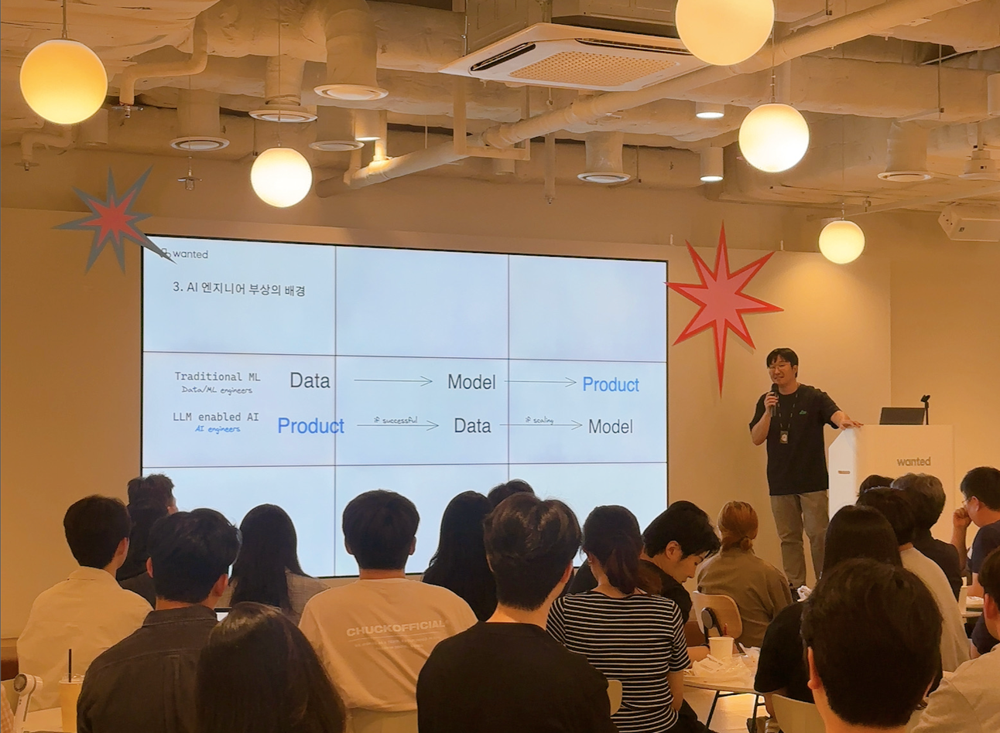

함께 F-lab 수강하던 멘티님과 함께 신청을 했는데, 너무 아쉽게 나만... 당첨이 되어서 다녀왔던 원티드랩.

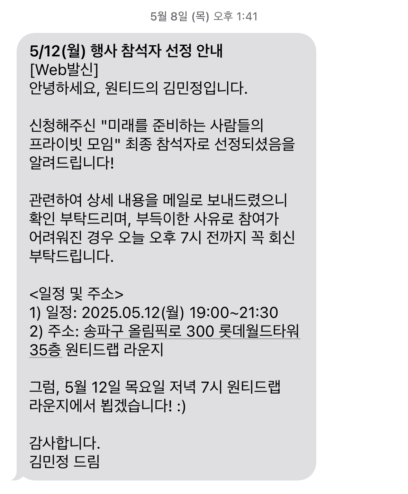

이런 거 잘 당첨 안 되는데 되어서 매우 신기했던 기억이 있다.

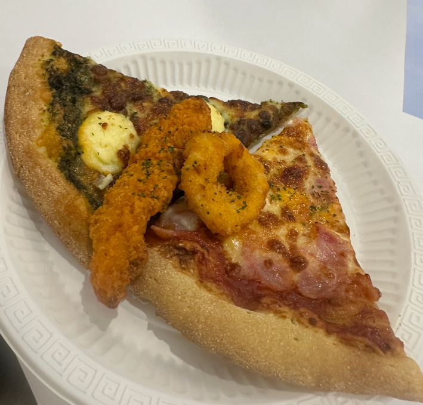

피자도 먹으면서, 어떤 식으로 AI를 활용하셨는지에 대한 이야기를 들을 수 있던 시간이었고, 

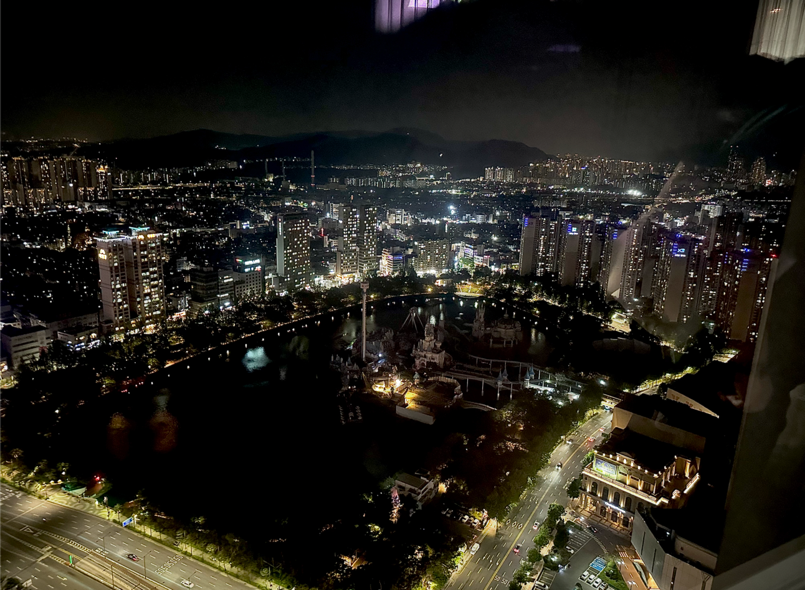

잠실 롯데타워 35층의 뷰를 볼 수 있는 시간이었다. 

좀 부러운데? 싶기도 하고. 엘리베이터 타고 올라가는 길 귀가 먹먹하고 창문 환기가 안 돼서 나는 힘들겠다 싶기도 하고.

일단 나는 집이 가까워서 부럽긴 했다. 나도 잠실에서 회사....

### 토비님 강연

> 31년차 개발자가 전하는 "AI시대, 개발자로 살아가는 법

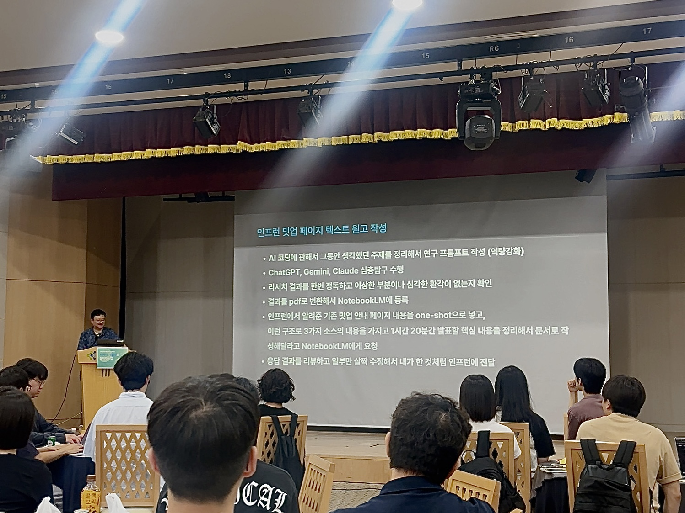

**그리고 토비님 강연.** 또 우연히 당첨! 

7시 퇴근이라 판교역에서 미친듯이 전기자전거를 타고 간 기억이 난다. 

7시 8분에 도착해서 (진짜 놀랍게도 이게 가능했다)

급하게 빈 자리에 앉았다가 뒤를 돌았는데, 이너서클 때 함께 거의 멘토링을 해 주셨던 멘토님이 앉아 계셨다. 

사실 종종 판교역 산책하다가 뵙고 인사를 드리긴 했는데. ㅋㅋㅋㅋ

이렇게 마주칠 거라고는 생각을 못해서 놀랐다. 반가웠습니다. 

강연은 **AI에 대한 섹션별 그레이드 이야기**를 들을 수 있어서 좋았다.

어떤 식으로 AI를 개발에 활용하는지에 대한 레벨 단위의 기술도 그렇고, 어떤 식으로 개발 공부에 NotebookLM을 활용하셨는지도.

이 이후에는 진짜 일이 너무너무너무 바빠서 한참 일만 하다가.... 

12월이 되어서야 정신을 차리기도 했고, 연말이라 마무리 이야기들이 올라와서 두 개 더 참여를 했다.

### Tech Friends Mixer 2025

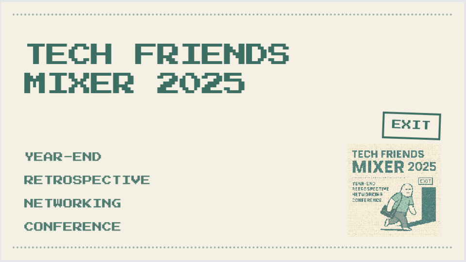

여기는 개최하시는 분들 중에서 한 분이 스탭 헬프를 이야기하셨던 곳이었다. 

그래서 원래는 스탭이든 참여든 하고 싶었는데, 가족 약속 때문에 유보했던 곳.

그런데 당일 오전에 가족에게 연락을 했더니.... `어머, 취소됐는데 전달 안 했니?` 라고 하시는 바람에. 

그 전화를 끊자마자 현장 참여가 되는지 물어보고, 급하게 택시를 타고 가천대로 넘어갔다.

Coffice에서 함께하던 iOS 팀원이 간다는 말을 새벽에 하기도 했고, 아는 다른 두 분도 오신다고 하셨기 때문에 인사도 드릴 겸.

멘토링과 발표 맡아 주셨던 가빈님이 이너서클 1기 참여하신 건 내가 기억하고 있었는데, 

이번에 온오프라인 전체적으로 초면이었는데도 이름표를 받다가 나를 아신다고 해서 깜짝 놀랐던 기억이. 

그리고 클라이언트 분들, 기획자 분들, 다른 곳의 백엔드 분들을 만나고 대화할 수 있는 시간을 가져서 좋았던 기억.

급하게 넘어가서 그런지 사진이 없어서 너무 아쉽다.

받은 키보드 키링이 너무 귀여워서 스트레스 받을 때마다 딸깍딸깍 눌러 보고 있다.

### 유스콘

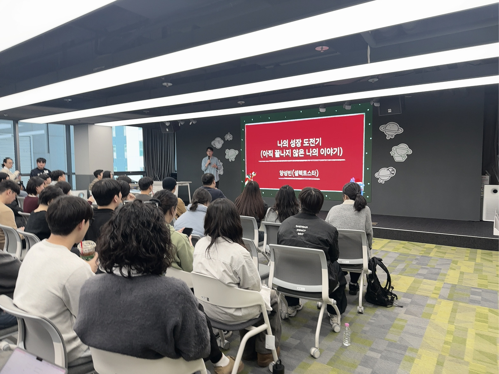

**유스콘.** 당첨이 되다니. 정리하다 보니 올해 이런 게 3번째네 싶다.

사실 당첨이 안 됐다고 생각하고 있었는데, 1사로에서 스팸함을 확인해 보라고 하시길래 엥? 하고 당일 8시에 확인을 해 봤더니 메일이 와 있었다. 

전날 일찍 자서 망정이지 아니었으면 식사도 못하고 강연만 들으러 갈 뻔했다....

유스콘에서는 멘토 신청을 해서 멘토님 그룹과 밥도 먹고 인사하는 시간도 가졌다. 

뒤에 이야기 나누다 보니 나를 아신다고 하는 분이 계셔서 또 깜짝 놀람. 조용히 살자.

멘토링 받으러 온 분과는 약 30분간 이야기를 나눌 수 있었다.

연차가 비슷한 분이라 내가 겪었던 이야기들을 유사한 상황의 분께 경험담처럼 들려드리는 방향으로 접근을 했는데, 

즐겁게 나눌 수 있는 시간이 되었다는 사실도 뿌듯했고. 

민기님의 강연까지 ㅋㅋㅋ 저도 정산 메타 해야 해서 아주 잘 들었습니다.

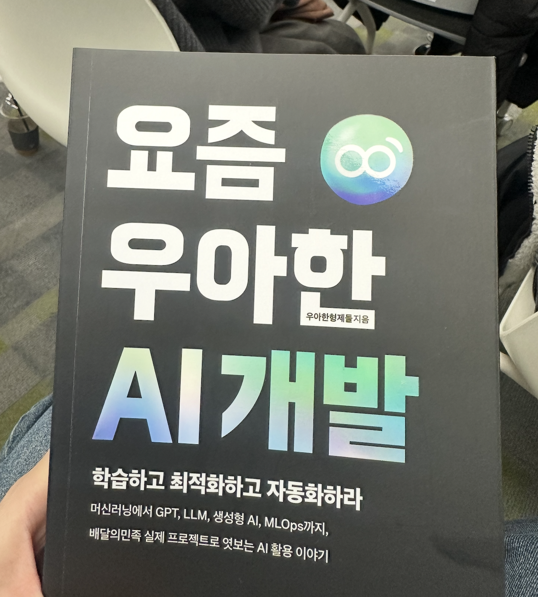

그리고 **이벤트 당첨**도 됐다. (이번 해 정말 좋은 해?)

4등은 만 원이고 5등은 20명인데 2만 4천원이라더니, 뭔가 했는데 `요즘 우아한 AI 개발` 책이었다. 잘 읽겠습니다. 

여섯 시까지 풀로 참여한 뒤, 우연히도 Tech Friends Mixer 2025 때 있었던 가족 약속이 이날 다시 잡혀서 급하게 사라졌다.

이번 해의 네트워킹도 아주 즐거운 시간을 나누는 많은 기회가 된 것 같고, 

좋은 분들을 새롭게 많이 뵙게 된 것 같아서 뿌듯한 시간이 되었다.

## 개인적 성장

그리고 작은, 개인적 성장에 대한 이야기.

> 데드리프트 대회 1등

PT 선생님이 진행했던, 본인의 수강자를 대상으로 한 데드리프트 대회. 

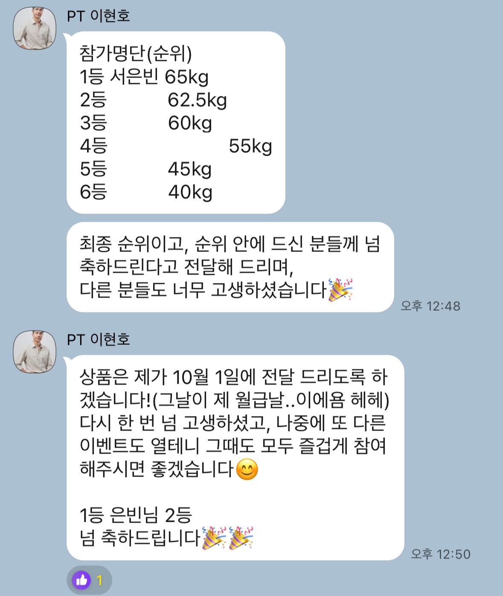

65kg로 1등을 했다. 1rm으로는 73kg?

**아무런 보조 기구 없이 3rm**을 들면 해당 무게가 인정되는 형태의 작업이었다.

야근을 진짜 많이 하고 있었기 때문에 목표였던 75kg까지는 가지 못했지만....

마지막에 역전 1등을 했기 때문에.

한우도 1등 포상으로 받아서 가족들과 맛있게 파티하며 구워 먹었다.

흥미롭고 재미있는 시간이었기 때문에. 만족합니다. 

> Duolingo 일본어 시작

그리고 Duolingo를 오랜만에 받았다. 

주변 사람들이 많이 하고 있어서 이것저것 자극을 받고 있었는데, 

한국어 버전의 영어는 사실 섹션 8까지 금방 끝내 버리는 바람에 다른 플랫폼을 하면 좋은가? 고민하던 때였다.

그런데 F-lab에 들어왔을 무렵 F-lab이 일본으로 사업 확장을 시작할 시즌이라서,

_그래? 그럼 일본어를 해 볼까?_ 하고 일본어를 시작했다. 

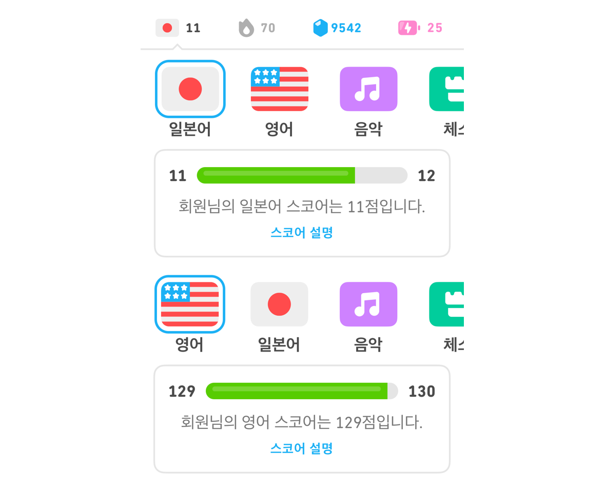

그리고 이제 **일본어 70일 차.** 

11점 ㅋㅋㅋㅋㅋㅋ

진짜 매일 딱 10분, 1개씩 한다. 퇴근할 때 버스 2정거장 지나가면서. 10분 걸으면서. 

작년만 해도 `로손이 뭐야?` 했다가 경악하는 표정을 받아 본 사람으로서...

그래도 이제 일본어에서 얼추 무슨 조사를 언제 쓰는지? 정도는 알고 있다. 은는이가 아는 정도인 듯...

지금 영어의 경우에는 영영으로 넘어가면 조금 더 레벨이 있다고 해서 영영도 가 보고 있다.

사실 옛~날에 프랑스어를 하려고 깔았는데 막상 프랑스어는 제대로 못 했다는 사실. ^^ 

~~Je ne sais pas français.. (저는 프랑스어 못해요)~~

## 독서 이야기

이외에도 F-lab 이직 후 2달간 책을 몇 권 읽었다. 

읽자 읽자고 다짐은 했지만 언제나 개발자의 성장을 앞세우며 못하던 것.... 

**수요일마다 독서 모임**이 있다길래 열광을 했고, 필참하려고 노력했고, 다 같이 나눌 수 있는 슬랙 채널도 만들었다.

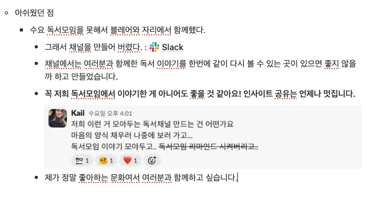

인도네시아 출장 가는 길에 읽었던 하드씽, 기획의 정석, 언더독스의 책인 액트프러너, 아이디어 불패의 법칙, 대체 뭐가 문제야, 함께 자라기... 

스타트업 씬에서 유명한 책들은 점차 하나씩 채워 가면서 읽고 있는 것 같다.

이런 것들을 하고, 2025년 1년이 끝났습니다.

# 조금 아쉽다

> 그래서 나 진짜 성장했나? 

많은 것을 했다. 진짜 거의 매일같이 야근하는 삶을 살면서 쌓아 온 것치고는 양이 정말 꽤 된다.

그런데......

어쩌면 완벽주의 성향이라 그런지는 모르겠지만, 결국 **개발자로서의 공부로 성장?을 진짜 잘했는지**는 사실 조금 회의적이다. 

사람들도 많이 만났고, 스터디도 꽤 진행했지만, 진행하는 과정에서 과정을 누락할 때마다 핑계로 야근을 대는 경우가 너무 잦았다.

**어쩌면, 그럴 거면 시작하면 안 됐다.** ~~(아니다)~~

걸쳐 있기만 했기 때문에 얻은 것도 물론 당연히 많지만, 그래도 무언가를 제대로 주워 갈 수 있을 때 해야 더 의미가 있다는 생각도 든다.

**야근 같은 튀어나오는 작업들이 핑계가 안 되었으면 좋겠다.**

적어도 핑계가 될 거라면 무엇을 할 수 있고 - 무엇을 못한다는 이야기를 명확하게 하고, 그것을 제대로 지켜내면 좋겠다. 

**그리고 개발자로서의 역량 증진을 할 수 있었다면 더 뿌듯했을 것.**

야근도 더더 줄였으면 좋겠다. 내가 한 시간에 어떤 임팩트를 낼 수 있는지 명확하게 알 수 있는 사람이 되면 좋겠다.

2025에서 얻은 것들을 토대로 2026을 그려 본다. 

# 2026, 내실

**내가 가져가고 싶은 2026의 키워드는 내실이다.** 

> 내실: 內實 - [명사] 내적인 가치나 충실성.

무엇을 `할 수 있나?`를 질문했을 때, **나는 이제 할 수는 있는 사람이다. 뭐든지.**

하지만 `잘할 수 있는 사람인가?`를 물어볼 때는 아직 점수가 낮다.

이번 해는 그 "잘함"을 가져가는 해를 원하고 있다. 

**"하는 법"보다 "정확하게 / 잘 / 빠르게" 하는 법 배우기.**

그러기 위해서는 여유로워질 필요가 있고, 단단해질 필요가 있다. 구조를 탄탄하게 만들 필요가 있다.

2026은 조금 더 깊어지고, 건강해지고, 조금 더 다채로울 수 있는 한 해가 되었으면.

고생했다! 더 넓어지러 가자!